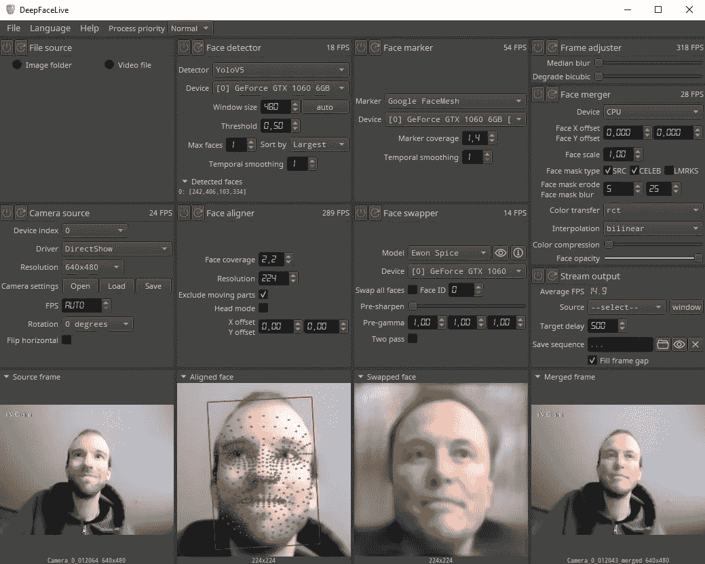

# 实时深度伪造

> 原文：<https://levelup.gitconnected.com/deep-fakes-in-real-time-88a236fcc7a7>

## 迷人的技术还是反乌托邦的未来场景？

尝试 DeepFaceLive 程序，可以实时交换我的脸。作者截图。

几年前，[深度假货可以用来交换视频中的人脸](https://edition.cnn.com/interactive/2019/01/business/pentagons-race-against-deepfakes/)并创造一个令人信服的任何人的二重身。从那以后，结果变得更好了，现在，人们很难识别制作精良的深赝品。然而，创建一个深度的假货需要一定水平的技术知识和强大的计算机来慢慢转换一个视频。

[但是现在，深度假货可以实时工作了！](https://github.com/iperov/DeepFaceLive)

你所需要做的就是下载一个程序，甚至像我的 GTX 1060 6GB 这样的 5 年前的中端显卡也足够强大，可以实时交换你的脸。

我第一次在[走廊工作人员 YouTube 频道](https://www.youtube.com/watch?v=qXLugdeogQU)上看到实时深度假版本，他们用它给朋友打视频电话，看看他们是否能认出他们在和一个假的说话。他们中的一些人很快意识到有些不对劲，甚至意识到了深层的虚假，但其他人需要一段时间才能注意到差异。他们欺骗的最大问题是没有声音，因为打电话的人不能说话，否则他们会马上认出他们。不过，[深度假声技术确实存在](https://www.forbes.com/sites/forbestechcouncil/2021/05/10/analyzing-the-rise-of-deepfake-voice-technology/)，所以他们本可以让它更有说服力。

自然地，我不得不下载这个程序来亲自试用，它显然是有效的。它无论如何都不是完美的，但考虑到它是实时运行的，这非常令人印象深刻，老实说，看到自己有一张不同的脸是一种奇怪的感觉。

# 它是如何工作的？

[换脸算法最本质的部分是神经网络](https://www.alanzucconi.com/2018/03/14/understanding-the-technology-behind-deepfakes/)，它由两个独立的网络组成，这两个网络都是典型的 [**深度卷积神经网络**](https://www.run.ai/guides/deep-learning-for-computer-vision/deep-convolutional-neural-networks) (CNN)。第一个网络被称为**编码器**。它的工作是将你的五官编码在一个更低维的数据结构中，也叫**潜脸**。一张潜在的脸的可视化不一定看起来像一张脸，它是一张人脸结构的一般表示，想象成一个大致的椭圆形，有两只眼睛，一个鼻子和一张嘴。

第二个神经网络是一个**解码器**。它把一张潜在的脸转换回真实的脸。你可以用你自己的脸来训练这两个网络，你的脸会被转换成一个潜在的脸，然后解码回你原来的脸。然而，你也可以用一个已经用不同的脸训练过的解码器，当它把你潜在的脸作为输入时，它会用其他人的面部特征来重建你的面部表情。

神经网络在非常特殊的图像上被训练，在这些图像中，脸是完全直的和居中的。因此，实时面部交换程序包括实际交换前后的附加步骤。首先，它需要在相机输入流中找到你的脸，然后对齐它，这样编码器网络就可以与它一起工作。在你的脸被交换之后，这些步骤被颠倒，因此你的新脸在输出流中以正确的旋转出现在正确的位置。

这个名为 [FaceSwapLive](https://github.com/iperov/DeepFaceLive) 的程序附带了一些预先训练好的名人模型，或者更确切地说是[不存在的人，他们与真人的相似之处纯属偶然](https://github.com/iperov/DeepFaceLive)。所以你可以到处玩，让自己看起来像 Ewon Spice、Kim Jarrey 和其他几个人(Elon Musk 和 Jim Carrey)。预训练的模型是 224x224 像素，因此它们适用于质量较低的网络摄像头，但在全高清视频中看起来不会很有说服力。

不过，自己训练新模型也是可以的，但是和只交换脸不同，训练一个模型需要非常强大的显卡和大量的时间。来自 Corridor 的家伙为他们的视频训练了一个新模型，在一台装有 3 台 RTX 3090 的计算机上花了两周时间，开发人员说他花了大约一个月的时间来训练一个模型。你还需要大量(5000 张或更多)你想在不同的光照条件下换成不同面部表情的人脸图像。

# 这是什么意思？

deep fakes 是一项具有合法应用的迷人新技术，还是只是一个反乌托邦式的未来场景？

当我们听到深度假货时，首先想到的是它们邪恶和不道德的用例。它们可能被用来[制作政客的虚假视频](https://www.theguardian.com/technology/ng-interactive/2019/jun/22/the-rise-of-the-deepfake-and-the-threat-to-democracy)传播各种错误信息、[未经同意制作色情材料](https://www.bbc.com/news/uk-scotland-57254636)、[欺骗人们](https://www.scmagazine.com/analysis/cybercrime/deepfakes-widen-fraud-opportunities-for-financial-hackers)，或者[窃取某人的身份](https://www.forbes.com/sites/renehendrikse/2019/12/20/how-deepfakes-could-become-a-threat-to-your-identity/)。所有这些听起来都很可怕。我们已经非常接近这样一个点，对于一个人来说，要判断一个视频或视频流是否被深度伪造是非常困难的，如果不是不可能的话。有些假货比其他假货更容易识别:如果你看到巴拉克·奥巴马(Barack Obama)宣传下一款以狗为主题的加密货币的视频，那很可能不是他(尽管可能仍会有人相信它)，但更微妙的变化呢，比如 10 年前一位政治候选人的视频，其中他们提到了一些按照今天的标准被认为是禁忌的话题。即使他们可能从未说过，10 年后也很难否认。有很多像这样的场景，一个深刻的假动作被用在一个负面的语境中。

我们怎样才能辨别一个视频或视频流是真是假呢？最好的机会是其他正在被训练来检测深度假货的神经网络。这种例子已经存在。深度假货和深度假货检测器之间将会有一场竞争。深度造假者可能会创建一个新模型，在一段时间内，他们可能无法检测到，直到检测器网络用新模型进行训练，因此一个新视频可能会在几周内被错误地标记为真实的，直到它被识别为假的。

深度假货也有正面用例吗？是的，他们肯定会这么做。它们可以用于娱乐业，在危险的情况下将演员的脸放在特技演员的身上，使老演员变老，以扮演年轻版的自己，甚至让已故演员复活，在后来的续集中客串出场。另一个例子是教育和培训，它们可以用来[重现历史场景](https://www.timesofisrael.com/at-this-holocaust-museum-you-can-speak-with-holograms-of-survivors/)或者为医疗培训创造非常现实但不真实的病人。同样，非常自私地说，我不介意在视频会议中用一个更好看的自己来代替自己。

深度假货很有意思，很迷人。它们已经可以在消费类硬件上实时运行，随着计算机变得更快、更容易使用，它们将在我们的社会中发挥更大的作用。这将取决于我们以及我们如何利用新技术来判断它们是用于促进人类进步还是创造一个反乌托邦的未来，在那里我们不能相信我们看到或听到的任何事情。

# 资源

*   [DeepFaceLive](https://github.com/iperov/DeepFaceLive)