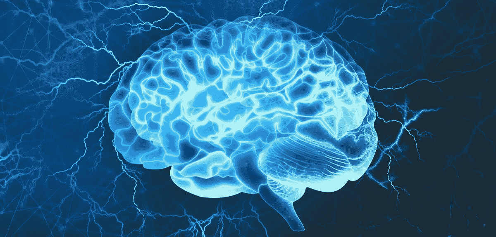
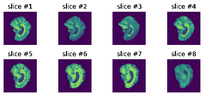
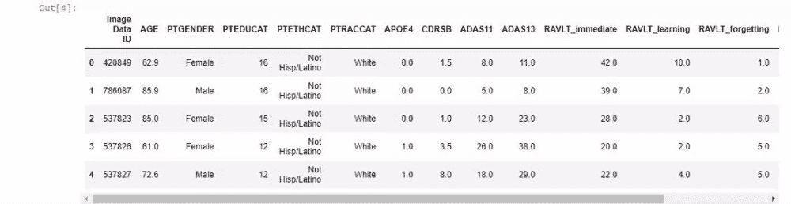
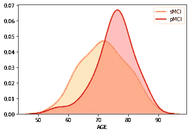
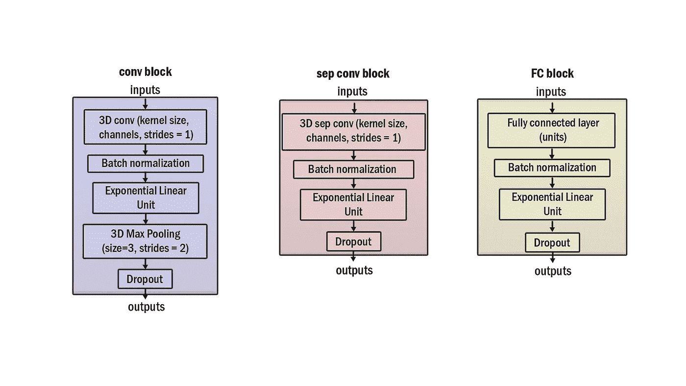
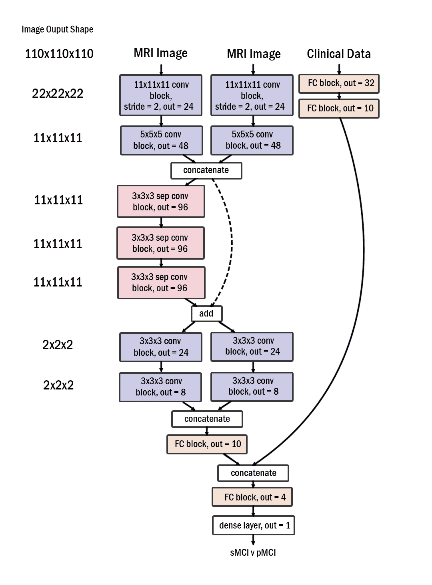
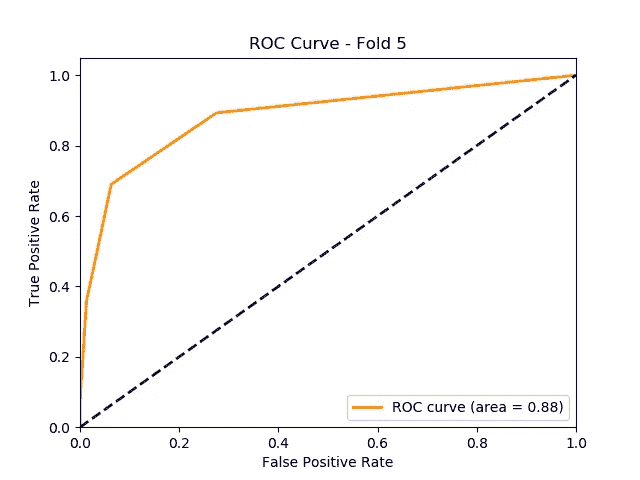

# 针对阿尔茨海默氏症分类的深度学习

> 原文：<https://levelup.gitconnected.com/deep-learning-for-alzheimers-classification-57611161e442>



(ref:[Y](https://www.ox.ac.uk/news/2018-05-01-how-decisions-form-brain-physical-basis-cognitive-process#)ur chanka Siarhei via[Shutterstock](https://www.shutterstock.com/image-illustration/human-brain-digital-illustration-electrical-activity-719796733?src=0qMPwIzLEtNMAGGfywpNHw-1-23)

# 1.介绍

到 2050 年，阿尔茨海默氏病将影响 9000 万人，这相当于英国的人口。这是一种特殊形式的痴呆症，会导致情节性记忆丧失、健忘和视觉空间定向问题。没有人希望自己爱的人忘记自己的名字。

虽然治愈阿尔茨海默氏症还有一段时间，但我们可以通过尽早治疗来减缓疾病的发展速度。疾病发现得越早，就能越早地为受试者提供治疗。自动化这样的诊断任务在整个医学科学中也有许多积极的意义。

当然，检测一个人是否已经患有阿尔茨海默病并不是很有用，相反，我们希望预测一个人在未来几年内患该病的概率。为了实现这一点，医生主要依靠受试者接受的认知测试，并通过查看他们的 MRI 扫描。因此，这两个输入都将被输入我们的自动化系统。

# 2.要求

在开始这个项目之前，建议您对卷积神经网络有一些了解，并且您可能已经理想地实现了一个更简单的神经网络来完成诸如猫对狗这样的任务。

我们将使用 python 和 PyTorch 进行深度学习。你将需要一台强大的计算机或云 gpu 集群在合理的时间内训练代码。谷歌云或 AWS 是两个很好的服务，但可能会变得昂贵，所以要小心。

## 2.1 克隆 GitHub repo

幸运的是，所有必要的代码都已经为您编写好了。您可以通过以下方式克隆回购

> https://github.com/McSpooder/camull-net.git 的 git 克隆

## 2.2 Python 库

我们将使用下面的库，这些库必须使用像 pip 这样的包管理器来安装。然而，我强烈建议您安装 conda，用 [environment.yml](https://github.com/McSpooder/camull-net) 文件自动完成这个过程。

Pytorch 1.4.0—张量变换深度学习库

Numpy 1.18.1—用于在 python 中创建和操作数组的数据科学库

Pandas 0.25.3—用于检查和预处理医疗数据的数据科学库。

ni Abel 3 . 0 . 0—用于将 MRI 扫描加载到 python 中的库

Tqdm 4.42.1—用于向控制台输出进度的库。

如果您有 conda，您可以执行以下操作:

```
conda env create -f environment.yml
```

## 2.3 数据

会有多个数据流进入这个神经网络。一个用于 3D MRI 数据，另一个用于对象的临床数据。MRI 数据将是 3D 张量，而临床数据将是 2D 值向量。临床数据包含患者的人口统计学、认知和遗传信息。

数据应该从 [ADNI](http://adni.loni.usc.edu/data-samples/access-data/) 获得。你需要用大学的电子邮件地址注册这个网站才能访问。从那里获取数据的好处是 MRI 体积已经被预处理和配准，这意味着体积被对准到共同的中心。在[这里](https://github.com/McSpooder/camull-net/wiki/Data-Requirements)可以找到检索用于这个项目的准确数据的说明。

# 3.数据探索

看一看我们将输入神经网络的数据是很重要的。这一阶段是可选的，但您至少应该通读一遍，以便更好地理解网络所需的层架构。

## 3.1 磁共振成像体积

MRI 体积存储在“漂亮的”文件中。“nii”文件扩展名。可以使用 nibabel 加载它们，并使用 matplotlib 库显示它们。

运行此代码后，您将能够看到 MRI 体积的前 8 个切片。



矢状面上 MRI 体积的切片

你还应该看到每个体积的尺寸都是 110x110x110。就像 2D 图像的最小单位是像素一样，3D 体积的最小单位是体素。

## 3.2 临床数据

临床数据包括认知评估、人口统计和遗传信息。最终，它只是一组数字，将与 MRI 张量一起输入神经网络。

为了更好地理解它，我们将加载原始的 csv 文件并用 pandas 可视化它。该文件保留了原始的分类变量值。

您将看到数据主要包含数字属性和 4 个分类属性。



前五名受试者的临床数据

这是两个标签的正态分布图。它表明，患有进行性轻度认知障碍的人往往年龄较大。



# 4.体系结构

该项目的架构是由 Simeon Spasov 等人开发的。艾尔。这不是我的功劳。然而，由于训练数据不同，一些内核变得更小，因此略有不同。

该架构由卷积块、3d 可分离卷积和全连接块组成。块只是神经网络层的分组，例如批量标准化、指数线性单元和丢失。



conv 块中的最大池将是负责 MRI 数据降维的主要层。而可分离卷积块将用于将输入映射到不同的特征空间。



## 4.1 可分离卷积

可分离卷积是这种实现的亮点之一。他们将卷积矩阵分解成两个张量，实现相同的计算。这减少了参数的数量，但是以卷积的可能性为代价。换句话说，不是每一个卷积都可以被一个单独的卷积复制，但足以使它仍然是一种有效的技术。

## 4.2 激活

最终输出将是 0 和 1 之间的数字，其中前者代表静态轻度认知障碍，后者代表进行性轻度认知障碍。为了强制输出在此范围内，使用了 sigmoid 激活。

将使用 Adam 优化器和可变学习率对网络进行 150 个时期的训练。为了更好地理解为什么使用以下排列和超参数，您应该阅读[这篇](https://www.sciencedirect.com/science/article/abs/pii/S105381191930031X)论文。

# 5.PyTorch 实现

下面的架构将以面向对象的方式在 PyTorch 中实现，以提高可读性。每个块将从 nn 继承。模块类，并且将有一个 forward 方法，该方法指示应该如何使用这些层来转换输入。同样，整个项目的完整代码可以在[这里](https://github.com/McSpooder/camull_net/)找到。

## 5.1 数据集

深度学习需要将数据放到 GPU 上进行并行计算。否则，执行线性转换会花费很长时间。幸运的是，只要我们定义一个数据加载器和一个数据集，PyTorch 就能为我们做到这一点。这些类指定了数据在放到 GPU 上之前如何被解释和处理。

这里的要点是，整个临床数据 csv 一次加载并存储在一个属性中。然后是 MRI 的训练目录列表。nii 文件是为以后获取它们而建立的。

现在，MRI 获取方法应该添加到数据集。pytorch 数据加载器将使用它将数据放到 GPU 上。

请注意 idx 参数。它将始终介于零和数据集长度之间(不包括零和数据集长度)。当从列表中获取 MRI 数据时，它被用作索引。

while 循环确实存在，以防 MRI 扫描被破坏。

## 5.2 数据加载器

## 5.3 Conv 街区示例

正向方法中的 x 将是存储在 3D 张量中的 MRI 体积。每一层将一个接一个地应用。

## 5.4 串联和加法连接跳过

连接跳过是在主架构图中可以看到的多个层上的跳跃。他们所做的是将输入保存在一个单独的变量中，然后在转换原始变量后，将它添加或连接到结果中。这种行为是在模型的正向函数中规定的。

将原件添加到结果中

将原始内容连接到结果

串联方法中的第二个参数表示连接两个张量的轴。索引 0 对应于批处理大小，因此索引 1 用于连接。

## 5.5 列车环路

# 6.结果



最接近 1 的区域是最佳的。

**参考文献**

[https://www . science direct . com/science/article/ABS/pii/s 105381191930031 x](https://www.sciencedirect.com/science/article/abs/pii/S105381191930031X)