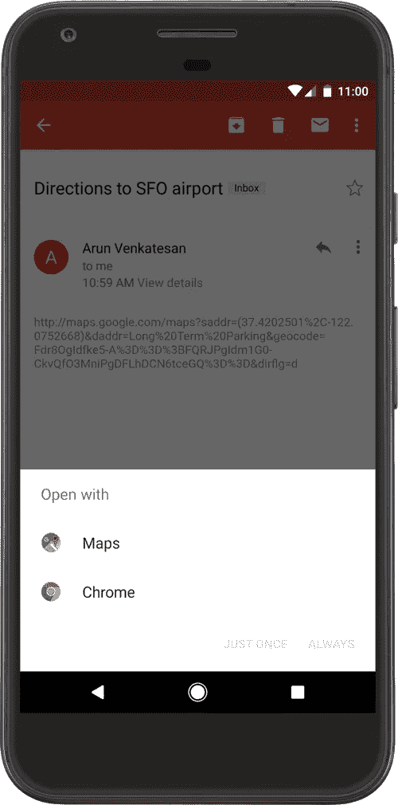
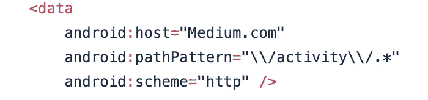
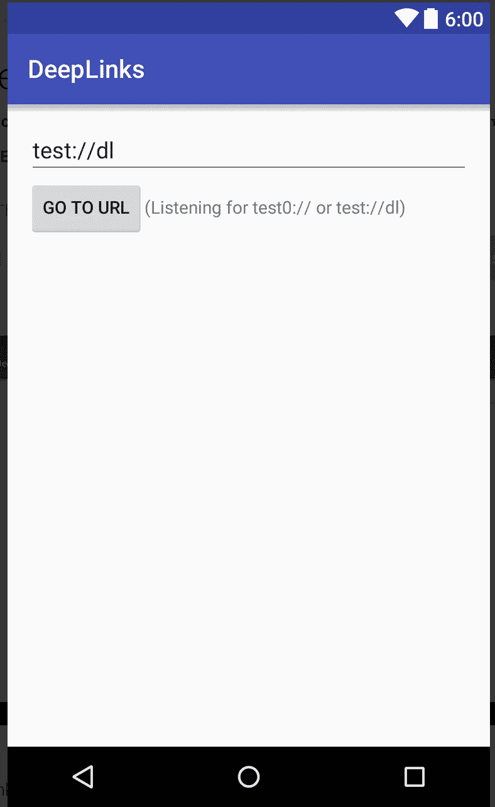
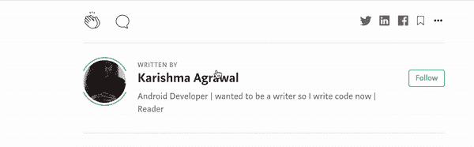

# Android 上的深度链接

> 原文：<https://levelup.gitconnected.com/deep-linking-on-android-302fd4ddc67d>

# 什么是深度链接？

深度链接是一个帮助用户在**网络**和**应用之间导航的概念。**它们基本上是将用户直接导航到**应用程序中特定内容的 URL。**

有时你想让用户容易地到达你的应用程序流程中的一个特定部分，而不必从开始屏幕*点击-点击-点击*到达那里。例如，也许你想在一个聊天应用程序中显示正在进行的对话，或者在一个购物应用程序中显示用户的购物车。你可以使用深层链接来做到这一点，在应用程序之外，在快捷方式和通知中显示这些链接，允许用户从这些其他位置单击并到达应用程序的更深层部分。

# 深度链接和 app 链接有什么区别？



一个**深度链接**是一个意图过滤系统，允许用户在 Android 应用程序中直接输入特定活动。然而，这个过程有一个**问题**。当用户点击一个 URL 时，它可能会打开一个对话框，要求用户从处理给定 URL 的多个应用程序中选择一个。

另一方面，**一个 Android 应用程序链接**是一个基于你的网站 URL 的深度链接，已经被验证属于你的网站。当用户点击该网址时，它会打开你的应用程序。

# 如何创造深度链接？

当用户单击 URL 时，Android 系统会按顺序尝试以下每个操作，直到请求成功:

1.  打开可以处理 URI 的用户首选应用程序(如果已指定)。
2.  打开唯一可用的可以处理 URI 的应用程序。
3.  允许用户从对话框中选择应用程序。

# 为传入链接添加意图过滤器

要创建应用程序内容的链接，请在清单中添加包含这些元素和属性值的意图过滤器:

> `**<action>**` *指定* `*ACTION_VIEW*` *意图动作，以便可以从 Google 搜索到达意图过滤器。*

```
<action android:name=”android.intent.action.VIEW” />
```

> `**<category>**` `[*BROWSABLE*](https://developer.android.com/reference/android/content/Intent#CATEGORY_BROWSABLE)` *—这是从 web 浏览器访问意图过滤器所必需的。如果没有它，在浏览器中单击链接将无法解析到您的应用程序。* `[*DEFAULT*](https://developer.android.com/reference/android/content/Intent#CATEGORY_DEFAULT)` *—这允许你的应用程序响应隐含的意图。否则，只有在意向指定了您的应用程序组件名称时，活动才能开始。*

```
<category android:name="android.intent.category.DEFAULT" />        <category android:name="android.intent.category.BROWSABLE" />
```

> `**<data>**`
> 数据标签表示解析为活动的 URI 格式。
> 至少，`[<data>](https://developer.android.com/guide/topics/manifest/data-element)`标签必须包含`[android:scheme](https://developer.android.com/guide/topics/manifest/data-element#scheme)`属性。



您可以添加更多的属性来进一步细化活动接受的 URI 的类型。例如，您可能有多个接受相似 URIs 的活动，但它们的区别仅在于路径名。在这种情况下，使用`[android:path](https://developer.android.com/guide/topics/manifest/data-element#path)`属性或其`pathPattern`或`pathPrefix`变量来区分系统应该为不同的 URI 路径打开哪个活动。

请参见下面完整的 xml。

现在 URL“**http://Medium.com/activity**”和“**样本://活动**”将做同样的工作。他们都将解决相同的活动。
对于多条路径，主机和方案将是相同的，您可以用“路径前缀”、“路径模式”来表示路径。

现在注意一件事，你可以在一个意图过滤器中有多个`data`点，就像上面的例子一样。他们将支持[](http://Medium.com/activity)******[**https://www.Medium.com/activity**](http://Medium.com/activity)**而且还有[](http://Medium.com/activity)****[**【http://www.Medium.com/】**](http://Medium.com/activity)**意思是所有方案和主机的组合。**************

******例子:[**https://www.Medium.com/activity**](http://Medium.com/activity)**/故事********

****从应用程序内部或外部的任何地方点击此链接后，您将直接进入故事页面，无需通过点击导航。****

# ****从传入意向中读取数据****

****一旦系统通过意图过滤器启动您的活动，您就可以使用由`[Intent](https://developer.android.com/reference/android/content/Intent)`提供的数据来确定您需要呈现什么。调用`[getData()](https://developer.android.com/reference/android/content/Intent#getData())`和`[getAction()](https://developer.android.com/reference/android/content/Intent#getAction())`方法来检索与传入的`[Intent](https://developer.android.com/reference/android/content/Intent)`相关联的数据和动作。您可以在活动生命周期中的任何时候调用这些方法，但是您通常应该在早期回调时这样做，例如`[onCreate()](https://developer.android.com/reference/android/app/Activity#onCreate(android.os.Bundle))`或`[onStart()](https://developer.android.com/reference/android/app/Activity#onStart())`。****

```
**override fun onCreate(savedInstanceState: Bundle?) {
    super.onCreate(savedInstanceState)
    setContentView(R.layout.main)

    val action: String? = intent?.action
    val data: Uri? = intent?.data
}**
```

******最佳实践:******

*   ****处理空数据****
*   ****您需要有一个**单独的深度链接活动**来处理所有需要登录、完成入职等情况。隔离入口点将提供处理事情的灵活性，并提供更干净的代码来维护。****
*   ****最好用**验证并呈现**页面内容，因为目的页面是隐藏的，可能会有安全问题。最好在呈现页面之前进行验证****
*   ****保持后退动作。遵循[中描述的设计指南，让用户通过深层链接进入你的应用后，你的应用能满足他们对反向导航的期望。](https://developer.android.com/design/patterns/navigation)****

# ****测试你的深层链接:****

********

******方法一**:安装深度链接测试仪应用:
[https://play.google.com/store/apps/details?id = org . thewheatfield . Android . deep links&HL = en&GL = US](https://play.google.com/store/apps/details?id=org.thewheatfield.android.deeplinks&hl=en&gl=US)****

****当你打开应用程序时，你会看到一个这样的页面，粘贴你的网址，看看它是否会从你的应用程序打开所需的页面。****

******方法 2:** 您可以使用 [Android 调试桥](https://developer.android.com/tools/help/adb)和活动管理器(am)工具来测试您为深度链接指定的意图过滤器 URIs 是否解析到正确的应用活动。您可以针对设备或模拟器运行 adb 命令。
用 adb 测试意图过滤器 URI 的一般语法是:****

```
**$ adb shell am start
        -W -a android.intent.action.VIEW
        -d <URI> <PACKAGE>**
```

****对于我们的例子，它将是这样的****

****[**https://www.Medium.com/activity**](http://Medium.com/activity)**/故事会******

```
**$ adb shell am start
        -W -a android.intent.action.VIEW
        -d "https://www.Medium.com/activity/stories" com.example.android**
```

****上面设置的清单声明和意图处理程序定义了应用程序和网站之间的连接，以及如何处理传入的链接。****

******我在下面添加了一些关于深层链接开发者面临的常见问题的链接:******

*   ****[https://medium . com/mobile-app-development-publication/breaking-deep-link-unknown-by-adding-another-deep-link-14773 fea1de](https://medium.com/mobile-app-development-publication/breaking-deep-link-unknowing-by-adding-another-deep-link-14773fea1de)****
*   ****[https://level up . git connected . com/the-wrong-hacked-and-correct-way-of-Android-deep-linking-for-redirected-multisite-with-auto verify-5c 72 FB 1 f 8053](/the-wrong-hacked-and-correct-way-of-android-deep-linking-for-redirected-multisite-with-autoverify-5c72fb1f8053)****
*   ****[https://medium . com/mobile-app-development-publication/unrealized-deep link-bug-on-many-apps-6a c78 a 557702](https://medium.com/mobile-app-development-publication/unrealized-deeplink-bug-on-many-apps-6ac78a557702)****

****感谢您的阅读。👏我真的希望这篇文章对你有所帮助。非常感谢你的鼓掌帮助其他人找到这篇文章😃。****

********