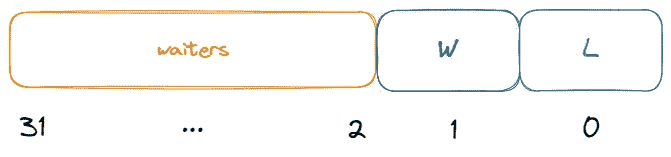
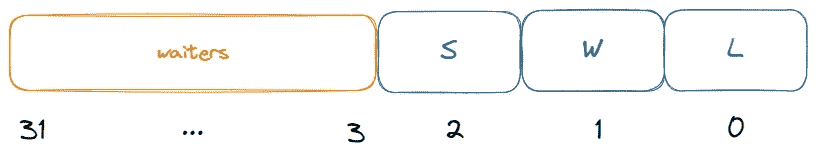

# 对 Golang 互斥体的深入理解

> 原文：<https://levelup.gitconnected.com/deep-understanding-of-golang-mutex-9964b02c56e9>

## 如何实现 Golang 互斥体


丹尼尔·西兰特夫在 [Unsplash](https://unsplash.com/s/photos/home?utm_source=unsplash&utm_medium=referral&utm_content=creditCopyText) 上拍摄的照片

在开始之前，我们需要添加几种实现锁的方法。

**#旗语。**

操作系统中有 P 和 V 操作。P 操作是将信号量改变-1，V 操作是将信号量增加 1，所以信号量的操作方式是:

*   初始化，给它一个非负整数值。
*   程序试图进入临界块的进程需要先运行 P。那么将会有两种情况。

1.  当信号量 S 减少到负值时，进程将被阻塞，无法继续。此时，进程被阻塞。
2.  当信号量 S 不为负时，该进程可以被允许进入临界块。

*   为了结束离开临界块的进程，将运行 V。当信号量 S 不为负时，先前被阻塞的其他进程将被允许进入临界块。

**#信号量和锁。**

虽然信号量和锁看起来很像，比如信号量为 1 时，实现了互斥锁，但实际上，它们的含义是不同的。

锁用于保护关键资源，例如不能同时执行读和写。

信号量是为了确保进程(或线程或 goroutine)被调度。比如三个进程共同计算 c=a+b，首先 a+b 的计算和赋值操作不能同时进行。其次，要保证先执行 a+b。c 是在赋值之后执行的，所以这个地方需要以信号量的形式来完成。

此外，锁可以通过信号量来实现，然后 goroutine 可以根据规定被阻塞和唤醒，或者它可以通过旋转锁来实现，然后 goroutine 将占用 CPU，直到它被解锁。

这两种方法的区别在于是否需要 goroutine 调度，但本质上，锁的实现是为了保证关键资源不会被错误访问。

**#旋转锁。**

CAS 理论是一种自旋锁。

同一时间只能有一个线程获得锁，没有获得锁的线程通常有两种处理方法:

*   它一直在循环中等待确定资源是否已经释放了锁。这种锁称为旋转锁，它不会阻塞线程(非阻塞)。
*   阻塞自己，等待重新调度请求，这是互斥的。

自旋锁的原理相对简单。如果持有锁的线程可以在短时间内释放锁资源，那么那些等待竞争锁的线程就不需要在内核态和用户态之间切换进入阻塞状态，它们只需要等待一分钟(spin)，等到持有锁的线程释放锁后再获取，这样就避免了用户进程和内核切换的消耗。

但是如果长时间锁定，自旋锁的开销会非常大，它会阻止其他线程运行和调度。

线程持有锁的时间越长，持有该锁的线程被 OS 调度程序中断的风险就越大。

如果发生中断，其他线程将继续运行(反复尝试获取锁),而持有锁的线程不打算释放锁，这将导致无限延迟，直到持有锁的线程可以完成并释放锁。

解决上述情况的一个好方法是为自旋锁设置一个自旋时间，时间一到就释放自旋锁。

旋转锁的目的是占用 CPU 资源而不释放它们，并在获得锁时立即处理它们。

**#悲观锁定和乐观锁定。**

悲观锁定是一种悲观的思维。它总是认为最坏的情况可能会发生。它认为数据很可能被他人修改。无论是读还是写，悲观锁在执行操作之前都会被锁定。

读写都需要锁，导致性能低，所以悲观锁的机会不多。但是，在多次写入的情况下，仍然有机会使用悲观锁，因为乐观锁会在写入不一致的情况下不断重试，这样会浪费更多的时间。

乐观锁定的思想与悲观锁定的思想相反。它始终认为资源和数据不会被别人修改，所以读不会被锁，但是乐观锁会决定写操作时当前数据是否被修改过。。

乐观锁的实现方案主要包括 CAS 和版本号机制。乐观锁定适用于多次读取的情况，可以提高吞吐量。

CAS 代表比较和交换，这是一种众所周知的无锁算法。

即在不使用锁的情况下实现多个线程之间的变量同步，也就是在不阻塞线程的情况下实现变量同步，所以也叫非阻塞同步。

CAS 涉及三种关系:指向内存区域的指针 V、旧值 A 和要写入的新值 B。

CAS 实现的乐观锁会带来 ABA 问题。同时，整个乐观锁会在数据不一致的情况下触发等待和重试机制，对性能影响很大。

版本号机制通过版本号版本实现版本控制。

好了，有了以上的基础知识，我们就可以开始分析 Golang 是如何实现互斥的了。

Golang 对互斥体的实现一直在改进，截至目前主要改进了 4 个版本:

*   V1:简单的实现。
*   V2:新的 goroutine 参加锁比赛。
*   给新人更多的机会。
*   V4:解决老的 goroutine 饥饿问题。

每一次改进都是为了提高系统的整体性能。这种升级是渐进和持续的，所以有必要从 V1 版本开始慢慢看互斥体的演变。

V1:简单的实现。

在 V1 版本中，互斥体的完整源代码如下。

[](https://github.com/golang/go/blob/d90e7cbac65c5792ce312ee82fbe03a5dfc98c6f/src/pkg/sync/mutex.go) [## go/mutex . go at d 90 e 7 cbac 65 c 5792 ce 312 ee 82 FBE 03 a5 DFC 98 c 6 f golang/go

### 此文件包含双向 Unicode 文本，其解释或编译可能与下面显示的不同…

github.com](https://github.com/golang/go/blob/d90e7cbac65c5792ce312ee82fbe03a5dfc98c6f/src/pkg/sync/mutex.go) 

主要核心代码如下:

首先，`Mutex`的结构非常简单，包括两个标志，`key`和`sema`。

`key`表示有几个 goroutines 正在使用或准备使用该锁。如果`key==0`，表示当前互斥体解锁，否则`key>0`表示互斥体锁定。

`sema`是信号量，它实际上是导致`goroutine`阻塞和唤醒的原因。

`xadd`函数是基于 CAS 的加减函数。

`Lock`和`Unlock`函数是锁定当前互斥体的核心，但逻辑很简单。

`Lock`函数使用`xadd`方法来`key+1`。如果结果为`1`，则说明原锁处于解锁状态，不需要关注信号量直接获取锁。如果没有，调用`semacquire`方法来阻塞当前的 goroutine。

`Unlock`函数使用`xadd`方法来配对`key-1`。如果结果不是`0`，则意味着一个 goroutine 正在等待，需要调用`semrelease`来唤醒一个 goroutine。

在当前的 V1 版本中，锁定和解锁完全基于 FIFO 方法。这种方法虽然很公平，但从效率的角度来看并不是最优的。

想象一个场景:被阻塞的 goroutine(将当前 goroutine 命名为 g1)一定不能占用 CPU，所以需要在 g1 被唤醒后进行上下文切换。如果此时出现新的 goroutine (g2 ),它将拥有 CPU 资源。

如果锁给了 g2，那么它可以立即执行并返回结果(不用等待 g1 的上下文切换)，这样整体效率可以提高一个档次。

**V2:新歌路汀参加锁比赛。**

完整的源代码地址位于:[https://github . com/golang/go/blob/weekly . 2011-07-07/src/pkg/sync/mutex . go](https://github.com/golang/go/blob/weekly.2011-07-07/src/pkg/sync/mutex.go)

在 V2 版本中，核心特征是一个 goroutine 在被唤醒后并不立即执行任务，而是仍然重复抢占锁的过程，以便新的 go routine 有机会获取锁，这就是所谓的新人机会。

互斥结构和常量定义如下。

虽然互斥结构的定义基本不变，但是从 V1 的`key`到 V2 的`state`，它们的内部结构却大不相同。

第 0 位代表锁定状态(L)，即`0`代表解锁，`1`代表锁定，第 1 位代表唤醒状态(W)，第 2 位到第 31 位代表阻塞等待次数。



`mutexLocked`的值是`0x1`,`mutexWoken`的值是`0x2`,`mutexWaiterShift`的值是`0x2`,`mutexWaiterShift`表示任何代表阻塞等待数的数组都需要左移两位。

V2 版本的主要改进存在于锁方法中，代码如下。

第 2–4 行中的代码逻辑适用于解锁状态，通过将 L 位从`0`设置到`1`，goroutine 通过 CAS 获取锁定。

在这一点上没有争用，所以获得锁几乎不需要任何成本。

接下来的代码被访问表示当前被锁定，即 L 位为`1`。

然后，goroutine 进入一个循环，在这个循环中，CAS 方法确保新状态被正确叠加。

从旧状态到新状态(新)的主要变化包括:

*   尝试获取锁。
*   尝试将服务员的数量增加 1。

由于更改不是原子性的，因此可能会导致旧状态变得陈旧。

比如当前处于解锁状态，两个 goroutines 同时获取旧状态，都处于解锁状态，但总有一个能得到锁，另一个不能。

同样，即使当前状态被锁定，旧状态也会由于等待者的数量而过时。

因此，您需要继续通过循环获得新的旧状态。

在旧状态未过时并覆盖新状态后，进入真正的锁定步骤。

如果旧状态解锁，则直接获得锁，否则通过信号量机制阻塞当前的 goroutine。

被唤醒后，不像 V1，当前进程还是会陷入 for 循环重新抢锁，这是给新人机会的体现:

*   如果在上下文切换期间旧的 goroutine 有了新的 goroutine，锁将被给予新的 goroutine。
*   如果在上下文切换完成后，旧的 goroutine 仍然没有新的 goroutine，那么锁将被给予旧的 goroutine。

解锁方法相对简单。代码如下。

解锁逻辑主要有两个。

*   如果没有服务员或者当前系统未锁定并且有唤醒程序，则直接返回。
*   如果不满足上述要求，等待的次数将减一，队列头的 Goroutine 将通过信号量被唤醒。

**V3:多给新人一些机会。**

这个版本的优化，关键在于

[https://github . com/golang/go/commit/edcad 8639 a 902741 DC 49 f 77d 000 ed 62 b 0 cc 6956 f](https://github.com/golang/go/commit/edcad8639a902741dc49f77d000ed62b0cc6956f)

在 V2 的基础上，如何进一步提高性能？很多时候，协程独占锁期间对数据的操作其实是很低的，可能比唤醒+切换上下文的耗时还要低。

想象一个场景:GoroutineA 有 CPU 资源，GoroutineB 在阻塞队列的最前面。然后当 GoroutineA 试图获取锁时，它发现当前锁已被占用。根据 V2 策略，GoroutineA 会立即被阻塞，假设此时锁已被锁定。如果被释放，那么 GoroutineB 将按计划被唤醒，即整个运行时间包括 GoroutineB 的唤醒+上下文切换时间。

在 V3 中，允许新的 Goroutine (GoroutineA)通过旋转等待一段时间。如果在等待时间内释放了锁，新的 Goroutine 立即获得锁资源，避免了旧的 Goroutine 的唤醒+上下文切换的耗时，提高了整体工作效率。

同样，V3 的改进主要集中在`Lock`方法上，代码如下。

与 V2 的实现代码相比，主要集中在第 14–25 行，多了两个函数`runtime_canSpin`和`runtime_doSpin`，是自旋锁的核心。

首先是`runtime_canSpin`功能。传入的参数是`iter`(代表当前的旋转次数)。runtime_canSpin 函数的实现功能是确定是否可以进入当前的自旋等待状态。

如前所述，自旋锁等待不释放 CPU 资源，不存在上下文切换的消耗，但如果自旋时间过长，会导致无意义的 CPU 消耗，进而影响性能。

因此，在使用自旋锁时，必须严格控制自旋锁的进入过程。

最后是`runtime_doSpin`函数，可以简单理解为 CPU 空闲一段时间，也就是自旋过程。

整个过程非常清楚。所有占用 CPU 的 Goroutines 都在 runtime_canSpin 函数通过检查后执行 spin 操作。如果在旋转操作完成后它们仍然没有持有锁，则 Goroutine 被阻塞。其他逻辑与 V2 相同。

**V4:解决老 goroutine 饥饿问题。**

源地址位于:[https://github . com/golang/go/blob/go 1 . 15 . 5/src/sync/mutex . go](https://github.com/golang/go/blob/go1.15.5/src/sync/mutex.go)

V2 到 V3 的改进是为了给新的 goroutines 更多的机会，导致老的 goroutines 可能抢不到新的 goroutines 的饥饿问题，所以这个问题在 V4 中重点改进。

首先是互斥结构的 State 字段有了新的变化，增加了饥饿指示器。

其中`0`表示没有发生饥饿，`1`表示发生了饥饿。



在新的定义中，常数的定义也有一些变化。

```
const (
    mutexLocked = 1 << iota *// mutex is locked
*    mutexWoken
    mutexStarving *//* separate out a starvation token from the state field    mutexWaiterShift = iota
    starvationThresholdNs = 1e6    
)
```

Lock 方法的逻辑如下。

我们关注洛克斯洛方法。在深入研究代码之前，我们首先需要了解在什么情况下当前锁被认为是饥饿的:

*   (场景 1)旧的 Goroutine 被唤醒，但是锁被新的 Goroutine 占用，因为旧的 Goroutine“我被唤醒并且什么也没做，并且立即再次被阻塞”。
*   (场景 2)go routine 被阻塞的总时间超过了阈值(默认值为 1 毫秒)。

所以核心是记录当前 Goroutine 开始等待的时间:对于最先进入锁的 Goroutine，开始等待时间为 0。对于场景 1，判断标准是开始等待时间是否为 0。如果不是 0，说明之前已经被屏蔽了。通过(第 45 行)。

对于场景 2，判断标准是当前时间和开始等待时间之差是否超过阈值。如果是这样，这意味着 Goroutine 已经等待了太长时间，应该进入饥饿状态(第 50 行)。

进一步，当我们知道饥饿状态是如何判断的，饥饿模式和非饥饿模式有什么区别？

首先，如果当前锁是饥饿的，任何新的 Goroutines 都不会旋转(第 15 行)。

第二，如果当前的 Goroutine 处于饥饿状态，当它被阻塞时，它将被添加到等待队列的头部(下一个唤醒操作肯定会唤醒当前饥饿的 Goroutine，第 45–49 行)。

最后，饥饿的 goroutine 被允许在被唤醒后立即持有锁，而无需与其他 goro utine 重新竞争锁(比较 V2，第 52–62 行)。

对应于 V4 的解锁也根据饥饿状态进行了调整。代码如下:

与上锁操作相比，解锁操作要容易理解得多。

在正常模式下，解锁操作与以前的版本相同。在饥饿模式下，位于阻塞队列顶部的协同程序将被直接唤醒。

感谢阅读。

如果你喜欢这样的故事，想支持我，请给我鼓掌。

你的支持对我来说非常重要，谢谢你。

# 分级编码

感谢您成为我们社区的一员！在你离开之前:

*   👏为故事鼓掌，跟着作者走👉
*   📰更多内容请查看[升级编码刊物](https://levelup.gitconnected.com/?utm_source=pub&utm_medium=post)
*   🔔关注我们:[Twitter](https://twitter.com/gitconnected)|[LinkedIn](https://www.linkedin.com/company/gitconnected)|[时事通讯](https://newsletter.levelup.dev)

🚀👉 [**将像你这样的开发人员安置在顶级创业公司和科技公司**](https://jobs.levelup.dev/talent/welcome?referral=true)