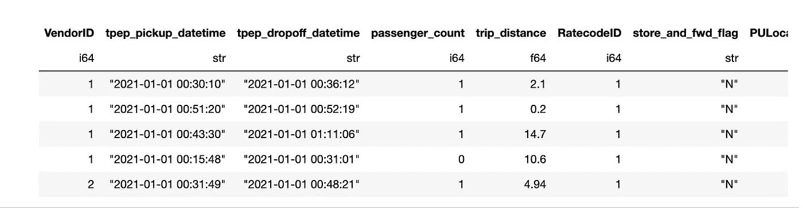
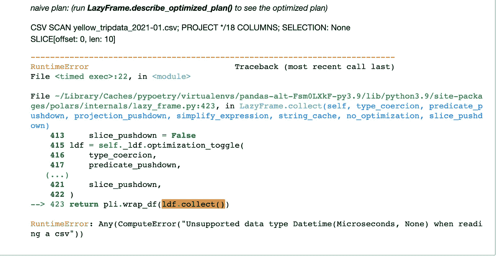

# 比熊猫还快:极地(第一部分)

> 原文：<https://levelup.gitconnected.com/deeper-dive-alternatives-to-our-beloved-pandas-polars-part-1-e34d31398006>


熊猫几乎不需要它自己的介绍。它是最常用的数据操作库之一。Pandas 是一个快速、强大、灵活且易于使用的开源数据分析和操作工具，构建于 Python 编程语言之上。

随着 Pandas 在多个方面的不断发展，如可扩展性、字符串类型处理、丢失值的一致处理等，人们仍在努力使它变得更快。人们可以看到 **Numba** 加速操作和**火花箭头**兼容性在^1 的路线图上

然而，有一种新的包装已经显示出前景。本系列将介绍许多这样的软件包，它们有可能变得更有用、更快、更用户友好。那么，让我们开始吧

我们的第一个候选人是 Polars。[https://github.com/pola-rs/polars](https://github.com/pola-rs/polars)

Polars 是一个非常快速的数据帧库，在 Rust 中实现，使用 Apache Arrow Columnar 格式作为内存模型。Polars 标榜懒惰/渴望执行，多线程，SIMD，查询优化，强大的表达式 API。根据用户指南，^2 `Polars`完全由`[Rust](https://www.rust-lang.org/)`编写(没有运行时开销！)并使用`[Arrow](https://arrow.apache.org/)`—[本机 arrow2](https://github.com/jorgecarleitao/arrow2) `[Rust](https://github.com/jorgecarleitao/arrow2)` [实现](https://github.com/jorgecarleitao/arrow2)——作为其基础，本指南中的示例将主要使用其高级语言绑定。后者仅仅是一个薄薄的包装器，不会提供比核心库更多的功能。

我们将浏览 Polar 提供的全套功能，并检查它是否准备好替代真正快速的熊猫！我们将假设我们的分析将在木星环境中进行。

```
**!** python **--**version
Python 3.9.4
```

# 安装和导入 polars

```
**!** pip install polars
**import** polars **as** pl
```

# 获取数据

```
**!** wget "https://s3.amazonaws.com/nyc-tlc/trip+data/yellow_tripdata_2021-01.csv"--2022-03-06 11:55:29--  [https://s3.amazonaws.com/nyc-tlc/trip+data/yellow_tripdata_2021-01.csv](https://s3.amazonaws.com/nyc-tlc/trip+data/yellow_tripdata_2021-01.csv)
Resolving s3.amazonaws.com (s3.amazonaws.com)... 52.216.251.190
Connecting to s3.amazonaws.com (s3.amazonaws.com)|52.216.251.190|:443... connected.
HTTP request sent, awaiting response... 200 OK
Length: 125981363 (120M) [text/csv]
Saving to: ‘yellow_tripdata_2021-01.csv.1’yellow_tripdata_202 100%[===================>] 120.14M  24.9MB/s    in 4.9s2022-03-06 11:55:34 (24.4 MB/s) - ‘yellow_tripdata_2021-01.csv.1’ saved [125981363/125981363]**!** wc **-**l yellow_tripdata_2021**-**01.csv
1369766 yellow_tripdata_2021-01.csv
```

# 让我们用熊猫的方式做事情


```
**import** pandas **as** pd
**import** polars **as** pl
**import** datetime
```

我们将用熊猫作为我们的基准。熊猫 read_csv()函数的默认设置可以在[这里](https://pandas.pydata.org/docs/reference/api/pandas.read_csv.html)找到。

```
**%%**time
data **=** pd.read_csv("yellow_tripdata_2021-01.csv", infer_datetime_format**=True**)CPU times: user 1.26 s, sys: 131 ms, total: 1.39 s
Wall time: 1.41 sdata.dtypesVendorID                 float64
tpep_pickup_datetime      object
tpep_dropoff_datetime     object
passenger_count          float64
trip_distance            float64
RatecodeID               float64
store_and_fwd_flag        object
PULocationID               int64
DOLocationID               int64
payment_type             float64
fare_amount              float64
extra                    float64
mta_tax                  float64
tip_amount               float64
tolls_amount             float64
improvement_surcharge    float64
total_amount             float64
congestion_surcharge     float64
dtype: object
```

熊猫无法推断日期和时间字符串。熊猫将这些领域转化为物体。 **tpep_pickup_datetime** 和 **tpep_dropoff_datetime** 都应该是日期或者某种形式的日期+时间推断**。**为什么重要？提示:任何对象都将占用更多的内存，并成为未来处理的一大难题。

让我们试着解析日期并实现 *strptime。*成功了。现在的特征实际上是日期时间 64 秒，但是一个大但是..

```
**%%**timemydateparser **=** **lambda** x: datetime.datetime.strptime(x, '%Y-%m-%d %H:%M:%S')
data **=** pd.read_csv("yellow_tripdata_2021-01.csv", parse_dates**=**['tpep_pickup_datetime','tpep_dropoff_datetime'], date_parser**=**mydateparser)display(data.dtypes)
VendorID                        float64
tpep_pickup_datetime     datetime64[ns]
tpep_dropoff_datetime    datetime64[ns]
passenger_count                 float64
trip_distance                   float64
RatecodeID                      float64
store_and_fwd_flag               object
PULocationID                      int64
DOLocationID                      int64
payment_type                    float64
fare_amount                     float64
extra                           float64
mta_tax                         float64
tip_amount                      float64
tolls_amount                    float64
improvement_surcharge           float64
total_amount                    float64
congestion_surcharge            float64
dtype: objectCPU times: user 15.4 s, sys: 212 ms, total: 15.6 s
Wall time: 15.6 s
```

在没有指定数据类型或日期解析器的情况下，读取时间为 1.4 秒，通过添加对日期列的解析，读取时间缩短到了 15.6 秒。对于行数为 1，369，766 的文件来说，这是很长的时间。乌曼..这不是很好..哦，亲爱的熊猫..！

# 使用极坐标读取数据

有两种主要方法可以将数据读入 Polar。

1.  Polars.scan_<format></format>
2.  Polars.read_<format></format>

Polars 可以处理 **csv** 、 **ipc** 、 **parquet** 、 **sql** 、 **json** 和 **avro** ，因此我们覆盖了 99%的基础。所以，事不宜迟，让我们读入 2021 年 1 月纽约出租车数据的 csv 文件。

```
df **=** pl.scan_csv("yellow_tripdata_2021-01.csv")
display("trying head on the LazyFrame")
display(df.head(n**=**5))*naive plan: (run* ***LazyFrame.describe_optimized_plan()*** *to see the optimized plan)*CSV SCAN yellow_tripdata_2021–01.csv; PROJECT */18 COLUMNS; SELECTION: NoneSLICE[offset: 0, len: 5]
```

需要记住的一点是，LazyExecution 就像一个蓝图。印刷在那里，但并不意味着房屋已经建成。计划不允许实际查看数据，因此我们调用方法 *collect()。* Naive plan 不允许直接使用 head()，所以让 collect()方法之后再做。



df.collect()。头部(n **=** 5)

当我们扫描 _csv 文件时，该对象是一个懒惰对象。惰性执行允许 Polars 在执行之前优化工作流。它允许链接操作，而无需将更改提交给内存。但是，懒惰对象没有 dtypes！！有人会认为地图应该有理想的数据类型，对吗？好吧，让我们继续。让我们看看什么是允许偷懒的！:)


我们可以比较懒惰对象和急切执行对象/数据帧的所有方法。

```
*# Following methods are available to the LazyFrame but not to DataFrame*set_difference **=** set(dir(df)) **-** set(dir(df.collect()))
list_difference **=** list(set_difference)
list_difference['_from_pyldf',
 'cache',
 'map',
 'describe_optimized_plan',
 'describe_plan',
 'scan_parquet',
 'last',
 'collect',
 'reverse',
 'show_graph',
 'inspect',
 '_ldf',
 'scan_csv',
 'first',
 'scan_ipc',
 'fetch']
```

相反，以下方法适用于 Polars 数据帧，但不适用于 lazy 帧

```
set_difference **=** set(dir(df.collect())) **-** set(dir(df))
list_difference **=** list(set_difference)
list_difference['__getattr__',
 '_read_json',
 'width',
 '__add__',
 'transpose',
 'is_empty',
 'height',
 'replace',
 '__len__',
 'to_csv',
 'to_dummies',
 'to_dicts',
 '_read_parquet',
 'to_parquet',
 '__copy__',
 'lazy',
 '_from_dict',
 '__iter__',
 'n_chunks',
 '_pos_idx',
 'to_avro',
 'schema',
 'describe',
 'frame_equal',
 'sample',
 '_from_records',
 'replace_at_idx',
 '__mod__',
 'upsample',
 'fold',
 'to_dict',
 'apply',
 'get_column',
 'hstack',
 '__setstate__',
 'to_ipc',
 'shrink_to_fit',
 '__setitem__',
 'to_series',
 'row',
 'to_arrow',
 '__getstate__',
 'to_json',
 '_read_avro',
 '_from_dicts',
 'find_idx_by_name',
 'rechunk',
 '__getitem__',
 '_df',
 '__sub__',
 'select_at_idx',
 'insert_at_idx',
 'extend',
 '_from_pydf',
 '_read_ipc',
 'hash_rows',
 '__truediv__',
 'null_count',
 'rows',
 '__mul__',
 'to_pandas',
 'shape',
 '_from_pandas',
 '_from_arrow',
 'vstack',
 'is_duplicated',
 'is_unique',
 'product',
 'pivot',
 'clone',
 '__deepcopy__',
 'to_numpy',
 'dtypes',
 'get_columns',
 'drop_in_place',
 '_read_csv']
```

重要的是**模式**和 **dtypes** 在 LazyFrame 中不可用。其他重要的方法还有 **lazyexecute** 、 **chunk** ，以及一些有帮助的**哈希**、**分组**、**折叠**函数。但是，没有模式和数据类型可能会导致问题。

人们可以期望能够将 LazyFrame 转换成 DataFrame。如果有错误，那么**模式**或 **dtypes** 不可用，因此没有 LazyFrames 的方法是有意义的，已经被扫描的模式仍然是可用的..让我们进一步挖掘

所以让我们来看看这个模式。

```
**%%**time
df **=** pl.scan_csv("yellow_tripdata_2021-01.csv")
df.collect().schemaCPU times: user 586 ms, sys: 243 ms, total: 829 ms
Wall time: 348 ms{'VendorID': polars.datatypes.Int64,
 'tpep_pickup_datetime': polars.datatypes.Utf8,
 'tpep_dropoff_datetime': polars.datatypes.Utf8,
 'passenger_count': polars.datatypes.Int64,
 'trip_distance': polars.datatypes.Float64,
 'RatecodeID': polars.datatypes.Int64,
 'store_and_fwd_flag': polars.datatypes.Utf8,
 'PULocationID': polars.datatypes.Int64,
 'DOLocationID': polars.datatypes.Int64,
 'payment_type': polars.datatypes.Int64,
 'fare_amount': polars.datatypes.Float64,
 'extra': polars.datatypes.Float64,
 'mta_tax': polars.datatypes.Float64,
 'tip_amount': polars.datatypes.Float64,
 'tolls_amount': polars.datatypes.Float64,
 'improvement_surcharge': polars.datatypes.Float64,
 'total_amount': polars.datatypes.Float64,
 'congestion_surcharge': polars.datatypes.Float64}
```

不幸的是，日期字段 **tpep_pickup_datetime** 和 **tpep_dropoff_datetime** 被读作 **Utf8** 。我们需要解决这个问题。其他地方看起来不错。还有一些其他的方法来减少内存占用，但是我们将在后面检查这些方法。

还有，scan_csv 用 **collect** 在 0.35 秒内完成了操作！相比之下为 1.4 秒。

# 让我们再次读取该文件，并尝试修复模式

另一种方法是让 Polars 做尽可能多的工作来推断数据类型，并显式地确认其余的数据类型。

```
**%%**time
df **=** pl.scan_csv("yellow_tripdata_2021-01.csv")df **=** df.with_columns([ pl.col("tpep_pickup_datetime").str.strptime(pl.Datetime, '%Y-%m-%d %H:%M:%S'),
pl.col("tpep_dropoff_datetime").str.strptime(pl.Datetime, '%Y-%m-%d %H:%M:%S')]).collect()display(df.schema){'VendorID': polars.datatypes.Int64,
 'tpep_pickup_datetime': polars.datatypes.Datetime,
 'tpep_dropoff_datetime': polars.datatypes.Datetime,
 'passenger_count': polars.datatypes.Int64,
 'trip_distance': polars.datatypes.Float64,
 'RatecodeID': polars.datatypes.Int64,
 'store_and_fwd_flag': polars.datatypes.Utf8,
 'PULocationID': polars.datatypes.Int64,
 'DOLocationID': polars.datatypes.Int64,
 'payment_type': polars.datatypes.Int64,
 'fare_amount': polars.datatypes.Float64,
 'extra': polars.datatypes.Float64,
 'mta_tax': polars.datatypes.Float64,
 'tip_amount': polars.datatypes.Float64,
 'tolls_amount': polars.datatypes.Float64,
 'improvement_surcharge': polars.datatypes.Float64,
 'total_amount': polars.datatypes.Float64,
 'congestion_surcharge': polars.datatypes.Float64}CPU times: user 1.06 s, sys: 106 ms, total: 1.16 s
Wall time: 452 ms
```

因此，假设日期是非标准时间戳，我们将无法使用现成的日期解释器。( **parse_dates()** 和**polars . data types . datetime**使用的是由 64 位有符号整数编码的 **UNIX 纪元)**

# 懒惰的对象会发现一个故意的错误吗？

我尝试在读取 csv /扫描 csv 时显式指定 dtypes。有趣的事情发生了。scan_csv 作为一个懒惰调用执行时没有错误，在我看来这是不应该允许的。扫描应该捕获不兼容的数据类型规范。

```
**%%**timetypes**=** {'VendorID': pl.Int64,
'tpep_pickup_datetime': pl.Datetime,
'tpep_dropoff_datetime': pl.Datetime,
'passenger_count': pl.Int64,
'trip_distance': pl.Float64,
'RatecodeID': pl.Int64,
'store_and_fwd_flag': pl.Utf8,
'PULocationID': pl.Int64,
'DOLocationID': pl.Int64,
'payment_type': pl.Int64,
'fare_amount': pl.Float64,
'extra': pl.Float64,
'mta_tax': pl.Float64,
'tip_amount': pl.Float64,
'tolls_amount': pl.Float64,
'improvement_surcharge': pl.Float64,
'total_amount': pl.Float64,
'congestion_surcharge': pl.Float64}df **=** pl.scan_csv("yellow_tripdata_2021-01.csv", dtypes**=**types)
display(df.head(n**=**10))
display(df.collect().dtypes)
```

只有在调用执行方法(head()、collect()等)时，才会显示该错误。



旁注:我注意到有些 head()调用需要指定 df.head(n=10)的行数，而有些时候则不需要。但是除此之外，这个过程像预期的那样工作。

# 真实使用案例的结论

最好用 **infer_schema_length=0 读入数据。**下一步自然是以可接受的模式 dtype()格式操作数据。接下来可以显式指定 dtypes()。的确，这是一种普遍接受的方法，适用于所有数据源，但不同之处在于，Polars 允许在一个步骤中完成这些操作，而无需在内存中创建对象。

不管选择什么选项，阅读速度对 Polars 来说都是令人印象深刻的。记住 Polars。DataFrame 与 Pandas.DataFrame 不同。对于所有的熊猫爱好者来说，总是可以使用 **to_pandas** 功能将 Polars 帧转换成熊猫。提前了解你所拥有的数据并使用适当的方法将会节省大量的时间和可能的内存。

在下一篇文章中，我将用数据更详细地介绍内存占用，以及如何提高资源消耗。

在那之前，继续编码吧！

如果这篇文章对你有帮助

请通过按下喜欢按钮来分享一些爱。

请 [***成为会员***](https://ithinkbot.com/membership)*[***订阅***](https://ithinkbot.com/subscribe) 获取更多简明教程。*

1.  *[https://pandas.pydata.org/docs/development/roadmap.html](https://pandas.pydata.org/docs/development/roadmap.html)*
2.  *[https://pola-rs.github.io/polars-book/user-guide/index.html](https://pola-rs.github.io/polars-book/user-guide/index.html)*