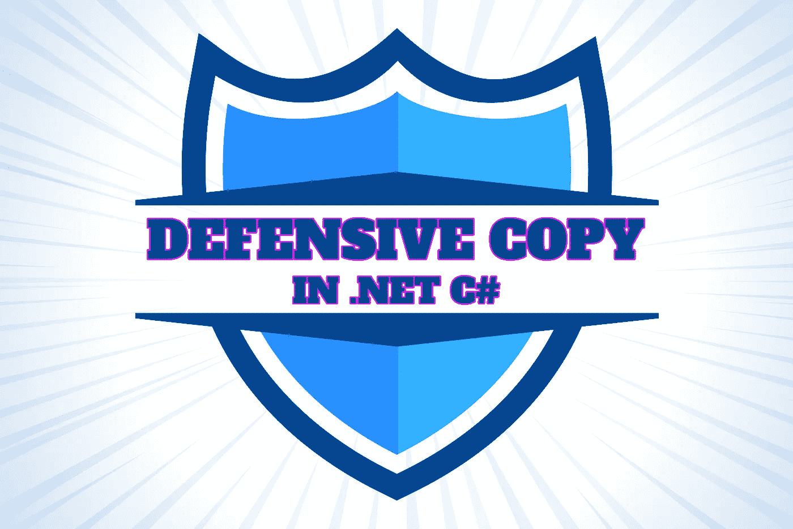
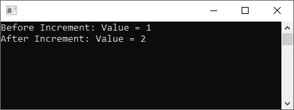
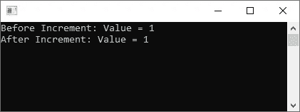
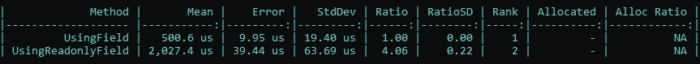
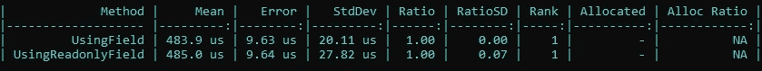

# 防御副本在。NET C#

> 原文：<https://levelup.gitconnected.com/defensive-copy-in-net-c-38ae28b828>

## 最佳实践

## 理解为什么防御性拷贝很重要，以及它如何影响性能。



防御副本在。NET C#。图片由[艾哈迈德·塔里克](https://medium.com/@eng_ahmed.tarek)拍摄

你听说过**防御副本**吗？NET C#？

你知道这个话题有多重要吗？

你知道你可能会因此浪费内存和处理能力吗？

让我告诉你吧…

[](https://medium.com/subscribe/@eng_ahmed.tarek) [## 🔥订阅艾哈迈德的时事通讯🔥

### 订阅艾哈迈德的时事通讯📰直接获得最佳实践、教程、提示、技巧和许多其他很酷的东西…

medium.com](https://medium.com/subscribe/@eng_ahmed.tarek) 

脑筋急转弯。图片由[艾哈迈德·塔里克](https://medium.com/@eng_ahmed.tarek)拍摄

# 脑筋急转弯

在进入任何细节之前，让我给你看一些有趣的东西。

假设我们有如下定义的结构:

```
public struct Num
{
    public int Value;

    public Num(int value)
    {
        Value = value;
    }

    public void Increment()
    {
        Value++;
    }

    public override string ToString() => $"Value = {Value.ToString()}";
}
```

如您所见，这是一个简单的`Num`结构，包含:

*   一个叫做`Value`的`int`字段。
*   一个建筑工人。
*   名为`Increment`的方法将`Value`字段增加 1。
*   一个`ToString`方法覆盖。

现在，假设我们有以下代码:

```
public class MainProgram
{
    private Num _number = new Num(1);

    public void Run()
    {
        Console.WriteLine("Before Increment: " + _number.ToString());
        _number.Increment();
        Console.WriteLine("After Increment: " + _number.ToString());
    }
}
```

在这个类中，我们只是定义了一个私有字段类型`Num`，在`Run`方法中，我们只是通过调用它自己的`Increment`方法来增加字段。

如果我们运行这段代码，我们会得到这样的结果:



预期结果。图片由[艾哈迈德·塔里克](https://medium.com/@eng_ahmed.tarek)拍摄

不出所料吧？

现在，让我们对代码做一个小的改动，看看这将如何反映。

让我们将代码修改如下:

```
public class MainProgram
{
    private readonly Num _number = new Num(1);

    public void Run()
    {
        Console.WriteLine("Before Increment: " + _number.ToString());
        _number.Increment();
        Console.WriteLine("After Increment: " + _number.ToString());
    }
}
```

正如您在这里可以注意到的，我们应用的唯一更改是在字段声明中添加了`readonly`关键字。

现在，如果我们再次运行代码，您是否希望得到与之前不同的结果？不确定？让我们试一试。

当我们运行新代码时，我们会得到这样的结果:



意外的结果。图片由[艾哈迈德·塔里克](https://medium.com/@eng_ahmed.tarek)拍摄

我能听到你在尖叫:

> 搞什么鬼？这怎么可能呢？！！！

是的，这是可能的，而且它实际上每次都会发生，因为它不是矩阵中的一个小故障或什么的😁

让我给你解释一下。


引擎盖下的一瞥。由 [Evan Brorby](https://unsplash.com/@evanbrorby?utm_source=unsplash&utm_medium=referral&utm_content=creditCopyText) 在 [Unsplash](https://unsplash.com/?utm_source=unsplash&utm_medium=referral&utm_content=creditCopyText) 上拍摄，由 [Ahmed Tarek](https://medium.com/@eng_ahmed.tarek) 调整

# 引擎盖下的一瞥

实际发生的事情是我在这篇文章的前几行一直在问你的；是**防御副本**。

发生的事情可以分解成简单的步骤:

1.  当我们用关键字`readonly`标记该字段时，这表明了我们完全不改变该字段的意图。换句话说，我们不希望对该字段后面的对象应用任何更改。
2.  所以，编译器实际上是听我们的，理解我们的意图。因此，编译器决定帮助我们实现我们的目标。
3.  然后，我们试图通过调用它自己的`Increment`方法来增加字段。
4.  因此，这是编译器决定介入并保护我们的字段对象免受任何改变的地方，即使这些改变是从内部触发的。但是编译器会怎么做呢？
5.  编译器会首先创建一个字段对象的副本，然后对其应用`Increment`调用，而不是对原始字段对象。
6.  这里值得一提的是，field 对象属于类型`Num`，这是一个结构。众所周知，复制一个结构会产生一个全新的对象。
7.  因此，这将最终保护我们的字段对象免受任何更改。

所以，简单地说，这段代码:

```
public class MainProgram
{
    private readonly Num _number = new Num(1);

    public void Run()
    {
        Console.WriteLine("Before Increment: " + _number.ToString());
        _number.Increment();
        Console.WriteLine("After Increment: " + _number.ToString());
    }
}
```

最终会被翻译成这样的代码:

```
public class MainProgram
{
    private readonly Num _number = new Num(1);

    public void Run()
    {
        var number = _number;
        Console.WriteLine("Before Increment: " + number.ToString());

        number = _number;
        number.Increment();

        number = _number;
        Console.WriteLine("After Increment: " + number.ToString());
    }
}
```

现在你可能会问:

> 但是为什么编译器会在`ToString`调用之前创建字段对象的副本呢？！！这个调用不会以任何方式改变对象。

是的，你是对的。它不会对字段对象应用任何更改，但这不是编译器的想法。

编译器不会检查方法内部的代码，并决定是否要对对象进行任何更改。

它只是假设这可能发生，这足以让编译器保持谨慎，并应用**防御复制**机制。

我希望你现在明白到底发生了什么。在下一节中，我们将更多地讨论**防御副本**机制。


防御性复制机制。照片由[乔希·里德](https://unsplash.com/@joshredd?utm_source=unsplash&utm_medium=referral&utm_content=creditCopyText)在 [Unsplash](https://unsplash.com/photos/u_RiRTA_TtY?utm_source=unsplash&utm_medium=referral&utm_content=creditCopyText) 拍摄，由[艾哈迈德·塔里克](https://medium.com/@eng_ahmed.tarek)调整

# 防御性复制机制

现在，让我们来看看你现在最可能想到的问题。

## ❓什么时候发生的？

当一个 **struct** 对象被用在一个**只读**上下文中，并且这个对象被操作时，就会发生这种情况。

## ❓，你说被操纵是什么意思？

被操纵意味着调用对象上的任何**方法**。同样，调用一个**属性**也是一样的，因为该属性最后是一个方法。然而，调用**字段**不会触发该机制。

## ❓**只读**上下文是什么意思？

这意味着当对象被声明为下列之一时:

👉**只读**字段

```
public class MainProgram
{
    private readonly Num _number = new Num(1);

    public void Run()
    {
        Console.WriteLine("Before Increment: " + _number.ToString());
        _number.Increment();
        Console.WriteLine("After Increment: " + _number.ToString());
    }
}
```

👉 **ref 只读**局部变量

```
public class MainProgram
{
    private Num _number = new Num(1);

    public void Run()
    {
        ref readonly Num number = ref _number;

        Console.WriteLine("Before Increment: " + number.ToString());
        number.Increment();
        Console.WriteLine("After Increment: " + number.ToString());
    }
}
```

👉参数中的

```
public class MainProgram
{
    public void Run(in Num number)
    {
        Console.WriteLine("Before Increment: " + number.ToString());
        number.Increment();
        Console.WriteLine("After Increment: " + number.ToString());
    }
}
```

## **❓，这真的重要吗？我们应该关心防御性复制是否被触发吗？**

**这实际上取决于**结构**和**的大小以及**防御复制**机制被触发的频率。****

**👉结构越大，我们预期的影响就越大。**

**👉**越频繁**防御复制机制被触发，**越会对**产生我们应该预料到的影响。**

**让我给你看看…**

********

**性能影响。由[科林·格莱登](https://unsplash.com/@rockthechaos?utm_source=unsplash&utm_medium=referral&utm_content=creditCopyText)在 [Unsplash](https://unsplash.com/photos/ij5_qCBpIVY?utm_source=unsplash&utm_medium=referral&utm_content=creditCopyText) 上拍摄，由[艾哈迈德·塔雷克](https://medium.com/@eng_ahmed.tarek)调整**

# **性能影响**

**让我们简化`Num`结构，并向它添加更多的字段，以使它的大小更大。然后，代码应该如下所示:**

```
public struct Num
{
    // Fields to just make the struct bigger
    private long Field1, Field2, Field3, Field4;

    public long Value { get; }

    public Num(long value) : this()
    {
        Value = value;
    }
}
```

**现在，让我们构建一个**基准测试**项目来比较以下各项的性能:**

**👉`Num`结构的字段。**

**👉**只读`Num`结构的**字段。**

```
[MemoryDiagnoser]
[RankColumn]
public class Benchmarker
{
    private const int Count = 1_000_000;
    private Num _number = new Num(1);
    private readonly Num _readonlyNumber = new Num(1);

    [Benchmark(Baseline = true)]
    public long UsingField()
    {
        long total = 0;

        for (var i = 0; i < Count; i++)
        {
            total += _number.Value;
        }

        return total;
    }

    [Benchmark]
    public long UsingReadonlyField()
    {
        long total = 0;

        for (var i = 0; i < Count; i++)
        {
            total += _readonlyNumber.Value;
        }

        return total;
    }
}
```

**运行这个**基准**项目，我们会得到以下结果:**

****

**基准结果。图片由[艾哈迈德·塔里克](https://medium.com/@eng_ahmed.tarek)拍摄**

**从结果中我们可以注意到，使用字段比使用`readonly`字段快 4 倍。**

**这可能会引发你提出以下问题:**

> **好了，现在我知道这可能会有所不同，但是，当实际上不需要时，有没有办法避免这种防御性拷贝呢？？**

**是的，我明白你的意思。有时编译器只是触发**防御复制**机制，即使调用不会对对象应用任何改变。**

**如果仅仅因为编译器想要谨慎，我们就应该一直买单，那就不好了。但是，我们应该吗？？**

********

**解决方法。照片由 [Edge2Edge Media](https://unsplash.com/@edge2edgemedia?utm_source=unsplash&utm_medium=referral&utm_content=creditCopyText) 在 [Unsplash](https://unsplash.com/photos/x21KgBfOd_4?utm_source=unsplash&utm_medium=referral&utm_content=creditCopyText) 上拍摄，由 [Ahmed Tarek](https://medium.com/@eng_ahmed.tarek) 调整**

# **解决方案**

**不，我们不应该。我们并不总是被迫接受分配更多内存和浪费处理能力的账单。有一个解决办法。**

**修复就像将**结构**标记为`readonly`一样简单。**

**当我们将该结构标记为 **readonly** 时，编译器确保它是**不可变的**。这意味着没有人可以操纵对象或改变其状态。**

**相应地，编译器确信没有调用会操纵对象，因此不需要**防御复制**机制。**

**因此，如果我们将代码更改如下:**

```
public readonly struct Num
{
    public readonly int Value;

    public Num(int value)
    {
        Value = value;
    }

    public Num Increment()
    {
        return new Num(Value + 1);
    }

    public override string ToString() => $"Value = {Value.ToString()}";
}
```

**现在，如果我们运行完全相同的**基准测试**项目，我们将得到以下结果:**

****

**基准结果。图片由[艾哈迈德·塔里克](https://medium.com/@eng_ahmed.tarek)拍摄**

**看，将结构标记为`readonly`移除了**防御复制**机制开销，节省了内存和处理能力。**

********

**检测手段。 [Flex Point Security Inc.](https://unsplash.com/@flexpointsecurity?utm_source=unsplash&utm_medium=referral&utm_content=creditCopyText) 在 [Unsplash](https://unsplash.com/photos/xKztxJdAmpM?utm_source=unsplash&utm_medium=referral&utm_content=creditCopyText) 拍摄，由 [Ahmed Tarek](https://medium.com/@eng_ahmed.tarek) 调整**

# **检测手段**

**现在，你可能会问:**

> **有没有什么工具可以帮助我发现防御性拷贝的出现？**

**是的，[**ErrorProne.NET 结构**](https://www.nuget.org/packages/ErrorProne.NET.Structs) nuget 包。**

**这是一组帮助避免 struct 和 **readonly** 引用性能陷阱的分析器。使用这个 nuget 包，您可以发现与结构相关的问题，以便您可以当场修复它们。**

**您需要记住的是，只有当结构大小> = 16 字节时，分析器才会发出诊断信息。**

**据说您可以使用**来更改该阈值。editorconfig** 文件并添加以下行:**

**`**error_prone.large_struct_threshold = {new threshold}**`**

********

**。网芯。图片由[艾哈迈德·塔里克](https://medium.com/@eng_ahmed.tarek)拍摄**

# **。网络核心**

**到目前为止，我们讨论的所有内容都适用于**。NET 框架**。带**。网芯**，事情有变。**

**同样的概念**防御副本**仍然存在，但框架现在更智能了。一些被**错误检测到的代码。NET Framework** 作为操纵者不会被**检测到。网芯**。**

********

**最后的想法。照片由[肯尼·埃利亚松](https://unsplash.com/@neonbrand?utm_source=unsplash&utm_medium=referral&utm_content=creditCopyText)在 [Unsplash](https://unsplash.com/?utm_source=unsplash&utm_medium=referral&utm_content=creditCopyText) 上拍摄，由[艾哈迈德·塔雷克](https://medium.com/@eng_ahmed.tarek)调整**

# **最后的想法**

**我希望至此你已经了解了关于**防御副本**机制的一切。**

**我给你的最后建议是:**

**👉总是试图设计和实现不可变的结构。**

**👉这使得将结构标记为只读变得非常容易。**

**👉With structs 总是尝试使用**字段**，而不是属性。这将帮助你避免太多的问题。**

**👉就算有**。NET Core** ，你应该遵循最佳实践，而不仅仅是依靠框架来照顾它。**

**就是这样。希望你觉得读这篇文章和我写这篇文章一样有趣。**

****

# **希望这些内容对你有用。如果您想支持:**

**如果您还不是**中的**会员，您可以使用 [**我的推荐链接**](https://medium.com/@eng_ahmed.tarek/membership) ，这样我可以从**中的**中获得您的一部分费用，您无需支付任何额外费用。订阅 [**我的简讯**](https://medium.com/subscribe/@eng_ahmed.tarek) 将最佳实践、教程、提示、技巧和许多其他有趣的东西直接发送到您的收件箱。**

****

# **其他资源**

**这些是你可能会发现有用的其他资源。**

**[](/compiler-friendly-code-sealed-keyword-in-net-c-b363fbcd1e35) [## 编译器友好代码:在。NET C#

### Why & When Sealed 关键字可以提高。NET C#

levelup.gitconnected.com](/compiler-friendly-code-sealed-keyword-in-net-c-b363fbcd1e35) [](/why-split-large-methods-into-smaller-ones-7b71f26f8745) [## 为什么要把大方法分成小方法呢？！

### 学习何时将大方法分解成小方法，让不可能变成可能。

levelup.gitconnected.com](/why-split-large-methods-into-smaller-ones-7b71f26f8745) [](/memory-management-in-net-740b03d01e24) [## 中的内存管理。网

### 中关于内存管理的所有内容。NET 和重要的相关主题。

levelup.gitconnected.com](/memory-management-in-net-740b03d01e24) [](/what-is-caching-in-software-systems-cfa71c385bfc) [## 什么是软件系统中的缓存

### 软件系统中缓存的定义和最佳实践。

levelup.gitconnected.com](/what-is-caching-in-software-systems-cfa71c385bfc) **