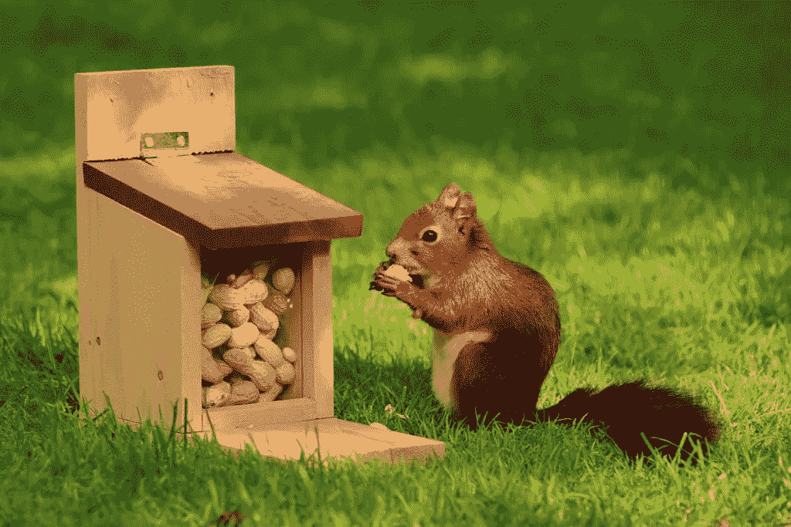

# 防御和进攻编程

> 原文：<https://levelup.gitconnected.com/defensive-offensive-programming-2fcbc2847795>


防御性编程是很多程序员都听过的一个术语。这与[错误处理](https://programmingduck.com/articles/errors)和拥有正确的程序有关。对于某些程序来说，防御性编程是必不可少的。对另一些人来说，在这里和那里使用可能是有用的。除此之外，还有攻击性编程。

在本文中，我们将从研究“普通编程”开始。我们将首先检查它，因为有些人将它误认为是防御性编程。然而，无论您是否进行防御性编程，这都是您应该做的事情。

然后，我们将研究防御性编程，然后是攻击性编程。

# 正常编程

正常编程意味着对代码进行所有必要的检查。这也意味着总是处理某些类型的错误。

# 代码中的必要检查

有些代码需要很多条件。它会让人觉得你对你所拥有的条件数量“过于防备”。

这方面的一个例子是检查`null`(十亿美元的错误)。[空值和空值检查](https://programmingduck.com/articles/nulls)非常棘手。许多代码库到处都需要`if`语句。

另一个例子是验证用户输入。您需要进行许多检查来确保用户输入是有效的。你的程序需要非常严格地处理它。否则，你会有安全漏洞。

但这不是防御性编程。

相反，像忘记一个空检查这样的事情是一个错误。它们不是你“以防万一”所做的不必要的检查。它们是必要的检查。价值有时会是`null`，这很正常。如果你忘记了一个，你就有一个 bug。不问任何问题。

# 必要的错误处理

错误处理在程序中非常重要。你总是需要考虑[你的程序应该如何响应错误](https://programmingduck.com/articles/error-responses)。

这也取决于错误的种类。

一般来说，大多数程序处理超出它们控制的“预期错误”。例如:

*   由于网络连接断开，发送网络请求失败。
*   找不到文件，因为用户删除了它。

如果程序因为这些错误而崩溃，对用户体验来说是非常糟糕的。此外，处理它们也相对容易。

因此，大多数程序都会处理这些问题，即使它们没有进行防御性编程。所以，再一次，这被认为是“正常编程”，而不是防御性编程。

另一种错误是 bug。在大多数程序中，这些错误被认为是“不可恢复的”。大多数程序的经验法则是遇到这些错误时崩溃，并且不处理它们。


# 防御性编程

在我看来，防御性编程是关于容错的。它意味着超越并确保你的程序继续工作。它用于某些您需要最大化的程序:

# 防御性编程的用例示例

Adrian Georgescu 在他关于 NASA 编码标准的文章中写道，防御性编程的一个例子是用于太空探索任务的代码。

这种代码被开发一次，然后被发送到太空。如果出了差错，那就是价值数十亿美元的工作损失。

对于那种代码，你需要采取极端的措施。无论如何，代码必须正确运行，不能崩溃。

这与你的普通程序非常不同。对于一般的程序，bug 通常不是大问题。即使你的程序有问题，它仍然是可用的。在最坏的情况下，可以通过致电客户服务来手动解决问题。如果程序变得不可用，您可以使其崩溃并重新启动。如果是后端程序，可能有多个服务器在运行它。如果是客户端，用户可以自己重启程序。在非常糟糕的情况下，您可以更新服务器代码。您甚至可以手动转到物理服务器并重启它。

但是，对于某些关键软件，你不能这样做。软件必须一直正常工作。

问题是人并不完美。我们制造虫子。更不用说程序控制之外的其他错误也可能发生(比如操作系统错误)。这意味着程序可能会失败。

但是，有些软件没有这个选项。

因此，你需要竭尽全力防止失败。

# 如何做防御性编程

防御性编程主要是指尽一切可能确保您的程序正确运行并将继续正确运行。这可以包括:

*   拥有非常好的软件开发实践。
*   在代码中进行多次检查，一次又一次地检查所有的东西是否一直在工作。
*   可选地，具有错误恢复机制。这样，如果出现问题，程序可能会恢复。

## 良好的软件开发实践

第一步是使代码尽可能没有错误，并且尽可能容易使用。

这意味着你需要这样的东西:

*   非常严格的质量保证
*   非常彻底的测试
*   非常全面的运行时监控
*   非常严格的编码和开发标准。事实上，你可以完全禁止某些模式或语言特性，比如递归。
*   良好的一般软件质量
*   易于理解的源代码
*   以可预测的方式运行的软件

这些要点对所有软件都很重要。然而，它们对于防御性编程至关重要。毕竟，如果你的源代码没有经过很好的测试或者不容易理解，它可能会有错误。这挫败了防御性编程的意义。

## 额外检查

带有防御性编程的代码往往会有许多额外的检查。检查是为了捕捉错误。如果代码完全没有错误，就不需要它们了。不是为了捕捉错误的检查属于“正常编程”，而不是“防御性编程”。

在代码中有条件检查某些东西，比如程序中的某些状态，是否有效。如果检查失败，则表明存在错误。

在这一点上:

*   如果程序正在开发中，你可以让它崩溃并修复错误。这与在开发过程中，在攻击性编程中使用断言的原理是一样的。
*   如果程序在生产中，您可以运行错误恢复(如果您已经实现了它)，这样程序就可以继续工作。

常见的情况是让程序崩溃，修复 bug。在开发过程中，您希望测试和额外检查的结合能够捕捉到所有的 bug。然后，当程序在生产中时，它应该按预期工作。

这些检查的另一个好处是它们可以及早发现错误。对中间状态是否正确的检查越多，就能越快发现错误。这使得调试更加容易。这也意味着您可以更早地开始错误恢复。

最后，您可能能够实现一些错误恢复。然后，如果检查失败，您可以运行错误恢复代码。

你需要多少支票都可以。你必须根据风险分析来决定检查什么。一些重要的检查可能是涉及重要计算和数据的结果。一些不太重要的检查是像检查函数参数或在简单操作后不断检查状态这样的事情。

以下是您可能有的一些检查示例:

检查函数参数的示例

您可以检查函数是否是用有效的参数调用的。参数应该具有正确的类型和范围。

下面是一个代码示例:

```
function foo(nonEmptyString, naturalInteger) {
  if (
    typeof nonEmptyString !== 'string' || // if it's not a string
    nonEmptyString === '' || // if it's the empty string
    !Number.isInteger(naturalInteger) || // if it's not an integer
    naturalInteger < 1 // if it's not a natural integer (1 or more)
  ) {
    // crash the program
    // or handle the error here
    // or throw an exception so some code higher up handles the error
    // or do anything else your error recovery implementation requires
  }
  // code for normal function execution
}
```

检查数据计算结果的示例

另一个例子是检查涉及数据的结果。

通常，您只会在第一次收到数据时检查一些数据。例如，如果一个用户提交了一些数据，您将检查它以确保它是有效的。

然后，您将处理这些数据。你可以用某种方式格式化或转换它。您需要进行测试来确保这些过程正常工作。

理论上，你不需要检查最终结果。初始数据是有效的。您处理它的代码工作正常。所以最终结果应该是正确的。

但是，如果你在做防御性编程，你可能也要检查最终结果。

## 从意外错误中恢复

到目前为止提到的步骤试图减少程序中的错误数量。然而，仍然可能有错误。因此，您可能希望实现错误恢复。

这可能需要很多思考。它甚至可能需要成为你的功能规划的一部分。如果程序在恢复过程中需要响应用户，就会出现这种情况。面向用户的行为可能会由产品经理决定，而不仅仅是由程序员决定。

此外，错误恢复可能是代码的一大部分。举一个虚构的例子，考虑一个接受产品订单网络请求的后端。服务器在处理订单时可能会出错。为了处理这种情况，您可以做如下事情:

*   让初始服务器记录订单信息，这样就不会丢失。
*   为故障服务器提供一些恢复机制。例如某个其他进程可以重启它。或者，也许服务器可以尝试在内部修复自己的状态。
*   订单可以交给不同的服务器，或者出错的服务器可以在修复后再次尝试处理订单。

下面是一些可能的恢复机制的例子。如果代码中的某个部分失败了:

*   也许你可以尝试手动修复或重置程序中的状态。
*   也许你可以尝试再次运行操作。如果这个问题是一个竞争条件，它可能在下一次工作。
*   如果是子程序出错了，也许你可以重启它。如果问题是子程序中的无效状态，那么重新启动它可能有效。
*   也许你可以在服务器上安装一个备份程序。如果客户端产生不正确的结果，那么它可以调用服务器来进行计算。
*   也许你可以有一个比主程序功能少的备份程序。如果主程序出错，可以运行备份程序，它只提供基本操作。

当然，如果程序的一个关键部分有问题，那么你可能在运行时对此无能为力。唯一的解决方案可能是修复代码。

你还需要进行风险分析。这就是你要考虑的事情:

*   什么代码可能有错误？
*   它出错的可能性有多大？
*   该错误会产生什么影响？
*   防止错误发生或针对该错误实施恢复机制的成本是多少？

这个想法是，恢复将需要被视为一等公民和项目期间的要求。

请注意，这些类型的恢复措施可能是为真正需要防御性编程的程序保留的。对于大多数正常的程序来说，简单地重启服务器或者通知用户有问题就足够了。

# 防御性编程的缺点

防御性编程有明显的缺点。例如:

*   它需要更多的代码。至少，与没有防御性编程的类似程序相比，您将有更多的条件和检查。
*   性能可能会更差。这是因为额外的检查需要时间来执行。
*   这使得代码更难处理，因为有更多的代码。
*   计划和实施错误恢复可能需要很长时间。

# 何时使用防御性编程

是否使用防御性编程取决于您的程序。

如前所述，一些程序需要最大的可用性、可靠性和安全性。这些类型的程序可能需要大量的防御性编程。

对于大多数其他程序，您不应该需要防御性编程。“正常编程”应该就够了。尽管如此，您可以在代码的一些关键区域自由使用一些防御性编程技术。由你来做决定。

不管你做什么，记住要务实。使用风险分析。考虑:

*   什么会出错？
*   出问题的可能性有多大？
*   会有什么影响？
*   你如何防止它出错？
*   实施预防或恢复的成本是多少？

然后，在必要的地方使用适量的防御性编程。如果没有必要，尽量避免过度使用防御性编程。


# 攻击性编程

攻击性编程的目标是捕捉 bug 并尽早崩溃。正如在[如何应对错误](https://programmingduck.com/articles/error-responses)中解释的，尽早崩溃是有帮助的。

这意味着您会立即收到错误通知。此外，崩溃的堆栈跟踪更接近问题的根源。这有助于调试。

# 如何进行攻击性编程

要进行攻击性编程，您需要:

*   做正常编程
*   不要从错误中恢复(避免防御性编程)
*   用一种容易发现错误的方式编写代码
*   立即让程序因错误而崩溃

就像普通编程一样，对于不是 bug 的东西，你仍然需要条件。例如，您需要用于`null`检查的条件。

类似地，您可能应该处理不是 bug 的错误。例如，当用户提供无效数据时，或者当您在文件系统中找不到文件时。很多时候，撞上他们是不合理的。换句话说，您可能应该遵循“正常编程”的方式来处理这些问题。

此外，您应该以一种容易发现错误的方式编写代码。这里有一些技巧。

## 避免回退代码和默认值

像默认状态、默认参数和回退代码这样的东西可以隐藏错误。

例如，您可能使用不正确的参数调用函数。您可能不小心使用了`null`而不是字符串作为参数。那是一个错误。然而，由于默认的参数，参数将是一个字符串。bug 不会被捕获，结果程序可能会做错事情。

类似的事情也适用于回退代码。一个例子是继承和子类化。你可能忘记了在子类中实现一个方法。然后，您调用方法，它执行父方法。这是无意的行为，是一个错误。

为了防止这种情况，请避免使用默认状态、默认值和回退实现之类的东西。

## 避免对出错时会崩溃的代码进行检查

有时，错误代码会自行崩溃。你不必做任何额外的事情。让代码保持原样，让它崩溃。

例如，考虑下面的代码。`array`绝不应该是`null`。如果是`null`，那就是一个 bug。

如果你有一个防御性的检查，代码不会崩溃:

```
function foo(array) {
  if (array !== null) { // code doesn't crash if array is null
    return array[0];
  }
}
```

但是如果没有防御检查，代码就会崩溃。

```
function foo(array) {
  return array[0]; // code crashes if array is null
}
```

您希望代码尽早崩溃。因此，在这种情况下，就让它保持原样，不进行防御检定。

## 使用条件或断言来检查错误

与上面的观点相反，一些错误不会导致程序崩溃。

例如，您的程序中可能有一些不正确的状态。你的程序不会因此而崩溃。

作为另一个例子，一些在正常情况下不应该执行的代码可能会执行。

在这些情况下，您可以使用手动检查。然后，如果发现有问题，可以手动使程序崩溃。

例如:

```
function foo(arg) {
  switch(arg) {
    case 'foo':
      // do something
      break;
    case 'bar':
      // do something
      break;
    default:
      // this code should never execute, so crash the program if it does
      throw new Error('Default case should never execute.');
  }
}
```

下面是另一个检查状态的例子:

```
function getCurrentPlayerHealth() {
  const health = player.health;
  if (health < 0 || health > 100) {
    // this condition should never evaluate to true, so crash the program if it does
    throw new Error(`Player health should be between 0 and 100.`);
  }
  // continue normal function execution
}
```

更传统的是，这种“错误检查”使用断言而不是条件。

断言是发现错误的工具。如果它们失败了，就意味着有一个错误。条件是控制流工具。如果一个条件“失败”，这并不意味着一个错误。这意味着应该执行不同的代码块。

因此，不使用条件句，你可以使用断言。有关如何做到这一点的详细信息，请参见您的编程语言的文档。

下面是一个 JavaScript 代码示例:

```
console.assert(player.health >= 0 && player.health <= 100, player); // logs a stack trace if condition is false, along with the player object
```

在一些编程语言中，断言会使程序崩溃。然而，在另一些情况下，他们不会使它崩溃。他们可能只会将错误信息打印到控制台或其他地方。两个都可以用。然而，攻击性编程建议尽可能进行硬崩溃。

此外，一些编程语言允许您在生产中关闭断言以获得更好的性能。

# 攻击性编程的缺点

类似于防御性编程，攻击性编程也有缺点。

一个缺点是必须避免某些类型的代码，比如默认参数。默认参数有有效的用例。他们提供“合理的默认值”。它们可以使一些代码更容易使用。

另一个缺点是不得不使程序崩溃。正如在[如何应对错误](https://programmingduck.com/articles/error-responses)中所解释的，对错误崩溃通常是好的。但是，这可能是您在应用程序中不准备做的事情。

另一个缺点是性能。在整个代码中使用 assert 语句会显著降低性能。

因此，当断言失败时，许多编程语言不会崩溃。此外，他们可以选择从生产代码中删除断言。有了这个选项，您就失去了生产中进攻性编程的好处。你只在开发过程中获得好处。然而，这本身就非常有用。

# 何时使用攻击性编程

攻击性编程帮助你捕捉 bug。这是一个重大的胜利。

正因如此，开发时用它就好了。通常，您会在各处放置 assert 语句，以确保某些事情是正确的。

至于产量，看情况。考虑攻击性编程的利弊，做出决定。

在开发中只使用攻击性编程是可以的。毕竟，在开发过程中捕捉更多的 bug 总比什么都没有好。



# 务实点

当选择处理错误的方法时，您需要务实。

“正常编程”是大多数程序最起码需要做的事情。

对于某些程序，您可能会使用防御性编程。特别是，对于需要高:

但也要理解它的缺点。主要缺点是性能更差，开发时间更长。

攻击性编程帮助你捕捉 bug。这在开发(甚至生产)过程中很有用。

您可以根据需要混合搭配这些方法。您甚至可以在代码的不同区域使用不同的方法。由你决定。

# 最终注释

所以这就是这篇文章。我希望你觉得有用。

一如既往，如果有任何遗漏，或者有任何异议，或者有任何意见或反馈，请在下面留下您的评论。

对于接下来的步骤，我建议看看[错误处理系列](https://programmingduck.com/articles/errors)中的其他文章。

好的，谢谢，下次见。

# 信用

图像制作者名单:

*   海龟在海里——照片由来自 Pexels 的 Tanguy Sauvin 拍摄
*   龟壳中的乌龟——照片由霍格·奥斯曼在 Unsplash 上拍摄
*   老虎——照片由 Samuele Giglio 在 Unsplash 上拍摄
*   松鼠——照片由 Pexels 的 Pixabay 拍摄

*原载于 2021 年 7 月 26 日*[*【https://programmingduck.com】*](https://programmingduck.com/articles/defensive-programming)*。*