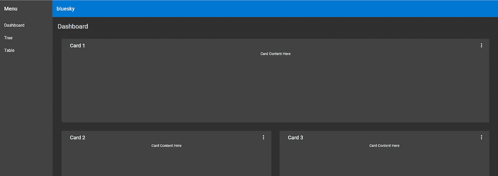
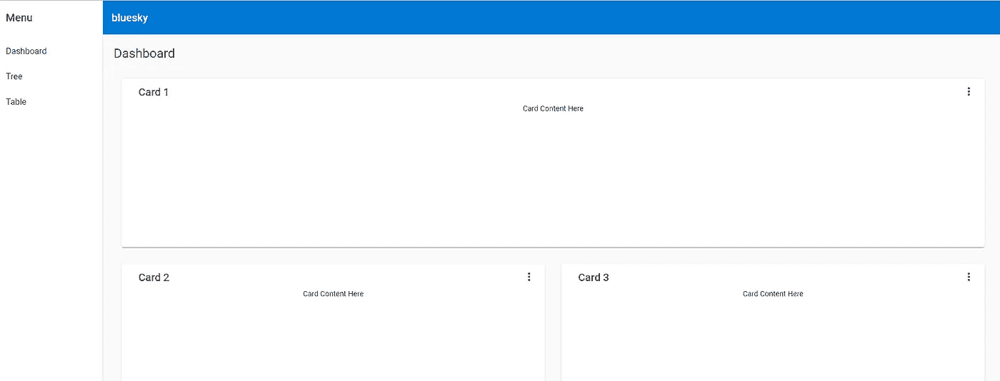
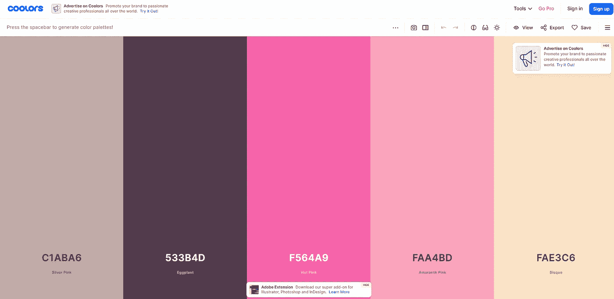
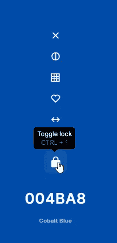
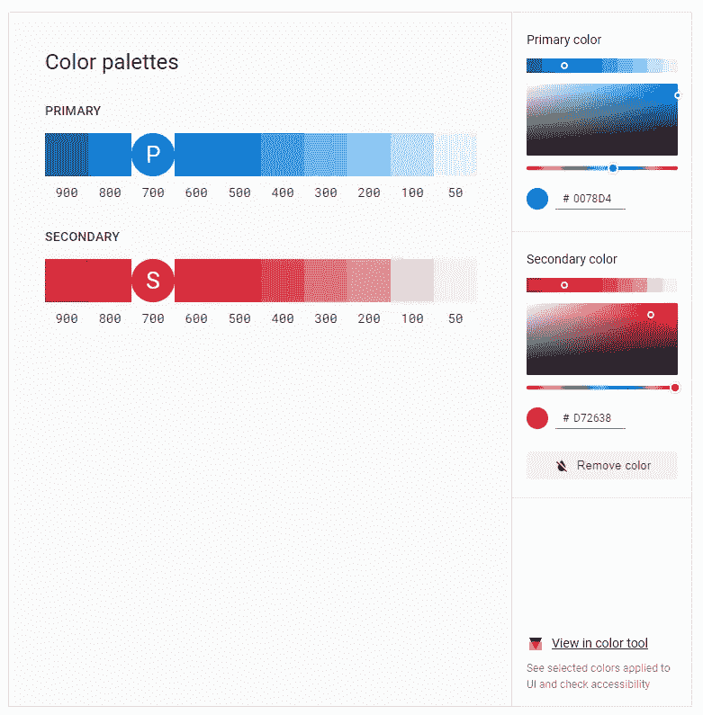

# 用棱角分明的材料定义自己的主题

> 原文：<https://levelup.gitconnected.com/defining-your-own-theme-in-angular-material-8a4a6ffad400>

在你的 web 应用程序中拥有你自己的主题是让它看起来更专业的关键。想象一下，在您的应用程序中使用您正在使用的框架提供的默认颜色主题，每个人都在使用它。尤其是当主题颜色如此突出，以至于任何以前使用过框架的人一眼就能认出来的时候。由 [Angular Material](https://material.angular.io/) 提供的 4 个主题还不错，但是如果一个应用程序使用了 4 个默认主题中的一个，我不会给它太高的评价。这表明没有太多的努力投入到设计中，所以它看起来并不完美。

在有角度的材质中创建你自己的主题颜色是相对容易的，你只需要为你的应用程序定义 3 种主要颜色——#原色#、#强调色#和#警告色#。#Primary#将是在整个应用程序中最常出现的颜色。#Accent#是用来有选择地突出显示用户界面某些部分的颜色。#Warn#是应用程序中用于警告和错误的颜色，通常为红色。

然后你需要决定主题是#暗#主题还是#亮#主题。就像它听起来的那样，决定一个深色的主题会让你的应用背景变暗，白色的主题会给同一个主题一个默认的白色背景。



在你的 angular 应用程序中运行`ng add @angular/material`后，你的`styles.css`将从一个相对空白的文件中更新，并带有一个用 4 种选定主题颜色之一定义的`$<app>-theme`。例如，我的应用程序被命名为`bluesky`，因此在我的`styles.css`中默认创建以下内容。

```
@use '@angular/material' as mat;
@include mat.core();$bluesky-primary: mat.define-palette(mat.$indigo-palette);
$bluesky-accent: mat.define-palette(mat.$pink-palette, A200, A100, A400);// The warn palette is optional (defaults to red).
$bluesky-warn: mat.define-palette(mat.$red-palette);// Create the theme object. A theme consists of configurations for individual
// theming systems such as "color" or "typography".
$bluesky-theme: mat.define-light-theme((
  color: (
    primary: $bluesky-primary,
    accent: $bluesky-accent,
    warn: $bluesky-warn,
  )
));
```

`$bluesky-theme`被定义为`$bluesky-theme: mat.define-light-theme...`系列中的灯光主题。把`define-light-theme`改成`define-dark-theme`就可以改成深色主题了。

使用 Angular Material 提供的默认调色板- `$indigo-palette`、`$pink-palette`、`$red-palette`定义`$bluesky-primary`、`$bluesky-accent`和`$bluesky-warn`。每个调色板是一个从最亮到最暗的色调 SCSS 地图。你可以在`node_modules\@angular\material\core\theming\_palette.scss`文件中找到调色板，下面是`$pink-palette`的一个例子。也可以在材质设计网站-[https://material . io/archive/guidelines/style/color . html # color-color-palette](https://material.io/archive/guidelines/style/color.html#color-color-palette)上看到自己的颜色。

```
$pink-palette: (
  50: #fce4ec,
  100: #f8bbd0,
  200: #f48fb1,
  300: #f06292,
  400: #ec407a,
  500: #e91e63,
  600: #d81b60,
  700: #c2185b,
  800: #ad1457,
  900: #880e4f,
  A100: #ff80ab,
  A200: #ff4081,
  A400: #f50057,
  A700: #c51162,
  contrast: (
    50: $dark-primary-text,
    100: $dark-primary-text,
    200: $dark-primary-text,
    300: $dark-primary-text,
    400: $dark-primary-text,
    500: $light-primary-text,
    600: $light-primary-text,
    700: $light-primary-text,
    800: $light-primary-text,
    900: $light-primary-text,
    A100: $dark-primary-text,
    A200: $light-primary-text,
    A400: $light-primary-text,
    A700: $light-primary-text,
  )
);
```

数字 50、100、200–900 中的每一个都是不同的颜色深浅，A100、A200、A400 和 A700 只是可选的颜色深浅，便于参考您需要的颜色深浅。对比色将是不同阴影的文本颜色。如你所见，色调 50–400 是浅色，所以对比色是`$dark-primary-text`。对于较暗的色调 500 - 900，情况正好相反。

作为一名程序员，而不是设计专家，我不擅长配色，但我仍然希望我的应用程序有一些独特的东西，所以我将从调色板创建者网站创建自己的调色板，而不是依赖于提供的颜色。前往[https://coolors.co/](https://coolors.co/e8aeb7-b8e1ff-a9fff7-94fbab-82aba1)并启动发生器，移除提供的 5 种颜色中的 2 种，因为我们只需要 3 种颜色。



点击`space`按钮，让它为你随机生成一个调色板。但是当你找到你喜欢的颜色时，在我的例子中，我正在寻找一个蓝色的主题，将鼠标放在颜色上并点击`lock`图标，这样当你点击`space`按钮尝试新的主题时，颜色将保持不变。



然后，我将生成主题，直到我得到一个红色并锁定它，因为我将需要它在我的主题#warn#中。然后继续点击`space`，直到获得所需的#accent#颜色。

为了生成不同深浅的颜色，我们可以使用材料设计网站上的调色板工具—[https://material . io/design/color/the-color-system . html # tools-for-picking-colors](https://material.io/design/color/the-color-system.html#tools-for-picking-colors)。



输入右边的颜色代码，将为您生成 50–900 的色调。你可以省去 A100 — A700，因为它们是可选的。然后在`styles.css`中创建调色板 SCSS 地图变量，如下所示。

```
$bright-navy-blue-palette: (
  50: #e3f2fd,
  100: #badffb,
  200: #8fcbfa,
  300: #61b7f7,
  400: #3ca7f6,
  500: #0c98f5,
  600: #078ae7,
  700: #0078d4,
  800: #0067c2,
  900: #0049a3,
  A100: #c2e4ff,
  A200: #addcff,
  A400: #1f9eff,
  A700: #00518f,
  contrast: (
    50: rgba(black, 0.87),
    100: rgba(black, 0.87),
    200: rgba(black, 0.87),
    300: rgba(black, 0.87),
    400: rgba(black, 0.87),
    500: white,
    600: white,
    700: white,
    800: white,
    900: white,
    A100: rgba(black, 0.87),
    A200: rgba(black, 0.87),
    A400: white,
    A700: white,
  )
);
```

我没有用`$dark-primary-text`来对比，而是用`_palettes.scss`中定义的`rgba(black, 0.87)`来代替。`$light-primary-text`就是`white`。

来自`coolors.co`调色板生成器网站的一个好东西是它也给了你颜色的名称，所以你可以用它作为你的变量名，而不是用浅蓝、深蓝等等来代表所有的蓝色。

```
$bluesky-primary: mat.define-palette($bright-navy-blue-palette, 700, 300, 900);
$bluesky-accent: mat.define-palette($gainsboro-palette, 300, 100, 500);// The warn palette is optional (defaults to red).
$bluesky-warn: mat.define-palette($crimson-palette, 700);
```

如上所述，我们使用`mat.define-palette`函数定义颜色。第一个也是唯一一个必需的参数需要一个 SCSS 地图调色板，我可以使用我新创建的`$bright-navy-blue-palette`。以下是调色板的可选键，它们应该分别指向默认色调、较浅色调和较深色调。默认情况下，它们将是 500、100 和 700。因此，如果您的默认色调不是从用于挑选颜色的材质设计工具中生成的 500，请确保为您的默认色调指定键。

我最后的结果如下，供你参考。

```
@use '@angular/material' as mat;@include mat.core();$bright-navy-blue-palette: (
  50: #e3f2fd,
  100: #badffb,
  200: #8fcbfa,
  300: #61b7f7,
  400: #3ca7f6,
  500: #0c98f5,
  600: #078ae7,
  700: #0078d4,
  800: #0067c2,
  900: #0049a3,
  A100: #c2e4ff,
  A200: #addcff,
  A400: #1f9eff,
  A700: #00518f,
  contrast: (
    50: rgba(black, 0.87),
    100: rgba(black, 0.87),
    200: rgba(black, 0.87),
    300: rgba(black, 0.87),
    400: rgba(black, 0.87),
    500: white,
    600: white,
    700: white,
    800: white,
    900: white,
    A100: rgba(black, 0.87),
    A200: rgba(black, 0.87),
    A400: white,
    A700: white,
  )
);$gainsboro-palette: (
  50: #f9f9fa,
  100: #f3f3f4,
  200: #ebebec,
  300: #dcdcdd,
  400: #b9b9ba,
  500: #99999a,
  600: #707071,
  700: #5d5d5e,
  800: #3e3e3f,
  900: #1d1d1e,
  A100: #f5f5f5,
  A200: #eaeaeb,
  A400: #d6d6d7,
  A700: #838386,
  contrast: (
    50: rgba(black, 0.87),
    100: rgba(black, 0.87),
    200: rgba(black, 0.87),
    300: rgba(black, 0.87),
    400: rgba(black, 0.87),
    500: white,
    600: white,
    700: white,
    800: white,
    900: white,
    A100: rgba(black, 0.87),
    A200: rgba(black, 0.87),
    A400: rgba(black, 0.87),
    A700: white,
  )
);$crimson-palette: (
  50: #ffebef,
  100: #ffcdc5,
  200: #f0999f,
  300: #e77179,
  400: #f24e58,
  500: #f83a40,
  600: #e9313e,
  700: #d72638,
  800: #ca1e30,
  900: #bb0d24,
  contrast: (
    50: rgba(black, 0.87),
    100: rgba(black, 0.87),
    200: rgba(black, 0.87),
    300: rgba(black, 0.87),
    400: white,
    500: white,
    600: white,
    700: white,
    800: white,
    900: white,
  )
);$bluesky-primary: mat.define-palette($bright-navy-blue-palette, 700, 300, 900);
$bluesky-accent: mat.define-palette($gainsboro-palette, 300, 100, 500);
$bluesky-warn: mat.define-palette($crimson-palette, 700);$bluesky-theme: mat.define-light-theme((
  color: (
    primary: $bluesky-primary,
    accent: $bluesky-accent,
    warn: $bluesky-warn,
  )
));@include mat.all-component-themes($bluesky-theme);html, body { height: 100%; }
body { margin: 0; font-family: Roboto, "Helvetica Neue", sans-serif; }
```

*本文原载于*[*https://the coding analyst . github . io/knowledge base/Defining-your-own-theme-in-Angular-Material/*](https://thecodinganalyst.github.io/knowledgebase/Defining-your-own-theme-in-Angular-Material/)

# 分级编码

感谢您成为我们社区的一员！在你离开之前:

*   👏为故事鼓掌，跟着作者走👉
*   📰查看[升级编码出版物](https://levelup.gitconnected.com/?utm_source=pub&utm_medium=post)中的更多内容
*   🔔关注我们:[Twitter](https://twitter.com/gitconnected)|[LinkedIn](https://www.linkedin.com/company/gitconnected)|[时事通讯](https://newsletter.levelup.dev)

🚀👉 [**加入升级人才集体，找到一份惊艳的工作**](https://jobs.levelup.dev/talent/welcome?referral=true)