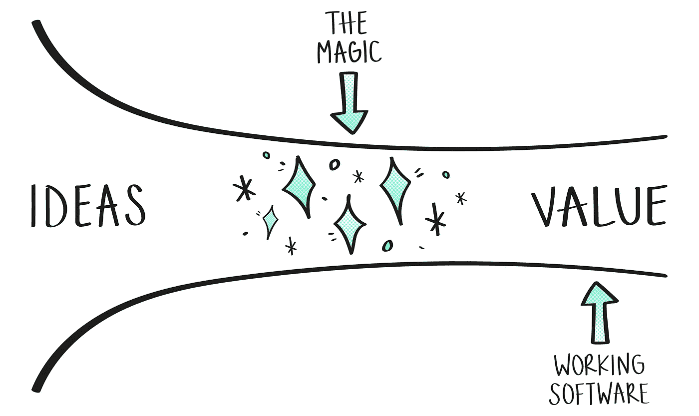
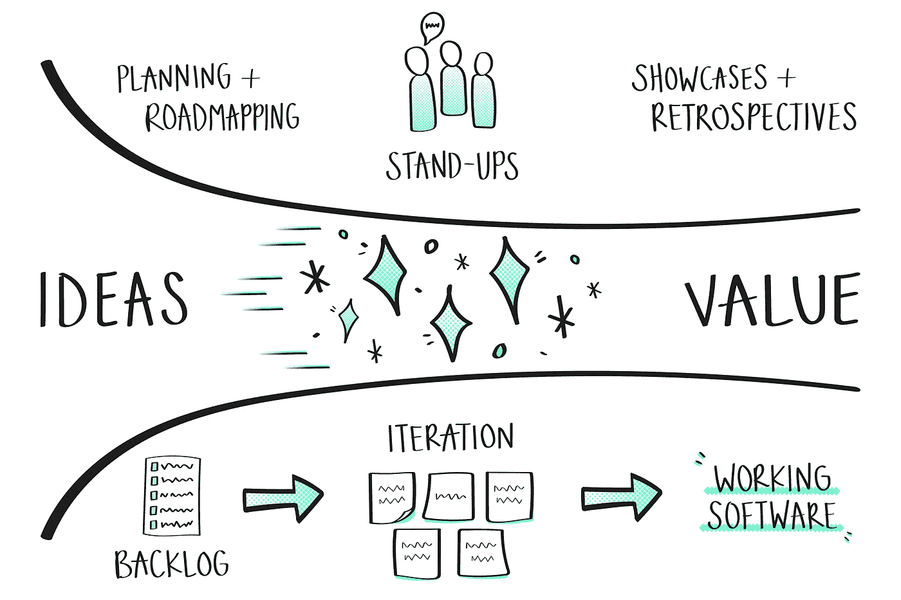
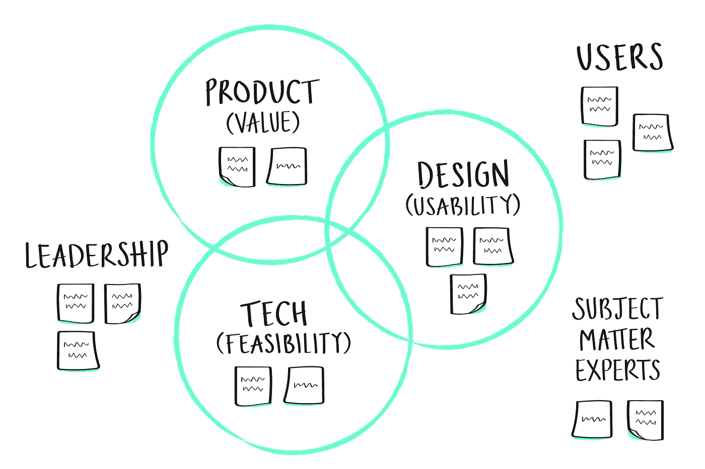

# 定义你的工作方式

> 原文：<https://levelup.gitconnected.com/defining-your-ways-of-working-53f3d8539b3>

最初由卢克·莫顿发布给[团队&科技。](https://lukemorton.tech/articles/defining-your-ways-of-working?utm_source=medium&utm_medium=article&utm_campaign=defining-your-ways-of-working)

定义你的工作方式:将想法转化为价值，决定如何合作，培养反馈文化，调整你的过程以满足不断变化的需求。

软件开发团队能够调整他们的过程来解决他们面临的问题。在快速变化的数字世界中，学习和适应的能力是一种竞争优势。团队必须能够定义他们的工作方式，并在工作过程中不断学习和适应。

工作方式不仅仅是选择一个软件开发过程，比如 Scrum、看板或者(希望不是)SAFe。框架从来都不是完整的，除了 SAFe，在我看来这完全是疯狂的。

在很多方面，你需要忘记批发下降在整个过程中，可能是为非常不同的需求比你的设计。

## 团队决策

作为一个自组织团队，你需要对自己的工作方式有一个共同的理解。你们必须达成共识。

你可能在一个已经建立了流程的组织中工作。你可能不是第一个组建的软件开发团队。你的团队可能以前一起工作过。尽管如此，你的团队将会有一个新的目的和任务，解决一个新的问题，因此一起明确定义你的过程是健康的。

你现在做的决定还不是一成不变的。事实上，当你朝着你的使命努力时，你必须学习和适应——你的过程应该随着你的努力而发展。

从定义你的流程开始，或者如你所知，产品开发生命周期。为此，您可以向您的团队提出四个问题:

*   你将如何将想法转化为价值？
*   团队将如何合作？
*   你将如何寻求反馈？
*   你将如何发展你的过程？

让我们思考这些问题，以及你如何与你的团队合作来定义你的工作方式。当你第一次组建你的团队时，或者当你的团队还没有确定你们的合作方式时，你可以这样做。

## 你将如何将想法转化为价值？

软件开发的基础很简单:作为一个团队，你通过将工作软件交付到用户手中，将机会和想法转化为价值。一些团队称这个流程为产品开发生命周期。一些团队用特定敏捷框架的名字来称呼它，比如 Scrum。你如何称呼它并不重要，但是对它如何工作有一个共同的理解是至关重要的。

很可能你的团队选择 Scrum 作为他们的敏捷交付框架。不幸的是，Scrum 是由开发人员创建的，他们完全忘记了包括如何在 Scrum 开发过程中整合设计的说明。哎呦。

这种框架中设计过程的缺乏将设计推回到瀑布式的“预先设计领域”,并且经常伪装成用户优先的发现。相反，你希望设计师和开发人员携手合作，共同开发出有价值的、可用的和可行的软件。

因此，您的团队可以从这个或那个框架开始，但是您必须最终定义一个为您的团队工作的流程，可能包括许多不同的方法。这就是一些人所说的“敏捷”而不是“做敏捷”的想法。没有神奇的过程，神奇的是你的团队适应环境的能力。

为了让团队达成共识，你可以在白板上画出你的**流程**、**人工制品、**和**仪式**。

## 流动

作为一个团队，你需要了解你是如何验证想法和机会的，以确保它们交付有价值的、可用的和可行的软件。你需要一种方法将这些想法转化为可交付的工作单元。一旦发布，您必须确保验证您的软件正在产生预期的影响。这是你的心流。

你的团队应该清楚你的流程的各个阶段，以及是什么使他们能够将工作从一个阶段推进到另一个阶段。你的流程应该足够简单，可以在一两分钟内画在白板上，我建议你在回顾自己的工作方式时这样做。

## 人工制品

人工制品是让你的产品所有者和交付经理兴奋的东西。常见的例子包括:产品路线图、产品积压、用户故事图、冲刺积压、看板板等。我现在警告你，许多时间已经浪费在完善艺术品上，而这些艺术品大部分都是短暂的和被扔掉的。

工件的重要性在于它们能够被你的团队和更广泛的利益相关者用作交流工具。没有共同的理解，人工制品是无法工作的，你不能只给你的老板看你的产品清单，然后期望他们理解它。人工制品必须共同使用和改变。

人工制品帮助你交流你的流程的各个阶段以及当前在这些阶段的工作。作为一个团队，你需要就你希望使用的人工制品以及它们与你的流程的每个阶段的关系达成一致。尝试在白板上将它们添加到您的流程中。

## 仪式

团队使用仪式来交流和发展他们共同的理解。仪式可以用来庆祝成功和从错误中学习，仪式是人工制品可以共同改变的地方。

常见的仪式包括:积压计划、积压优化、起立、起立、展示和讲述、展示和回顾。

你绝对可以用太多的仪式让你的团队超负荷。不管你有多喜欢你的同事，没有人喜欢每隔一两个星期就陷入一天的仪式中。从最少开始，并确保你的时间盒，它应该是一个仪式运行超过一个小时的例外，你的站立不应该变成静坐。

作为一个团队，你需要清楚你希望使用什么样的仪式，它们应该在什么时候发生，以及它们如何与你的流程的每个阶段相关联。通过添加仪式来完成你的流程草图。

## 你从哪里开始？

如果你不确定从哪里开始，我建议从 Scrum 或看板这样的框架开始。他们提供了一个流程、一套人工制品和仪式，尽管后者 Scrum 称之为事件。我知道我说过你需要忘记大规模地加入框架，你应该忘记，你不能指望它们能工作。他们需要时间来适应团队的特殊需求。

你不能从 Scrum 或看板中得到的是你的团队应该如何一起工作来验证想法、开发软件或证明你的软件满足你的组织和用户的需求。别担心，我们接下来会谈到那个。

## 团队将如何合作？

到目前为止，我们已经关注了过程和工具。如果你已经看过敏捷宣言，你现在可能会感觉很糟糕。毕竟:

> 过程和工具上的个体和交互
> 敏捷软件开发宣言

嗯，如果我是你，我不会感觉太糟。“敏捷宣言”并不是说你不应该有工具和过程。事实上，在一个容易理解的过程的背景下谈论个人和互动更容易。

然而，个人和互动比过程和工具更重要。你的工作的质量和影响依赖于一个合作良好的团队。你正在解决问题，而你解决问题的方式可能必须改变，你不能只是盲目地遵循一个过程，并希望最好的结果。

你们需要就支撑你们工作的**共同价值观**达成一致。您需要定义**角色和职责**，描述团队需要执行的任务和活动。你还应该定义**核心实践**来完成你的工作。

## 共享价值观

价值观是你期望并鼓励每个团队成员具备的共有属性。你们的价值观是你们如何作为一个团队一起工作的基础。

敏捷宣言有四个价值，最好概括为:以人为中心，工作软件，沟通和响应。极限编程(XP)有五个:沟通、简单、反馈、勇气、尊重。为什么从来没有人把“好玩”加到清单上？

我建议做一个练习，让每个团队成员花一些时间单独提出他们认为重要的价值观，并与团队的目的和使命保持一致。然后，您可以将这些值进行比较，得出 3-7 个你们都认同的值。

## 角色和职责

重要的是要记住，你正在组建一个多学科的团队，你的每个团队成员都在为团队贡献他们的各种力量。你的团队中的角色不是用来创建筒仓、给个人增加负担或在团队中创建层级的。角色应该明确你的团队需要做什么，这些角色可以由整个团队共享，或者主要由具有特定技能的人拥有。

您可以绘制一个团队画布，其中包括团队中所需的各种利益相关者和技能集。在这张画布上，您可以贴上代表您的团队已确定的角色的便利贴。

如果你正在练习 Scrum，你可能会在产品圈里包括产品所有者，在技术圈里包括开发人员，在维恩图中间包括 scrum master。你还需要包括 Scrum 没有定义的角色，比如用户研究员和交互设计师，这些都在设计圈里。

在角色旁边，你可以贴更多写有团队成员名字的便利贴。你可以，或许也应该，为一个人准备多张便利贴。例如，你的整个团队可能每个人都轮流戴 Scrum Master hat，而不是让某个人在整个流程中扮演专门的角色。你也可以将产品所有权和用户研究视为整个团队的活动。

虽然不一定与团队的角色相关，但如果适用于您的团队工作，您也可以包括业务外部领域的角色和名称，例如，主题专家、组织领导和关键用户。

每个角色都需要明确定义的职责。在某些情况下，比如产品负责人和 scrum master，你可以遵从教科书的定义。遗憾的是，健康和成功的团队的许多职责并没有在敏捷框架指南中定义。

哪些角色负责定期向更广泛的组织汇报团队的进展？你将如何关注团队的健康和幸福？代码质量？同样，这些可能不是一个人所拥有的，但是你应该明确地表达出来，并在上面写上一个或多个名字。

在构建团队画布的最后，你应该根据你现在所知道的来明确角色和职责。请记住，这总是可以在以后修改。

## 核心实践

哦，天啊，我通常在这个时候会很兴奋。

接下来，您的团队应该决定他们在一起工作时想要使用什么核心实践。你可以再次粗略地将核心实践归类到维恩图中。

产品管理实践可能包括:规划扑克，三个朋友或用户故事映射。你可以决定在一个共享的办公空间里为它保留一面实体墙，或者你可以决定让它数字化，使用像 Trello、JIRA 或任何你这个月喜欢的工具。

可用性测试等设计实践可以定期进行，以确保您正在构建的软件是可用的。您可以决定维护一个研究 wiki，使您的团队以及其他团队都可以轻松访问它。

技术实践是交付高质量软件的支柱。你的团队应该采用测试驱动和基于主干的开发、结对编程、小发布、重构、使用拉式请求的同行评审、持续集成和自动化部署。

你永远不会完成一个完整的实践列表，特别是当你偶尔作为一个团队去试验和尝试新事物的时候。这里的想法是定义一组团队应该一直使用的合理的默认值。

## 你将如何寻求反馈？

快速反馈周期是敏捷软件交付的关键原则。他们使你的团队最大限度地减少浪费，让失败对所有人都安全，并引导你走向成功。

你的团队可以通过在构建任何东西之前测试假设来最大限度地减少浪费。研究人员、设计人员和开发人员可以一起工作来定义问题和解决方案假设，使他们能够测试想法。您可能会选择花费一定的迭代时间，通过用户研究、调查、技术高峰和原型来测试假设。

通过尽早发布软件，你的团队可以有更早的学习机会。你可以和用户一起测试你的软件，尤其是早期采用者，以确保你在构建正确的东西。你发布软件越频繁，你就有越多的机会去纠正错误或者发现一个想法是否失败。当失败变得便宜时，失败变得安全，你通过每天或每周寻求反馈来使失败变得便宜，这将确保失败花费你几天而不是几个月。

确保你的团队在他们的工作方式中有足够的反馈机制，意味着他们将有定期的机会调整他们的路线。团队越频繁地修正他们的方向，他们就能越快地交付为他们的组织和用户都产生价值的软件。

你应该与团队讨论收集反馈的正式和非正式方式。

## 正式反馈

您的团队应该决定他们希望在工作方式中包含什么样的正式反馈以及何时包含。这通常是通过同意在你的流程的某些点需要发生的实践来实现的，以鼓励反馈。除非有特殊情况，否则它们通常应该在这些时间点发生。

利用像用户故事映射这样的研讨会，包括组织领导、团队和其他利益相关者，你可以建立共识，并获得对你的计划的反馈。积压计划是确保您的团队能够向产品负责人提供反馈的另一种方式，反之亦然。

你可以考虑使用三个朋友，这种做法在历史上包括产品所有者或业务分析师、测试人员和开发人员。如今，使用自动化测试的组织可能会选择包括用户研究员或设计师来代替测试人员。你可以使用三个朋友来确保工作在开始开发之前准备好，检查完成时是否符合团队对“完成”的定义，然后通过审查 KPI 和与用户进行彻底的测试来证明它正在产生你想要实现的影响。

您团队中的开发人员可能会选择在代码合并之前使用同行评审，以便为更广泛的团队(包括设计人员)提供评审工作的机会。任何视觉上的变化都应该部署在一个专门的环境中进行评审，或者至少作为截图和变化的解释包含在内，这样设计者就可以在代码合并之前给出反馈。

展示和回顾是大多数软件开发团队在其过程中包含的常见的正式反馈机制。showcase 使组织及其用户能够向团队提供反馈。回顾使团队能够给自己反馈。

## 非正式反馈

你的团队还应该决定他们希望鼓励什么样的非正式反馈。这些是可以临时使用的实践或团队规范。

你的团队应该鼓励一种反馈文化，当事情进展顺利或不顺利时，经常分享反馈。然而，像这样的反馈文化需要不断的维护，以确保团队成员在接受和给出反馈时感到安全。这是值得的，毕竟，反馈是给你的同事和未来的自己的礼物。

您的团队可能偶尔会将假设测试作为迭代目标的一部分。通过在迭代中测试假设，您的团队可以一起工作来测试想法，无论是在用户测试实验室还是构建原型。

你可以采用的另一个实践是研究和设计评审，团队聚在一起评审新的研究开发和设计，无论它们采取什么形式。这是一个与团队成员一起回顾和评论设计的机会。

你的团队可能会选择鼓励结对编程。这使得成对的开发人员能够在处理一个特性时相互提供即时反馈。

如果你的团队与组织用户共处一地，或者可以很容易地接近他们，那么鼓励他们特别地拿着笔记本电脑去检查一些东西，这样可以确保很快得到反馈。如果你打算这么做，你需要和你的用户建立一些礼节。尽量不要成为“那个”人。

## 你将如何发展你的过程？

我希望你不要认为你会预先定义好你的工作方式，然后就结束了？我们在这里谈论的是敏捷而不是瀑布，伙计。

你可能会发现这些工作方式很难一直坚持下去。没关系。很可能它们不一定都满足您团队的需求。你不会真的知道，直到你开始。与其沉迷于此太久，不如看看你能否在组建团队时开几个小时的研讨会，以确立你最初的工作方式，然后确定你回顾这些方式的频率。

你应该把回顾作为一周或两周一次的机会，让你的团队讨论你工作方式中好的、坏的和丑陋的地方。并不是每一种回顾形式都能让你轻松做到这一点，但是只要你有机会，每几次回顾就足够了。

每季度对你的团队进行工作回顾也是值得的。这通常可以与您的任务和质量目标评审保持一致。每个季度都有一个断点，让团队深呼吸和反思一两天，甚至一周，这既是一个巨大的压力阀，也是一个振兴器。

通过建立和发展您的协作方式，您的团队将作为一个有效的单位工作，能够适应他们面临的挑战，并迭代地发布为您的组织及其用户提供价值的工作软件。