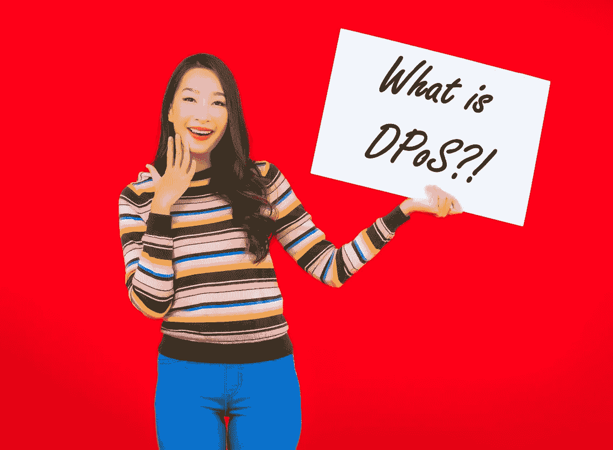
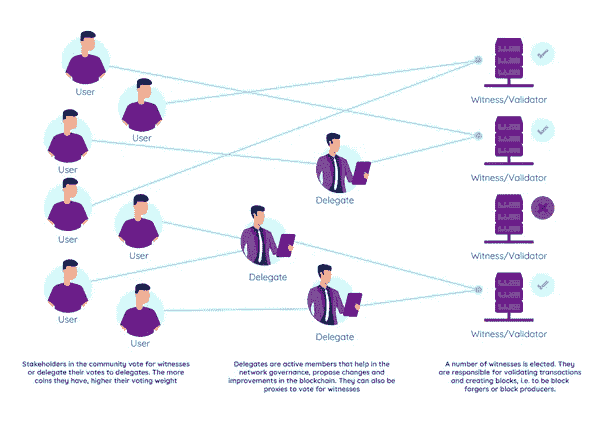
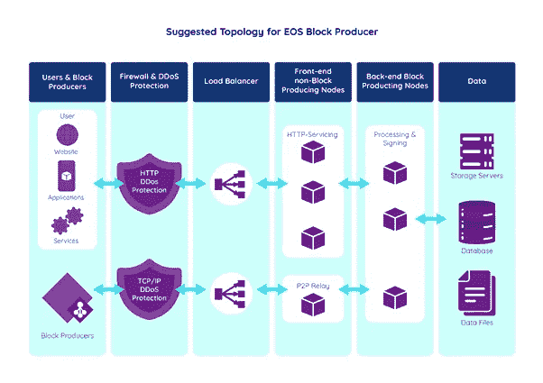

# 利益或 dpo 的委托证明

> 原文：<https://levelup.gitconnected.com/delegated-proof-of-stake-of-dpos-f60a27c16341>

## 区块链应该有民主吗？我们信任区块链的 DPoS 吗？

> "民主是最糟糕的政府形式，除了所有其他形式."
> 
> 温斯顿·丘吉尔

我将在一系列文章中讨论许多共识机制。你可以在下面的链接中找到一些答案:

*   [经过时间的证明是什么](https://medium.com/nerd-for-tech/whats-proof-of-elapsed-time-4f67cf3f45b3)
*   [比特币工作证明——你必须阅读的唯一一篇文章](/bitcoin-proof-of-work-the-only-article-you-will-ever-have-to-read-4a1fcd76a294)
*   [利益相关证明——什么是利益相关证明，它是如何工作的？](https://medium.com/nerd-for-tech/proof-of-stake-what-is-and-how-does-it-work-1c8bd7f00303)(顺便说一下，创建 DPoS 是为了处理股权限制的证明)
*   [重要性共识机制证明](/proof-of-importance-consensus-mechanism-5e0d7abbd5ba)

## 什么是共识机制

共识机制允许分布式系统和区块链协同工作并保持安全。区块链是一个巨大的分布式数据库，需要有一种机制让节点就如何在所有对等节点之间建立共识达成一致。

不同的共识机制在安全性、可伸缩性和去中心化之间有不同的权衡。比特币使用工作证明，它非常分散和安全，但扩展性不强。

dpo 区块链通常是高度可伸缩的，因为它们在少量不需要执行工作证明的节点上进行回复。让我们进入细节！

## 好了，废话够多了！再来说说 DPoS！

授权证明与民主非常相似。让我们称之为仅 dpo，因为“授权股权证明”太长了，我的手指因为打字太多而开始疼。

DPoS 是一种共识机制，加密货币的利益相关者或所有者可以在选举过程中选举有限数量的验证节点。验证节点，在 dpo 中也称为见证节点或块生成节点，验证事务/块并获得工作报酬。

通常，验证节点的选举是实时和持续的，即用户/代表可以随时投票。利益相关者可以投票决定他们想让谁做代表，并阻止验证者/见证人。投票权是根据他们拥有的硬币数量来定义的，即更多的硬币转化为更多的选票(就像公司的股东投票权一样)。利益相关者也可以将他们的投票委托给其他利益相关者，他们将代表他们投票(同样，非常类似于公司股东代理投票)。因此，残疾人组织是一个民主进程。

与[利害关系证明](https://medium.com/nerd-for-tech/proof-of-stake-what-is-and-how-does-it-work-1c8bd7f00303)类似，块验证者因验证交易而获得奖励。他们还可能被要求持有股份，如果出现不良行为，这些股份可能会被没收。具有新事务的块可以每隔几分钟被附加到区块链。因为 DPoS 更集中在少数节点中，例如 EOS 有 21 个块生产者/见证人，所以网络广播更快并且允许更好的吞吐量。

如果一个验证节点不能产生一个块或者表现出一些不好的行为，他可能会失去他的股份并被踢出网络。然后，涉众将投票选举一个新的验证节点。

EOS、Steem 和 BitShares 是 DPoS 区块链的一些例子。不，Dogecoin 不是 DPoS。 [Dogecoin](https://www.udemy.com/course/-dogecoin-course-the-first-complete-dogecoin-course/?referralCode=9416B1408224CE309DD8) 是 [**工作证明**](/bitcoin-proof-of-work-the-only-article-you-will-ever-have-to-read-4a1fcd76a294) 🏴‍☠️最喜欢比特币之类的第一代区块链。

## dpo 背后的机制

通常，为了成为验证节点的候选节点，节点管理器将向网络提交他们的提议，并试图说服社区他们具有成为验证节点的所有要求。通常，一些标准，如节点背后的团队、硬件容量、位置、第三方审计、预算和社区参与是有利于节点当选的因素。

与股权证明类似，在 dpo 中，股权越高，投票权重越高。根据区块链的不同，用户(或利益相关者)通常可以通过代理投票或直接投票给见证人。代表是社区中的活跃成员，他们改进区块链、开发新功能、改善治理，有时还促进区块链的采用。

见证方或块验证方将是网络中的“矿工”。他们的工作是验证交易，向区块链添加块，维护共识机制并保持网络健康。他们需要分配计算资源(本地服务器或基于云的服务器)，并且必须确保高可用性、数据完整性和高吞吐量。如果证人未能遵守标准或行为恶意，她可以很容易地从网络中删除。

EOS 块生产商或见证人需要投资一些基础设施和设计节点，以便提供必要的安全性、可扩展性和网络要求。在上图中，我们可以看到节点架构的高级图。

虽然任何人都可以成为块生产商的候选人，但考虑到他们在社区中的参与和硬件能力，市场中的一些参与者可能更有优势。作为区块链最大的 dpo 之一，EOS 与谷歌云合作，成为 EOS 区块链区块生产商。

基于云的见证利用了云的可扩展性、安全性、可靠性和成本效益。谷歌云(Google Cloud)或 AWS 等云提供商非常适合作为见证人做出贡献。

## **残疾人组织的利与弊**

**优点**

*   证人的动机是诚实，并向网络提供必要的计算能力
*   高性能和更好的可扩展性，以及良好的 TPS —每秒事务数
*   恶意的证人或代表几乎可以被实时投票淘汰
*   见证人可以在几秒钟内验证交易
*   交易费用通常很低或不存在
*   高能效和高成本效益，因为它不需要工作证明，并且可以基于云
*   半分散化，具有更强大的治理体系

骗局

*   当大“鲸鱼”在网络中获得很大权力，并可以投票给他们的亲信时，它可以创造某种程度的集权
*   更容易受到 51%的攻击
*   小股东可能没有投票的动机

你有什么想法？DPoS 在某种程度上是集中的吗？我们能容忍这种程度的集权吗？你会百分百相信这种区块链吗？

**🚀关注我并查看我的🧱区块链课程:**

**🐶** [**有史以来第一个 Dogecoin 课程**](https://www.udemy.com/course/-dogecoin-course-the-first-complete-dogecoin-course/?referralCode=9416B1408224CE309DD8)

**👨‍🎓** [**金融科技、云和网络安全课程**](https://www.udemy.com/course/fintech-technologies-cloud-and-cybersecurity/?referralCode=F1D4EA005A2881735A36)

**📖****[**完整 NFTs 教程**](https://www.udemy.com/course/the-complete-nft-course-learn-everything-about-nfts/?referralCode=AAEE908D13D0E2276B19)**

****👨‍🎓** [**Unblockchain 课程**](https://www.udemy.com/course/blockchain-deep-dive-from-bitcoin-to-ethereum-to-crypto/?referralCode=B8463EE382E6D313304B) **—脑洞大开的区块链课程****