# 委托和事件第 1 部分:空类型

> 原文：<https://levelup.gitconnected.com/delegates-and-events-part-1-void-type-bc46ee93226a>

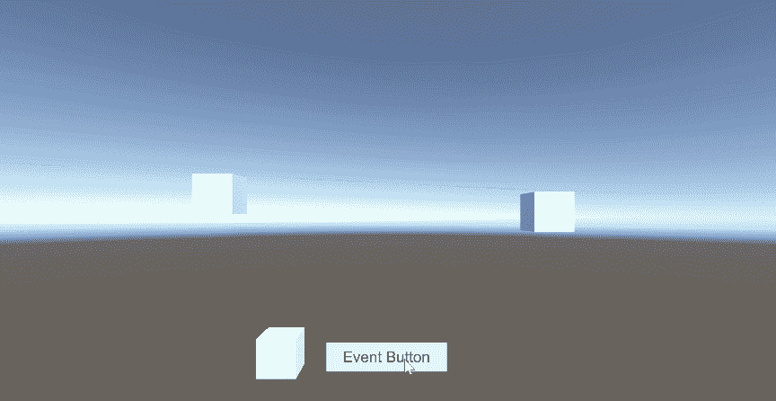

代理和事件有一个强大的组合，当使用 Unity 的*新输入系统*时，它们非常有用。让我们深入研究一下如何声明和使用委托和事件。

**代表们**

委托就像保存一个或多个方法的变量。你可以通过使用关键字 *delegate* ，后跟它的*方法签名*来声明一个委托。方法签名是您希望您的委托持有的方法的*类型*。这可能是一个带有或不带有*参数*的 *void* 类型方法，甚至是一个 *return* 类型方法。在为您的委托定义了方法签名之后，您可以声明一个*变量*来存储该委托。变量类型*必须与委托的*名称*和*方法签名*匹配。我们来看两个例子，一个有*参数*，一个没有。*

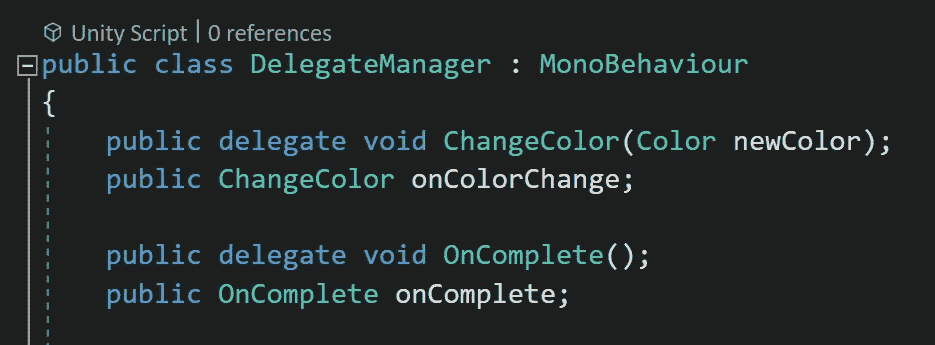

这些每个都有对应的*方法*。这里需要注意的是*匹配*方法签名。*更新颜色*方法是一个 *void* 类型的方法，带有一个*参数*，该参数带有一个*颜色变量*。*任务完成*方法也是一个 *void* 类型的方法，它没有*参数。*

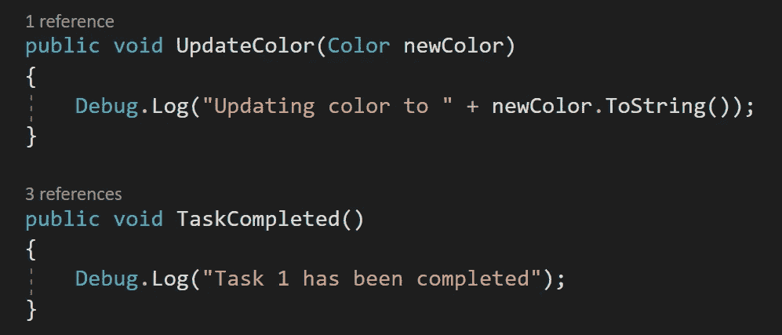

如果我试图将 on *颜色变化*委托*变量*赋给*任务完成*方法，我会得到一个*错误*，因为方法签名不匹配。

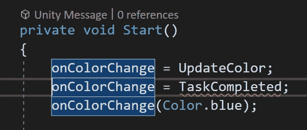

如果我从 void start 运行它，控制台会显示每个方法都被执行了。

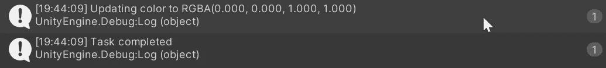

作为避免错误的最佳实践，您应该在运行*方法*之前*空检查*委托变量*。*

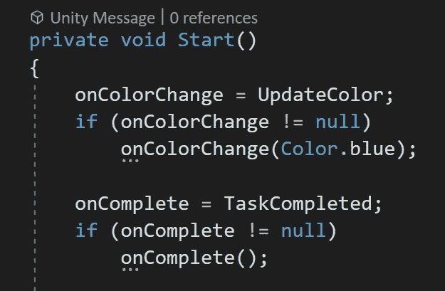

**组播**

当一个代表使用*多播*时，它不会像一个超级法师一样同时施放治疗法术和攻击法术。然而，它以类似的方式运行*多个方法*。不是使用*等于*符号将委托变量赋给方法，而是使用 **+=** *(加/等于)*运算符来*将*附加方法添加到委托变量。这里，在运行 on complete 委托之前，我总共添加了三个方法。

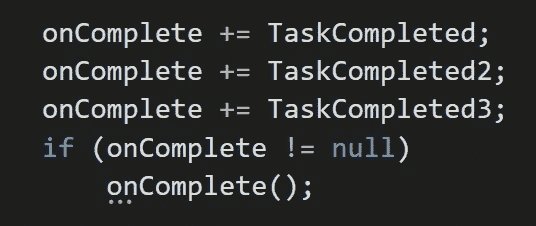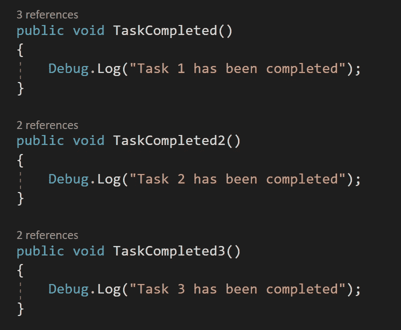

控制台显示这三种方法都已运行。

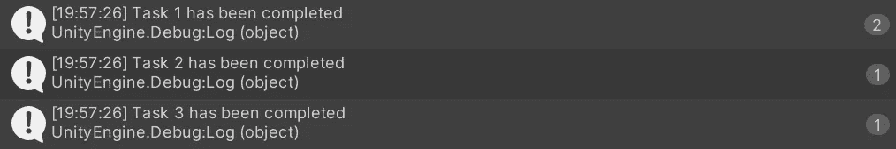

你可以用 **-=** *(减/等于)*操作符从委托变量中移除方法。您不需要按照任何特定的顺序删除它们。

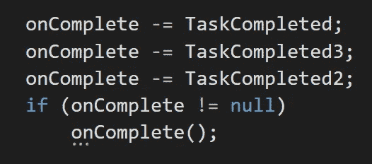

**事件**

事件是使用*通知*系统的*专门代表*。事件代理允许其他类*订阅*和*取消订阅*他们的广播。与普通的委托不同，事件有内置的安全性。委托变量可以被其他类调用，其中事件只允许其他类订阅和取消订阅它们的通知。让我们看一个使用带有 UI 按钮的点击事件的例子。

这里有三个立方体原语和一个 UI 按钮，它将在委托管理器类上引发一个事件。

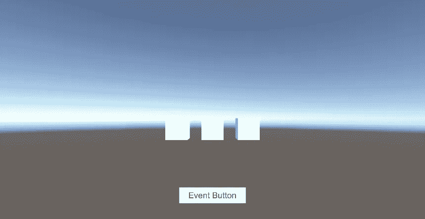

声明委托后，不要使用典型的委托变量，而是使用关键字*事件。*确保方法签名与委托签名匹配，然后给事件一个变量名。事件不一定是静态的，但是我将在这个例子中使用一个静态事件。这样所有的功能都是独立的。

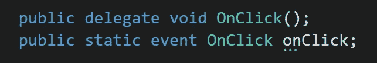

在方法中调用该事件之前，还应该对其进行空检查，以避免错误。事件正在向*订户* / *侦听器*广播，您需要在引发事件之前检查是否有侦听器。

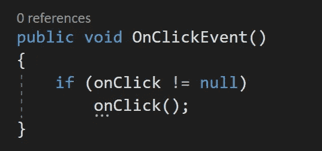

*UI 按钮*被按下时会调用上面的 *on click 事件*方法。

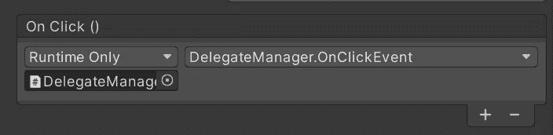

每当按钮被按下时，我想给立方体分配一个随机的颜色，所以我创建了一个*新颜色*类。我需要抓取立方体的*网格渲染器*，并分配一个随机颜色。在 void start 中， *onClick 事件变量*通过*委托管理器*类被引用。 **+=** 操作符用于*将*更新颜色*方法订阅给*事件*。*

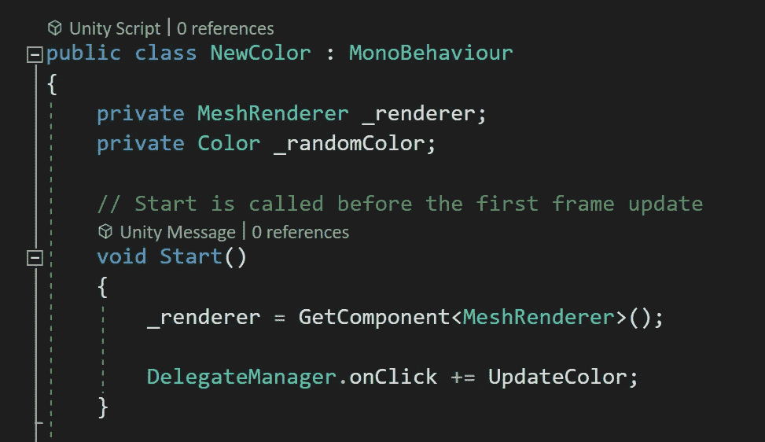

*更新颜色*方法将*随机值*分配给随机颜色*变量*。我可以选择在方法中使用一个*局部*颜色变量。网格渲染器被检查为空，然后被指定随机颜色。这将在每次按下带有新的随机颜色的 UI 按钮时触发。

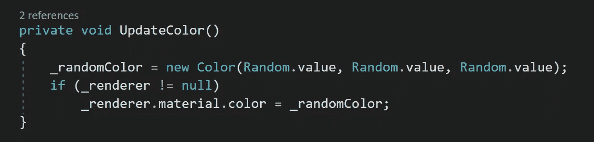

为了避免错误，一旦对象不再活动，静态事件的最佳实践是*取消*对*监听器*的订阅。这可以通过*中的 **-=** 操作器关闭*来完成。

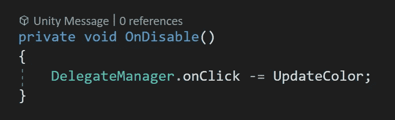

*新颜色*脚本被添加到场景中的所有立方体中。

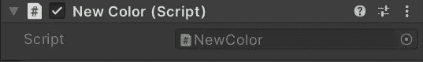

下面是*点击事件*的动作，调用*更新颜色*方法。

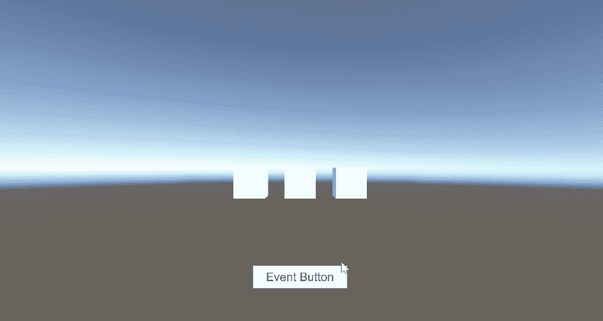

让我们创建一个名为*使用重力*的新类。使用这个类的对象将需要一个*刚体*，并且它需要在脚本中被引用。*使用 gravity* 类*将*订阅到*的点击事件变量*中，并添加了一个名为 *Fall* 的方法。

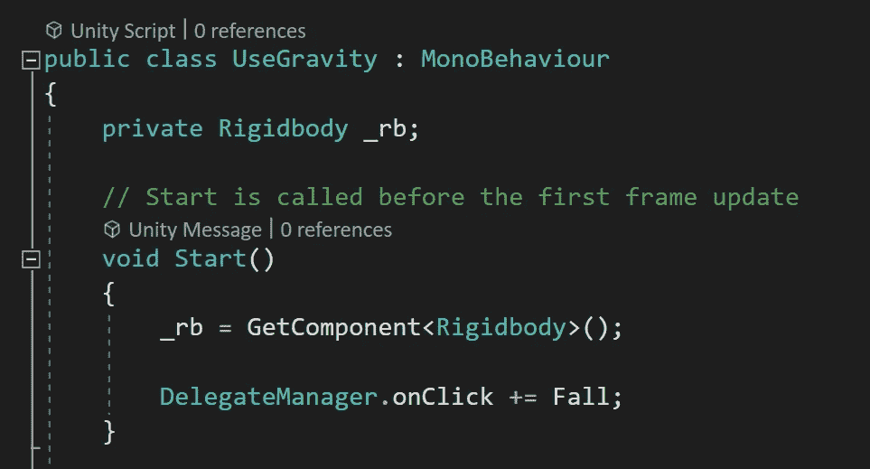

这里在 f *all 方法*中，*刚体*被*零位检测*然后*使用重力*被设置为*真*。还有一个 *on disable* 方法来*取消*对点击事件的订阅。

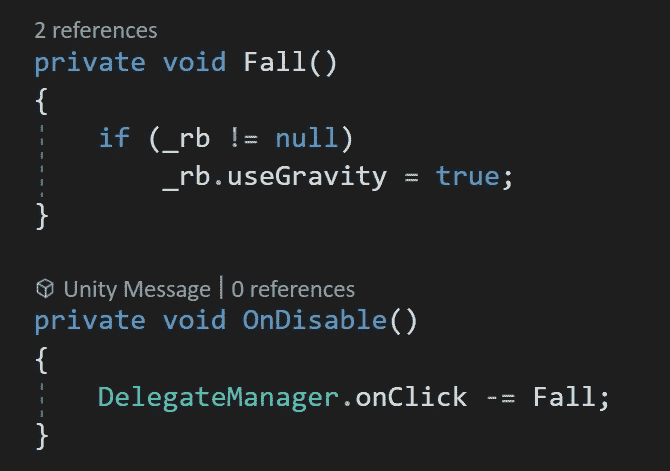

一个*刚体*组件被添加到一个立方体中，其中*使用重力*被设置为*假*。*使用重力*脚本也被附加到对象上。

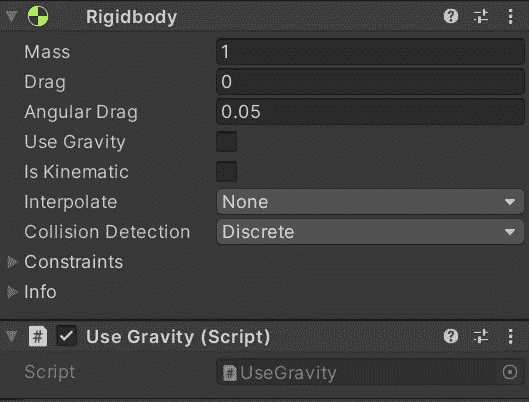

现在，当按下 *UI 按钮*时，每个立方体会获得一个新的*颜色*，带有*使用重力*等级的立方体会从屏幕上掉落。

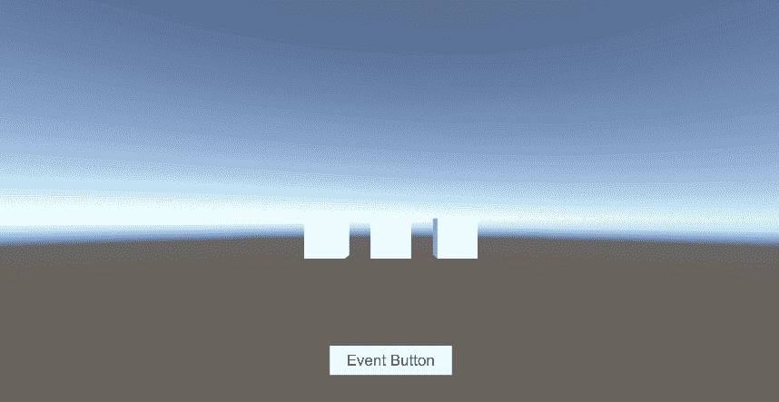

**挑战:*瞬移事件***

让我们做一个挑战，当按下*空格键*时，让立方体在给定的*范围*内传送到一个*新的随机位置*。一个新的*代理*在空间按上被创建称为*，并且一个相应的*事件*被创建来匹配。*

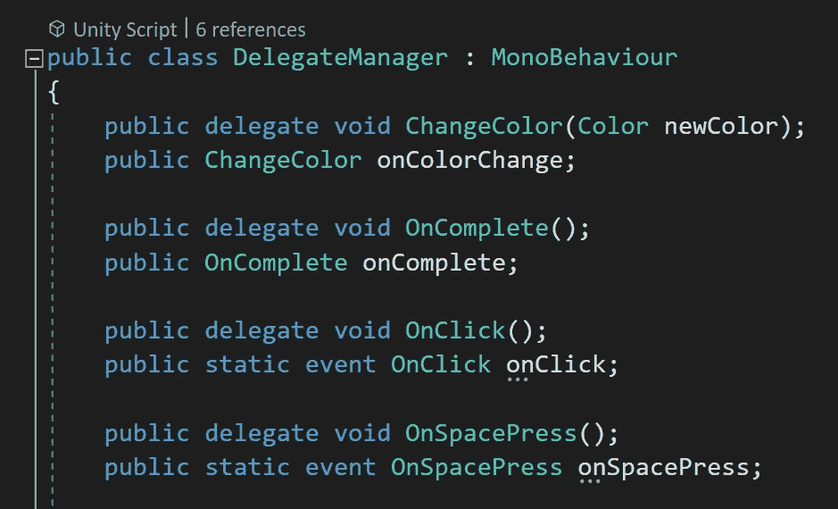

这个*更新*方法正在*代理管理器*上运行，并检查用户*输入*的空格键。当空格键*被按下*时，会引发*按下*事件。

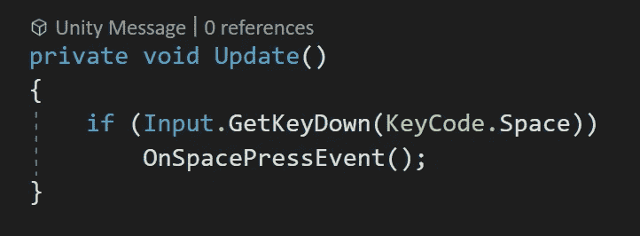

像往常一样， *onSpacePress* 事件*变量*在引发事件前被*空检查*。

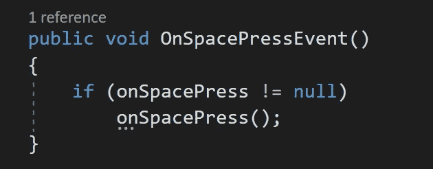

创建了一个名为*传送*的新脚本，在 void start 中，它订阅了 *onSpacePress* 事件变量。然后，它向事件添加一个*新位置*方法。

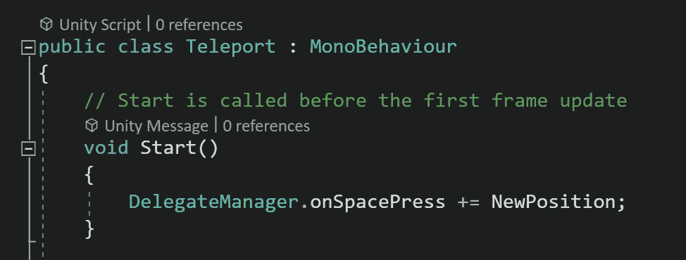

*新位置*方法有一个 temp *Vector3* 变量，它用*随机范围*分配一个*新位置*，然后将对象的*变换*的位置分配给新位置。 *On disable* 处理*从事件中取消*订阅。

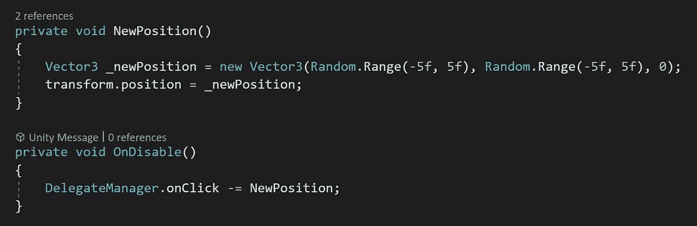

每个立方体都附有*传送*脚本。

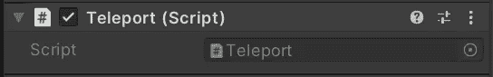

现在按下*空格键*给每个立方体一个新的随机位置。

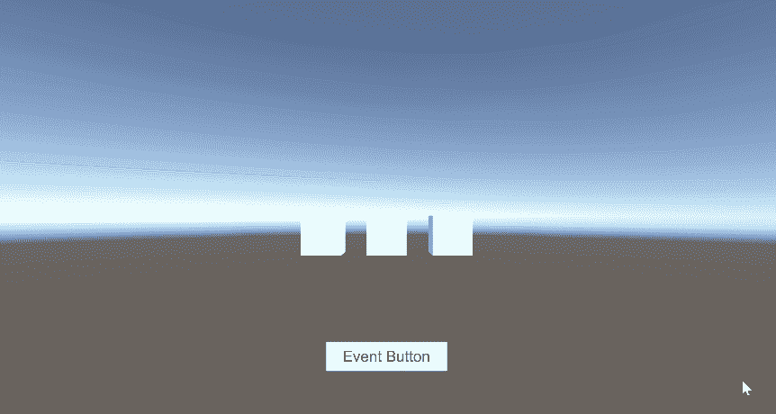

这里的空格键和按钮都发射了。

请下次和我一起深入了解代表和事件，因为还有更多的内容要介绍。感谢阅读！