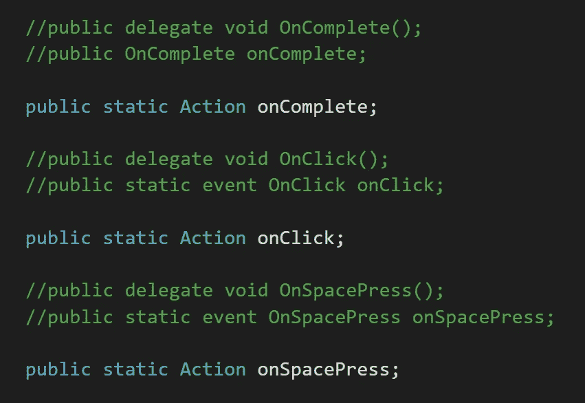
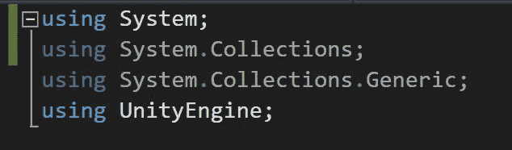
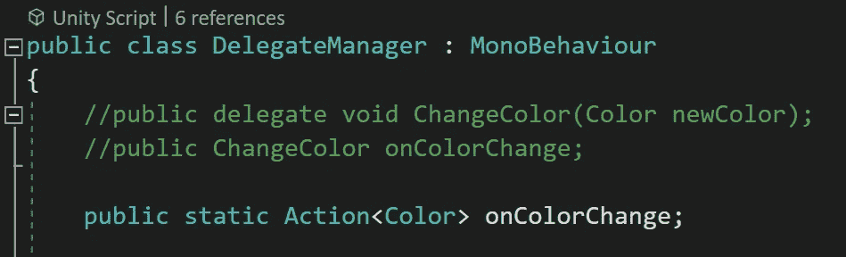

# 委托第 2 部分:操作

> 原文：<https://levelup.gitconnected.com/delegates-part-2-actions-d60a9cef452e>

*动作*的功能与使用*委托*和*事件*相同，只是用了一行代码而不是两行。动作本身在技术上是一个 *void 类型*委托，所以让我们深入研究一下声明和使用动作。

首先，您需要使用*系统*名称空间。

对于这个例子，我将在这里使用我上一篇文章 [*中的委托和事件 https://medium . com/git connected/delegates-and-events-part-1-void-type-BC 46 ee 93226 a*](https://medium.com/gitconnected/delegates-and-events-part-1-void-type-bc46ee93226a)，并将它们转换为*动作*。像事件一样，动作不需要是静态的。我将在这里使用静态动作，这样其他类就不需要引用它们，不会产生实例，最终会被垃圾回收。

简单地使用关键字 *Action* ，然后给它分配一个变量名。如果你想包括*参数*，使用 *T 型支架*并传入你需要的参数类型。与常规委托不同，参数类型不需要变量名。我已经注释掉了动作要替换的*委托*和*事件*以供视觉参考。

如果不需要参数，则不需要使用 *T 型支架*。下面是转换为*动作*的其余代理和事件。

这些事件的所有订阅者的工作方式都与转换为操作之前一样。我希望你喜欢这篇短文，下次当我讲述使用*返回类型委托*和 *Func* 时，请加入我。