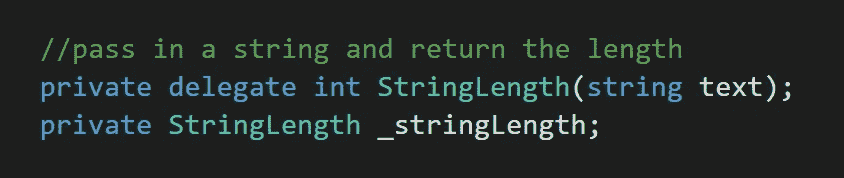
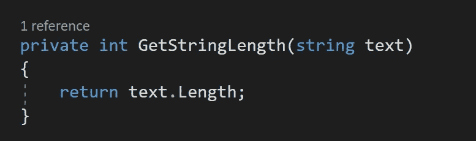
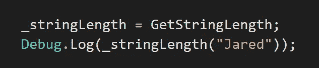
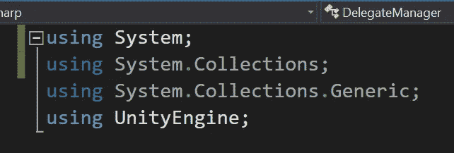
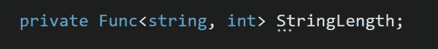
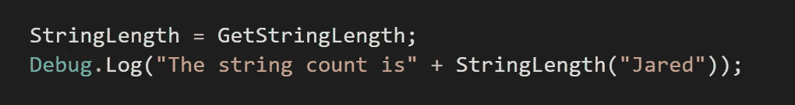

# 委托第 3 部分:返回和函数类型

> 原文：<https://levelup.gitconnected.com/delegates-part-3-return-and-functional-type-delegates-7ebea7d1e35e>

与 void 类型的委托不同， *return* 类型的委托需要返回一个*值*。让我们深入研究声明和使用返回类型委托和函数委托。

## **返回型代表**

对于这个例子，我们希望*返回*字符串*的*长度*，这与文本中的字符数相同。这里我们使用 *delegate* 关键字，后面是我们想要返回的 *(int)* 的*值类型*。这里的*参数*将接受一个带有变量名*文本*的*字符串*值，并返回一个*整数*值，即文本中有多少个字符。声明返回类型委托后，它被存储到 *stringLength* 变量中。*

创建了一个名为*获取字符串长度*的方法，该方法将一个*字符串值*作为一个*参数*。这个方法需要*返回*关键字，并返回传入文本的*长度*。

在 void *Start* 中， *stringLength* 变量被赋值给 *GetStringLength* 方法。然后一个*调试*消息被发送到*控制台*以打印出*字符串长度*变量的*值*，这也需要一个*字符串*值来满足*参数*。在这里我输入我的名字*贾里德*。

当我运行 Unity 时，结果是 *5* ，因为 *Jared* 包含了 *5 个字符*。

## **功能 *(Func)* 委托人**

函数委托是使用通用类 *Func* 的*返回类型*委托。为了访问 *Func* 关键字，您需要使用*系统*名称空间。

与操作类似，您可以使用 *T 型括号*将*参数*添加到 *Func* 委托中，然后传入一个*值*类型，后跟一个变量*名称*。让我们用一个 *Func* 委托替换第一个例子中使用的返回类型委托。那两行代码变成了一行！

你可以用 *Func* 委托做的一件真正有利的事情是添加多个*参数*。因为 *GetStringLength* 方法接受一个*字符串*并吐出一个 *int* ，所以您可以在这里按时间顺序将它们添加为*参数*。

*Func* 委托 *StringLength* 现在被分配给 *GetStringLength* 方法。一个 *debug* 消息被发送到控制台，控制台打印出*string length**Func*委托，它接受一个类型为 *string* 的参数，这是我的名字。

就像第一个例子一样，该方法告诉我传入的*字符串*值的*长度*，也就是 *5* 。

请加入我的下一篇文章，我会告诉一些*代表*使用*λ表达式*。感谢阅读！