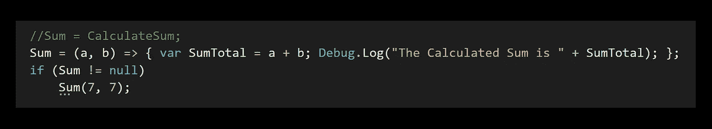

# 委托第 4 部分:Lambda 表达式

> 原文：<https://levelup.gitconnected.com/delegates-part-4-lambda-expressions-98aaa4f0bfb6>



使用 *Lambda 表达式*是将一个方法转换成一行代码的好方法。让我们使用我以前关于*委托*的文章中的一个方法示例，并将其转换为 *Lambda 表达式*。

这里我们有一个*返回*类型*功能*委托，它接受一个*字符串*值并输出一个 *int* 值。

```
private Func<string, int> StringLength;
```

*字符串长度*委托变量被赋予*获取字符串长度*方法的值。然后向*控制台*发送一条消息，返回带有我的名字 *Jared* 的给定*参数*的字符串的值。

```
StringLength = GetStringLength;
Debug.Log("The string count is " + StringLength("Jared"));
```

该方法接受一个字符串*参数*并返回它的*长度*。

```
private int GetStringLength(string text)
{
    return text.Length;
}
```

让我们通过将*字符串长度*变量赋给 *lambda* 而不是*方法*来将其转换为 *lambda 表达式*。我就*点评*出之前的作业，供参考。

要声明一个 *lambda 表达式*，首先要为委托提供*参数*。在本例中，它是一个*字符串*值。我将在这里使用变量名*文本*，因为这是我在原始方法中使用的。接下来，使用 *lambda 运算符*，它是一个*等于* *符号*后跟一个*右尖括号* **= >** 。*λ运算符*表示*“转到”*。然后我是*‘将要’*在*方法*、中的命令，也就是*返回被传入的*字符串*的*长度*。*

```
//StringLength = GetStringLength;
StringLength = (text) => text.Length;
Debug.Log("The string count is " + StringLength("Jared"));
```

我现在可以注释掉现有的*获取字符串长度*方法，因为 *lambda 表达式*的*功能*将与*相同*。

```
//private int GetStringLength(string text)
//{
    //return text.Length;
//}
```

此处*控制台*中 *Jared* 的*串长*为 *5* 。


**练习:** ***用 Lambda 表达式代表***

*创建一个****void****类型的委托，用* ***参数*** *计算两个数之和。*

这里有一个*动作*委托，它接受两个*整数*值作为*参数*，以便计算总和。

```
private Action<int, int> Sum;
```

下面是在将逻辑转换成 lambda 表达式之前，用来计算逻辑的方法。

```
private void CalculateSum(int a, int b)
{
    var SumTotal = a + b;
    Debug.Log("The Calculated Sum is " + SumTotal);
}
```

将*求和动作*分配给*计算求和*方法，然后在下一行输入所需的*参数*值。

```
Sum = CalculateSum;
if (Sum != null)
    Sum(7, 7);
```

7 和 3 的*值*相加，在*控制台*中显示为 10。


专用方法被注释掉，现在 *Sum 动作委托*被转换为使用 *lambda 表达式*。 *int* 值更改为 7 和 7，以产生不同的结果。

```
Sum = (a, b) => { var SumTotal = a + b; Debug.Log("The Calculated Sum is " + SumTotal); };
if (Sum != null)
    Sum(7, 7);
```

现在控制台告诉我总数是 14。


*创建一个****void****类型的委托，用* ***无参数*** *告知游戏对象的名称。*

这里有一个新的*动作*委托，没有*参数*，它将打印脚本附加到的*游戏对象*的*名称*。

```
private Action onGetObjectName;
```

这里有一个*方法*来打印*游戏对象*的*名称*。

```
private void GetName()
{
    Debug.Log("This object name is " + this.gameObject.name);
}
```

*onGetObjectName* 被分配给 *GetName* 方法。要在没有参数的情况下运行它，只需像普通方法一样调用它的委托。

```
onGetObjectName = GetName;
if (onGetObjectName != null)
    onGetObjectName();
```

这里你可以看到这个脚本附加的对象叫做*代理管理器*。


该方法被移除并转换为使用一个*λ表达式*来代替。因为这个委托*没有参数*，方法*签名*用空的*括号声明。*

```
onGetObjectName = () => Debug.Log("This object name is " + this.gameObject.name);
if (onGetObjectName != null)
    onGetObjectName();
```

就像使用专用方法一样，对象的名称打印在控制台中。


*创建一个* ***返回*** *类型的委托用* ***无参数*** *即计算一个游戏对象名称的长度。*

这个例子类似于我返回我的名字 Jared 的长度的例子。唯一的区别是返回游戏对象名称的长度。

对于一个*返回*类型的委托，让我们带上 *Func* ！因为它是一个返回类型，我们需要指定返回的值 *type* ，在本例中是一个 *int* 值。

```
private Func<int> onNameLength;
```

下面是返回这个脚本附加到的*对象*的*名称长度*的方法。

```
private int ReturnObjectNameLength()
{
    var count = this.gameObject.name.Length;
    Debug.Log("character count is " + count);
    return count;
}
```

委托*变量*被分配给*方法*并被*无参数*调用。

```
onNameLength = ReturnObjectNameLength;
if (onNameLength != null)
    onNameLength();
```

控制台告诉我字符数是 15，代表 *DelegateManager* 对象。


现在让我们移除专用方法，并将其转换为一个*λ表达式*。现在把名字的长度从这里发送到控制台。

```
onNameLength = () => this.gameObject.name.Length;
if (onNameLength != null)
{
    int characterCount = onNameLength();
    Debug.Log("The character count of this object is " + characterCount);
}
```

同样，字符数是 15。


*创建一个* ***返回*** *类型的委托，用* ***参数*** *得出两个数之和。*

这个例子与上一个计算两个数之和的例子相同，只是使用了一个 *return* 类型的委托，而不是一个 *void* 类型。

这里有一个*返回*类型的委托，它接受*两个 int 值*，而*返回*一个 *int 值*。

```
private Func<int, int, int> onReturnSum;
```

这里的*方法*接收两个值，并将它们相加。总和存储在*总变量*中，该变量被发送到*控制台*。

```
private int ReturnSumValue(int a, int b)
{
    var total = a + b;
    Debug.Log("The total Sum is " + total);
    return a + b;
}
```

这里输入 12 和 3 以满足*参数*。

```
onReturnSum = ReturnSumValue;
if (onReturnSum != null)
    onReturnSum(12, 3);
```

控制台告诉我这些数字的总和是 15。


现在让我们把它转换成一个λ表达式。

```
onReturnSum = (a, b) => a + b;
if (onReturnSum != null)
    Debug.Log("The total sum is " + onReturnSum(10, 3));
```

现在有了 10 和 3 的新值，*控制台*告诉我*和*是 13。注意，这样做时，你实际上不需要使用*返回*关键字，即使委托是一个*返回类型*。


如果你想添加进一步的逻辑，你可以这样做，但是然后将需要使用*返回关键字*来返回一个*值*。

```
onReturnSum = (a, b) => { var totalSum = a + b; Debug.Log("The total sum is " + totalSum); return totalSum; };
if (onReturnSum != null)
    onReturnSum(12, 10);
```

这里 12 和 10 的值加在一起是 22。


我希望喜欢这篇关于 lambda 表达式的文章，感谢阅读！