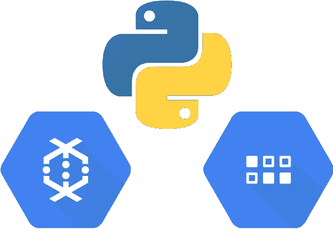
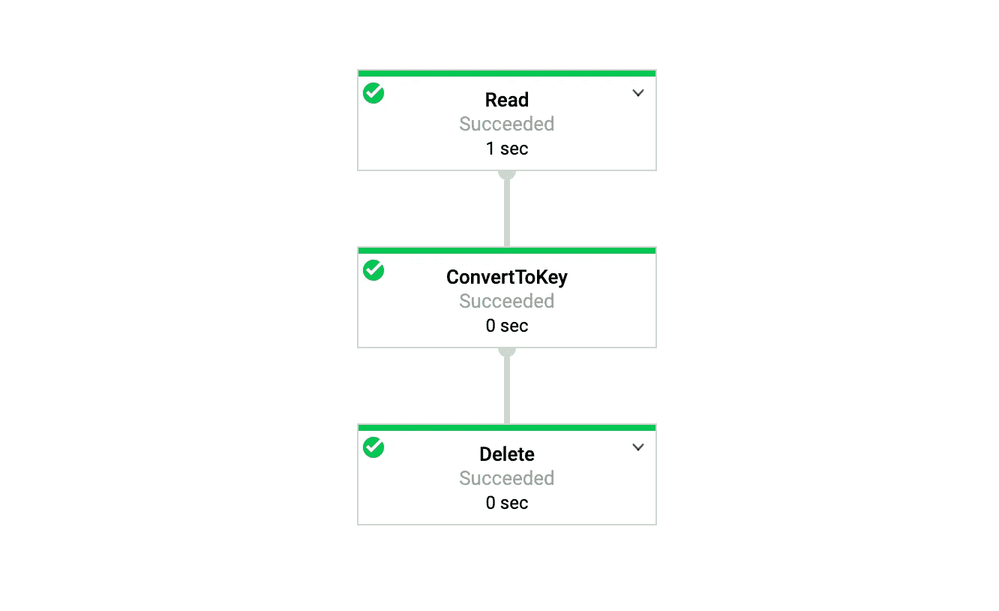
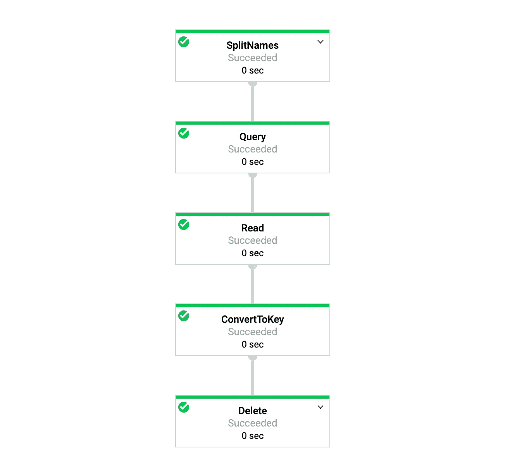

# 用 Python 实现的数据流批量删除数据存储的实体

> 原文：<https://levelup.gitconnected.com/delete-entities-of-datastore-in-bulk-with-dataflow-implemented-in-python-37cbe2dd7e08>



有时，我们可能需要批量删除 Google Cloud Datastore 的实体。例如，当客户停止使用我们的服务时，我们可能不得不删除他们在我们的数据存储上的数据。在这种情况下，谷歌云数据流适合批量删除实体，根据[这个 GCP 文档](https://cloud.google.com/datastore/docs/bulk-delete?hl=en)。Dataflow 帮助我们开发了一个基于 Apache Beam SDK 的数据管道。这也支持 Java 和 Python。

在这篇文章中，我将向**介绍一种简单的方法**，用 Apache Beam Python SDK 在数据流上批量删除实体。然后，我将介绍使用运行时参数运行管道的方法。

# 发展环境

本文的示例代码中使用了下面这些 python 包。

```
REQUIRED_PACKAGES = [
    'apache-beam[gcp]==2.17.0',
    'googledatastore==7.1.0'
]
```

# 带束批量删除实体

在本文中，我使用了在 *datastore.v1new* 包中实现的模块来删除实体。在这个示例代码中，具有名为“foo”的*名称*列的*用户*实体将被删除。流水线按照以下步骤执行:

1.  基于查询读取实体
2.  把实体转化为自己的钥匙
3.  根据关键字删除实体

```
import apache_beam as beam
from apache_beam.io.gcp.datastore.v1new.types import Query
from apache_beam.io.gcp.datastore.v1new.datastoreio import ReadFromDatastore, DeleteFromDatastorewith beam.Pipeline(options=options) as p:
    filters = [("name", "=", "foo")]
    query = Query(kind="User", project=project_id, filters=filters)
    (p
    | "Read" >> ReadFromDatastore(query=query)
    | "ConvertToKey" >> beam.Map(lambda entity: entity.key)
    | "Delete" >> DeleteFromDatastore(project=project_id))
```

## 用键过滤

上面的代码删除了具有特定属性但没有键的实体。如果开发人员希望通过关键字过滤实体，那么 *google.cloud.datastore* 包中的 *Key* 类可以实现这一点。

```
from google.cloud.datastore.key import Key
filters = [("__key__", "=", Key("User", element, project=self.project_id))]
```

## 创建模板

虽然开发人员可以在本地运行管道，但是可以灵活地使用数据流模板。您可以检查[链接](https://cloud.google.com/dataflow/docs/guides/templates/overview)。

> 模板工作流将开发步骤与准备和执行步骤分开。

一旦创建了模板，就可以通过使用 Google Cloud 控制台、REST API 或 gcloud 命令行工具使用模板来执行管道。

要创建模板，请使用以下命令。

```
python pipeline.py --runner DataflowRunner --project [PROJECT] --temp_location gs://[BUCKET]/[PATH]/temp --template_location gs://[BUCKET]/[PATH]/delete_datastore
```

## 执行模板

若要使用模板运行此管道，请使用以下命令。如前所述，开发人员也可以通过使用谷歌云控制台 REST API 来运行这个管道。

```
gcloud dataflow jobs run delete_datastore -project [PROJECT] -gcs-location gs://[BUCKET]/[PATH]/delete_datastore -region [REGION]
```

一旦在 Dataflow UI 中创建了作业，它将如下所示。



删除实体的管道

很简单吧？Dataflow 提供了一种非常简单的批量删除实体的方法。此外，这种删除将在数据流上可伸缩地执行。

下面是完整的代码链接:

# 使用运行时参数执行

有时我们需要用运行时参数运行管道。数据流模板可以使用运行时参数。您可以检查[链接](https://cloud.google.com/dataflow/docs/guides/templates/creating-templates)。

## 带有运行时原语参数

在 Python SDK 中，*add _ value _ provider _ argument*方法可以接受运行时参数。

```
from apache_beam.options.pipeline_options import PipelineOptionsclass DeleteOptions(PipelineOptions):
    [@classmethod](http://twitter.com/classmethod)
    def _add_argparse_args(cls, parser):
        parser.add_value_provider_argument('--name')
```

要使用模板和运行时参数运行此管道，请使用以下命令。

```
gcloud dataflow jobs run delete_datastore -project [PROJECT] -gcs-location gs://[BUCKET]/[PATH]/delete_datastore -region [REGION] -parameters name=foo
```

但是，正如上面的文档中所写的，在执行管道之前，您不能获得运行时参数。

> 您可以使用`isAccessible()`来检查`ValueProvider`的值是否可用。如果在管道执行前调用`get()`，Apache Beam 返回错误:
> `Value only available at runtime, but accessed from a non-runtime context.`

```
def run(argv=None):
    options = DeleteOptions(flags=argv) with beam.Pipeline(options=options) as p:
 **# This error happens: Value only available at runtime, but accessed from a non-runtime context.**        filters=[("name", "=", options.name)])
```

因此，您必须像下面的代码一样在上下文中调用 *get()* 方法。现在管用了。

```
with beam.Pipeline(options=options) as p:
    (p
        | "Read" >> ReadFromDatastore(query=Query(kind="User", project=project_id, filters=[("name", "=", options.name)]))
        | "ConvertToKey" >> beam.Map(lambda entity: entity.key)
        | "Delete" >> DeleteFromDatastore(project=project_id))
```

整个代码如下链接:

## 使用运行时数组参数

让我们考虑一个高级的例子，在这个例子中，管道接受数组运行时参数。不幸的是， *PipelineOptions* 不能接受数组值。因此，本文介绍了接受数组运行时参数的另一种方法。在下面的代码中，管道通过以下这些步骤接受数组值:

1.  管道接受以逗号分隔的*add _ value _ provider _ argument*。

```
from apache_beam.options.pipeline_options import PipelineOptionsclass DeletionOptions(PipelineOptions):
    [@classmethod](http://twitter.com/classmethod)
    def _add_argparse_args(cls, parser):
        # Ex: names=foo,bar
        parser.add_value_provider_argument('--names')
```

2.在管道上下文中，此字符串被更改为用逗号分隔的字符串数组。在*展开*方法中， *PBegin* 对象通过调用*impact()*方法*、*然后成为*pccollection*在运行时上下文中逗号分隔的字符串。

```
class SplitNames(PTransform):
    def __init__(self, names_opt):
        self.names_opt = names_opt def expand(self, pbegin):
        import apache_beam as beam
        from apache_beam.transforms import Impulse
        return pbegin | Impulse() | beam.FlatMap(lambda _: self.names_opt.get().split(","))
```

3.基于字符串数组，管道删除实体。

```
def run(argv=None):
    options = DeleteOptions(flags=argv) with beam.Pipeline(options=options) as p:
        (p
        | "SplitNames" >> SplitNames(options.names)
        | "Query" >> beam.ParDo(CreateQuery(project_id))
        | "Read" >> beam.ParDo(ReadFromDatastore._QueryFn())
        | "ConvertToKey" >> beam.Map(lambda entity: entity.key)
        | "Delete" >> DeleteFromDatastore(project=project_id))class CreateQuery(DoFn):
    def __init__(self, project_id):
        self.project_id = project_id def process(self, element):
        from apache_beam.io.gcp.datastore.v1new.types import Query
        filters = [("name", "=", element)]
        return [Query(kind="User", project=self.project_id, filters=filters)]
```

要使用以逗号分隔的运行时参数运行此管道，请使用以下命令。

```
gcloud dataflow jobs run delete_datastore -project [PROJECT] -gcs-location gs://[BUCKET]/[PATH]/delete_datastore -region [REGION] -parameters=^:^names=foo,bar
```

一旦在数据流用户界面中创建了作业，它将如下所示。



删除具有运行时数组参数的实体的管道

整个代码如下链接:

我希望本文能对你的工作有所帮助。

谢谢你的阅读！