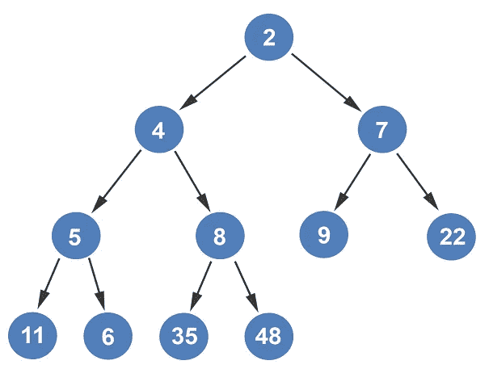
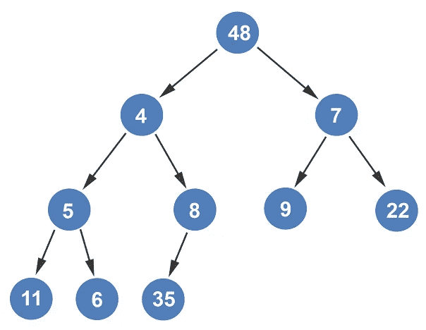
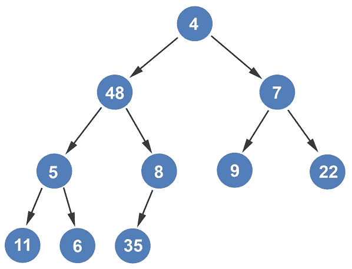
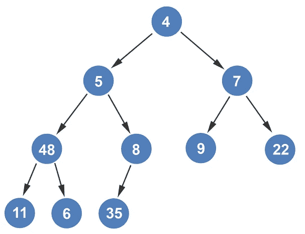
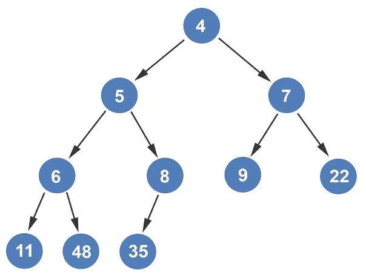

# 从最小堆中删除根节点

> 原文：<https://levelup.gitconnected.com/deleting-the-root-node-from-min-heap-e8ed0d48ddd3>

首先，我将说明在最小堆中插入一个节点已经在我的其他文章中概述过了:[从树中构造最小堆](/constructing-min-heap-from-a-tree-ebe20eceb867)和[从数组中构造最小堆](/constructing-min-heap-from-an-array-1119347486c5)。

简单回顾一下，您将它添加为树中的最后一个元素。你把它和它的父节点进行比较，如果它更大，你就交换父节点和子节点。沿着树向上，不断与每个父节点进行比较，直到到达这样一个点，要么父节点比要插入的节点小，要么节点已经到达根节点。

我们将从删除根节点开始。我们删除根节点的原因是由于堆的底层概念:优先级队列。具有最高优先级的元素被从优先级队列中移除。

删除根节点时，最后一个节点成为新的根节点。

根元素可能不在最小堆上的正确位置。因为 48 比它的子元素大，所以它需要向下渗透到正确的位置。我们将遵循与在[从树文章](/constructing-min-heap-from-a-tree-ebe20eceb867)中构造最小堆相同的方法。

对两个孩子 4 和 7 进行比较，选择最小值。因为 4 小于 48，所以它们交换位置。

接下来，比较 5 和 8 以再次获得 48 的最小子代。考虑到 5 是最小的孩子，48 比 5。节点 5 小于 48，因此这两个节点被交换。

最后比较 11 和 6。节点 6 是最小的子节点，所以它与 48 相比较。节点 48 更大；因此，这两个节点被交换。节点 48 没有进一步的比较。在删除根节点之后，再次获得最小堆。

*如果你喜欢你所读的，我的书，* [*算法的说明性介绍*](https://www.amazon.com/Illustrative-Introduction-Algorithms-Dino-Cajic-ebook-dp-B07WG48NV7/dp/B07WG48NV7/ref=mt_kindle?_encoding=UTF8&me=&qid=1586643862) *，涵盖了这种数据结构和更多内容。*

迪诺·卡伊奇目前是 [LSBio(生命周期生物科学公司)](https://www.lsbio.com/)、[绝对抗体](https://absoluteantibody.com/)、 [Kerafast](https://www.kerafast.com/) 、[珠穆朗玛生物](https://everestbiotech.com/)、[北欧 MUbio](https://www.nordicmubio.com/) 和 [Exalpha](https://www.exalpha.com/) 的 IT 主管。他还担任我的自动系统的首席执行官。他有十多年的软件工程经验。他拥有计算机科学学士学位，辅修生物学。他的背景包括创建企业级电子商务应用程序、执行基于研究的软件开发，以及通过写作促进知识的传播。

你可以在 [LinkedIn](https://www.linkedin.com/in/dinocajic/) 上联系他，在 [Instagram](https://instagram.com/think.dino) 上关注他，或者[订阅他的媒体出版物](https://dinocajic.medium.com/subscribe)。

[*阅读迪诺·卡吉克(以及媒体上成千上万其他作家)的每一个故事。你的会员费直接支持迪诺·卡吉克和你阅读的其他作家。你也可以在媒体上看到所有的故事。*](https://dinocajic.medium.com/membership)