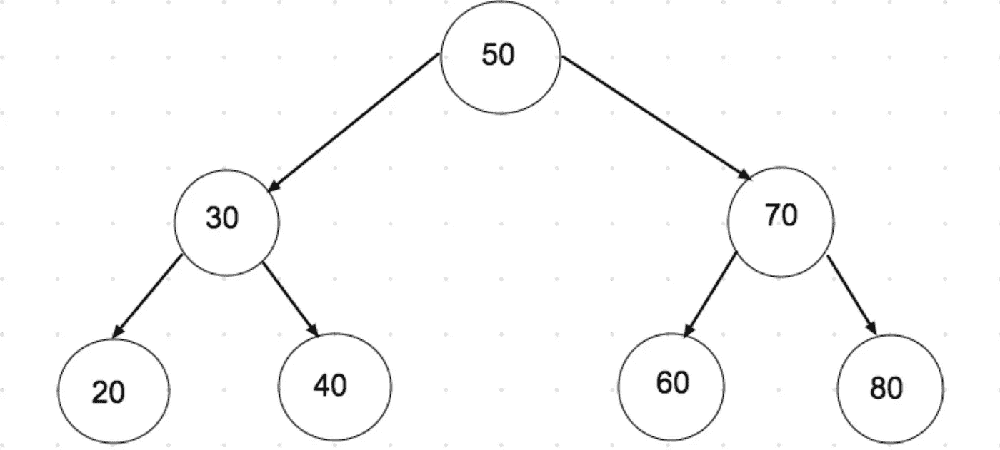
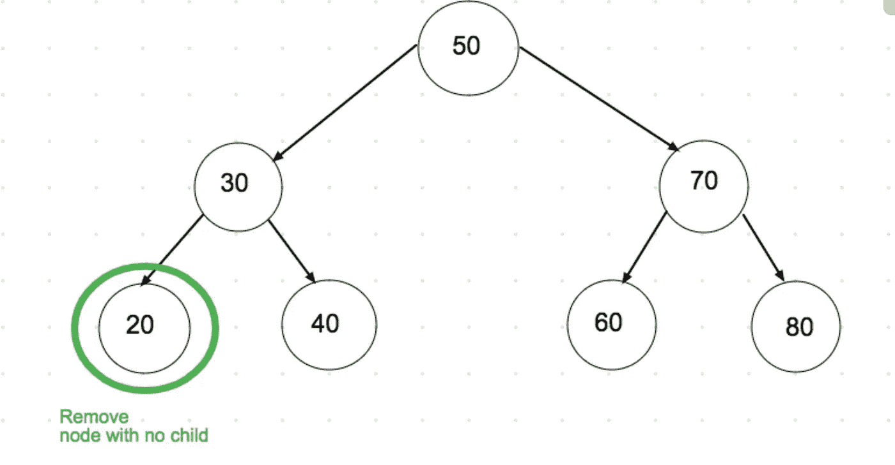
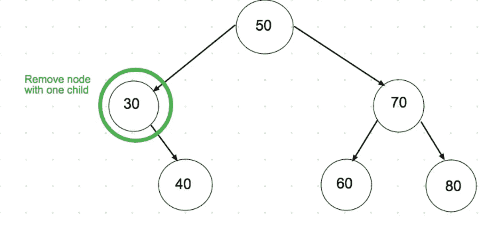
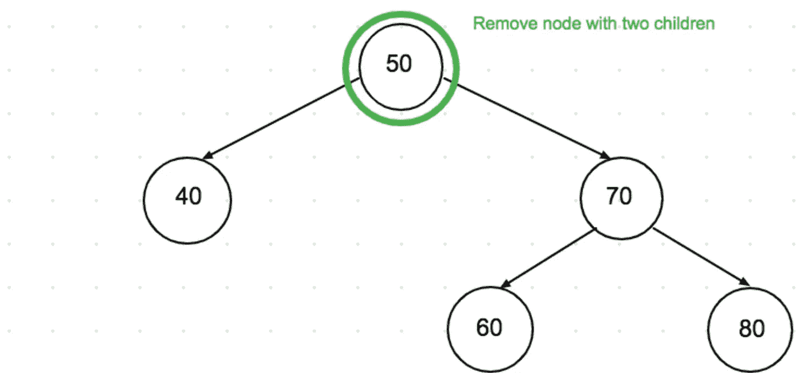
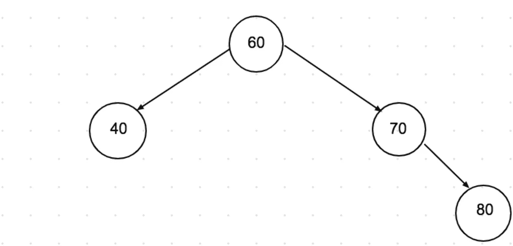
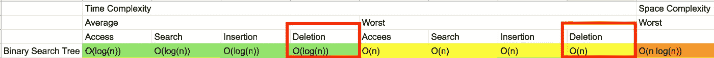

# 用 JavaScript 在二叉查找树删除

> 原文：<https://levelup.gitconnected.com/deletion-in-binary-search-tree-with-javascript-fded82e1791c>

**先决条件:**[**JavaScript 中的二叉查找树**](https://medium.com/swlh/binary-search-tree-in-javascript-31cb74d8263b)

二叉查找树的例子

在二叉查找树删除可能会很棘手，因为我们不是只处理叶子，而是必须重构节点的所有子节点。

二叉查找树的删除分为三种情况:

*   要删除的节点是叶节点。要删除叶节点，只需将其从树中删除即可。因为它是一个叶节点，所以我们没有做任何修改就把它从树中删除了。

移除树叶

*   要删除的节点只有一个子节点。若要删除此节点，请将子节点复制到该节点，然后删除子节点。该节点只有一个子节点，所以我们将它的子节点的值复制到其中，并删除了它的子节点。

移除带有一个子节点的节点

*   要删除的节点有两个子节点。首先，找到节点的有序后继节点。现在，将有序后继的内容复制到节点，并删除有序后继。有序的前身也可以以同样的方式使用。

删除有两个子节点的节点

在所有的删除之后，最终的树看起来如下。

最终树

如何用 **JavaScript** 实现这个逻辑？

[https://gist . github . com/Gai erken/2e 120 e2a 5699 ded1 e 52 EB 9 a 90 da 8 de 01](https://gist.github.com/GAierken/2e120e2a5699ded1e52eb9a90da8de01)

**时间复杂度:**

二叉查找树删除的时间复杂度

*参考:*

 [## 二叉查找树 JavaScript 实现-移除函数

### 您的代码提供了一种情况，当找到的节点是根并且是树中唯一的节点时，如果一个…

stackoverflow.com](https://stackoverflow.com/questions/27812367/binary-search-tree-javascript-implementation-remove-function)  [## 二叉查找树|第二集(删除)- GeeksforGeeks

### 我们已经讨论了 BST 搜索和插入操作。在这篇文章中，我们将讨论删除操作。当我们删除一个节点时…

www.geeksforgeeks.org](https://www.geeksforgeeks.org/binary-search-tree-set-2-delete/)  [## 编写面试问题

### 掌握编码面试的过程

技术开发](https://skilled.dev)