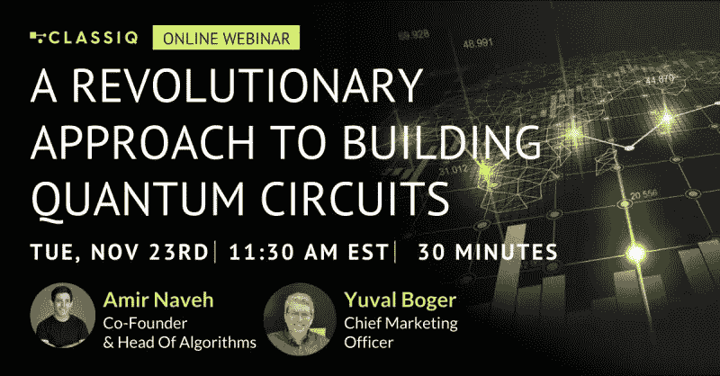

# 演示:Classiq 的 QAD 平台

> 原文：<https://levelup.gitconnected.com/demo-classiqs-qad-platform-f0bec3608549>

[https://www . LinkedIn . com/video/live/urn:李:ugcPost:6868946995961176065/？isInternal=true](https://www.linkedin.com/video/live/urn:li:ugcPost:6868946995961176065/?isInternal=true)

# TL；DW 给那些错过的人

刚刚看了 Classiq 的量子算法设计(QAD)平台的[录制演示](https://www.linkedin.com/video/live/urn:li:ugcPost:6868946995961176065/)。错过现场直播对我来说是一件幸运的事情，因为我结束了倒带和停顿。这不是因为有人说了什么；我只是想仔细看看屏幕上的代码。

## 好人

**区块扩展**

我是 IBM 第一个也是唯一一个非官方的 OpenQASM 倡导者，所以对我来说，任何比包含 OpenQASM 更高的排名都绝对令人震惊。不管怎样，我很震惊。但是，块扩展是一个非常酷的功能。想象一下，看一个电路图，上面有一个标有“QFT”的矩形，你只需点击角落里的“+”号，就可以查看该模块抽象出的门。然后，您可以折叠该块并展开另一个块。您可以展开所有这些选项，也可以不展开任何选项。你可以为神谕、加法器……你所构造的任何东西做这件事。

对于大型电路，可折叠性对于可读性非常重要。我知道我设计的电路不可能完整地观察。而且，因为这些积木是为你生成的，所以 QAD 让你轻松检查它们的组成是很重要的。我见过的最接近这个的特性是 Quirk 的自定义 gates 特性，可以显示小块的内容。QAD 肯定更好地实现了这一点，并允许您检查相当大的块。

**两种环境**

演示展示了 OpenQASM 编辑器和 Jupyter 笔记本。包含 Python 并不奇怪，因为它是量子计算的事实语言，也是世界上最流行的开发语言。但是，包含 OpenQASM 是从我这里获得正面评价的一种保证方式。毕竟，我确信取悦我是项目经理范围文档中的一个要点。

关键是，你有灵活性。我可以用我的方式利用 QAD，你可以用你的方式利用 QAD。因为这个 OpenQASM 编辑器，QAD 实际上只是我会考虑使用的第三个量子开发环境。

**格罗弗的神谕**

演示者生成了一个 20 量子位的格罗弗神谕。如果你以前从未构建过神谕，它们可以用远少于 20 个量子位给你带来悲伤。据称，你可以用 QAD 创造 100 量子位、400 量子位和 1000 量子位的神谕。没有提到量子位极限。

既然 IBM 已经有 100+量子位可用，谁不想至少尝试一下呢？

**QAOA 可视化**

我不是 QAOA 的粉丝，但这种视觉效果真的很有趣。我想我可以把它放在“块扩展”下，因为这就是它有趣的原因。但是，我特意把它分离出来，因为我不是一个粉丝。由于 Classiq 的演示，我想仔细看看扩展的 QAOA 电路。我昨天无意检查 QAOA 电路。

**数学**

我通常不建议在数学中使用量子处理器，但我确实有一个正在进行的特定项目，这可能会有用。看起来量子数学可能是这个平台的优势之一。

**还是“编程”**

我一直担心 QAD 可能是一些图形或文本编辑器，它抽象了太多东西，以至于你不需要了解太多量子计算就能使用它。只需点击一个按钮和因数数字。但是，不，QAD 看起来像一个虚拟编程助理。OpenQASM 仍然存在，Python 也仍然存在，因此它似乎可以利用你所知道的关于构建 5 量子位电路的知识，让你构建更大的电路变得切实可行。

## 坏事

我还没有访问 QAD 的权限。那是我唯一的委屈。不过，这是很严重的不满。

## 丑陋的

电路图可以更美观一些，但块扩展功能很容易原谅这一点。此外，可视化效果看起来比其他大多数产品都要好。我只是说我见过两个，特别是，看起来更好的。如果我必须在美学和区块扩展中选择一个，我会选择区块扩展。

## 好奇者

**缺乏品牌**

我希望 QAD 看起来像一个应用程序:双击你的桌面图标打开它。或者，即使在浏览器中，当我在 IBM Quantum 中时，例如，我知道我在 IBM Quantum 中。所以，我很惊讶 QAD 没有一个独特的外观。不要误会，我更喜欢功能性；我只是很惊讶。

**时间要求**

演示是预先准备好的，而且很快。所以，我们知道 QAD 可以快速生成一个 20 量子位的格罗弗预言，但我们不知道它花了多长时间来准备。就此而言，我不确定电路是在演示之前生成的还是在演示期间生成的。不管怎样，我们都知道生成一个 20 量子位的神谕并不简单，所以对我来说，假设它能工作就足够了。不过，我还是很好奇需要多久。

**数学神谕**

演示展示了量子数学以及格罗弗的神谕结构。我想试着一起使用它们。除此之外，事实上，我想做一些牵线搭桥，这可能是一个双赢的局面。

**优化器**

我希望看到一个演示——或者更好的是，亲自演示——QAD 产生的电路针对特定后端进行了优化。我看到了一行从 Qiskit 库导入的代码，所以我推测这是可能的。就此而言，QAD 甚至可能自己动手。但是，演示的重点是电路结构，因此没有显示硬件优化。

## 结论

我当然有一些算法，我想在 QAD 身上试验一下。它们的范围从极其复杂到简单乏味。幸运的是，这次示威让 QAD 看起来很有希望。我只需要一个登录名和一个密码…