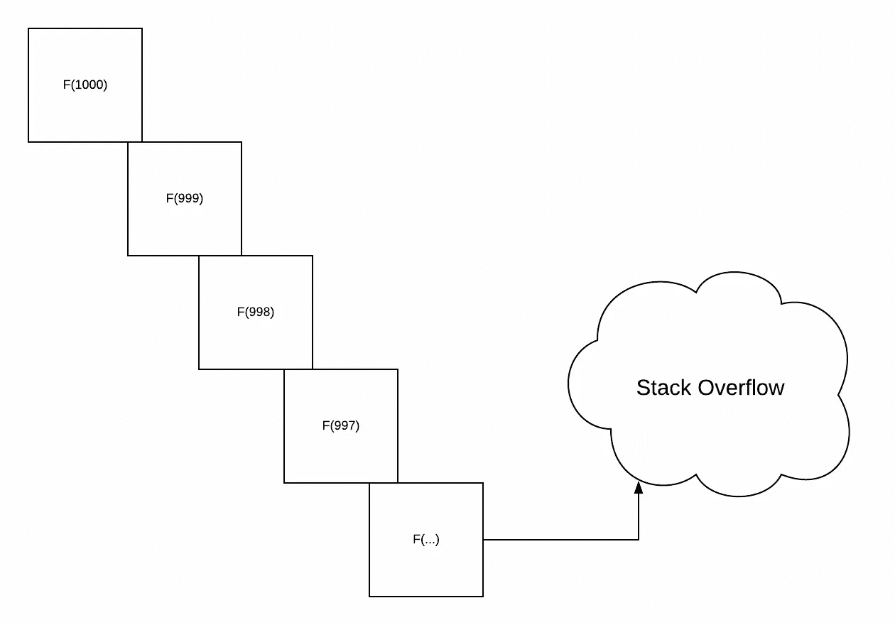

# 揭开 Scala Eager Lazy Memoized 的神秘面纱 Cats Eval 如何避免递归堆栈溢出

> 原文：<https://levelup.gitconnected.com/demystified-scala-eager-lazy-memoized-how-cats-eval-can-safe-your-recursive-stack-for-overflowing-b919c2c16b4a>



在学习了越来越多的函数式编程之后，我们通常在 Java、JavaScript 和其他命令式语言中进行的许多操作都是递归实现的。

围绕不变性编写代码有一些优点和缺点——你会更多地考虑[功能性](https://www.quora.com/How-can-I-learn-to-think-like-a-functional-programmer)。

在 Scala 中，递归通常是通过底层的堆栈来实现的。对于您所做的大多数操作，递归工作得很好。但是，如果您想要同步处理大量数据(这需要循环处理数据以转换到另一个数据),它可能会破坏您的堆栈并导致堆栈溢出。

为了对一个庞大的数据集进行函数式编程，您将如何推迟这种情况？

答案是使用 [Eval](https://typelevel.org/cats/datatypes/eval.html) 。它是一种用于控制同步数据评估的 cats 数据类型。

在我们开始之前，让我告诉你一点关于 Scala 修饰符的三种机制，以及如何利用它们来优化应用程序的性能。

# 什么是渴望？

当你声明一个计算时，急切的计算发生了，它立刻唤起它。例如，Scala 中的`val`在你声明它的时候会正确地调用计算内部的值。

# 什么是懒？

懒惰计算是渴望的反义词。当你唤起它们时，它会唤起计算。例如，如果在 Scala 中定义了`def`,计算不会马上被调用。当你第二次调用这个函数时，它就会被调用。

# 什么是记忆？

内存化的计算就像一个缓存，它存储了您对该计算的初始调用的结果，以便下次您调用该计算时，它可以从缓存中检索它。

例如，当你在 Scala 中声明一个`val`时，当你再次检索计算时，它将会记忆它。

```
val x = {
  println(s"hi, I am eager and memoized!")
  math.random
}
// hi, I am eage and memoized!
// x: Double = 0.09227668662578081

// first access 
x
// res0: Double = 0.09227668662578081

// second access
x
// res1: Double = 0.09227668662578081
```

# 作为单子求值

猫`Eval`有三种类型:`now`、`always`、`later`，表现与评估的`scala`型号相同。

像这样导入和定义构造函数参数的方式，创建了一个`eval`类型的实例:

```
import cats.Eval
val now = Eval.now(math.random + 1000) // this will evaluate right away
val always = Eval.always(math.random + 2000)
val later = Eval.later(math.random + 3000)
```

您可以通过调用`value`方法来提取您创建的`Eval`实例的结果。

```
now.value
```

`Eval.now`相当于`val`——是渴望，是记忆。`Eval.always`相当于`def`——它懒惰，不被记忆。`Eval.later`相当于`lazy`——是懒，是记忆。

知道了这一点，就可以通过`Eval`构造`map`和`flatMap`，因为它是一个[单子](https://en.wikipedia.org/wiki/Monad_(functional_programming))。

```
val greetings = for {
  hi <- Eval.now {
      println("hi is evoke.")
      s"hi with random math : $math.random"
    }
  world <- Eval.always {
      println("always is evoke.")
      "world -- $math.random"
  }
} yield hi + world

// first access, which one gets evoke? What will the value?
greetings.value

// second access, which one gets evoke what will the value?
greetings.value
```

在上面的代码中，`Eval.now`首先被打印和计算。然而，第一次访问和附加访问时，`world`被评估，并转到`yield`部分评估`hi+world`。

Eval 有一个`memoize`功能，能够记忆所有的计算结果。让我给你举个例子:

```
val x = Eval.always{println("First step")}
          .map(_ => println("Second Step"))
          .memoize
          .map(_ =>  println("Third Step"))

// first access
x.value
// First Step
// Second Step
// Third Step

// second access 
x.value
// Third Step
```

**外卖**注意:如果你有一个只有一步连续变化的计算序列，你可以在计算中记忆它以提高它的性能。

通常我们在用数字计算递归调用时，会遇到`stack-overflow`。`Eval.defer`可以帮助你从栈中延迟计算，并把它们存储在堆中，这样你就可以递归地计算大量的计算。

阶乘的简单示例:

```
def factorial(x:BigInt) : BigInt = if(x == 0) {
  1
} else {
  factorial(x-1) * x
}

factorial(500000) // this will blow up your stack
```

稍微改变一下`Eval`，你就可以计算出你的`BigInt`阶乘

```
def factorialEval(x: BigInt): Eval[BigInt] = if(x == 0) {
  Eval.now(1)
} else {
  Eval.defer(factorialEval(x-1).map(_ * x))
}

// incorporate in your original factorial method
def factorial(x:BigInt):BigInt = factorialEval(x).value
```

# 一个练习项目:

能不能把 foldRight 转换成 Eval？

```
def foldRight[A,B](as:List[A], acc:B)(fn:(A,B) => B):B = as match {
  case head::tail =>
    fn(head, foldRight(tail,acc)(fn))
  case Nil =>
    acc
}
```

# 主要外卖:

*   计算有三个术语——渴望、懒惰、记忆
*   Eval 和 Scala 有相同的 3 个术语——eval . now，Eval.always，Eval.later
*   您可以记忆您的计算序列，还可以使用 Eval 创建(几乎完全)无堆栈计算，以优化您对大量数据和数据结构的计算。

# 喜欢这篇文章？

注册我的[简讯](https://edward-huang.com/subscribe/)每周获取此内容！

*最初发表于*[*https://edward-huang.com*](https://edward-huang.com/tech/scala/programming/functional-programming/2020/01/12/demystified-scala-eager-lazy-memoized-how-cats-eval-can-safe-your-recursive-stack-for-overflowing/)*。*