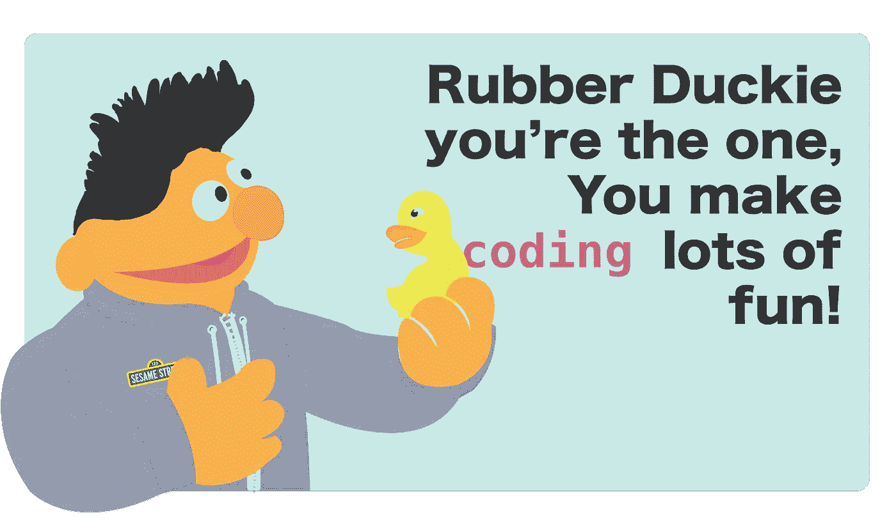
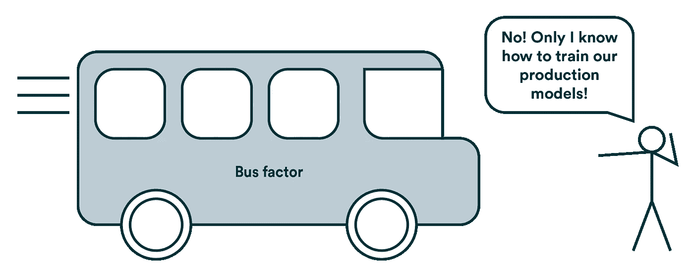
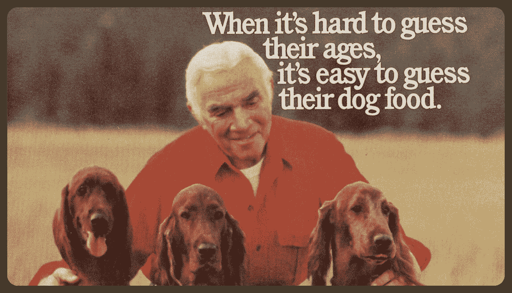

# 科技行业的 5 个常用习语，第 1 卷

> 原文：<https://levelup.gitconnected.com/demystifying-5-commonly-used-idioms-in-the-tech-industry-827e8a6d653a>

## 自行车脱落，橡胶闪避，狗食，公共汽车因素，牦牛刮毛…我的同事到底在说什么？

如果厄尼是个技术兄弟会怎么样？🤔

从事技术工作的人(尤其是开发人员)有一种有趣的术语，让许多人难以理解。我们的首字母缩写词和习语充满了隐含的意义，来自学术界、内部笑话、名著或思想实验。业内人士喜欢使用它们，因为它就像是同行之间使用的密码，给人一种归属感。

如果你是这个行业的新人，现在不得不解码人们所说的话，你可能听过很多这些古怪的短语。也许你已经问过你的新同事他们是什么意思，或者在谈话后在你最喜欢的搜索引擎上查找他们。或者，如果你像大多数人一样，你可能只是微笑着点点头，同时心里想“那个的*到底是什么意思？”*

首字母缩写词和习语应该简化交流，但是如果人们不分享这种语言，就会适得其反！在这个行业工作了十年之后，我希望向任何想融入科技行业的人揭开这些表达的神秘面纱。所以，这是我职业生涯中听到的最常用的五个短语的初步入门。

# **自行车脱落🚲**

让我们把所有的时间都花在争论假想的自行车棚的油漆上(来源:[桑德拉·坎宁安摄影](https://sandra-cunningham.pixels.com/)

骑自行车意味着花费太多的时间和精力在琐碎的事情上，而不是关注现在真正重要的事情上，这些事情通常是假设未来还不存在的问题。

## 背景

这个术语来源于一个故事，一群工程师、建筑师和科学家被雇佣来建造一座核电站，但却无法决定在哪里以及如何建造员工自行车棚。自行车会去哪里？它应该能装多少辆自行车？自行车棚应该刷成什么颜色？所有这些对员工自行车棚的关注导致了资金的损失，自行车棚和发电厂都没有建成。这也被称为“[琐碎定律](https://en.wikipedia.org/wiki/Law_of_triviality)”，即人们会对琐事给予不相称的权重。或者…简称为自行车脱落！

## **使用示例**

假设您将在不到一个月的时间内推出您的产品。你正在和所有同事开会，试图计划接下来三周的工作。有很多重要的事情要做，产品甚至还没有工作！然而，每个人都在争论如何写文档:我们应该使用 JS 文档吗？收纳盒纸？中央大厅？许多工程师花费宝贵的时间在他们喜欢的平台上创建新的文档和维基。你可能会说“各位，让我们把这个问题解决掉吧。这一点没关系，随便挑一个！我们现在正在*脱自行车*。

# 牦牛毛✂️

任的《牦牛剃度日》中的在被施了魔法的独木舟里给牦牛剃度

*剃牦牛毛*是开始做一件事，让你去执行另一件事，结果是一个看似永无止境的任务队列，让你偏离了最初的目标。

然而，与自行车脱落不同，通常这些任务都很重要，必须在某个时候完成。它们甚至可能是实现最初目标的先决条件。它通常以技术债务的形式出现，而这些债务是在试图做其他事情时发现的。

## 背景

这个术语是由麻省理工学院的卡林·维耶里博士在 90 年代初看了《任与史汀普》的一集后创造的。“牦牛剃毛日”部分描述了一个类似圣诞节的节日，参与者悬挂尿布，用凉拌卷心菜填充胶靴，并观看剃毛的牦牛乘坐他的魔法独木舟漂浮而过。孩子们没有给圣诞老人留下饼干，而是给牦牛留下剃须膏和剃须刀，这样它就可以在房子之间继续刮胡子了。

如今，我们通常不会引用 Ren & Stimpy 的短剧，而是想到为一头牦牛剃毛需要什么。你可能拿着一把剪刀接近牦牛，但意识到这把剪刀生锈了，所以你出去试着磨剪刀。当你外出时，你可能意识到你需要一个新桶来装牦牛毛，所以你买了一个新桶。如此等等。这整个过程被称为“牦牛剃毛”,因为给牦牛剃毛是一项非常复杂的工作。

或者，这个术语有时被用来暗示剃牦牛毛是许多偏离最初目标的支线任务之一。也许有人一天开始时想换个灯泡，但最后却剃了一头牦牛。有了这个不同的定义，有时人们甚至会惊呼“无论你做什么，不要剃牦牛毛！”对一个跑题的人来说。

无论哪种情况，在中间剪辑中有一个伟大的[马尔孔，这是主要的*牦牛剃毛*行为。](https://www.youtube.com/watch?v=8fnfeuoh4s8)

## 用法示例

也许你被分配去修复一个 bug，你开始修复这个 bug，但是你意识到它所在的实用函数使用的是一个过时版本的包。所以你去更新包，然后意识到整个功能需要重构。所以你这样做了，把它提取到它自己的文件中，很快你的一行 bug 修复就膨胀了。你开始了你的旅程，只是试图修复一个小错误，你结束了*牦牛刮毛*或*牦牛刮毛*。

你所做的一切都是有益的；解决技术债务总是很重要的！但是如果可能的话，重要的是优先考虑什么是重要的，并把其他问题记下来作为将来要做的 bug，而不是现在推迟你的任务。

# **橡皮鸭调试🦆**

[什么是橡皮鸭调试？](https://www.kenzie.academy/blog/what-is-rubber-duck-debugging/)一篇包含更多信息的精彩文章。

到*橡皮鸭*，或者到*橡皮鸭调试*，就是大声解释你的代码或者问题，希望描述和大声听到的过程能够帮助你诊断你的问题。经常是这样！

## 背景

90 年代有一本名为 [*《实用主义程序员*](https://en.wikipedia.org/wiki/The_Pragmatic_Programmer) 的书，甚至被许多大学用作教材。里面有一个关于程序员的故事，他会带着一只橡皮鸭，通过强迫自己一行一行地向这只鸭子解释来调试他们的代码。这个想法是，听自己大声说话会帮助你抓住逻辑谬误。不需要同事！

这个想法变得如此流行，甚至有一种科学的方法来“调试橡皮鸭”。

## 用法示例

大声听到你自己对正在发生的事情的解释可以帮助你更快地调试问题。典型的虚构人物是一只橡皮鸭，但是你可以使用任何东西。你可能会说“嘿，你能帮我解决这个问题吗？实际上，我可能只需要做一些*橡皮鸭调试*。或者，也许你请同事帮忙调试，在解释问题的中途，你意识到问题是什么，并感谢他们是你的*橡皮鸭*。

 [## 科技行业的 5 个常用习语，第 2 卷

### 喜欢这篇文章？看看这个系列的第二个:技术债务、唾手可得的水果、分类、身兼数职、喝苦艾酒。

levelup.gitconnected.com](/3-more-commonly-used-idioms-in-the-tech-industry-1dabad291b2a) 

# 公共汽车(或彩票)因素🚌

我想我们以前都见过这种场景(来源:[瓦罗海](https://valohai.com/blog/the-bus-factor-in-machine-learning-development/)

一个 [*总线因子*](https://en.wikipedia.org/wiki/Bus_factor) 是一个人或团队所拥有的责任和知识水平的度量。系数越低，这个人离开团队的风险就越大。

更新:在发表这个故事后，我被告知这个词有多种用法，取决于地点。先说两个吧！

## 背景

这个术语也是 90 年代早期的软件工程术语，它的确切起源很难追溯。这个想法是这样的:如果团队中的一个人，或者整个团队，明天被公交车撞了，没有他们，公司还能继续运营吗？还有人知道他们是做什么的吗？如果他们掌握了代码库或产品的所有知识会怎么样？如果他们没有写文档，没有告诉任何人他们在做什么，或者他们甚至加密了他们的工作，会怎么样？

理想情况下，知识被分配并委托给团队中的许多人，这样，如果某个人或他们的团队有一天失踪了，公司可以在没有他们的情况下继续运营。

在这个术语更流行的版本中，公共汽车系数是通过在知识未知之前乘坐的人数来计算的。所以，如果一个公司有 100 个人，只有 4 个人知道如何做某事，那么这件事的公共汽车系数是“4”，因为这 4 个人被公共汽车撞了，远离了默默无闻。在这个版本中，最好有一个高的总线因子；数字越高，风险越小。最糟糕的总线因素是 case 是 1，这意味着如果有一个人失踪，整个项目将被迫停止。

在[中，术语](https://news.ycombinator.com/item?id=27946770)的另一个(更少见的)版本中，公共汽车因素是通过项目中不可或缺的人数来计算的。理想情况下，您不希望任何人是不可或缺的，并且您希望总线因子为无穷大，因此 0 是理想的数字，因为它意味着没有单点故障。

还有很多比被公交车撞更不暴力的变化。“公交因素”的一个更受欢迎、更令人愉快的版本是“彩票”因素。也就是，如果一个人明天中了彩票，决定提前退休，搬到一个没有接收的岛上，风险有多大？

## 用法示例

在开发产品时，您可能会注意到一些有趣的工作流行为。有些人比其他人承担更多的工作，有些人没有其他人做得好，有些人不经常与同事交谈。也许你找到了一个人，当他们需要帮助时，每个人都会去找他，而当他们在度假时，进展开始缓慢停滞。你可能会说“我们需要减少这个信息的*总线因子*”或者甚至“我们需要减少这个人的总线因子”并且实现新的过程，这需要新的代码有伴随的文档，或者雇佣更多的人，等等。

# 喂狗🐶

[1986 年的 Alpo 广告](https://goshyesvintageads.tumblr.com/post/188346062839)，术语“喂狗”的假定来源

到 [*吃自己的狗粮*](https://en.wikipedia.org/wiki/Eating_your_own_dog_food) ，或者到*狗粮，*就是让做产品的团队在向公众发布之前自己使用产品。

## 背景

这个的起源有更多的争论。我最喜欢的一个是在 70 年代有一个狗粮广告，狗粮公司 Alpo 的发言人说，如果他足够信任这些食物来喂他自己的狗，那么你也应该这样做。“吃你自己的狗粮”这个表达据说就是由此而来，在 80 年代微软鼓励每个人内部测试他们的产品的一封电子邮件中被使用。此后它被简称为“狗食”。

## 用法示例

如果你正在开发一款面向类似于你公司员工的产品，你可能会建议你*吃你自己的狗粮，*或*狗粮*该产品。这不仅有助于发现 bug 和产品流程问题，还能与产品用户产生共鸣，提高员工对产品的情感投入。毕竟，如果你自己使用你公司的产品，你会更有兴趣去使用它！这通常最适用于 B2B(企业对企业)公司，在这些公司中，目标用户群与项目工作人员相似。想想在 Slack 上和你的同事聊天，同时在产品 Slack 上工作！

我希望这是有帮助的，将有助于解码你在技术行业的一些常见发言。

在从这个列表中收到很多好的反馈后，我又写了一个！所以，如果你喜欢这篇文章，看看科技领域的另外五个习惯用法。

如果有其他喜欢的，欢迎评论分享！

 [## 喜欢这篇文章？考虑给我买杯茶吧！

### 我过去常常把我的文章放在中等收费的墙后面，但当谈到教育时，我完全关注可访问性，所以现在它们都是免费的。如果你觉得你从这篇文章中得到了一些东西，并且有一些闲钱，请考虑给我买杯茶来表示你的支持！🫖

www.buymeacoffee.com](https://www.buymeacoffee.com/karomancer)