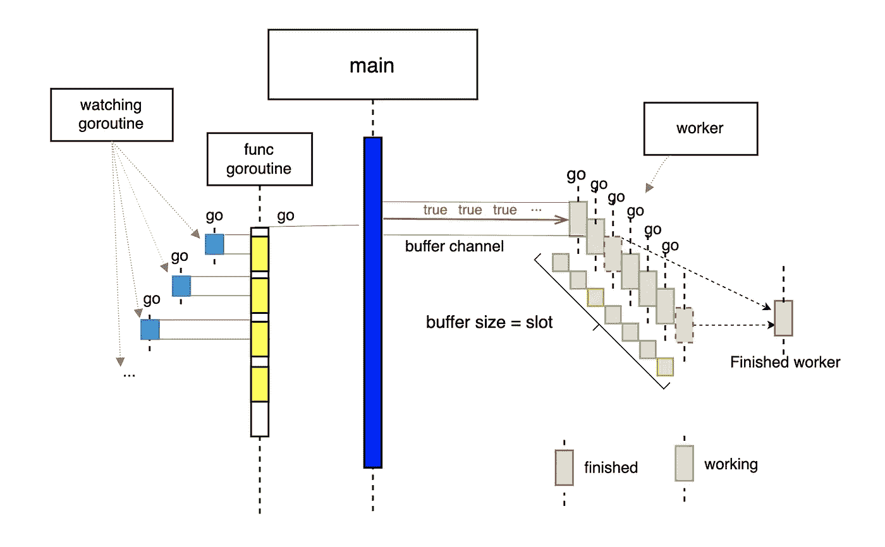

# 在 Go 中解密一个简单的网络爬虫示例

> 原文：<https://levelup.gitconnected.com/demystifying-a-simple-web-crawler-example-in-go-51b1d85770be>

Go 是一种出色的编程语言，具有高性能、表现力和可读性。

在本帖中，我将用一个网络爬虫的例子来展示其超强的并发能力。

# 基本能力

Go 中一个网络爬虫需要具备的一些基本能力。

*   高并发性
*   监控 goroutine 的数量是否有泄漏
*   允许灵活的并发控制

代码如下:

golang 网络爬虫示例

围棋中的网络爬虫

1️⃣:在这里，我们希望利用机器上的所有内核来实现高并发性。

2️⃣在这里，我们使用一个包含频道的 ticker，它会在每次 tick 之后发送频道上的时间。

3️⃣:这里我们启动一个守护程序 goroutine，一旦有信号从 ticker 通道发出，它就运行`watch`函数

4️⃣在这里，我们声明了函数`watch`,它打印当前活动的 goroutines 的数量

5️⃣在这里，我们创建了一个容量为 200 的缓冲通道。这个数字定义了我们程序允许的最大并发请求。

6️⃣在这里我们模拟`MAX`时间的网页请求

7️⃣在这里，我们启动一个新的 goroutine，在每次从通道`c`发出信号时执行`worker`任务。

8️⃣:这里我们用睡眠功能模拟网页抓取动作

9️⃣在这里，我们将请求令牌返回给通道

发现这篇文章很有用👏？看看我下面的其他文章吧！

*   [戈朗通道是如何工作的](/how-does-golang-channel-works-6d66acd54753)？
*   [Golang 中的复合数据类型](/composite-data-types-in-golang-a829288b5553)
*   [揭秘 Golang 中的字节符文和字符串](/demystifying-bytes-runes-and-strings-in-go-1f94df215615)