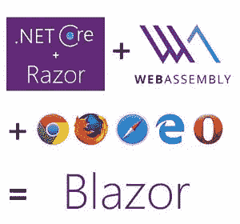
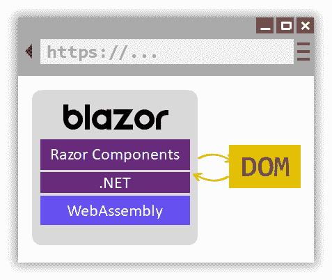
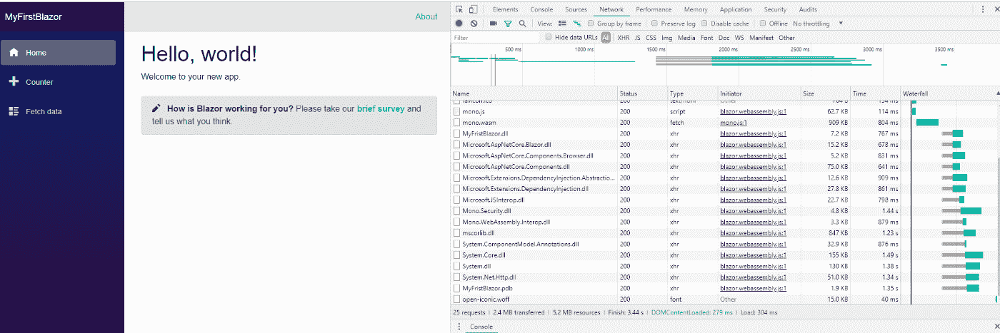
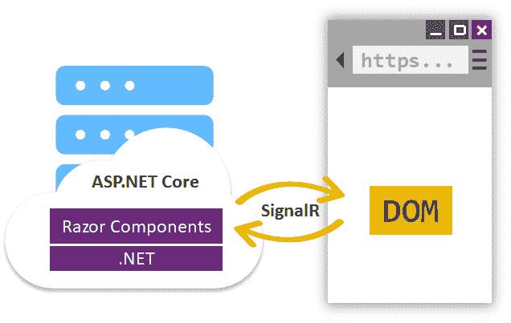
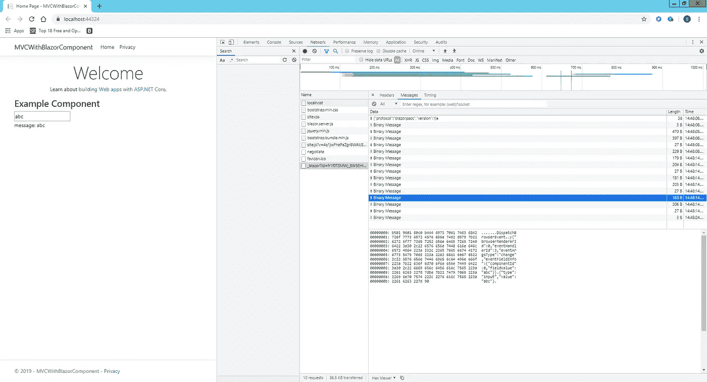

# 揭秘 ASP.NET 核心 Blazor——核心概念及其未来

> 原文：<https://levelup.gitconnected.com/demystifying-asp-net-core-blazor-core-concepts-and-its-future-b2e00fde1a98>

## **什么是 Blazor**

Blazor 是微软最新的 web 框架，用于构建交互式客户端 web UI。NET 而不是 JavaScript。可以用 C#。NET 来实现交互式前端 web 应用程序。

这怎么可能呢？浏览器如何理解或执行 C#代码？Blazor 编译成 WebAssembly，这样它就可以在没有 JS 的情况下在客户端上运行。

## **什么是 WebAssembly**

来自 https://developer.mozilla.org[的](https://developer.mozilla.org/)

*WebAssembly 是一种可以在现代 web 浏览器中运行的新型代码，它是一种低级的类似汇编的语言，具有紧凑的二进制格式，以接近本机的性能运行，并为 C/C++和 Rust 等语言提供编译目标，以便它们可以在 web 上运行。它还被设计成与 JavaScript 并行运行，允许两者协同工作。*

这是一个新的开放网络标准。这是网络的字节码。浏览器可以执行字节码格式的指令，而不是作为脚本语言传输的 JavaScript。如果将代码编译成 WebAssembly，它可以在任何支持 WebAssembly 的浏览器上以接近本机的速度运行。

## **它是如何工作的**

浏览器提供核心 WebAssembly 支持，这意味着它们可以执行 WebAssembly 代码。微软已经为 WebAssembly 构建了一个. NET 运行时，它可以执行。NET 程序集。Razor 组件(Web UI 元素将在本文后面部分解释)被编译成。NET 程序集一起下载到浏览器。NET WebAssembly 运行时并直接在浏览器中执行。

现在，浏览器将所有 UI 事件发送到您的。用于处理和。NET 运行时将响应发送回浏览器进行用户界面更新。所有这些都发生在安全浏览器的 JavaScript 沙箱中。您还可以访问 JavaScript 框架的全部功能。

Blazor 应用程序由组件组成，它们是应用程序的主要构件。让我们看看是什么。

## **什么是 Blazor 组件**

Blazor 组件，通常被称为 Razor 组件，是一个. NET 类，表示使用 C#、HTML、CSS 和 JS 实现的 web UI 元素。这些组件类内置于。NET 程序集。这个核心概念使我们能够构建可重用的。NET 程序集。这意味着它使我们能够构建可重用的 web UI 组件，并在应用程序之间共享它们。这些就像标准中的类库一样。网络世界。与。NET Core 3.0 你会得到一个新的项目类型叫做 ***Razor 类库。*** 所有可复用的 web UI 组件都可以在该项目类型下构建，并可以添加为组装引用，从而可以复用组件。

关于 Blazor 的另一个很酷的事情是，相同的 Blazor 组件可以以两种不同的方式托管。因此，如果您从一个 Blazor 托管模型开始，然后决定要切换到一个不同的模型，这样做是非常直接的。

1.  Blazor WebAssembly
2.  Blazor 服务器

## **Blazor WebAssembly**

Blazor WebAssembly 运行在浏览器的客户端。在本文前面，我们已经看到了 Blazor 组件如何在浏览器上运行。Blazor WebAssembly 仍在预览中。截至撰写本文时，计划于 2020 年 5 月发布。

查看以下内容，了解 dll 是如何下载到浏览器中的。看看 **mono.wasm** 就知道了。NET 运行时 WebAssebmly。

> 希望构建第一个简单的 Blazor WebAssembly 吗？下面是一步一步的快速指南来创建一个。

 [## 构建你的第一个 Blazor 应用程序(不再是实验性的)

### 在浏览器上执行 C#代码

medium.com](https://medium.com/@srikanth.gunnala/build-your-first-blazor-app-not-experimental-anymore-183a08a73bff) 

## **Blazor 服务器**

或者，您可以在服务器上运行相同的 Blazor 组件。这是如何工作的？Blazor 组件托管在服务器上，UI 交互将通过实时信号连接来处理。例如，用户点击了一个按钮，事件通过 SingalR 发送到服务器。相应的 Razor 组件运行并根据事件的更新状态呈现结果。Blazor 将新呈现的输出与之前呈现的输出进行比较，并将序列化的差异 DOM 数据发送回去以更新 UI。看下面的例子，在 keypress 上，事件通过 SinglaR 发送到服务器，差分 DOM 数据发送回浏览器更新 UI。

Blazor 服务器已随一起发货。网芯 3.0。这已经在生产了。

## **Blazor web assembly 的缺点**

1.  浏览器必须支持 web assembly——当今所有主流浏览器都将支持这一点。
2.  巨大的下载量。NET 运行时(2 MB 压缩版本)，基础库，应用程序 dll 都必须下载到浏览器。
3.  缓慢的初始加载时间。
4.  对于大中型应用程序，下载大小似乎是一个障碍。
5.  你所有的应用代码都在浏览器里。它很容易被反编译和提取。
6.  这仍在预览中。

## **Blazor 服务器的缺点**

1.  当事件通过信号工作时，你需要小心延迟。为了低延迟，客户机和服务器应该在地理上位于同一个大陆上。
2.  更多的用户意味着更多的单一连接，这意味着更多的服务器资源。您需要为服务器资源付费，以保持客户端连接活动。

## **下一步是什么，这个标题指向哪里**

微软为 Blazor 制定了一个伟大的路线图。

**Blazor 渐进式网络应用** — PWAs 是一种提供更多原生体验的方式。预计在 2020 年 11 月预览。

bal zor Hybrid——这些是在用户界面上使用网络技术的本地应用。例如，呈现 web 视图的移动应用程序。这些应用程序运行在。NET 运行时一样。网芯。预计在 2020 年 11 月预览。

**Blazor 本地应用**—Blazor 本地应用在设备上本地运行，并使用通用 UI 抽象为该设备呈现本地控件。仍然是实验性的。还没有路线图。

重大更新将在 **Blazor Web Assembly** 的发布中到来。这完全取决于他们带来什么样的机制来解决问题。

1.  最小化下载大小(。NET Run-Tim 和其他 dll 大小)
2.  保护代码版权的加密机制。

总之，Blazor WebAssembly 看起来很有前途。我急切地等待最初的发布，我希望它能解决重要的问题。