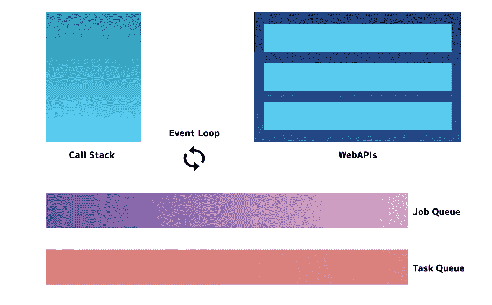
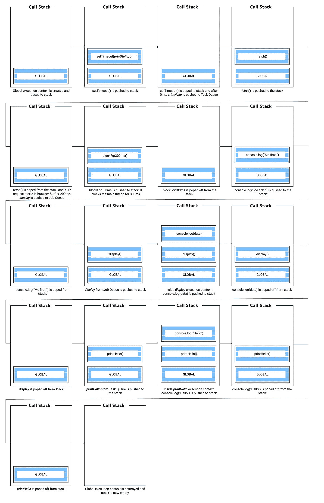

# 揭开异步 JavaScript 的神秘面纱——事件循环、调用堆栈、任务队列等等！

> 原文：<https://levelup.gitconnected.com/demystifying-asynchronous-javascript-event-loop-call-stack-task-queue-and-more-51fb748a4bd4>



JavaScript 并发模型

JavaScript 是一种单线程编程语言。这意味着一次只能有一段代码在**单个主线程**上运行，其他的都被**阻塞**直到一个操作完成。

但是我们不希望**等待**或**被阻塞**来完成某个异步任务！想象一下，在 Instagram 上滚动，直到某个特定的 feed 被完全加载后才能真正滚动。那真的太可怕了！

幸运的是，JavaScript 是一种**非阻塞**语言，这篇文章是关于事情如何在幕后工作的。

# 目录

1.  执行上下文
2.  调用栈
3.  任务排队
4.  作业队列
5.  事件循环——所有这些是如何协同工作的！

# 执行上下文

在我们进入 JavaScript 如何处理异步任务之前，我们应该知道 JavaScript 代码到底是如何执行的。

> **执行上下文**是一个抽象概念，它保存了*关于当前代码正在其中执行的环境*的信息。

*   每当 JavaScript 文件第一次加载到浏览器中时，**就会创建一个全局执行上下文**。
*   每次我们调用一个函数，**一个新的执行上下文**被创建。
*   当我们从一个函数返回或者函数体被完全执行时，该函数的执行上下文被**销毁并被垃圾回收**。

基本上，每当一个 JavaScript 代码在一个给定的执行环境中执行的时候，两件事情会同时发生

1.  **线程化—** JavaScript 线程以程序化的方式一次执行一行代码。
2.  **内存** — JavaScript 创建新标签，并将给定执行上下文的所有变量/函数声明**存储在内存中**

# 调用栈

> **调用堆栈**是一种解释器(就像 web 浏览器中的 JavaScript 解释器)跟踪其在调用多个函数的脚本中的位置的机制——当前正在运行什么函数，以及从该函数中调用了什么函数，等等。

更准确地说，**调用栈帮助我们知道我们的主线程当前在哪个执行上下文中**！让它深入人心。

我们需要记住一些事情——

1.  将*推送到*调用栈的第一件事是全局执行上下文。
2.  每当一个新的函数被调用时，即**当一个新的执行上下文被创建**时，它被*推到*调用堆栈上
3.  每当一个函数完成执行时，也就是说，当执行上下文被销毁时，它就会从调用堆栈中弹出(移除)。
4.  当完整的 JavaScript 代码已经被执行时，即当全局执行被破坏时，调用栈被清空。

# 任务排队

为了执行异步任务，JavaScript 利用了[webapi](https://developer.mozilla.org/en-US/docs/Web/API)

WebAPIs 是浏览器的一部分，而不是 JavaScript 运行时的一部分。因此，JavaScript 运行时与 WebAPIs 接口，使我们能够执行异步任务，同时不会阻塞主线程！

任务队列是一个 DS，当我们使用任何 WebAPI 时，它就会发挥作用。

在大多数情况下，当我们启动一个异步任务时，我们提供一个回调**函数**，它在耗时的异步任务完成时执行。这个回调函数需要返回到调用堆栈才能被执行。现在问题来了，我们到底什么时候把这个回调函数推送到调用栈？

基本上，

> 每当异步任务完成时，与该异步任务相关联的回调函数被推送到任务队列。

例如，考虑下面的`setTimeout`示例—

1.  值得注意的是`sayHello`和`sayBye`都是回调函数。
2.  我们触发了两个 setTimeout 函数，它们触发了浏览器中的一个定时器。
3.  根据`setTimeout`的第二个参数，以毫秒为单位的时间，定时器完成，回调函数被推送到任务队列。
4.  因此，上面例子中的任务队列看起来像这样— [ `sayHello`，`sayBye` ]

# 作业队列

ES6 引入了作业队列的概念，**由 Promises** 使用(也在 ES6 中引入)。这是一种尽可能快地执行异步函数**的结果的方法**，而不是将结果放在调用堆栈的末尾。

> 因此，每当我们对异步任务使用 promise 时，在解析 promise 之后，与 Promise 相关联的回调被推送到作业队列。

例如，如果一个承诺被解析，并且我们的调用堆栈不为空，也就是说，我们的主线程在某个执行上下文中，那么在当前的执行上下文被销毁，并且没有更多的同步代码被留下来执行之后，下一个将被推送到我们的调用堆栈的东西将来自我们的作业队列。

# 事件循环

是时候把我们在上面学到的所有东西放在一起，理解 JavaScript 的完整并发模型了。

> 事件循环监视回调队列和作业队列，并决定什么需要被推送到调用堆栈。

基本上遵循一些简单的规则，这些规则决定了什么需要被推到调用堆栈中，以及以什么样的顺序

1.  当 JavaScript 文件第一次加载到浏览器中时，**全局上下文被推送到调用栈**，即 JavaScript 的主函数被执行。
2.  按顺序，同步代码被执行，**任何同步函数都被推送到调用栈，按顺序它被找到**。
3.  每当使用 WebAPIs 执行异步任务时，当异步任务完成时，与该任务相关联的回调被推送到任务队列**。**
4.  每当使用 Promise 执行异步任务时，当 Promise 得到解析时，与 Promise 相关联的回调被推送到作业队列**!**
5.  如果我们在调用堆栈中存在当前执行上下文，并且没有更多的同步代码要执行，如果作业队列不为空，则从作业队列中取出下一个函数。
6.  如果我们在调用堆栈中有一个当前执行上下文，并且没有更多的同步代码要执行，那么**如果作业队列为空，则从任务队列中取出下一个函数。**

让我们看看下面的例子和它的调用堆栈图，总结一下我们到目前为止学到的东西



因此，上面代码的输出是—

```
Me first!
*data from twitter*
Hello
```

我希望您现在对 JavaScript 中的并发模型有了很好的了解！

谢谢你花时间滚动到最后😊

# 资源

[](https://developer.mozilla.org/en-US/docs/Web/JavaScript/EventLoop) [## 并发模型和事件循环

### JavaScript 有一个基于事件循环的并发模型，它负责执行代码，收集和…

developer.mozilla.org](https://developer.mozilla.org/en-US/docs/Web/JavaScript/EventLoop)