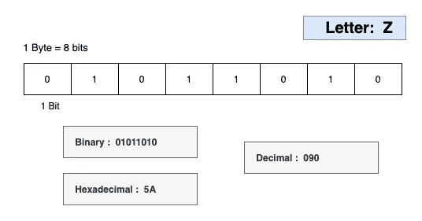
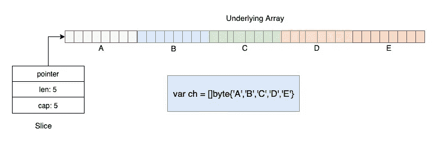
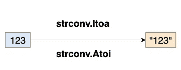

# 揭开 Go 中字节、符文和字符串的神秘面纱

> 原文：<https://levelup.gitconnected.com/demystifying-bytes-runes-and-strings-in-go-1f94df215615>


[西格蒙德](https://unsplash.com/@sigmund?utm_source=medium&utm_medium=referral)在 [Unsplash](https://unsplash.com?utm_source=medium&utm_medium=referral) 上拍照

在谈到*字符串、字节、符文*的时候，很多入门级的 Golang 开发者都感到很困惑。在这篇文章中，我想从应用开发者的角度给出一些解释。

如果你更喜欢 Rob Pike 的全面解释，他是 Go 语言的合作伙伴。请有空在这里暂停一下，看看下面的帖子。

[](https://blog.golang.org/strings) [## Go 中的字符串、字节、符文和字符

### rob Pike 2013 年 10 月 23 日上一篇博文解释了切片在围棋中的工作原理，并使用了几个例子来…

blog.golang.org](https://blog.golang.org/strings) 

# 字节

Go 中的一个字节是一个**无符号 8 位**整数。这意味着它的数值范围限制在 0-255 之间。

```
**type byte = uint8**
```

> 根据 Go 文档，Byte 是 **uint8** 的别名，在所有方面都与 uint8 相同。按照惯例，它用于区分字节和实际的 8 位无符号整数值。

字节类型可用于存储所有的 [ASCII](https://en.wikipedia.org/wiki/ASCII) 字符。例如，下图表示字节变量中的字符 Z。



ASCII 字符 Z 的位表示

要初始化一个字节变量，我们至少有三种不同的方法:

*   通过指定一个 0 到 255 之间的十进制整数
*   通过分配一个 [ASCII](https://en.wikipedia.org/wiki/ASCII) 字符
*   通过分配不同的基数整数(二进制、八进制、十六进制)

如何分配一个字节变量

现在我们已经知道了字节，让我们进一步看看字节片，特别是初始化字节片类型的三种方法。



字节片

# 古代北欧文字

和字节类型一样，Go 还有另一种整数类型`**rune**`。它是 int32 (4 字节)数据类型的别名，在所有方面都等同于 int32。

```
// rune is an alias for int32 and is equivalent to int32 in all ways. It is used, by convention, to distinguish character values from integer values.**type rune = int32**
```

那么究竟是什么让与普通`int32`如此特别呢？

我们知道`byte`类型代表 [ASCII](https://en.wikipedia.org/wiki/ASCII) 字符。 [ASCII](https://commons.wikimedia.org/wiki/File:ASCII-Table-wide.svg) 只包括英语和一些欧洲语言符号。但是世界上有很多人也需要在电脑中使用他们自己的书写系统。

这就是为什么 **Unicode** 被创建的原因。Unicode version 8 在 100 多种语言中定义了超过 120，000 个字符[代码点](https://en.wikipedia.org/wiki/Code_point)。

在围棋中引入了一个新名词叫做 ***符文****到*与码分含义相同。

For example, the Chinese character ‘汉’ has a Unicode codepoint of U+6C49 and integer value 27721\. We use a rune variable to store it in memory.

Source code in Go is *defined* to be UTF-8 encoding. So character ‘汉’ has a binary representation of 1110**0110** 10**110001** 10**001001**

```
A character:                    汉
Unicode Code points:            U+6C49 
Convert 6C49 to binary:         **01101100 01001001**
Encode character as UTF-8:      1110**0110** 10**110001** 10**001001**
```

如果你不明白 UTF 8 和 Unicode 之间的区别，这里有两个很好的帖子。

[](https://www.joelonsoftware.com/2003/10/08/the-absolute-minimum-every-software-developer-absolutely-positively-must-know-about-unicode-and-character-sets-no-excuses/) [## 每个软件开发人员绝对、肯定必须了解 Unicode 和…

### 有没有想过那个神秘的内容类型标签？你知道，你应该把它放在 HTML 中，但是你从来没有…

www.joelonsoftware.com](https://www.joelonsoftware.com/2003/10/08/the-absolute-minimum-every-software-developer-absolutely-positively-must-know-about-unicode-and-character-sets-no-excuses/) [](https://stackoverflow.com/a/27939161/10153574) [## UTF 8 和 Unicode 有什么区别？

### 世界上有很多角色，

stackoverflow.com](https://stackoverflow.com/a/27939161/10153574) 

在 Golang 中，字符值的默认类型是`rune`。如果在声明带有字符值的变量时没有显式声明类型，那么 Go 会将类型推断为`rune`而不是`byte`

再来看另一种常用类型:`[]rune`

# 线

一个字符串实际上是一个只读的字节片。它是用双引号声明的，如`"Hello World"`

> 请记住，单引号表示字节类型或符文类型值，双引号表示字符串类型。

就字符串的内容而言，它完全等同于一片字节。for 循环迭代每个字节。

这个循环是另一个故事:它在每次迭代中解码一个 UTF 8 编码的符文。for 循环迭代每个字节。

每循环一次，循环的索引就是当前符文的起始位置，以字节为单位，码位就是它的值。

# 类型变换

*   Go 中的一个 **Int** 值和一个**字符串**之间如何转换？使用`**strconv.Atoi**` **和** `**strconv.Itoa**` (注:a 代表 **ASCII)**



陷阱:您可能想执行一个错误的语句:`string(123)`，它产生' { '

3.围棋中的**字符串**和**[]符文**如何转换？

那都是乡亲们！感谢阅读。更多好文章敬请期待。

[](/composite-data-types-in-golang-a829288b5553) [## Golang 中的复合数据类型

### Go 支持复合类型，如数组、切片、映射和结构。我们将讨论四种复合类型之一…

levelup.gitconnected.com](/composite-data-types-in-golang-a829288b5553)