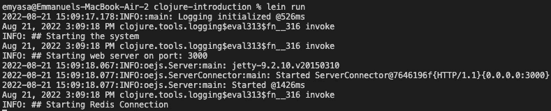

# 揭开 Clojure 的神秘面纱:足以开始大多数项目

> 原文：<https://levelup.gitconnected.com/demystifying-clojure-enough-to-get-started-on-most-projects-a45f63890622>

## 从零到有(当然不是英雄)

由[Pierre chtel-Innocenti](https://unsplash.com/@chatelp?utm_source=medium&utm_medium=referral)在 [Unsplash](https://unsplash.com?utm_source=medium&utm_medium=referral) 上拍摄的照片

## **简介**

Clojure 可能令人望而生畏——特别是对于以前没有使用 Lisp 的经验，并且只使用过 Java 等常见语言的人来说——顺便说一下我自己。

话虽如此，Clojure 并不是火箭科学。被赋予在 Clojure 中维护几个服务的责任(我注意到公司中的大多数开发人员都试图避免这一点)的确是一个机会——那么，我们为什么不对此进行更深入的探讨呢？

在本文中，我们将了解一些事情:

*   设置并运行项目
*   依赖注入
*   在项目中导航
*   与 Java 的互操作性

## **语境**

为了做好准备，让我们假设我们在 Clojure 中有一个服务，一个相当老的服务——需要一些更新；然而，为了简单起见，也许限制它的范围是好的。因此，假设我们有以下库:

*   Stuart Sierra 的组件(依赖注入)
*   环形码头适配器(HTTP 服务器)
*   胭脂红(红色连接)

虽然有 HTTP Kit 和 Jedis 这样的替代工具来分别替代 Jetty Adapter 和 Carmine 这样的依赖工具，但是让我们考虑一下使用遗留服务的前提，并坚持使用它。

## **带 Leiningen 的启动和运行**

与 Maven 非常相似，Leiningen 是一个构建自动化和依赖性管理工具，已经成为事实上的标准。事不宜迟，让我们在这个项目上试用一下: [clojure-introduction](https://github.com/emyasa/medium-articles/tree/master/clojure-introduction) 。

假设有一个 Redis 在端口 6379 上本地运行，让我们在项目的根目录下运行 Leiningen run 命令:`lein run`

## **依赖注入 w/ Stuart Sierra 的组件**

虽然 Clojure 中没有对象，但是有了 Stuart Sierra 的组件[*——感觉就像我们在做通常的面向对象和组件的自动连接。这里有一个例子，让我们看看我们的`system.clj`:*](https://github.com/stuartsierra/component)

如上所示，我们需要一个 web 服务器和 Redis 组件——然后执行*关联依赖注入*(这将贯穿组件的生命周期，我们将在后面看到)。

或者，基于偏好，我们也可以这样编码:

## **在项目中导航**

熟悉了*组件*库之后，我们可以开始导航，并选择查看特定的组件以进行更深入的挖掘——让我们检查一下我们的 Redis 组件(`redis.clj`):

从顶部开始(需要)，我们包括了以下库:

*   记录
*   组件(依赖注入)
*   胭脂红(红色连接)

然后我们定义一个名为`Redis`的 defrecord，用`host`、`port`和`enabled`作为参数。

接下来，我们定义了一个方法来初始化我们的 Redis defrecord——基于 config 参数。

接下来，我们定义了一个 rediscomponentdefrecord——其中我们利用了组件的开始和停止生命周期。

最后，我们定义了一个名为 *make* 的方法来初始化 redis composition。

## **与 Java 的互操作性**

值得一提的是，Clojure 支持互操作性 w/ Java 类。让我们来看看我们的`webserver.clj`:

让我们不要讨论这个组件的每一个部分——相反，让我们集中讨论一些具体的部分，展示我们如何利用 Java 库。

看最上面，我们可以看到 Java 导入。此外，在我们名为 jetty-conf 的私有函数中，注意我们在服务器参数上使用了 [*类型提示*](https://clojure.org/reference/java_interop#typehints) 。最后， [*点特殊形式*](https://clojure.org/reference/java_interop#_the_dot_special_form) 使我们能够访问 Java 的成员方法。

## **结论**

事实上，我们在本文中所涉及的只是冰山一角；然而，有了这几样东西——浏览一个项目并开始为之做贡献就足够了。

此外，虽然这个项目的代码显然是用于演示目的，但其结构和依赖关系与 Clojure 中的一些遗留项目非常相似。

像往常一样，完整的源代码总是可以在 [GitHub](https://github.com/emyasa/medium-articles/tree/master/clojure-introduction) 上获得。