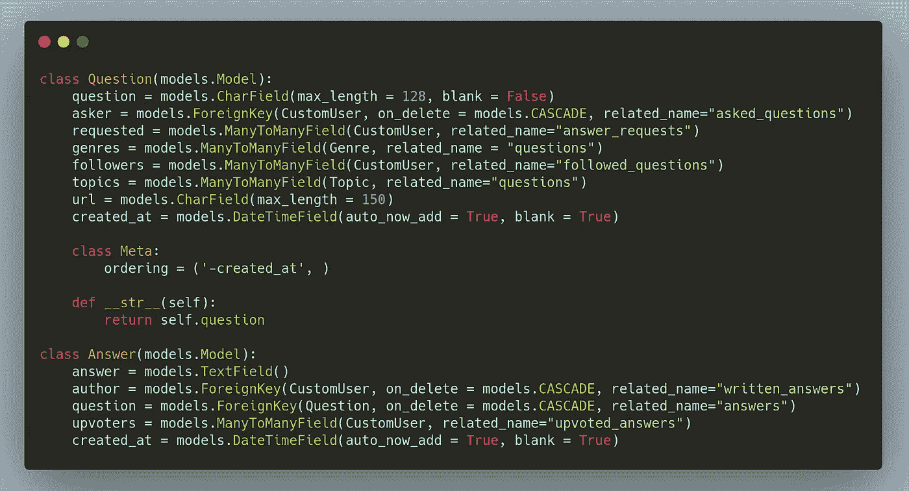

# 揭秘 Django ORM 的复杂查询

> 原文：<https://levelup.gitconnected.com/demystifying-complex-queries-for-django-orm-2297d3bfbd2f>

在 Django 中创建复杂 SQL 查询的权威指南。



# 动机

因此，当我在写一个特定的查询时，我遇到了一个障碍。我对 SQL 本身很有经验，但是当我试图将这种逻辑转换成经典的 Django 对象关系映射(ORM)时，我感到很困惑。这让我经历了痛苦的几个小时，直到一位先生最终回答了我关于堆栈溢出的具体问题。根据这个答案，我决定浏览几个参考资料和 Django 的简洁文档，编写一个小指南，在提供的 ORM 中创建复杂的 SQL 逻辑，这样您就不必这么做了。

# 介绍

本文假设您对 Django 和基本 SQL 有基本的了解。我打算涵盖的**主要主题**是:**聚合、函数、子查询、窗口函数**。我的目标是添加更多的概念，因为我觉得个人需要使用它们。**经验法则**:任何比你的可用带宽更复杂或消耗更多时间的表达式？只需将原始 SQL 写入 Django 游标。这不是最好的方法，因为它很容易受到 SQL 注入的攻击。然而，遵循适当的规则和函数式编程，也可以防范注入攻击。

我将主要参考一个**问题**和一个**答案**模型，其模式在上方最上面的图像中定义**。**

# 聚集

与 common SQL 一样，可以执行聚合来获取整个 queryset 的摘要结果，也可以为 queryset 中的每个对象获取单独的摘要。

## 聚合()

假设您有一个问题模型，每个问题与用户保持一个 ManyToMany 字段，表示一种“追随者”关系。如果我想要一个问题得到的**upvotes 摘要，我可以执行下面的查询:**

```
>>> from django.db.models import Count
>>> Question.objects.aggregate(
        avg_followers = Avg(Count('followers')),
        highest_followers = Max(Count('followers'))
        lowest_followers = Min(Count('followers'))
    )*{'avg_*followers*' : 14.23, 'highest_*followers*' : 1523, 'lowest_*followers*' : 0}*
```

请注意，我不得不导入一个计数函数并用它包装“followers”字段。Followers 是 ManyToManyField，Count 函数返回关注该问题的用户数。基于该结果，在完整的问题查询集中找到相应的最小、最大和平均追随者。

## 批注()

正如上面简要解释的，annotate 用于为 queryset 中的每个对象生成单独的摘要。这意味着，聚合的结果是为每条记录计算的，这些记录可能相同，也可能不同。如果我想在**答案模型**中为一个答案的所有支持者创建一个“支持投票”计数:

```
>>> from django.db.models import Count
>>> query = Answers.objects.annotate(upvotes = Count('upvoters'))
>>> query[0]
<Answer : 1>
>>> query[0].upvotes
143
>>> query[1]
<Answer : 2>
>>> query[1].upvotes
23
```

# f()表达式

F()表达式表示模型的字段/带注释的列的值。它用于有效地引用模型字段值，而不必实际将它们提取到 Python 内存中。这导致数据库而不是 Python 来执行工作。

```
>>> from django.db.models import F
>>> query = Answer.objects.get(author__username='keshavvinayak01')
>>> query.answer
Yes, Math is in fact related to Science.
>>> query.update(answer = F('answer') + " [Anonymous]")
>>> query.answer
Yes, Math is in fact related to Science. [Anonymous]
```

我们可以在注释、过滤器或引用外键中使用这些表达式。

```
>>> from django.db.models import F# In Annotations
>>> answer = Answer.objects.annotate(
        interest = Count(F('followers') + Count(F('requested')
    ) # In Filters
>>> own_qa = Answer.objects.filter(
        question__asker = F('author')
    ) # Referencing Foreign Key 
>>> answer = Answer.objects.annotate(
        question_id = F('question')
    )
>>> answer.question
Is Math related to Science?
>>> answer.question_id
3
```

# Func()表达式

这些表达式包括 LOWER 或 COALESCE 等数据库函数。一些例子可以是:

```
 **LOWER**>>> from django.db.models import F, Func, Coalesce
>>> quest = Question.objects.annotate(
        lower_question = Func(F('question')),
        function = 'LOWER'
    )
# All the question text cases will be in lower case. **COALESCE**>>> from datetime import datetime
>>> q = Answer.objects.annotate(
            updated_at = Coalesce(F('updated_at'), datetime.now())
        ) 
```

在第一个查询结果中，问题文本字段被转换成小写。这相当于在 SQL 中选择 LOWER(question.question)。在第二个查询中，如果 updated_at 字段的值为空，我们只需将其设置为当前日期时间，否则只需获取它。

# **子查询()表达式**

我们可以使用子查询()表达式将显式子查询添加到查询集中。例如，如果我们只想获取一个问题及其最高投票答案，我们就必须包含选择这样一个答案的子查询的结果。

```
>>> from django.db.models import OuterRef, Subquery>>> answer_subquery = Answer.objects.filter(
        question=OuterRef('pk')).annotate(
            upvotes=Count(F('upvoters')
        )
    ).order_by('-upvotes')# What's happening here?
>>> questions = Questions.objects.annotate(
        answer=Subquery(answer_subquery.values('answer')[-1])
    )
```

让我们将其分解为原始 SQL。我们希望获取每个问题及其最高票数的答案。因此，首先，我们创建了一个子查询，该子查询获取 OuterRef 中引用的给定问题的每个答案，然后根据它们的支持票数按降序排序。

在第二部分中，我们添加了一个带注释的答案字段，它基本上是限制为 1 的子查询的结果，以获取最高的投票答案。

一个单独的表是为 upvotes 维护的，可以很容易地通过一个答案进行分组计数。为了简单起见，现在可以忽略这个查询。

SQL 可能如下所示:

```
# Missing some details on upvoters, as it is a many-to-many field.SELECT "question"."id", (
    SELECT "answer"."answer",COUNT("answer.upvoters") as "upvotes" 
    FROM "answer"
    WHERE "answer"."question" = "question"."id"
    GROUP BY 1
    ORDER BY COUNT("answer.upvoters") DESC 
    LIMIT 1
) as "answer" from "question"
```

除了这些基本概念之外，如果您已经理解了以上所有内容，那么现在您可以自己编写互连查询。您可以在子查询、带有过滤器的子查询等等中编写聚合。

有时，您可能需要执行不能完全映射到模型的查询，或者直接执行更新、插入或删除查询。在这种情况下，您可以直接访问数据库，完全远离模型层。示例:

```
**from** **django.db** **import** connection

**def** my_custom_sql(self):
    **with** connection.cursor() **as** cursor:
        cursor.execute("""
        UPDATE x 
        SET a = 1 
        WHERE bar = %s
        """,[self.a]) cursor.execute("""
        SELECT foo 
        FROM x 
        WHERE bar = **%s** """, [self.a])

        row = cursor.fetchone()

    **return** row
```

对象 **django.db.connection** 表示默认的数据库连接。若要使用数据库连接，请调用 connection.cursor()来获取游标对象。然后，调用 **cursor.execute(SQL，< params > )** 执行 SQL，调用 **cursor.fetchone()** 或 **cursor.fetchall()** 返回结果行。

# 结论

在这篇简短的指南中，我们介绍了执行高级 SQL hacks 的一些关键基础知识，最后还讨论了如何执行定制 SQL。如果本文没有解释清楚什么，我强烈建议浏览 Django 官方文档，以获得更多关于 Django ORM 提供的其他可用特性和技巧的知识。我希望这有所帮助，如果有任何疑问或反馈，请留下回复。感谢你的阅读！