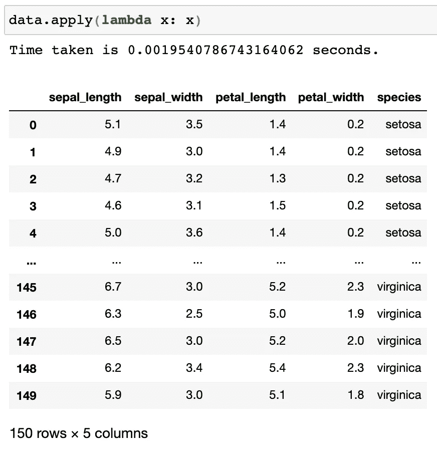
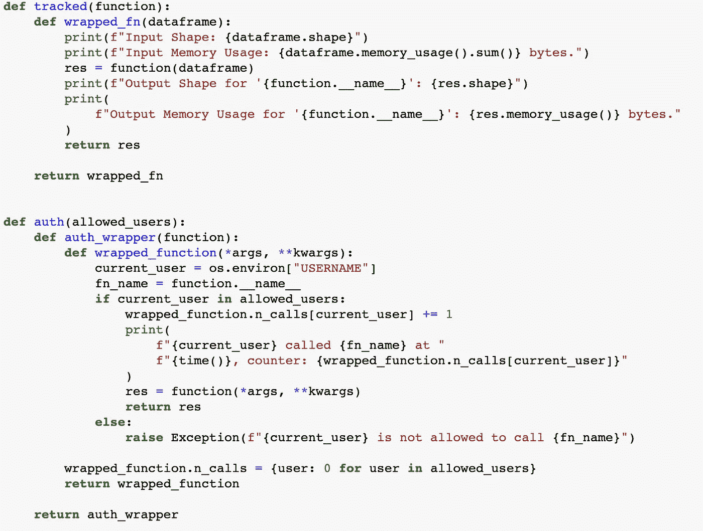
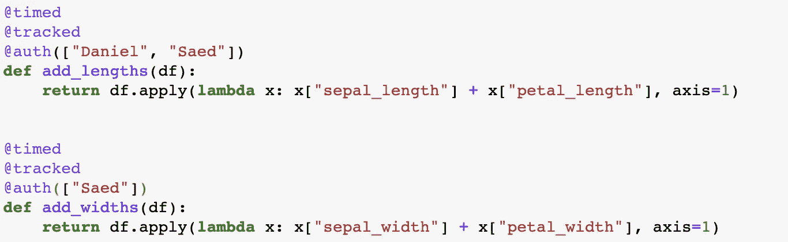
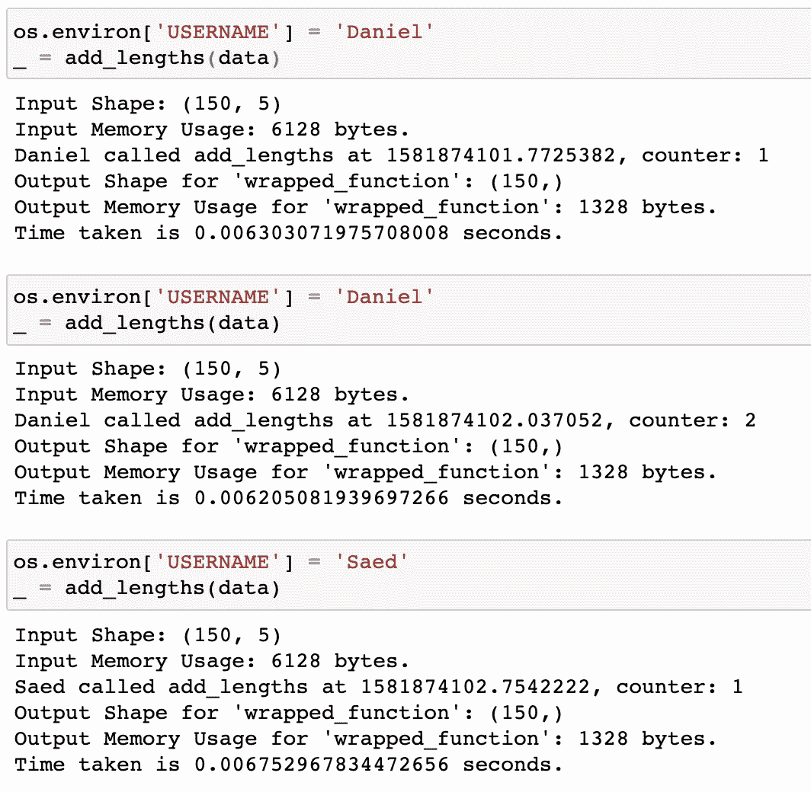
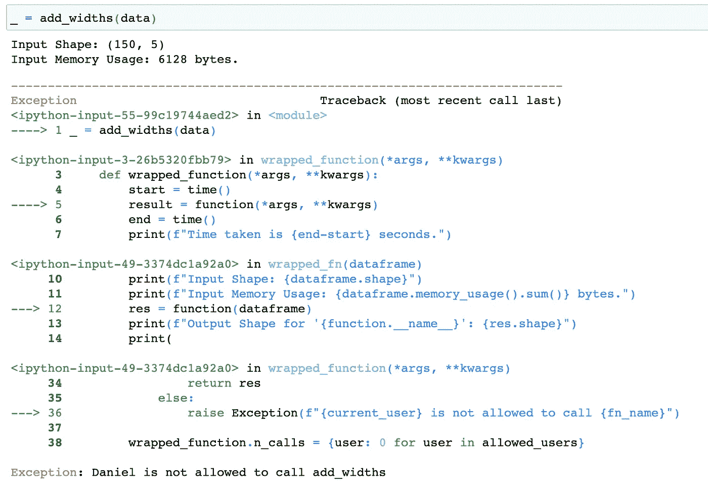

# 揭开 Python 装饰者的神秘面纱

> 原文：<https://levelup.gitconnected.com/demystifying-python-decorators-726f04963a52>


在本文中，我们将讨论 Python Decorators，以及如何使用它们让程序员的生活变得更加轻松。那么，让我们开始吧。

## 什么是 Python Decorators？

Python Decorators 的核心是函数、方法和类/对象的包装器。这意味着您可以动态地向现有函数添加额外的功能，而不会影响它的原始行为。这使得遵守[单一责任原则](https://en.wikipedia.org/wiki/Single_responsibility_principle)和拥有真正的面向对象代码变得更加容易。

## 如何定义他们？

典型的主流例子是函数执行时间的定时器。所以，我们来做一个，解释一下它的工作原理。

```
from time import time
def timed(our_function):
    def our_wrapped_function(*args, **kwargs):
        start = time()
        result = our_function(*args, **kwargs)
        end = time()
        print(f"Time taken is {end-start} seconds.")
        return result
    return our_wrapped_function
```

让我们解释一下这是如何工作的。我们创建了一个函数`timed`，它将函数`our_function`作为参数。在`timed`内部，我们创建了一个接受各种参数(位置和关键字参数)的函数，并将这些参数发送给`our_function`。调用`our_function`前，记录当前时间，调用`our_function`后，记录当前时间。最后，`start`和`end`的区别就是执行`our_function`所用的时间，以秒为单位。在我们创建了`our_wrapped_function`之后，我们将它作为新函数返回来使用。

## 如何使用它们？

有两种方法(据我所知)可以使用 decorators，并且两者是平等的。第一种是在函数签名前使用`@`符号。它与您有权访问其定义的函数一起工作。

```
@timed
def my_amazing_calculation(a, b):
    return a + b - b - a
```

另一种方式是

```
def my_amazing_calculation(a, b):
    return a + b - b - amy_amazing_calculation = timed(my_amazing_calculation)
```

第二种方式允许您修改您不能直接访问其定义的函数/方法。比如 numpy 函数或 DataFrame 方法

```
import seaborn as sns
data = sns.load_dataset('iris')
data.apply = timed(data.apply)
```

如果我们使用`data.apply`，它将被计时。(你必须小心，因为每个`data.apply`调用都会产生这个输出，而且`pandas.DataFrame`有时会在自己内部调用`apply`；所以它可能会在你没有明确`apply`调用的情况下弹出。



## 那么，我们还能用它们做什么呢？(更高级的使用案例)

您可以使用它们来跟踪函数的调用次数(有状态装饰器)，并行执行，验证访问，跟踪由函数引起的变化(操作前后数据帧的形状)。我们还可以对同一个函数应用多个装饰器，并向这些装饰器传递参数。让我们试几个。



认证和跟踪装饰示例

在这个例子中，我们创建了两个新的装饰者。第一种方法只使用数据帧(可能还有一个`Series`)来监控输入数据帧的形状及其内存使用情况，并对操作的输出做同样的事情。第二个 decorator 根据用户名(也可以添加密码)验证特定用户执行特定操作，并计算他们调用的次数(就像跟踪 API 令牌一样)。让我们使用它们。



第一个函数`add_lengths`可以被 Daniel 和 Saed 访问。但是，第二个只有赛义德能接触到，可怜的丹尼尔:(。让我们执行并看看结果。



但是，如果我们把`add_widths`称为[丹尼尔](https://medium.com/u/102134f9432b?source=post_page-----726f04963a52--------------------------------)，就会产生一个异常。



# 概述

简而言之，decorators 是接受其他函数/方法(可以接受类)作为参数并返回它们的增强版本的函数(它们也可以是类)。而且，他们可以有自己的论点。

这使得代码更容易模块化。它可以在[缓存](/faster-code-with-python-caching-8da6e8a92ae9)、日志记录、跟踪、并行性(检查 [joblib](https://joblib.readthedocs.io/en/latest/) )方面提供很大帮助，最重要的是，不必弄乱一段功能代码。

## 重要注意事项:

*   当您在原来的调用之上添加更多的调用时，调试变得有点不容易。
*   如果你使用有状态的 decorators，你必须小心在内存中存储什么，因为它的大小很容易爆炸。
*   Python 标准库中已经有一些既定的 decorators(例如，`decorator`、`contextmanager`、`total_ordering`、`lru_cache`、`property`)，它们在很多情况下确实很有帮助。

## 延伸阅读:

*   [https://wiki.python.org/moin/PythonDecorators](https://wiki.python.org/moin/PythonDecorators)
*   [https://en.wikipedia.org/wiki/Decorator_pattern](https://en.wikipedia.org/wiki/Decorator_pattern)
*   https://docs.python.org/3/library/functools.html
*   [https://en . Wikipedia . org/wiki/Single _ respons ibility _ principal](https://en.wikipedia.org/wiki/Single_responsibility_principle)