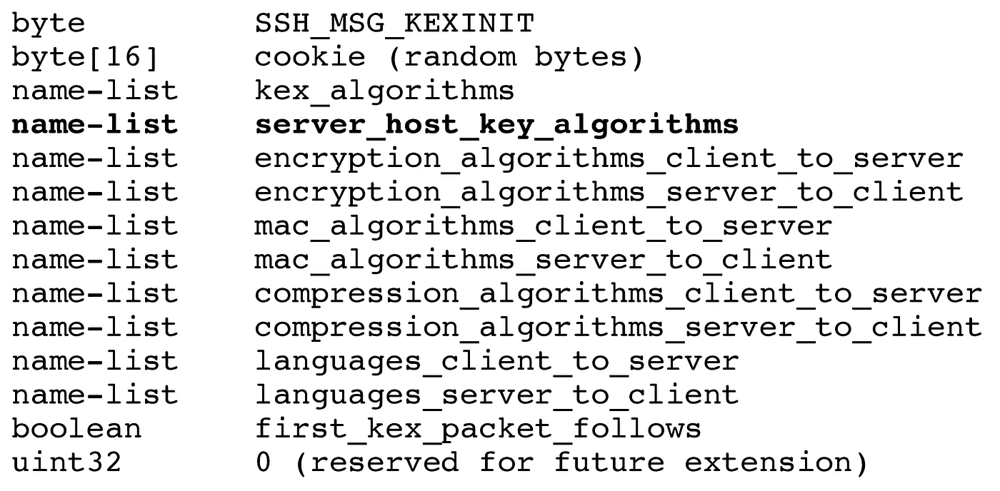
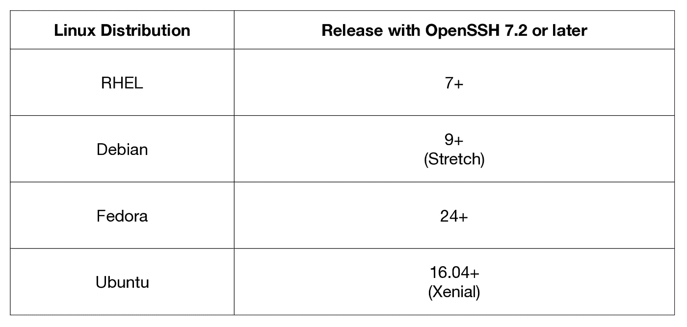

# 揭开 OpenSSH 弃用声明中“ssh-rsa”的神秘面纱

> 原文：<https://levelup.gitconnected.com/demystifying-ssh-rsa-in-openssh-deprecation-notice-22feb1b52acd>

## 详细了解哪些发生了变化，哪些保持不变


Marcus Dall Col 在 [Unsplash](https://unsplash.com?utm_source=medium&utm_medium=referral) 上的照片

OpenSSH 是 OpenBSD 项目开发人员对 SSH 2 协议的实现。它无处不在，是服务器上部署最广泛的 SSH 软件。在最初的 SSH 2 协议( [RFC 4253](https://tools.ietf.org/html/rfc4253) )中，SHA1 是推荐的散列算法。此后，经过多年的各种更新，SHA2 现在被推荐用于数据完整性算法( [RFC 6668](https://tools.ietf.org/html/rfc6668) )、密钥交换算法( [RFC 8268](https://tools.ietf.org/html/rfc8268) )和公钥算法( [RFC 8332](https://tools.ietf.org/html/rfc8332) )。虽然 OpenSSH 增加了对基于 SHA2 的新算法的支持，但在某种程度上它不得不放弃基于 SHA1 的旧算法。OpenSSH 将在不久的将来的版本中取代公钥算法“ssh-rsa”。从版本 8.2 开始，以下通知出现在[发行说明](https://www.openssh.com/txt/release-8.2)中。

> 现在可以[1]对 SHA-1 散列算法进行选择前缀攻击，花费不到 5 万美元。出于这个原因，我们将在不久的将来的版本中**禁用默认依赖于 SHA-1 的“ssh-rsa”公钥签名算法**。
> 
> [1]“SHA-1 一团糟:SHA-1 上的首选前缀冲突及其在 PGP 信任网络中的应用”Leurent，G 和 Peyrin，T(2020)[https://eprint.iacr.org/2020/014.pdf](https://eprint.iacr.org/2020/014.pdf)

SHA1(安全哈希算法 1)是一种广泛使用的密码安全哈希算法，直到它在 2017 年被[破解用于所有实际目的。从那时起，业界一直在努力开发一种安全算法，如 SHA2。这里没有一个单一的战略可以被所有人采纳。举几个例子，CA/Browser forum 多年来一直在致力于解决](https://shattered.it/) [SHA1 反对 TLS 证书](https://cabforum.org/2014/10/16/ballot-118-sha-1-sunset/)的问题，TLS 证书具有多年有效期的事实只会使事情变得复杂。从那以后,[缩短了证书的有效期以帮助管理未来的贬值。版本控制系统如](https://medium.com/@0snet/maximum-validity-of-tls-certificates-is-now-398-days-93e340ff9d48) [Git](https://git-scm.com/docs/hash-function-transition/2.23.0) 和 [Mercurial](https://lwn.net/Articles/832111/) 有他们自己的短期和长期计划，但是过渡还远未完成。

> 除非您使用的是 SSH 2 协议的实现，而不是 OpenSSH，否则您可能不会受到影响，并且可以安全地忽略这个反对通知。

# 算法协商

弃用通知非常明确，只有**签名算法**被弃用。为了理解这意味着什么，我们需要回到最初的 RFC 来理解[算法协商](https://tools.ietf.org/html/rfc4253#page-17)，



SSH 2 是一个设计良好的协议，允许客户端和服务器协商在不同级别使用的算法，“ssh-rsa”将列在主机密钥算法下。OpenSSH 客户端的选项 **-vv** 可以用来获取客户端和服务器都支持的主机密钥算法，

```
ssh -fNvv user@host |& grep "debug.*host key algorithms"
```

## 抽样输出

```
**OpenSSH 5.3p1**
debug2: host key algorithms: ssh-rsa,ssh-dss**OpenSSH 7.4p1**
debug2: host key algorithms: ssh-rsa,rsa-sha2-512,rsa-sha2-256,ecdsa-sha2-nistp256,ssh-ed25519
```

此外，选项 **-Q sig** 可用于列出 OpenSSH 客户端支持的签名算法，包括禁用的算法。一旦弃用，*主机密钥算法*列表中就不会有“ssh-rsa”，就像 OpenSSH 7.4 的主机密钥算法中没有“ssh-dss”一样。


奈杰尔·塔迪亚恩多在 [Unsplash](https://unsplash.com?utm_source=medium&utm_medium=referral) 上拍摄的照片

# 混乱

不幸的是，“ssh-rsa”在 SSH 2 协议中可以有多种含义，只有算法被否决了。在 RFC 8332 中可以找到澄清此的尝试。

## 公钥算法

作为一种算法名称，“ssh-rsa”用作主机密钥验证的一部分，并在公钥身份验证方法中用于用户身份验证，其中签名和验证使用 SHA1 哈希来执行。这个**将被弃用**。它只影响 SSH 2 协议的实现，SSH 2 协议需要与新版本的 OpenSSH 一起工作。

## 公钥格式和 blob

作为一种关键格式，“ssh-rsa”与 SHA1 没有任何关系。可以在 *authorized_keys* 、 *known_hosts* 和 *id_rsa.pub* 等文件中找到。并且作为公钥 blob 内的编码字符串。这些**不会是** **弃用的**。

```
$ cat tmp.pub 
**ssh-rsa** AAAAB3NzaC1yc2EAAAADAQABAAABAQDPyjl9euMQ4Crj/0VyP69+ltELAM4Wt0GyG8y3ENEtpa/Qv0XcJ1IZ8l3lRRWt5+ame2LKQJwInK1xo3UqL+JdCA1OX9h1ap8wOWEm6ZHiehB0JNe7BgIwPYl69qLpv48Xywtz28BahxZPSDd7k5NxiH4HIUbau3tHlvsO2LOqj9pQOPEDh+GdmMcgEv0ZQMY9B6uKJqI+RdiDgWHNDUW+pFwRi2xzMFQqPCqC07ykKMI8G/Nl3Q7RQuDiRw9AhO/BrdF1NEa3I4fyg09nPkBP351kBrLl17VPgoVP24VZJkZSojEKnp4KkIhGLTfg+5TqI6kx36blHZpx3g8txAQt$ cut -d" " -f2 tmp.pub | base64 -d | head -c16 | hexdump -C
00000000  00 00 00 07 73 73 68 2d  72 73 61 00 00 00 03 01  |....**ssh-rsa**.....|
00000010
```

# 影响

对于大多数只使用 OpenSSH 的用户来说，可能没有影响。基于 SHA2 的公钥算法，即 RSA-SHA2–512 和 RSA-SHA2–256，在 2016–02–29 发布的版本 7.2 中加入了 [OpenSSH。下表显示了提供 OpenSSH 7.2 或更新版本的流行 Linux 发行版，](https://www.openssh.com/txt/release-7.2)



## 其他实现

这种弃用主要影响 SSH 2 协议的其他实现，这些实现需要与较新版本的 OpenSSH 一起工作，比如 [PuTTY](https://www.chiark.greenend.org.uk/~sgtatham/putty/) 、 [libssh2](https://www.libssh2.org/) 及其依赖项。而且，很有可能，各种组织内部的协议实现也会受到影响。

持有私钥并实现 SSH 代理协议的程序，比如 *ssh-agent* 和 *gpg-agent* ，也受到这种弃用的影响。他们需要支持基于 SHA2 到[签名标志](https://tools.ietf.org/html/draft-miller-ssh-agent-04#page-10)的更新签名算法。

# 外卖食品

目前还不清楚*近期发布*意味着什么，以及何时会发生实际的贬值。然而，当发生这种情况时，该算法仅在默认情况下被禁用，如果需要，单个用户可以使用选项**HostKeyAlgorithms =+ssh-RSA**启用该算法进行主机密钥验证。

虽然还不太清楚如何启用“ssh-rsa”签名算法进行用户认证，如果它在默认情况下也被禁用的话。通过[发现过程](https://tools.ietf.org/html/rfc8332#page-6)，OpenSSH 客户端可能会决定使用不推荐的算法。如果这种情况没有发生，请尝试选项**PubkeyAcceptedKeyTypes =+ssh-RSA**

> 当使用 RSA 密钥对未实现“server-sig-algs”扩展的服务器进行身份验证时，客户端可能会默认使用“ssh-rsa”签名来避免身份验证损失。当新的 rsa-sha2-*算法被广泛采用以保证禁用“ssh-rsa”时，客户端可能会默认使用其中一种新算法。

值得注意的是，“ssh-rsa”签名算法将仅在较新的 OpenSSH 版本中被弃用。而且，在一段时间内，操作系统和发行版的未来版本可能仍然默认启用“ssh-rsa”。除非您使用的是 SSH 2 协议的实现，而不是 OpenSSH，否则您可能不会受到影响，并且可以安全地忽略这个反对通知。

*在第 0 根，我们正在提供一个解决方案，* [*第 0 根安全网络— 0SNet*](https://www.0snet.com/) *，它使用 TLS 客户端证书来保护组织的内部 web 应用程序。看看我们的产品吧，它很容易部署，也可以在*[*AWS*](https://0snet.info/#install.aws)*，*[*【GCP】*](https://0snet.info/#install.gcp)*和*[*Azure*](https://0snet.info/#install.azu)*上看到。*