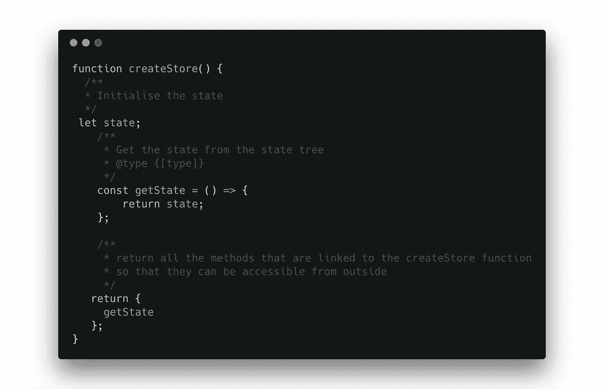
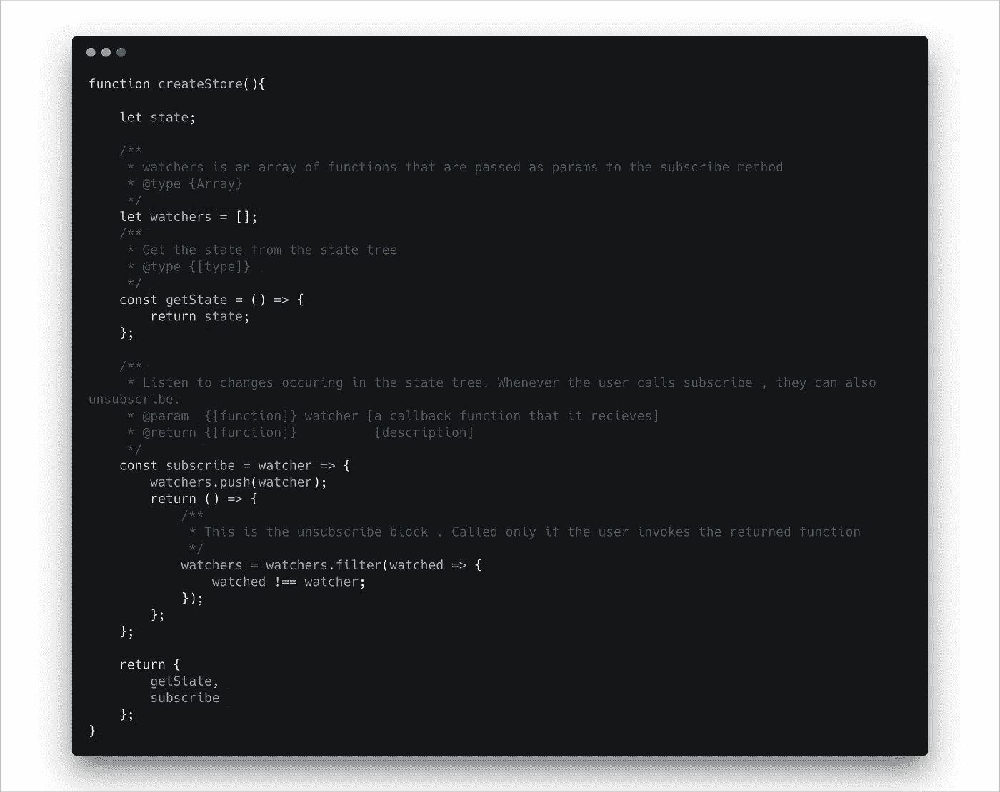
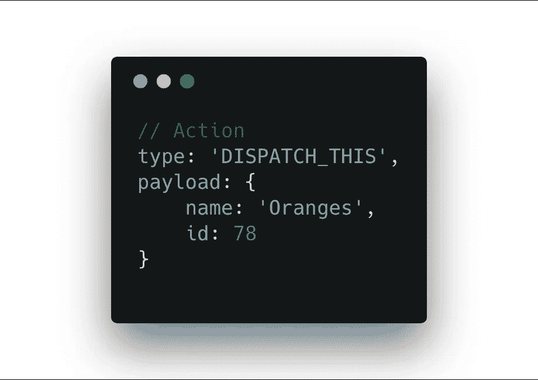
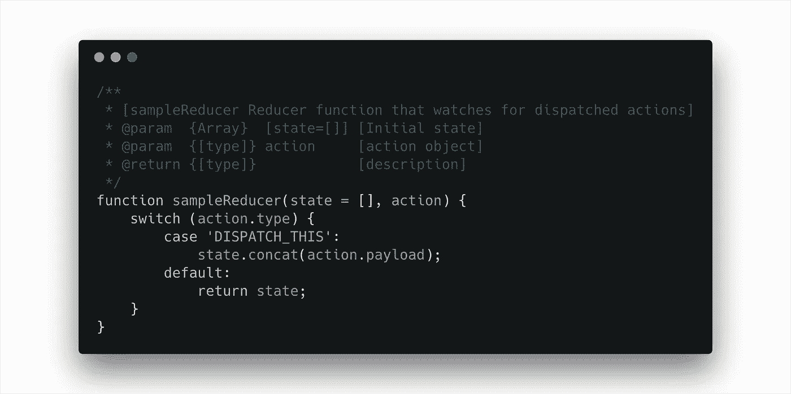
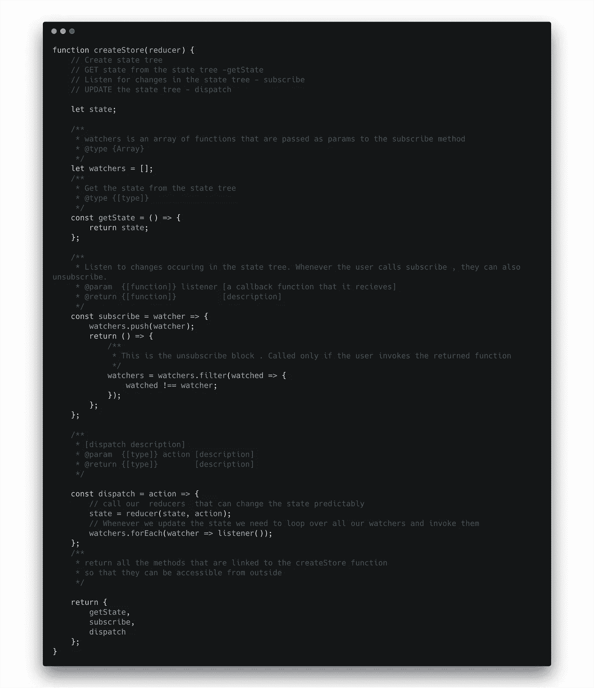
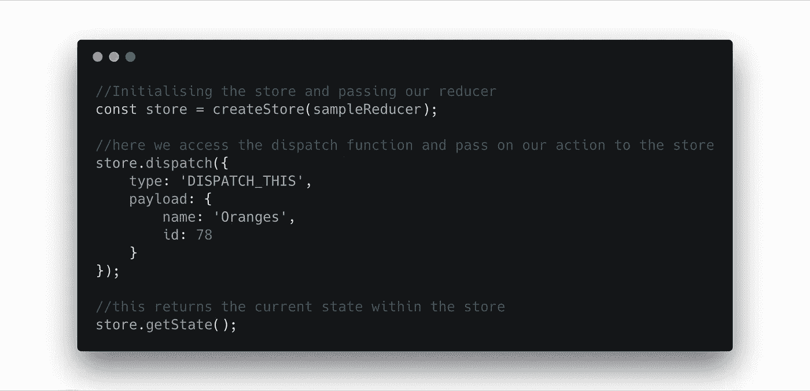

# 揭秘状态管理和冗余

> 原文：<https://levelup.gitconnected.com/demystifying-state-management-and-redux-4ccbb1a1167a>


任何应用程序的基本组成部分都是它的用户界面和应用程序状态。应用程序状态的神圣性和可预测性对于任何应用程序来说都是至关重要的。为了使这个任务更简单，我们有状态管理库。在这篇文章中，我将深入探讨状态管理的需求，并深入了解 redux 是如何工作的。

## **状态管理需求**

通常我们有 UI，状态通常分布在应用程序中。在基于 react 的应用程序中，状态跨组件和 DOM 本身传播。

这种分散的状态带来了许多挑战，其中不止一个组件需要访问同一个状态——通常我们将状态移动到父组件，并将其作为道具传递给需要它的组件。如果需要它的组件比父组件低 6-7 层，该怎么办？这种做法虽然没有错，但相当麻烦和乏味。如果我们所有的状态都在 Redux 状态树中，我们就不需要担心这一切，需要它的组件可以直接从状态树中获得它。

因此，与其将状态分散在应用程序中，不如将它放在一个位置。这就是我们所说的*状态树。*

## 与状态树交互并理解 Redux 如何工作

现在我们已经理解了状态树的本质和存在的必要性，让我们更深入地理解 redux 是如何帮助处理状态树和应用程序状态的。

为了构建状态管理库，这些是`building-blocks`。

*   首先，我们需要将我们所有的州放在一个位置
*   然后我们需要从状态树中“获取”状态
*   倾听国家的变化
*   更新状态树

所有这些共同组成了我们的*商店。*

## *建设商场并与商场互动*

基于上面提到的 4 个`building-blocks`,让我们创建我们的`createStore()`函数

```
function createStore(){// Create the state tree// GET the state tree - getState()// LISTEN for changes - subscribe()// UPDATE the state tree - dispatch()}
```

无论何时调用`createStore()`函数，用户都可以访问`getState()` `subscribe()`和`dispatch()`方法。

## 初始化`state` 和`getState`功能



在我们的`createStore()`函数中，我们初始化状态，还有`getState()`函数，它的任务仅仅是返回当前状态。此外，`getState()`从主函数返回，这样当`createStore`被调用时，它可以作为一个方法被访问。

```
const myStore = createStore();myStore.getState()// returns the current state 
```

## 使用 subscribe 监听更改

既然状态是可访问的，我们需要监听对存储的更改。我们定义了一个 subscribe 方法，作为一个观察器。这个方法接受一个函数作为参数。因为 subscribe 方法可以被多次调用，所以我们使用一个数组来推送所有被监视的函数。

用户调用 subscribe 并传递函数，该函数被推送到 watchers 数组上。为了取消订阅，我们返回一个回调函数，它只是过滤器数组助手检查当前传递的函数是否已经存在于观察器数组中。然后返回一个数组，其中包含除传递给它的函数之外的所有其他函数。



## 更新状态树

可预测性是我们试图实现的状态管理库的本质。因此，一旦我们听取了要对商店做出的改变，我们就该实施这些改变了。

假设我们有一个事件集合，这些事件应该在我们的存储中强制执行这些状态更新



一个简单的动作

因为这是一个对象，我们可以添加任何我们想要的额外信息，这将帮助我们基于被调用的类型改变存储的状态。这被称为`ACTION`——它是一个表示改变我们商店状态的事件的对象

现在我们有了我们的状态和行动，我们需要以某种方式将它们连接在一起。动作必须有一个类型属性来指定正在发生的动作的“类型”。除了“类型”，动作的结构相当灵活

## 减速器功能

Reducer 函数应该是纯函数，它接受当前状态和动作，并返回状态的更新版本，而不改变它。



减速器功能

reducers 观察被分派的动作的`type`,然后更新状态。如果你在上面的代码中观察到我们使用了`.concat()`而不是`.push`，那么现有的状态不会发生变化

## 分派行动

一旦定义了归约器，我们所需要的就是能够“分派”一个动作，这样归约器就可以得到关于修改什么以及更重要的是如何修改状态的指令。



一种分派动作的方法

注意，`createStore()`现在接受一个 reducer 作为参数，这样在`dispatch()`中我们可以动态地访问 reducer 并传递动作以获得当前状态。一旦我们有了状态，我们就调用我们的观察器数组中的所有函数。

这上面，是我们的全功能状态管理库。



访问存储区中声明的状态和方法

## 结论

在这篇文章中，我试图让读者深入了解 redux 是如何工作的。对内部工作的更好理解可能会对在哪里以及如何使用它们给出更清晰的描述。我还强调了状态的神圣性是至高无上的，以及 redux 如何帮助我们维护它，尤其是在大型应用程序中。