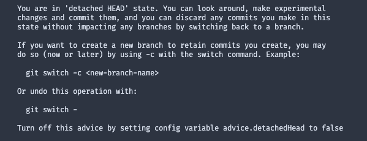
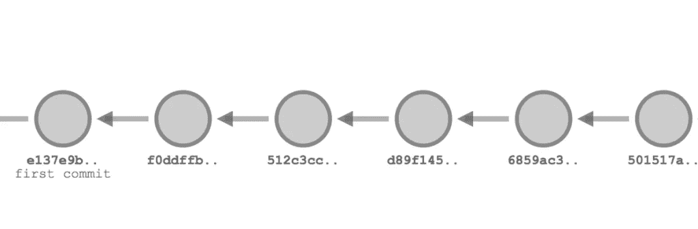
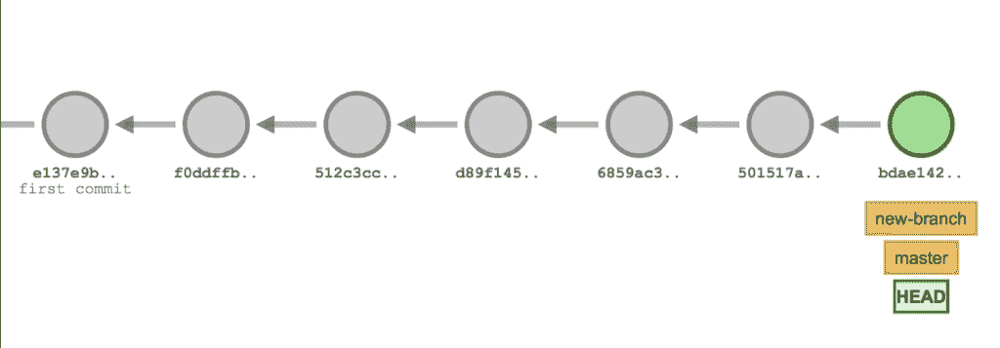
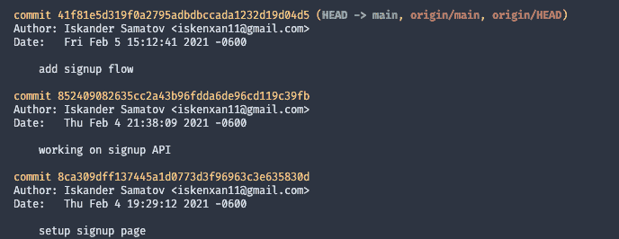

# 揭秘 Git 中可怕的分离头

> 原文：<https://levelup.gitconnected.com/demystifying-the-scary-detached-head-in-git-a1b8e5169ff6>


我同意,`You are in 'detached' HEAD state`消息听起来确实很吓人。我希望 Git 的创造者选择一个不那么令人担忧的。但是让我来消除你的担忧——分离的头部状态是容易逆转的，是一个项目的自然状态。完整的信息如下所示:



如果您是来寻求解决方案的，请随意跳到“如何解决”部分。如果你想知道更多关于这种状态背后的原因，请继续阅读。

## Git 基础

首先，让我们浏览一下 Git 是如何工作的。不要担心，我们将只涵盖足够了解国家的根本原因。

**提交的父子关系**

Git 是一个由对象和指针组成的系统。提交通过父子关系连接在一起。每个提交都指向前一个提交作为其父提交。这里有一个图表来说明这一点:



[https://trail head . sales force . com/en/content/learn/v/modules/git-and-git-hub-basics/work-with-your-history-in-git](https://trailhead.salesforce.com/en/content/learn/v/modules/git-and-git-hub-basics/work-with-your-history-in-git)

注意除了第一次提交之外，每次提交都指向前一次提交。

**头**

下一个问题是什么是头？HEAD 是指向当前工作提交的指针。它还定义了项目的当前状态。通常，HEAD 指向一个分支。

**Git 分支**

很多人对什么是分支有个大概的概念。但是让我们试着给出一个简单的定义。简单地说，分支是提交的标签。当您推入一个分支时，该标签现在指向新提交。当您运行带有分支名称的`checkout`命令时，Git 会检查分支指向的最新提交。

按照这个逻辑，当 HEAD 指向一个分支时，它指向该分支下的最新提交。



[https://trail head . sales force . com/en/content/learn/v/modules/git-and-git-hub-basics/work-with-your-history-in-git](https://trailhead.salesforce.com/en/content/learn/v/modules/git-and-git-hub-basics/work-with-your-history-in-git)

注意`master`分支和头是如何指向同一个提交的。

## 什么是超脱头？

那么什么是超脱的头呢？根据 [Tower 的博客文章:](https://www.git-tower.com/learn/git/faq/detached-head-when-checkout-commit/)“当一个特定的提交而不是一个分支被签出时——就是所谓的“分离头”。"

重申一下，这意味着你的项目负责人不再指向一个分支。相反，它指向一个特定的提交。当您使用提交散列而不是分支名称运行`checkout`命令时，就会发生这种情况。顺便提一下，您可以使用`git log`获得提交的散列值:



## 拆下头部的原因

检查特定提交有几个原因。其中之一是调试或修复问题。在这种情况下，回滚到某个时刻可能会有所帮助。

另一个原因是对任何给定的问题尝试不同的解决方案。因为状态很容易纠正，所以这是一个处理代码的好方法。

## 如何修复

记住，分离的头不是一个错误，而是 Git 中的一个特性。也就是说，有两种方法可以让事情回归“正常”

**检查不同的分支**

如果你偶然发现自己处于这种状态，或者完成了实验，你需要做的就是检查另一个分支。Git 会丢弃你未提交的代码，你的头会再次指向一个分支。

**创建一个新的分支并提交你的代码。**

如果您有一些不想丢失的代码更改，创建一个新的分支并提交您的代码。下面是实现这一点的 Git 命令:

```
git branch <branch-name> && git checkout <branch-name>
```

一旦你这样做了，你就可以提交你的代码到新的分支。只要你在回到你的常规分支之前做到这一点，你就会没事的。

现在你知道了！一旦你理解了游戏中的基本逻辑，分离的头部就不那么可怕了，而且可能相当有用。

*原载于 2021 年 2 月 6 日 https://isamatov.com**[*。*](https://isamatov.com/demystifying-the-scary-detached-head-in-git)*