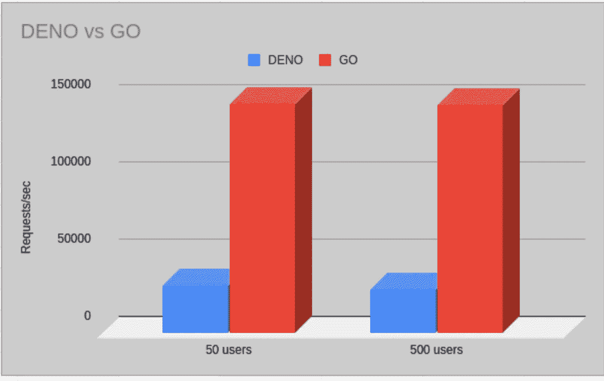
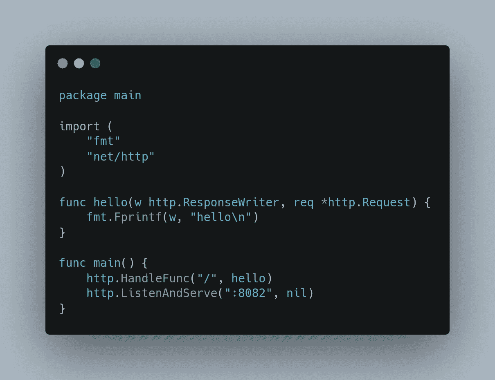
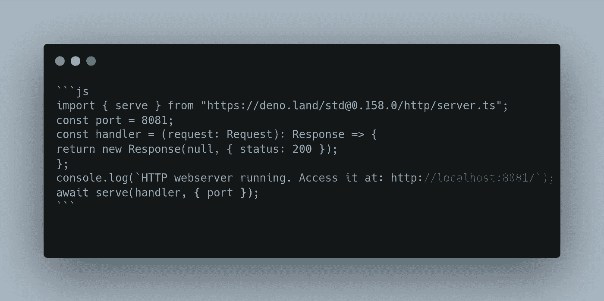

# Deno vs. Go

> 原文：<https://levelup.gitconnected.com/deno-vs-go-b483583c49ec>

一个简单的测试，看看哪一个是快速的 Go 或 Deno

我很少想到将两种技术正面交锋，但最近我很好奇看到了来自[https://bun.sh/](https://bun.sh/)的对比图，将它与 node 和 deno 进行了比较，并想尝试一下我目前正在使用的 deno 和 go，但不是为了评估和选择我工作的获胜者，而是为了满足我的好奇心。把这些结果贴在这里，如果你想做的话，这是我实验的总结

**####目标:我只想得到一个指标“哪个服务于每秒最高数量的请求”**

**#### 1。戈朗:**

这段代码直接从[https://gobyexample.com/http-servers](https://gobyexample.com/http-servers)的例子中摘录。最好的解释是这段代码在这个网站上做了什么，但是本质上我们使用 http 注册了我们的处理程序“/”。HandleFunc 便捷功能。它在 net/http 包中设置默认路由器，并接受一个函数作为参数。然后，我们使用端口 8081 调用 ListenAndServe 函数

**#### 2。Deno**

这段代码也没什么特别的，只是一个简单的例子，摘自 Deno 的官方网站[https://deno.land/manual@v1.26.0/examples/http_server](https://deno.land/manual@v1.26.0/examples/http_server)本质上也是如此，所有这些都是在“/”上的 8081 端口上启动 http 服务器，返回 200 ok。

为了测试这些 API，我使用了由贾纳·多安开发的名为 hey 的工具。这是一个简单的工具，可以对一个端点进行压力测试，并产生许多方面的结果详细信息。它给出了每秒的请求数，这是我们这个实验的目标。

**####考虑的标准:**

1.要运行的请求数:100/10000

2.同时运行的工人数量:50/500

3.时长:30 秒

从图中可以清楚地看出，在这两种情况下，go 程序在每秒处理多个请求的速度上至少比 Deno 快 4-5 倍。虽然此示例不是真实的使用案例，其中会有更多 CPU 和 IO 密集型需求，因此这些结果只是指示性的，而不是真正的同类比较。最后但并非最不重要的是，这里是机器规格下，测试运行

学分:

1.德诺图像:[https://github.com/heymicodes](https://github.com/heymicodes)

2.去图像:[https://github.com/egonelbre/gophers](https://github.com/egonelbre/gophers)

3.Go 代码片段:[https://gobyexample.com/http-servers](https://gobyexample.com/http-servers)

4.Deno 代码片段:【https://deno.land/manual@v1.26.0/examples/http_server 

5.嘿工具:【https://github.com/rakyll/hey】T4

最后但同样重要的是，这里是我运行这个测试的机器规格

这篇文章并不是以任何方式批评这两种语言作者的工作。许多**对 Go 和 Deno 语言开发团队都尊重**

# 分级编码

感谢您成为我们社区的一员！在你离开之前:

*   👏为故事鼓掌，跟着作者走👉
*   📰查看[升级编码出版物](https://levelup.gitconnected.com/?utm_source=pub&utm_medium=post)中的更多内容
*   🔔关注我们:[Twitter](https://twitter.com/gitconnected)|[LinkedIn](https://www.linkedin.com/company/gitconnected)|[时事通讯](https://newsletter.levelup.dev)

🚀👉 [**将像你这样的开发人员安置在顶级创业公司和科技公司**](https://jobs.levelup.dev/talent/welcome?referral=true)