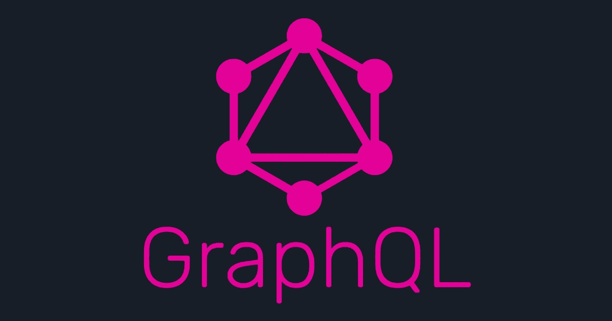
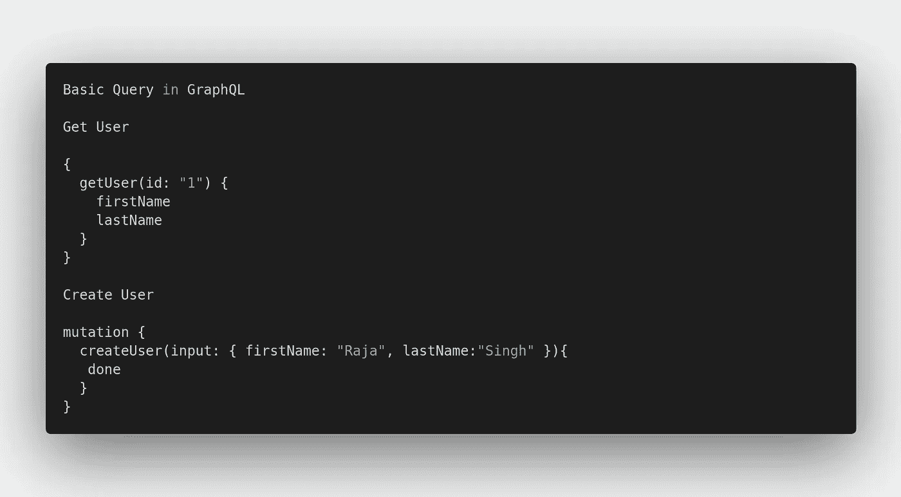
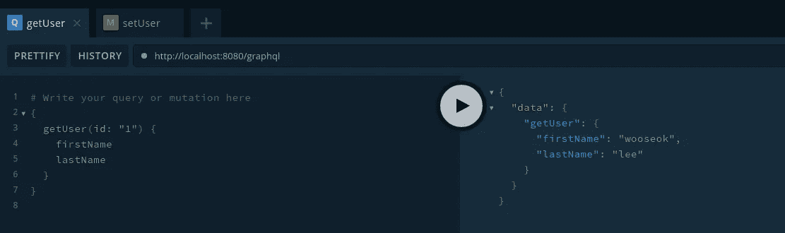
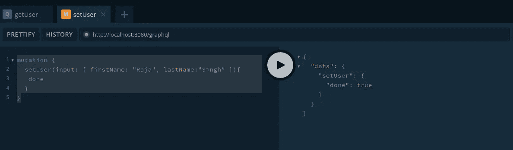
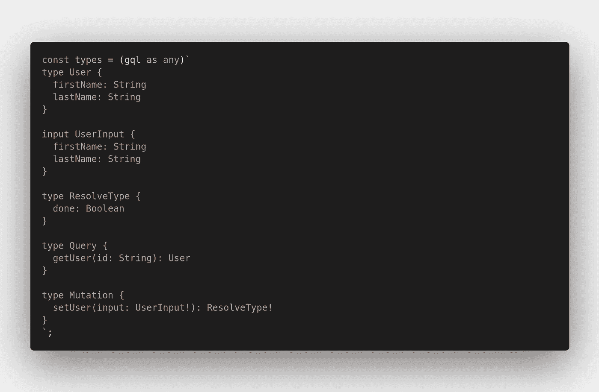

# 带 GraphQL 的 Deno

> 原文：<https://levelup.gitconnected.com/deno-with-graphql-e1f192259984>

# **什么是 GraphQL？**

GraphQL 是一种查询语言**，旨在通过提供直观灵活的语法**来描述客户的数据需求，从而构建客户应用。

# 与 REST API 和 GraphQL 进行比较

让我们用一家餐馆来比较一下。在这里，我将把 REST API 比作自助餐厅。在 GraphQL 中，我会将它与一家由服务员服务的餐馆进行比较。

**REST API**

在一家自助餐厅，你从桌边站起来，走到每一张桌子前，选择甜点、水果、蔬菜之类的东西。

**图表 QL**

但是在有服务员服务的餐馆里，我坐在桌子上，要了炒饭和比萨饼。服务员为你服务。

它比 REST APIs 更灵活，因为它允许前端客户机请求客户机需要的数据格式。另一方面，REST APIs 通常发送回固定的数据格式，这种格式通常包含客户机不需要的冗余数据。

**在 REST APIs 中，我们使用多个端点，如下图**

1.  帖子/用户
2.  GET /user/:id
3.  获取/用户

**但是在 GraphQL 中，我们只使用了一个端点**

1.  POST /graphql

# 问题

GraphQL 查询用于读取或获取值。GraphQL 查询有助于减少数据的过度提取。与 Restful API 不同，GraphQL 允许用户限制应该从服务器获取的字段。

**查询充当 GraphQL 中的 GET 方法**

# **突变**

GraphQL 变异用于修改服务器端数据。它可用于插入、更新或删除数据。突变被定义为模式的一部分。

**变异作为 GraphQL 上的 POST / PUT / DELETE 方法**

# **模式和类型**

GraphQL 请求是关于在对象上选择字段的。GraphQL 模式为客户机-服务器通信提供了一个清晰的契约。

下面是使用 Deno 的简单 GraphQL 演示

谢谢大家！🖤