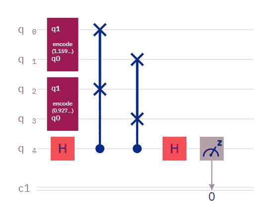
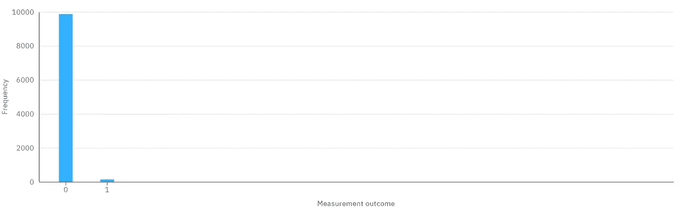
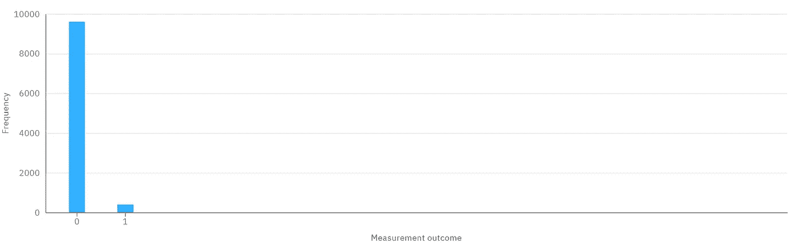
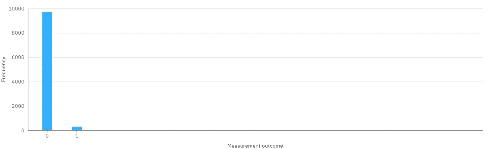
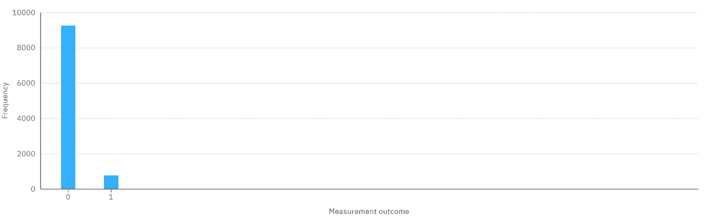
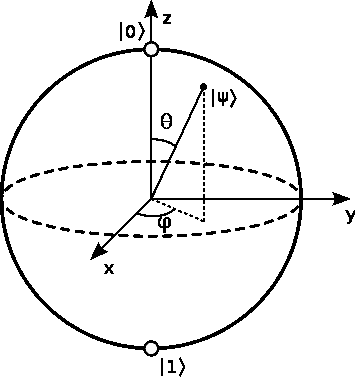

# 密集振幅编码

> 原文：<https://levelup.gitconnected.com/dense-amplitude-encoding-92453ad37ff0>

测试密集幅度编码的电路

# 又名实用振幅编码

我的“ [784 维量子 MNIST](https://towardsdatascience.com/784-dimensional-quantum-mnist-f0adcf1a938c) ”实验进行得如此之慢，以至于结果是不确定的。对于 IBM Quantum 模拟器，我几乎没有耐心每次对比运行 10 个镜头，可能需要数百万个镜头。因此，我的后续“[振幅的量子分类](https://bsiegelwax.medium.com/quantum-classification-of-amplitudes-e0a3c596bc45)”实验证明了[量子分类](https://medium.com/swlh/quantum-classification-cecbc7831be)实际上确实与[振幅编码](/amplitude-encoding-dd89dc84170d)一起工作，然而振幅变得如此之小，以至于我们添加量子位时它们变得几乎无法区分。例如，一个 10 量子位的 MNIST 实现有 1024 个振幅，它们的平方和必须是 1。这些数字非常小。

那么，我们如何增加可区分性呢？

从头开始构建。

为什么？因为很有见地。调用 Qiskit 库简单得可笑，但是您完全不受内部工作方式的影响。你需要打开它，看看引擎盖下面。

也就是说，我在这个实验中只使用了 5 个量子位，因为从头开始构建是如此乏味。对于 5 个量子位，我在比较两个 2 个量子位的状态。如果我比较两个 3 量子位的状态，我已经成长为一个 9 量子位的电路，因为需要 2 个安西拉量子位。你可以重置并重新使用一个 ancilla 量子位，将总量子位数降低到 8，但这并不能简化任何事情。

## 振幅编码

与分类 0 的比较

比较随机测试数据和随机分类 0 数据，我以 9865:135 的比例测得 0:1。

与分类 1 的比较

将相同的随机测试数据与随机分类 1 数据进行比较，我以 9605:395 的比例测得 0:1。

## 解释

那是什么意思？当两个量子态完全相同时，交换测试(也称为距离测量，也称为核方法，也称为内积)以 100%的概率测量 0，当两个量子态最大程度地相反时，以 50%的概率测量 0。距离较近的状态测量 0 的频率更高，距离较远的状态测量 0 的频率较低。因此，例如，两个靠近的州可能以 90–95%的概率测量为 0，而两个远离的州可能以 55–60%的概率测量为 0。这意味着测得的随机测试数据更接近随机分类 0 数据，而不是随机分类 1 数据，因此，分类 0 是测试数据的可能分类。

## 问题是

不幸的是，结果非常接近。你几乎看不到直方图中的结果。

那么，我们该如何改进呢？如果我们往引擎盖下看，会看到什么？

## 在后台

嗯，我们通常会看到围绕 y 轴的旋转。这是有道理的，因为如果你围绕 y 轴旋转一个量子位，你会影响它测量 0 或 1 的概率。对两个量子位元这样做，就会影响测量 00、01、10 或 11 的机率。概率是多少？振幅平方。我们将数据编码成这些振幅。

但是，互换测试并不是在一个基础上进行的。这在任何情况下都行得通。事实上，量子傅里叶变换(QFT)工作在傅里叶基，又名哈达玛基，又名 x 基，又名不要让我在所有这些同义词的基础上开始。尽管有 z 轴旋转而不是 y 轴旋转，简单地在 x 轴上测量，结果是一样的。

那么，如果我们用不止一种方式对数据进行编码，会发生什么呢？

## 密集振幅编码

与具有密集振幅编码的分类 0 的比较

将相同的随机测试数据与相同但密集编码的随机分类 0 数据进行比较，我测得 0:1 的比率为 9718:282。

与具有密集振幅编码的分类 1 的比较

将相同的随机测试数据与相同但密集编码的随机分类 1 数据进行比较，我测得 0:1 的比率为 9244:756。

## 新结果

所以，我们在这里看到了两件事。首先，测试数据稍微偏离分类 0。第二，测试数据被拉得离分类 1 更远。尽管我使用的随机数据最终都聚集在一起，但我们可以看到分类之间有更多的分离，并且我们可以更有信心地区分测试数据的可能分类。

## 一个解决方案

https://commons.wikimedia.org/wiki/File:Bloch_sphere.svg

有什么不同？我把单轴旋转换成了多轴 U 和 CU3 门。在这个特殊的实验中，我让θ和φ旋转相同的角度。因此，这两个状态不仅仅在 z 基上不同，它们在 x 基上也有类似的不同，从而导致了整体上稍大的差异。由于测试数据和分类 1 数据之间已经有了更大的差异，这种差异在两个碱基中的增长比测试数据和分类 0 数据之间的差异在两个碱基中的增长更大。

## 密度

或者，我们可以取八个维度的数据，通过映射 z 基中的四个特征和 x 基中的其他四个特征，将它们映射到仅仅两个量子位(而不是三个)。这会如何影响可分辨性？它们在两个而不是一个碱基上仍然是不同的，所以它们有更多的不同空间。

而且，这其实也是这篇文章标题的由来。我们可以将 8 个特征映射到 2 个量子位，16 个特征映射到 3 个量子位，32 个特征映射到 4 个量子位，等等。这很重要，尤其是考虑到幅度编码已经被推崇为 4:2、8:3、16:4 等压缩方式。我们会加倍努力。

## 实际

幅度编码是 NISQ 时代节省量子比特的一种方式，而量子比特供不应求。我们中没有人有 784 个量子位来以每个量子位一个像素的比例映射一个 MNIST 数字，但我们都有 10 个模拟量子位，有些人甚至有 10 个真实量子位。使用密集振幅编码，我们甚至可以将其减少到 5。现在我们谈论的是 10 甚至 5 个量子位，我们可以使用内核方法对手写数字进行分类，并执行其他量子机器学习(QML)任务，如[聚类](/quantum-clustering-c498b089b88e)。

## 未来

一个有趣的实验将会比较振幅编码的 21 量子位量子 MNIST 实现和角度编码的 1569 量子位实现。将 1024 个振幅编码到 10 个量子位上和应用 784 个弗雷德金门(又名受控交换)哪个会更好？我们离找到答案还有很长的路要走，但是如果 IBM 的合作伙伴中没有人比我先找到答案，你最终会从我这里读到答案。