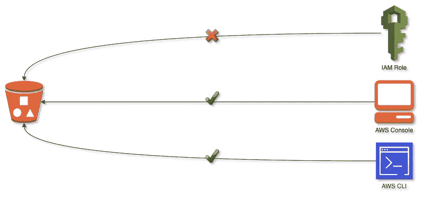

# “拒绝所有”AWS S3 存储桶策略

> 原文：<https://levelup.gitconnected.com/deny-all-aws-s3-bucket-policy-822696ed969f>

## 如何创建一个 AWS S3 存储桶策略来拒绝所有访问**而不被**锁定



# TL；灾难恢复—创建一个不太安全的安全策略

最佳实践是通过使用存储桶策略，明确授予已识别实体在您的亚马逊 S3 存储桶上执行操作的权限。您可以通过配置您的存储桶策略来拒绝所有实体的所有操作，除非另外列出。但是，在此过程中，您可能会意外地将自己锁定在自己的存储桶之外，这不仅会阻止对策略本身的修改，还会取消您使用 AWS CLI 或 AWS 控制台删除存储桶的权限。这可能特别令人恼火，因为 S3 存储桶名称是全局范围的，所以您将无法创建具有该名称的存储桶，除非它被删除，即使在另一个地区或帐户。

下面的策略包含一个声明，该声明将拒绝所有资源对存储桶`bucket-name`的所有操作，但允许您修改存储桶策略、清空存储桶、删除存储桶以及修改各种其他存储桶权限/管理设置的几个操作除外。

```
{
  "Version": "2012-10-17",
  "Statement": [
    {
      "Sid": "AllowDeletingAllowModifyBucket",
      "Effect": "Deny",
      "Principal": "*",
      "NotAction": [
        "s3:Delete*",
        "s3:GetBucket*",
        "s3:ListBucket*",
        "s3:PutBucket*"
      ],
      "Resource": [
        "arn:aws:s3:::bucket-name",
        "arn:aws:s3:::bucket-name/*"
      ]
    }
  ]
}
```

# 政策细分

[AWS S3 铲斗动作文档](https://docs.aws.amazon.com/AmazonS3/latest/dev/using-with-s3-actions.html)概述了每个动作所代表的内容。然而，文档并不是以用例为中心的。您在 AWS 控制台上考虑的操作(例如删除存储桶)可能需要在存储桶策略中允许多个操作。

## 不是行动

请注意上面的 bucket policy 语句中的双重否定——拒绝 not 操作的效果。换句话说，正如在 [AWS S3 文档](https://docs.aws.amazon.com/IAM/latest/UserGuide/reference_policies_elements_notaction.html)中所描述的，该策略明确允许某些行为，而拒绝所有其他行为。

## 修改存储桶策略

要在 AWS 控制台上修改 bucket 策略，您需要对 bucket 策略具有读写权限。这些行动各不相同。简单地授予自己对存储桶策略的写访问权限不会授予对 AWS 控制台的访问权限来加载策略以进行编辑，因此您的访问将被拒绝。如果您没有授予自己读取权限，可以使用 AWS CLI 来更新存储桶策略。

```
"s3:GetBucketPolicy",
"s3:PutBucketPolicy"
```

## **删除桶**

最好明确列出您希望在存储桶策略中允许的每个操作，而不是使用通配符。当您设计策略时，下面的操作非常简洁，非常适合实验，因为它允许您删除存储桶中的项目以及存储桶本身。

```
"s3:Delete*"
```

显而易见，您可以使用以下操作在 AWS 控制台上授予自己删除空的 S3 存储桶的能力。

```
"s3:DeleteBucket",
"s3:ListBucketVersions"
```

如果您的存储桶**不是空的**，您需要在 AWS 控制台上给自己三个额外的动作来清空存储桶，然后才能删除它。

```
"s3:DeleteBucket",
"s3:DeleteObject",
"s3:GetBucketVersioning",
"s3:ListBucket",
"s3:ListBucketVersions"
```

## 查看和修改其他铲斗设置

您可能希望 access 在 AWS 控制台上修改许多选项，包括版本、标记、存储桶策略、访问控制列表、指标、生命周期规则等。请随意根据您的用例对这些进行微调。

```
"s3:GetBucket*",
"s3:ListBucket*",
"s3:PutBucket*"
```

## 桶与桶内容

从资源的角度理解 S3 存储桶本身与存储桶的内容是不同的，这一点很重要。例如，存储桶策略或其他存储桶管理选项作用于存储桶本身，而像`s3:DeleteObject`这样的操作作用于存储桶中的项目。

```
"Resource": [
        "arn:aws:s3:::bucket-name",
        "arn:aws:s3:::bucket-name/*"
      ]
```

# 测试一下

有时，不清楚 AWS 控制台需要什么只读权限才能执行操作。令人欣慰的是，当你试图在控制台上执行一个被拒绝的操作时，会出现一个错误对话框，并指出它缺少权限。创造完美的政策需要反复试验。在 [AWS 免费层](https://aws.amazon.com/free)下，你可以免费创建一个 bucket，上传一个文本文件到里面，然后在几分钟内自己测试各种 bucket 策略。完成测试后，记得删除资源！

*披露声明:2020 奎因·维萨克。观点是作者个人的观点。使用或展示的所有商标和其他知识产权是其各自所有者的财产。*