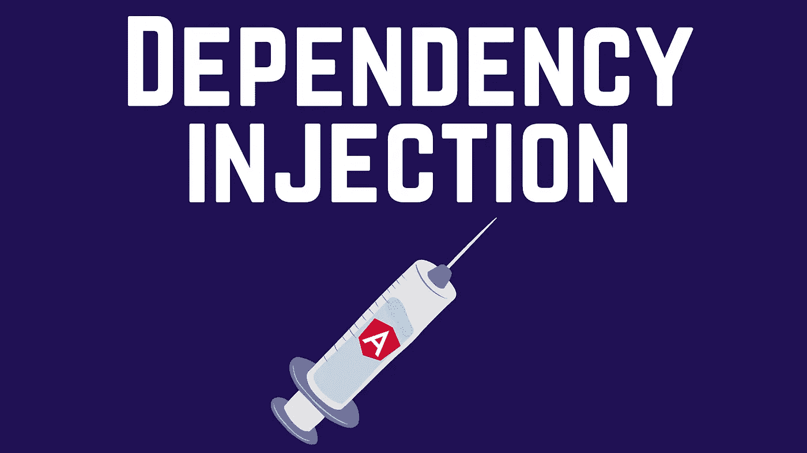

# 依赖注入(DI) —角度

> 原文：<https://levelup.gitconnected.com/dependency-injection-di-angular-21172d932f4f>

## 它是什么，它是如何工作的？+具体例子



组件的工作是呈现数据。因此，确保它有数据，并以正确的方式呈现数据，有时确保它将正确的数据分派给其子节点。

如果我们将获取和管理数据的任务委托给组件，那么这将是一件难以管理的事情。除此之外，如果我们在渲染组件时遇到问题，测试将会耗费更多的时间，因为我们要在同一个组件中进行数据获取和管理以及渲染。未来的任何改变都将更难实现和测试。这就是为什么这种类型的设计是一种可怕的做法。

Angular 的构建方式是通过使用服务和依赖注入来避免这个问题，因此:

*   您使得应用程序与其依赖项之间没有强耦合和链接。
*   分解依赖关系的实例化
*   提高可维护性，因为我们可以快速轻松地用另一个实现替换一个依赖项。
*   促进可测试性，因为您分别测试服务及其功能。因此，缺陷检测及其纠正是容易和快速的。

**在这篇文章中，我将介绍:**

*   **什么是服务？**
*   **什么是 DI，它是如何工作的？**
*   **DI 的一个具体例子**
*   **外卖**

# 什么是服务？

从技术上讲，服务是 Angular 中可用的 [*示意图*](https://angular.io/guide/schematics) 的一种类型。它可以通过使用 Angular CLI(命令行界面)生成。

从功能上来说，服务是针对特定主题的一组功能。我们可以想象一个导入 CSV 文件的服务，或者一个获取数据的服务，一个认证服务，一个服务日志等等。

Angular 中的服务是用`@Injectable`装饰器来装饰的。以下是 Angular 中空白服务的框架:

你可以复制并传递骨架，重命名它并添加你需要的功能。或者，使用 Angular CLI 生成服务，如下所示:

```
ng generate service [put-the-service-name-here]
```

# 什么是 DI，它是如何工作的？

依赖注入(DI)首先是一种设计模式。Angular 有自己的 DI 框架来提高应用程序的效率和模块化。DI 是每个 Angular 开发人员都应该了解和学习的 Angular 核心概念之一。

如果您一直在跟踪，您可能会记得在服务框架中看到过:

```
@[Injectable](https://angular.io/api/core/Injectable)({
  **providedIn**: 'root'
})
```

`@Injectable`装饰器是一个标记器。它将一个类标记为可以作为依赖项提供和注入。这意味着当注入类时，TypeScript **编译器将生成必要的元数据**来创建类的依赖项，而无需开发人员提供任何额外的代码。

我们还有元数据字段`**providedIn**: ‘root’``，它指向当前应用程序的根模块(`app.module.ts`)。它向模块的注入器注册服务。我们也可以将`**providedIn**`类型改为:

*   `root`:应用级注入器(最常用)。
*   `platform`:页面上所有应用程序共享的特殊单例平台注入器(通常用于大型应用程序之间的通信)。
*   `any`:在每个延迟加载的模块中提供一个唯一的实例，而所有急切加载的模块共享一个实例。

组件只需要在构造函数中实例化服务。之后，它可以在组件中的任何地方使用实例化的服务实例。这里有一个例子:

请注意，上面的代码与执行以下操作相同:

构造函数参数`articleService`的类型为`ArticleService`。角度注入器将检查该服务是否被识别。因为我们用`@Injectable` decorator 标记了 ArticleService，所以该服务是可用的并且可以识别的。因此，角度注入器会完成实例化。

现在，让我们看一个具体的例子。

# DI 的一个具体例子

下面是我的 ArticleComponent，它需要一个获取文章数据的服务:

*   首先，这里是文章服务:

*   其次，需要显示文章的组件需要在该组件中注入 ArticleService，以便我们可以使用组件中的服务功能:

注意，我还注入了 NgxLogger 服务(来自 ngx-logger)来记录错误。

*   第三，我们需要确保服务是在使用它的模块中提供的。如果组件有自己的模块，则为 app 模块或组件模块。

# 外卖:

*   服务的存在是为了解除数据管理或特定功能与组件的链接。
*   angular 中的服务和依赖注入旨在封装服务中的公共逻辑，并在我们需要多个组件中的逻辑时注入(一个完美的例子是 LoggerService，它几乎在任何地方都需要记录和调试)
*   这种设计模式允许你更好的可测试性和代码可维护性。
*   服务需要`@Injectable`装饰器，这样它就可以被注入到 app 模块或组件模块中。此后，该组件及其子组件也可以使用它。

亲爱的读者朋友们，感谢你们的支持和宝贵时间。我希望这对你有用和有帮助。

**关注我上** [**中**](https://medium.com/@famzil/) **、**[**Linkedin**](https://www.linkedin.com/in/fatima-amzil-9031ba95/)**、**[**Twitter**](https://twitter.com/FatimaAMZIL9)**了解更多文章。**

不久后见(ﾉ◕ヮ◕)ﾉ*:･ﾟ✧)

**FAM**