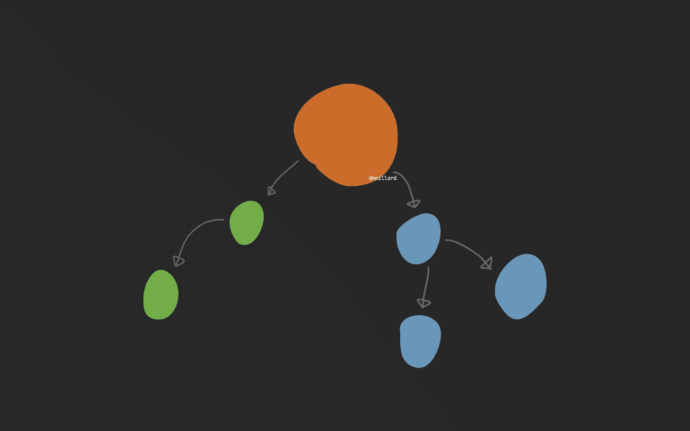
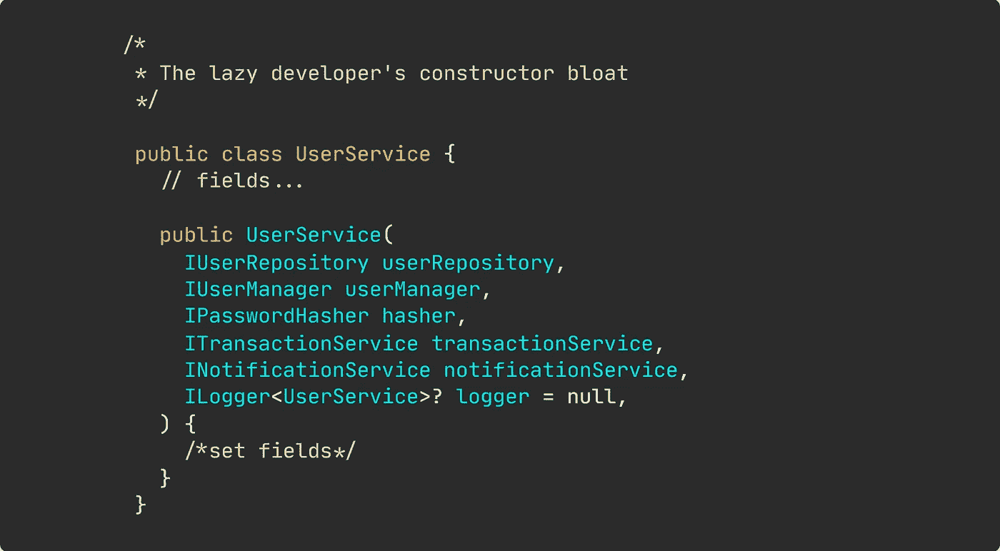

# 依赖注入让你变得极其懒惰

> 原文：<https://levelup.gitconnected.com/dependency-injection-has-made-developers-lazy-255afc5bedf7>

## 固执己见的观点

## 导致令人痛苦的构造函数膨胀和难以理解的对象图。

尼克拉斯·米勒德拍摄的图片

依赖注入很棒。真的是。但是，这也是地狱。

让一些 [IoC 容器](https://pasztor.at/blog/what-is-the-ioc-container/)解析我们所有的显式构造函数对象依赖关系的想法是惊人的，并且在开发人员社区中被强烈提倡。

而且，这是有意义的，因为它简化了设计时的开发。

方法本质上是这样的:创建一个类。让它采取一些依赖。无忧无虑地将它们注册到 IoC 容器中。永不回头。

我不打算详述 IoC、DIP、依赖注入和容器的细节。我相信你已经熟悉了所提供福利的广泛列表。

然而，有一个大问题。

> 依赖注入激励开发人员变得懒惰。就像，难以置信的懒。

突然间，见证[‘服务’类变成逻辑垃圾箱](https://medium.com/datadriveninvestor/the-true-meaning-of-service-and-manager-class-names-d09a08731fd9)变得很常见。服务类构造函数经常成为构造函数膨胀的牺牲品。现在，工程师的日常生活包括轻率地添加另一个显式的构造函数依赖。

常见构造函数膨胀的例子。尼克拉斯·米勒德的图片。

你通常需要传递六个、七个或更多的对象来调用一个服务类方法，这个服务类方法只需要这些依赖关系中的一个*就能正确执行。*

[与此相关，这里有一篇关于如何重构这种膨胀的文章。](https://medium.com/better-programming/refactoring-rules-of-thumb-for-beginners-to-become-experts-70161c3c4f20)

## 简直是地狱。

我认为许多开发人员完全忽视了这种实践是多么令人痛苦。现在，即使编写最简单的单元测试，也需要实例化或模仿几个对象。

> 依赖疲劳开始出现。

假设您有一个带有八个构造函数参数的类，并且您需要测试一个方法。编写单元测试现在非常麻烦，以至于您开始将空值作为构造函数参数传入，因为您知道在测试这一特定方法时，其他七个依赖项并不执行任何操作。

一旦你依赖于一个构造函数臃肿的类，乐趣就真正开始了。例如依赖于另一个服务类别的服务类别。你可能会说这是糟糕设计的结果。当然，它是。拙劣的设计是由于不加思索地注入依赖项而导致的。

另一方面，我会鼓励你停止使用服务类。逻辑垃圾箱。它们通常是结构不良的门面，没有真正的好处。相反，尝试将您的服务类分成多个专门的类，如本文所示:

 [## 用命令和处理程序替换 If-Else

### 如何轻松替换 if-else 语句？不，开关不是合适的替代品。

levelup.gitconnected.com](/replacing-if-else-with-commands-and-handlers-527e0abe2147) 

## 我是显式依赖、DI、IoC 以及所有这些好东西的忠实拥护者。

到现在，你可能已经开始往相反的方向想了。

我提倡反对“我只是要增加一个构造函数参数”的懒惰习惯。没别的了。

为了克服这种不好的习惯，您应该总是尝试评估测试一个类或方法有多困难。测试你的新方法需要多少努力？相对于实际使用的类，您需要模拟多少个？

添加构造函数参数不应该简单地是一个匆忙进行的随机行为。

## 离别词。

你喜欢你的类接受大量的构造函数参数吗？好吧，那就什么都不要改变。

从这篇文章中去掉任何你觉得有用的东西，忽略其余的。

# 让我们保持联系！

[点击这里](https://nmillard.medium.com/subscribe)订阅时事通讯，获取类似文章的通知，并查看 YouTube 新频道[*(@尼可拉斯·米勒德)*](https://www.youtube.com/channel/UCaUy83EAkVdXsZjF3xGSvMw)

*连接上* [*LinkedIn*](https://www.linkedin.com/in/nicklasmillard/)

# 好奇者的资源

*   Janos Pasztor 的[干净的代码:依赖关系](https://pasztor.at/blog/clean-code-dependencies/)
*   [战术设计模式。NET 创建对象](https://app.pluralsight.com/library/courses/tactical-design-patternsdot-net/table-of-contents)作者 Horvat Zoran

# 分级编码

感谢您成为我们社区的一员！ [**订阅我们的 YouTube 频道**](https://www.youtube.com/channel/UC3v9kBR_ab4UHXXdknz8Fbg?sub_confirmation=1) 或者加入 [**Skilled.dev 编码面试课程**](https://skilled.dev/) 。

 [## 编写面试问题+获得开发工作

### 掌握编码面试的过程

技术开发](https://skilled.dev)