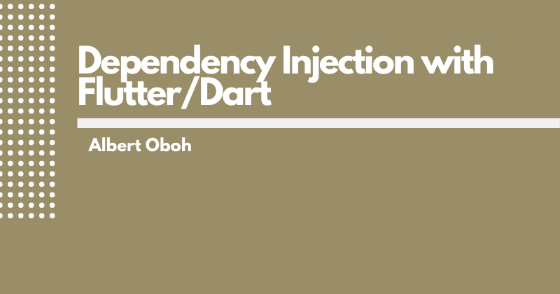

# Dart/Flutter 应用中的依赖注入

> 原文：<https://levelup.gitconnected.com/dependency-injection-in-dart-flutter-apps-3332f1a61041>



依赖注入是一种使一个对象的依赖关系通过另一个对象可用的方法，这些依赖关系通常被称为服务。

这些服务可以是包含不同功能的代码块，可以在项目的不同部分轻松重用。

依赖项是部分项目成功运行所需的功能。在许多情况下，您会导入文件并在其中使用类或方法，这样使用这些导入的类就依赖于它们。

在 dart 中，处理依赖注入的最基本方法是通过构造函数将服务传递给类。

```
class MyClass {

//MyClass is dependent on OtherClass
OtherClass service;

  MyClass(this.service)
}
```

这种方法初看起来可能并不坏(没什么问题)，但是在小部件树的深处传递值就很成问题了，而且在处理许多依赖项时，事情会变得很混乱。

# 颤振的依赖注入选择

我们可以在 flutter 应用中使用许多 DI 方法和包，我们将在本帖中了解一些:

*   继承的小部件—开箱即用。
*   IOC dart 包——一个易于使用的包[可从发布网站](https://pub.dev/packages/ioc#-readme-tab-)获得
*   获取它飞镖包—可以在 pub.dev 上的[这里](https://pub.dev/packages/get_it)找到

> *在本文中，示例将会很简单，目的是作为对 DI 的介绍。我将撰写其他详细的文章，展示如何在真实的应用程序中使用这些概念。*

# 继承的小部件

继承的小部件允许您轻松地沿着小部件树传递数据。显示了一个继承的小部件的示例:

```
import 'package:flutter/material.dart';

class InheritedHomeWidget extends InheritedWidget {
  InheritedHomeWidget({Key key, this.child}) : super(key: key, child: child);

  final Widget child;

  static InheritedHomeWidget of(BuildContext context) {
    return (context.inheritFromWidgetOfExactType(InheritedHomeWidget)
        as InheritedHomeWidget);
  }

  @override
  bool updateShouldNotify(InheritedHomeWidget oldWidget) {
    return true;
  }
}
```

这是一个自动生成的继承自 flutter VS 代码扩展的小部件，让我们看看代码包含了什么。

*   传入一个名为 child(可以取任何名字)的部件，这是放置子部件树的地方。
*   下一个代码块查找小部件树，找到最接近的`InheritedWidget`，并向该小部件注册 BuildContext，以便当小部件发生任何变化时，它可以重建树。
*   `updateShouldNotify()`返回一个 boolean 值，该值表明当 InheritedWidget 发生更改时，是否应重新构建子树小工具。

## 在小部件中使用

为了使你的依赖关系在这个窗口小部件树中可用，你可以通过继承的窗口小部件的构造函数来发送依赖关系，或者使用一个 getter，或者任何适合你的用例的方式，你仍然可以在树的深处使用它。

```
InheritedHomeWidget({Key key, this.child, this.homeText})
      : super(key: key, child: child);

final Widget child;
//add the new dependency
final String homeText;
```

如果您希望您的依赖关系沿着整个树向下传播，那么用您创建的继承的小部件来包装您的整个小部件树。在这种情况下，我将简单地向构造函数传递一个文本，这可能是一个服务的实例。

```
class FunApp extends StatelessWidget {
  @override
  Widget build(BuildContext context) {
    return InheritedHomeWidget(
      homeText: 'This is printed on the screen',
      child: MaterialApp(
        title: 'Inherited Widget',
        home: FunHomePage(),
      ),
    );
  }
}
```

然后，您可以通过在继承的小部件上调用`.of(context)`来使用该文本，如下所示:

```
class FunHomePage extends StatelessWidget {
  const FunHomePage({Key key}) : super(key: key);

  @override
  Widget build(BuildContext context) {
    var homeText = InheritedHomeWidget.of(context).homeText;
    return Container(
      color: Colors.white,
      child: Center(
        child: Text(homeText),
      ),
    );
  }
}
```

# 国际奥委会套餐

IOC 代表控制反转，它是一种模式，表明服务/依赖关系应该在一个单独的类中创建，并且是依赖关系注入背后的基本原则。

[这个包](https://pub.dev/packages/ioc#-readme-tab-)非常容易使用，它允许你将你的服务初始化为一个 [singleton](https://en.wikipedia.org/wiki/Singleton_pattern) 并且你可以将你的依赖绑定到任何你选择的数据类型。

要使用这个包，首先需要将它添加到 pubspec.yaml 文件中，如下所示:

```
dependencies:
  ioc: ^0.3.0
```

接下来，创建一个 dart 文件来绑定您的所有服务。我叫我的`ioc_locator.dart`，你想怎么叫都行。这个文件的内容是:

```
import 'package:ioc/ioc.dart';

void iocLocator() {
  Ioc().bind('service1', (ioc) => InfoService());
} 
```

*   在这里，我将类(service) `InfoService`绑定到一个字符串“service1 ”,它的作用有点像一个键，并且是动态的。`Ioc().bind(key, (ioc) => Service());`
*   `InfoService`是另一个非常简单的类，其中只有一个名为 **infoText** 的字符串。

现在，您希望在应用程序运行之前运行主文件中的`iocLocator()`函数，因此导入它并将其添加到您的`runApp()`函数之上，如下所示:

```
void main() {
  iocLocator();
  runApp(MyApp());
}
```

然后，您可以在小部件和文件中使用来自该服务的数据，我将尝试打印出 infoText 的值。

```
import 'package:flutter/material.dart';
import 'package:ioc/ioc.dart';

class IocView extends StatelessWidget {
  final infoService = Ioc().use('service1');

  @override
  Widget build(BuildContext context) {
    return Scaffold(
      body: Center(
        child: Text(infoService.infoText),
      ),
    );
  }
}
```

要查看 IoC 包的其他酷功能，请查看他们的[发布与开发页面](https://pub.dev/packages/ioc#-readme-tab-)。

# 得到它

[Get it](https://pub.dev/packages/get_it) 是在 flutter 应用中处理 DI 比较流行的方法之一。您还可以将您的依赖项注册为单例、惰性单例或工厂。

*   单例将总是返回该服务的同一个实例。
*   惰性单例将在第一个实例被调用时创建对象。当您有一个需要时间才能启动的服务，并且应该只在需要时才启动时，这很有用。
*   工厂将在任何时候调用服务时返回服务的新实例。

## 使用

首先，将 get_it 添加到您的 pubspec.yaml 文件中:

```
get_it: ^3.1.0
```

现在，您可以创建一个文件来注册您的所有对象，我将调用我的 service_locator.dart，并在其中放置一个名为`getServices()`的函数。

```
import 'package:get_it/get_it.dart';

GetIt getIt = GetIt.instance;

void getServices() {
  getIt.registerFactory(() => InfoService());
  getIt.registerSingleton(() => MyService());
  getIt.registerLazySingleton(() => OtherService());
}
```

从版本 2.0.0 开始，get_it 被改造成了一个 singleton，你现在可以用`GetIt.instance`或`GetIt.I`得到相同的 get_it 实例。

现在，在运行应用程序之前，将`getServices()`函数放在 main.dart 文件中:

```
void main() {
  setupLocator();
  runApp(MyApp());
}
```

要在小部件中使用注册的对象，只需调用`locator.get<Type>()`或`locator<Type>()`，这里的类型，在我们的例子中，是 InfoService。

```
class InfoView extends StatelessWidget {
  final infoService = getIt.get<InfoService>();

  @override
  Widget build(BuildContext context) {
    return Scaffold(
      body: Center(
        child: Text(infoService.infoText),
      ),
    );
  }
}
```

# 为什么我应该使用依赖注入？

*   DI 有助于更好的开发体验。
*   给你的项目增加一点结构。
*   非常适合在编写测试时模仿对象。

本文到此为止！你可以通过[推特](https://twitter.com/txe_bert)联系我，查看我的其他文章。

*原载于*[](https://berthacks.com/dependency-injection-in-dartflutter-apps-ck71x93uu06fqd9s1zuosczgn)**。**