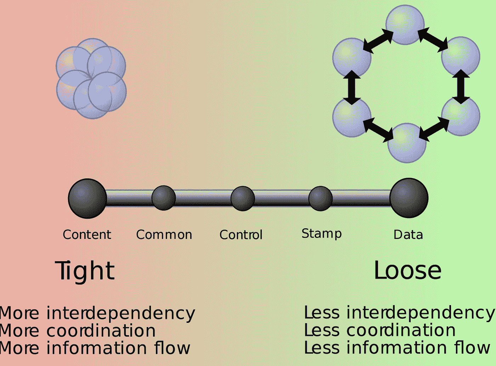
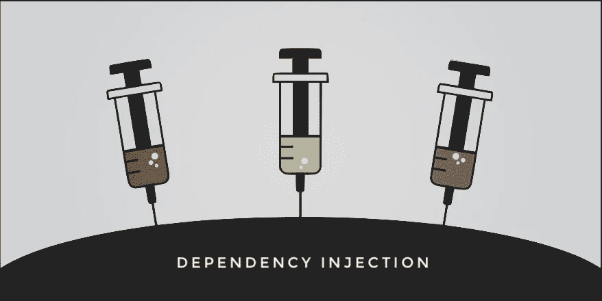
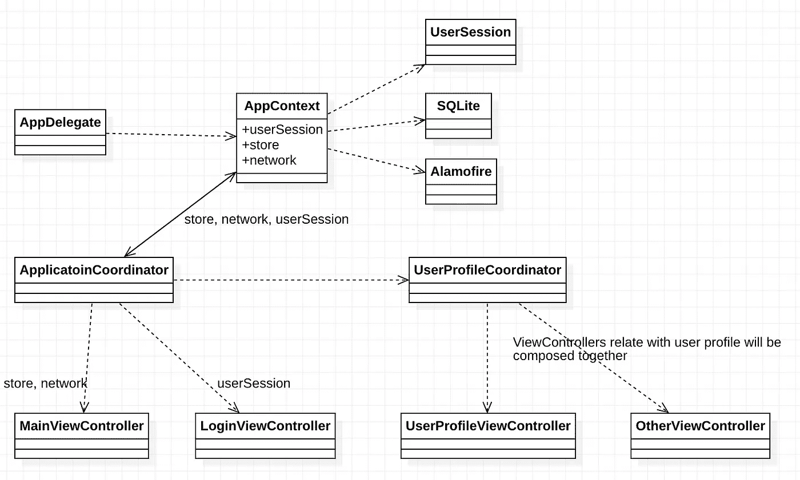
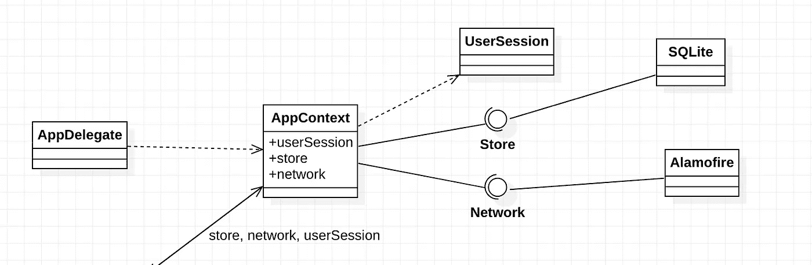
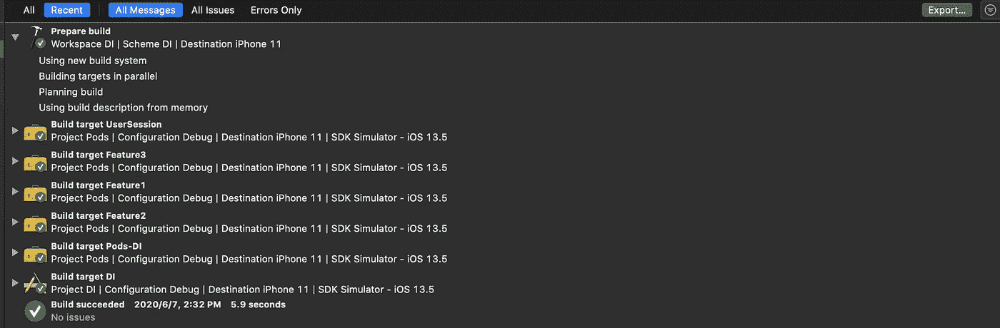
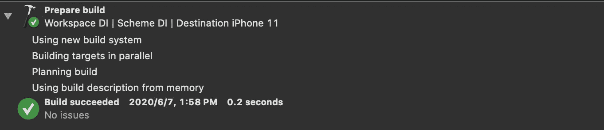
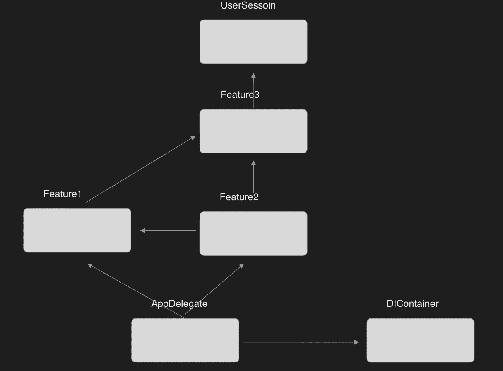
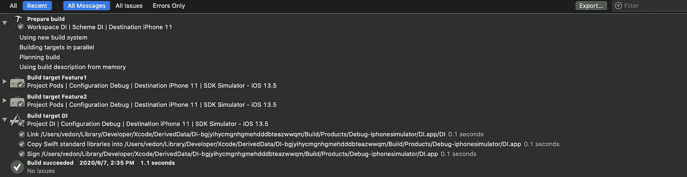
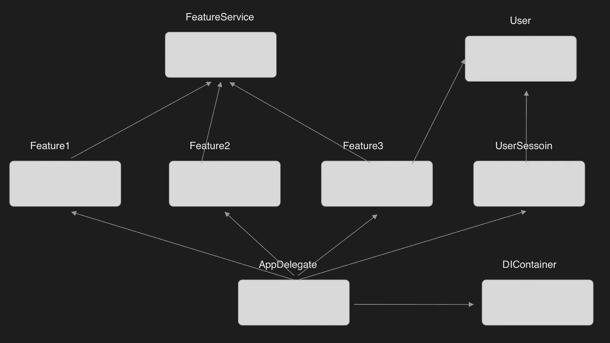
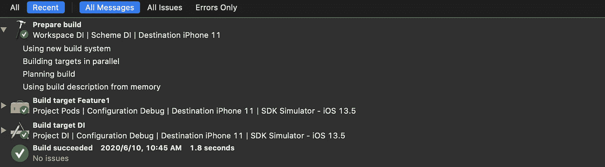

# Swift 中的依赖注入

> 原文：<https://levelup.gitconnected.com/dependency-injection-in-swift-bc16d66b038b>

我将谈谈我在日常工作中使用 DI 的方式。在我继续之前:我应该强调，如果我把事情搞砸了，那是我的错，不是我的团队。

# 摘要

```
**1\. Why dependency injection
**  1.1\. Reduce software complexity**2\. Dependency injection**
  2.1\. Type of injection
  2.2\. The way i use Dependency Injection
  2.3\. Reduce compilation time**3\. TL;DR**
```

# 为什么要依赖注入？


来源:Adobe Stock

降低软件复杂性的最重要的技术之一是设计系统，这样开发者只需要面对整体复杂性的一小部分，也就是**模块化设计**。

在模块化设计中，软件系统被分解成相对独立的模块集合。从系统的角度来看，这些模块通过调用彼此的函数或方法来协同工作。这将是模块之间的依赖关系。如果你不能很好地处理依赖关系，你将会送命。例如，一个方法的参数在该方法和任何调用该方法的代码之间创建一个依赖关系。如果参数发生变化，则必须修改该方法的所有调用，以符合新的签名。模块之间的交互称为[耦合](https://en.wikipedia.org/wiki/Coupling_(computer_programming))。

> 在[软件工程中](https://en.wikipedia.org/wiki/Software_engineering)、**耦合**是软件模块之间相互依赖的程度；对两个例程或模块连接紧密程度的一种度量；[【1】](https://en.wikipedia.org/wiki/Coupling_(computer_programming)#cite_note-ISO_24765-1)模块间关系的强弱。[【2】](https://en.wikipedia.org/wiki/Coupling_(computer_programming)#cite_note-ISOIECTR19759_2005-2)
> 
> 耦合通常与[内聚](https://en.wikipedia.org/wiki/Cohesion_(computer_science))形成对比。[低耦合](https://en.wikipedia.org/wiki/Loose_coupling)通常与高内聚相关，反之亦然。低耦合通常是结构良好的[计算机系统](https://en.wikipedia.org/wiki/Computer_system)和良好设计的标志，当与高内聚结合时，支持高可读性和可维护性的一般目标。-来自维基



[联轴器(计算机编程)](https://en.wikipedia.org/wiki/Coupling_(computer_programming))

出色的模块化设计，这意味着模块的不同组件可以替换为替代实施，而不会影响其他组件。这需要开发人员使用适当的抽象(抽象是一个实体的简化视图，它省略了不重要的细节，使我们更容易思考和操作复杂的事情)来使模块变得松散耦合。依赖注入的主要目标是松耦合。

**结论:**

依赖注入使模块变得松散耦合，这有助于降低整体软件的复杂性。

# 依赖注入



```
*“Dependency injection is really just passing in an instance variable.” -* [*James Shore*](https://www.jamesshore.com/Blog/Dependency-Injection-Demystified.html)
```

# **注射类型**

*   构造函数注入
*   资产注入
*   方法注入
*   周围环境

## **构造函数注入**

**优点:**

*   明确依赖关系
*   信息隐蔽

**缺点:**

*   对象初始值设定项中的样板代码
*   可能传递参数太多

在类方法中提供默认值在 swift 中总是一个方便的特性，但是要小心以防 UserSession 不是您想要的实例。特别是，UserSession 有一些前提条件。

## **物业注入**

**优点:**

*   干净的初始化器接口，将初始化与注入分开
*   “登机容易”

**缺点:**

*   信息泄漏，暴露内部属性，初始化不完整
*   使用解包选项整理代码
*   不能将属性定义为不可变的
*   很难定义默认值

## **方法注射**

With method 注入依赖项作为参数传递给 ViewController 的 login 方法。

赞成者:

*   自由组合注入方法
*   不需要保留对注入方法的引用

**缺点:**

*   信息泄漏，将内部逻辑暴露给使用它的类

## **周围环境**

使用静态方法或静态属性实现环境上下文。iOS 上常见的用法是 [Singleton](https://medium.com/@lovelydog/singleton-is-good-pathological-liars-6f0ff81e6f96) ，它让你的 API 看起来非常简单并且“没有依赖性”。至于我，我只在不影响代码执行的 logger 上使用 singleton，doe 没有任何全局状态。

**优点:**

*   保持你的 API 简洁明了

**缺点:**

*   全球状态
*   隐藏依赖关系
*   让你的单元测试更难

# 我使用依赖注入的方式

我使用构造函数注入作为我进行依赖注入的首选方式。下图是我在自己的应用中使用的主要概念。如果你有什么建议，请告诉我。



**AppContext** 保存了应用运行时的依赖关系，在海量 AppContext 的情况下，可以将 AppContext 分解成子 Context，并组合成 AppContext。

**协调器**处理 ViewController 的导航、逻辑流(A/B 测试)，甚至用户数据修改。它包含了在 ViewControllers 中使用的所有依赖项，并将它们传递给对象初始化器。

**视图控制器**将被放置在同一层。这一点很简单，但非常重要，直到你发现你有很多传递参数。

在示例中，AppContext 依赖于 SQLite 和 Alamofire 实现的 API，我的代码与具体实现紧密耦合。在面向对象设计中，这类问题可以用[依赖倒置原则](https://en.wikipedia.org/wiki/Dependency_inversion_principle)来解决。遵循 DIP 指令以获得松散耦合的代码。

> 高级代码不应该依赖低级代码，它们都应该依赖抽象，而抽象不应该依赖细节。



现在，把 AppContext 作为高层代码，SQLite 作为底层代码。它们都依赖于同一个抽象，存储。(协议是我用来建模抽象的方式，但这并不意味着协议是抽象，**好的抽象是至关重要的**。关于抽象，也许下一篇文章。)DIP 增强了可替换性，您可以用 Leveldb 替换 Store 实现，而无需修改高层代码。DIP 也会增加编译时间。让我们看看这是怎么发生的。

你可以下载[演示](https://github.com/vedon/DI)来看看发生了什么。按下 CMB + B，然后按下 CMB + 9(报告导航器)，确保选择最近选项卡。每次清理构建后编译时间为 **5.9 秒(**指清理整个缓存 **)**



再次构建，编译时间只有: **0.2 秒**因为使用了来自内存的构建描述。



下面的 UML 类图是演示的架构。



以 Feature1 为例:在 Feature1.swift 上添加新结构，按 CMD + B，CMD + 9



Feature2 和 App 被重新编译(库需要重新编译以符合 [ABI](https://en.wikipedia.org/wiki/Application_binary_interface) 的变化)，构建时间增加到 1.1 秒。虽然这对于演示应用程序来说不是太大的问题，但是大的应用程序使用这种方法会遭受巨大的性能损失，很容易达到超过 20 分钟的构建时间。最坏的情况是修改用户会话导致整个应用程序重新编译。

减少编译时间

为了获得尽可能好的构建时间，我们应该使依赖图尽可能水平。因此，我添加了三个组件:FeatureService、User 和 DIContainer。



**功能服务**包含功能 1、功能 2、功能 3 提供的服务。

**用户**包含 UserSession 提供的服务或任何与用户相关的东西。

**DIContainer** 用相应的实现注册每个服务。功能 1 用于功能 1 服务，功能 3 用于功能 3 服务。注册后，有了这个容器，你就可以随心所欲地得到任何地方的服务。

以功能 2 为例。功能 2 的依赖项是功能 2。包含 Feature1Service 和 Feature3Service 实现的依赖项。

要获得 Feature2 的实例，**只需 c** 所有的 Feature2 init 方法，并传递由 AnyInitializer 创建的依赖关系以及 Feature2 依赖关系描述和容器。

再次修改 Feature1(例如注释掉 PrivateModel)，CMD+B，CMD+9，我们只能看到 App 和 Feature1 被重新编译，没有 Feature2。我假设您的应用程序的构建性能将通过这种方法获得巨大的性能。



为了便于阅读，我简化了示例，以便进行概念性演示，从而简单地理解事物，并对如何使用 DIContainer、Swift 中的 Type Erasure 等技术有所了解。[演示代码](https://github.com/vedon/DI/tree/DI)在这里。任何建议都会有帮助。

# TL；速度三角形定位法(dead reckoning)

参考:

[依赖注入](https://www.objc.io/issues/15-testing/dependency-injection/#ambient-context-2)

[使用接口目标减少构建时间](https://medium.com/better-programming/reducing-ios-build-times-by-using-interface-targets-f5c3fd15fa29)

[https://stack overflow . com/questions/2171177/what-a-a-application-binary-interface-ABI](https://stackoverflow.com/questions/2171177/what-is-an-application-binary-interface-abi)