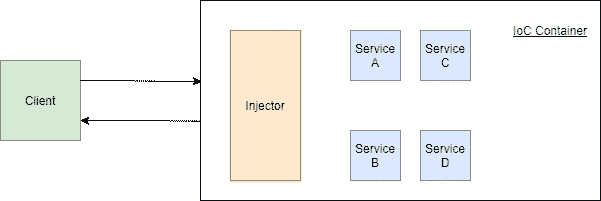

# TypeScript 中的依赖注入

> 原文：<https://levelup.gitconnected.com/dependency-injection-in-typescript-2f66912d143c>

## 如何使用 Typescript 在 Node.js 中进行依赖注入

Anthony DELANOIX 在 [Unsplash](https://unsplash.com?utm_source=medium&utm_medium=referral) 上拍摄的照片

# 介绍

每个软件程序都有基本的构建模块。在面向对象编程中，我们使用类来构建复杂的体系结构。像构建一个结构一样，我们在我们的模块之间建立被称为**依赖**的关系。其他类通过提供代表我们做复杂操作来支持我们的类。

一个类可能有引用其他类的字段。那么，我们要问这些问题:这些参照物是如何构建的？是**我们**组装这些对象，还是**其他**负责实例化？如果实例化一个类**太复杂**，并且我们想要避免意大利面条式的代码，该怎么办？所有这些问题构成了**依赖注入原理**试图解决的问题集。

在我们开始举例之前，我们必须理解一些关于依赖注入的概念。依赖注入原则告诉我们，一个类应该**接收**它的依赖，而不是实例化它们。委托对象初始化可以通过处理复杂的操作来减轻设计类的压力。您从代码中去掉了复杂的部分，并通过其他方式重新引入了依赖关系。你怎么做到这个*“带走”**“重新引入它们”*就是管理依赖的问题。您可以手动处理所有的初始化和注入，但是这会导致复杂的系统，这是我们试图避免的。相反，你可以把你的建设责任移交给一个国际奥委会的集装箱。

**控制反转**是反转整个程序流，让一个容器管理所有的程序依赖。您创建了一个容器，这个容器负责构造每个对象。当一个类需要一个对象来实例化时，IoC 容器提供所需的依赖。

IoC **只是**表达了一种方法论，并不是具体的实现。为了应用依赖注入原则，你需要一个 **DI 框架**。几个例子是:

*   **弹簧**和**匕首**为**爪**
*   **刀柄**为**科特林**
*   **统一**为 **C#**
*   **将**、 **Nest.js** 、 **TypeDI** 转化为 **TypeScript**

# 概述和角色

依赖注入概述

在依赖注入原理中，我们需要了解**四个**不同类型的**角色**:

*   **客户端**
*   **服务**
*   **界面**
*   **喷油器**

服务是我们暴露出来的东西。这些类由 IoC 容器实例化和使用。一个**客户端**通过 IoC 容器使用这些服务。客户不应该被细节所困扰，所以**接口**确保客户和服务和谐相处。一个客户端询问依赖关系，一个**注入器**提供实例化的服务。

# 依赖注入的类型

当我们谈到如何设法将依赖关系注入到一个类中时，我们可以通过三种不同的方式来实现:

*   我们可以通过**属性**(字段)提供依赖关系。在类上定义一个属性，然后将一个具体的对象注入到该属性中，这称为属性注入。通过向外部公开一个属性，你**违反了面向对象的**封装**原则；因此，你可能要避免这种类型的注射。**
*   我们可以通过**方法**提供依赖关系。对象**的一个**状态**应该是私有的**，当一个局外人想要改变那个状态时，它应该使用该类的 **getter/setter 方法**。所以当你使用 setter 方法初始化类中的私有字段时，你使用了**方法注入**。
*   我们可以通过一个**构造器**来提供依赖关系。由于构造函数方法的基本性质，它们与对象构造高度交织在一起。我们通常**喜欢**通过构造函数进行注入**，因为我们的目的和构造函数方法相似。**

# 使用 TypeDI

一旦我们理解了底层的原则，我们使用什么样的框架或库就没什么区别了。对于本文，我选择了 TypeScript 语言和 TypeDI 库来演示基本概念。

初始化 Yarn 和添加 TypeScript 需要一点努力。因为我不想用没有额外信息的众所周知的项目配置来烦你，所以我将给出开始的代码并简单地浏览一下。你可以从[这个 GitHub 库](https://github.com/mertturkmenoglu/typescript-dependency-injection)查看和下载代码。

任何 TypeScript 项目都可以作为演示 DI 的例子，但是我为本文选择了 Node/Express 应用程序。我假设使用 TypeScript 的人要么直接使用 Node/Express 服务器，要么对它们有所了解。

当您检查`package.json`时，您可以看到几个依赖项。让我简单介绍一下:

*   **express** : Express 是一个用于编写 Node.js RESTful 服务器的流行框架。
*   **reflect-metadata** :元数据反射 API 的 Polyfill 库。这个库允许其他库通过 decorators 使用元数据。
*   **ts-node:** Node.js 不能运行 TypeScript 文件。在运行代码之前，需要将 TypeScript 编译成 JavaScript。ts-node 为您处理这个过程。
*   **typedi:** TypeDI 是 TypeScript 的依赖注入库。我们很快就会看到用例。
*   **typescript:** 我们正在为这个项目使用 typescript，所以我们需要将它添加为一个依赖项。
*   **@ types/Express:**Express 库的类型定义。
*   **@ types/node**:node . js 的类型定义
*   **ts-node-dev:** 这个库允许您运行 TypeScript 文件并观察某些文件的变化。

您需要注意几个重要的编译器选项。如果你看一下***ts config . JSON***，你可以看到编译过程的选项:

*   我们指定类型为 ***反射-元数据*** 和 ***节点*** 。
*   我们必须将***emitedecoratormeta data***和***experimental decorators***标志设置为真。

我们所有的源代码都在 ***src*** 文件夹里。 ***src/index.ts*** 是我们的切入点。该文件包含服务器的所有引导步骤:

这段代码是一个只有一个端点的最小 Express 服务器。当你向**/用户**路由发送一个 **GET** 请求时，它会返回一个用户列表。**主**函数的关键部分是“ *Container.ge* t”方法。请注意，我们没有使用 new 关键字或实例化一个对象。我们只是请求 IoC 容器返回一个 UserController 实例。然后我们绑定路由和控制器方法。

我们的应用程序是一个虚拟的 RESTful 服务器，但是我不希望它完全没有意义。我添加了四个不同的文件夹来代表一个完整后端的基础部分。这些是**控制器**、**模型**、**存储库**和**服务**。现在，让我们逐一查看:

*   **控制器**文件夹包含我们的**剩余控制器**。他们负责协调用户和服务之间的通信。它们接收请求并返回响应。
*   **Models** 文件夹包含我们的**数据库实体**。我们没有数据库连接，也不需要，但是建立一个合适的项目结构对学习有很大的影响。让我们假设它们是真实的数据库实体，并继续我们的旅程。
*   **服务**文件夹包含我们的**服务**。它们负责通过访问不同的存储库来满足 REST 控制器的需求。
*   **Repositories** 文件夹包含我们的**数据库访问类**。我们使用数据映射器模式来执行数据库操作。在这个模式中，我们使用存储库类来访问数据库并进行操作。

我们不会在一节课上做所有的事情。请求和响应之间有许多层。这叫做**分层架构**。通过在类之间进行工作分担，我们使得依赖注入变得更加容易。

UserController 只有一个方法。“getAllUsers”方法负责从用户服务获取结果并传送。我们向 UserController 类添加了一个**服务**装饰器，因为我们希望这个类由 IoC 容器管理。在构造函数方法内部，我们可以看到这个类需要一个 UserService 实例。同样，我们不必控制这种依赖关系，因为 TypeDI 容器将为 UserService 创建一个实例，当它生成 UserController 实例时，它将注入 UserService。

UserService 与 UserController 非常相似。我们向类中添加一个服务装饰器，并在构造函数方法中指定我们想要的依赖关系。

用户存储库是我们的最后一站。我们用服务注释这个类，但是我们没有任何依赖。因为我们没有数据库连接，所以我只是将硬编码的用户列表作为私有属性添加到 class 中。

# 结论

依赖注入是管理复杂对象初始化的便利工具。做手工依赖注入总比什么都不做好，但是使用 TypeDI 要简单得多，也更简洁。当你开始一个新的项目时，你一定要检查一下 DI 原则并尝试一下。

你可以在 GitHub 库找到本文中的代码。

你可以在 [GitHub](https://github.com/mertturkmenoglu) 、 [LinkedIn](https://www.linkedin.com/in/mert-turkmenoglu/) 和 [Twitter](https://twitter.com/capreaee) 上找到我。

谢谢你的时间。祝你愉快。

# 参考

*   [【https://www.tutorialsteacher.com/ioc/dependency-injection】](https://www.tutorialsteacher.com/ioc/dependency-injection)
*   [2][https://en.wikipedia.org/wiki/Dependency_injection](https://en.wikipedia.org/wiki/Dependency_injection)
*   [https://developer.android.com/training/dependency-injection](https://developer.android.com/training/dependency-injection)
*   [4][https://stack overflow . com/questions/21288/which-net-dependency-injection-frameworks-was-looking-into](https://stackoverflow.com/questions/21288/which-net-dependency-injection-frameworks-are-worth-looking-into)
*   [5][https://docs . typestack . community/typedi/v/develop/01-入门](https://docs.typestack.community/typedi/v/develop/01-getting-started)