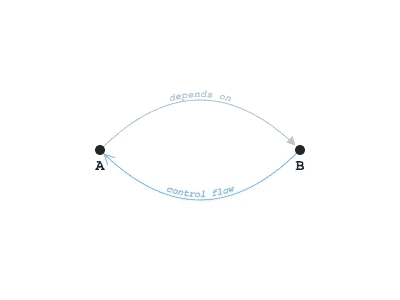
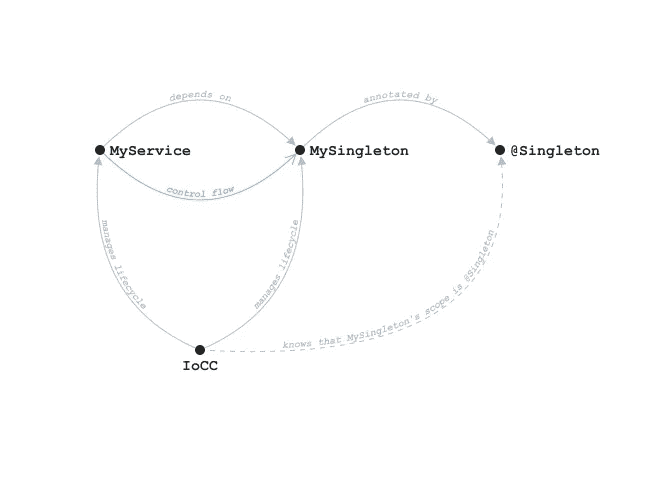

# 依赖注入与控制反转

> 原文：<https://levelup.gitconnected.com/dependency-injection-vs-inversion-of-control-e8a9fcc7d9f7>

# 动机

关于依赖注入和控制反转之间的区别，软件工程师中有一个广泛传播的误解。这两个概念经常被认为是一回事。我甚至知道这样一个案例，一位面试官在一次技术面试中问及两者的区别，并期望得到“没有区别”的答案。依赖注入框架，如 [Spring](https://spring.io/) 和 [Google Guice](https://github.com/google/guice) ，也被称为控制容器反转(IoCC)，这是一个误导性的名称，只会增加更多的混乱。

本文从软件架构的角度阐述了这两个概念。在本文中，我们将看到这些术语之间的不同，以及如何使用依赖注入来实现控制反转。我们还将看到一个没有控制反转的依赖注入的例子和一个没有依赖注入的控制反转的例子。

这篇文章使用了 [NoUML](https://medium.com/@volodymyrfrolov/nouml-afbb7f07f369) 符号。尽管这不是绝对必要的，因为符号是不言而喻的，您可以在继续之前参考符号的描述。

# 控制反转

在控制流命令式编程中，我们指的是代码执行从一个抽象(模块、类、对象、函数等)开始的情况。)到另一个。例如，如果函数 *f* 调用函数 *g* ，我们说控制从 *f()* 流向 *g()* 。经常出现的情况是，如果 *f* 调用 *g* ，那么它也依赖于 *g* 。所以依赖关系和控制流都有相同的方向。

但事实并非如此。为了调用 *g* ， *f* 不一定要依赖它。事实上， *f* 和 *g* 之间可能根本没有依赖关系。例如， *f* 可能会接收 *g* 作为回调参数并调用它。在这种情况下，控制仍然从 *f()* 流向 *g()* ，但是 *f* 和 *g* 并不相互依赖。

在软件架构中，通过反转一个依赖项的方向来重构系统是一种常见的做法。出于多种原因，可能需要它，例如打破循环依赖，或者遵循 SOLID 原则中的依赖倒置原则(另一个不幸的名称，经常与依赖注入混淆)。但是，控制流不必和依赖项一起自动反转。

> 当抽象 A 依赖于抽象 B，但是控制从 B 流向 A 的方向相反时，就会发生控制反转。

控制反转的一个例子。a 依赖于 B，但控制流向相反，从 B 到 a。

插件 Architecture⁴是一个没有依赖注入的控制反转的例子。微内核调用插件，因此控制权从微内核流向插件。但是插件实现了由微内核提供的接口，所以依赖是反方向的。

# 依赖注入

> 依赖注入是一种技术，在这种技术中，抽象被免除了管理其依赖项的生命周期的责任。

使用依赖注入，如果抽象 *A* 依赖于 *B* ，它不会创建或者显式查找 *B* 的实现。假设 *B* 的实例由专用 IoCC 管理，并且当 *A* 需要执行其业务逻辑时，其中一个实例被提供给 *A* 。

没有控制反转的依赖注入的一个例子是由 IoCC 管理的单例。

IoCC 管理的 Singleton 就是一个没有控制反转的依赖注入的例子。这里的 IoCC 抽象是指应用程序的 IoCC 配置。容器本身显然不依赖于 MySingleton。

上图中， *MyService* 依赖于 *MySingleton* ，控制流向相同。这里使用依赖注入来减轻 *MyService* 通过调用 *getInstance()* 或类似方法显式查找 *MySingleton* 实例的负担。将来，@Singleton 注释可以从 *MySingleton* 中移除，而不必修改 *MyService* 实现。

## 控制反转的依赖注入

依赖注入仍然是实现控制反转的最简单的方法之一。一个模块可以提供一个接口并使用这个接口的实现，而不知道具体是如何实现的。这些实现可以很容易地在单元测试和生产中进行交换，而不需要对模块进行任何修改。

# 结论

系统中的依赖关系可以在不改变相应控制流方向的情况下被逆转。控制反转是在那种情况下发生的效果。在多架构中，这种效果是可取的，因为它允许通过消除不希望的方向上的依赖性来实施架构 boundaries⁵，同时保留控制流结构。实现控制反转的最简单的方法是通过依赖注入和控制容器的反转，尽管这不是唯一可行的方法。

# 参考

Martin Fowler，[控制容器的倒置和依赖注入模式](https://martinfowler.com/articles/injection.html)，2004。
沃洛季米尔·弗罗洛夫，[努米尔](https://medium.com/@volodymyrfrolov/nouml-afbb7f07f369)，2018。
罗伯特·c·马丁，清洁建筑；《软件结构与设计工匠指南》，2018 年，第 87 页。
⁴大卫赖斯，马特福梅尔，外挂；《企业应用架构的模式》，马丁·福勒，第 499 页。
⁵·沃洛季米尔·弗罗洛夫，[具有抽象层次的 nouml】，2019。](https://medium.com/@volodymyrfrolov/nouml-2-9734a2746258)

# 分级编码

感谢您成为我们社区的一员！ [**订阅我们的 YouTube 频道**](https://www.youtube.com/channel/UC3v9kBR_ab4UHXXdknz8Fbg?sub_confirmation=1) 或者加入 [**Skilled.dev 编码面试课程**](https://skilled.dev/) 。

 [## 编写面试问题

### 掌握编码面试的过程

技术开发](https://skilled.dev)