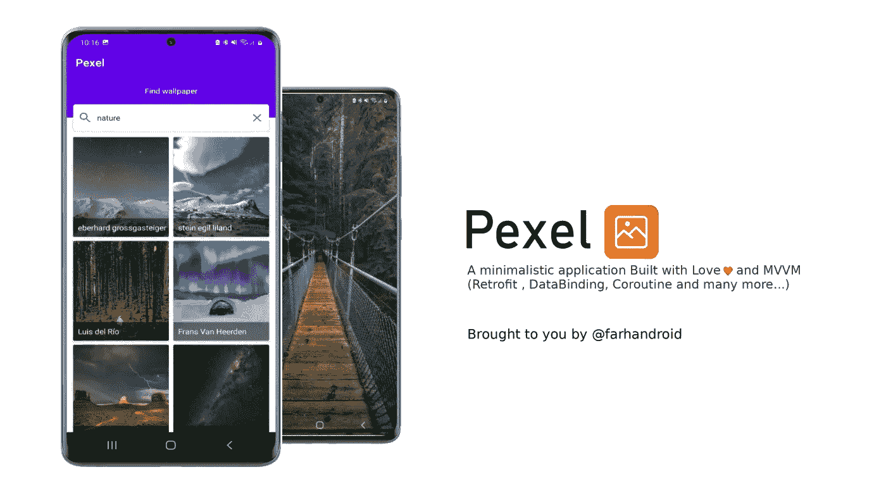
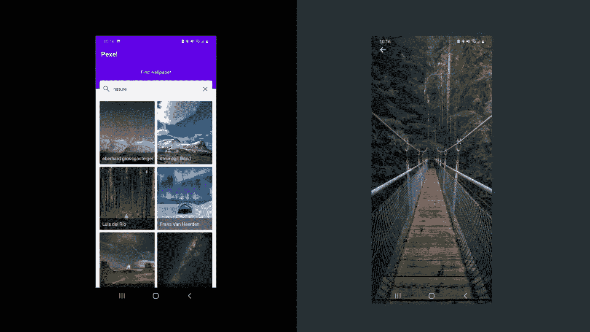
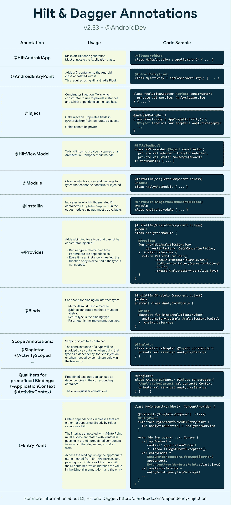

# Android 中的依赖注入

> 原文：<https://levelup.gitconnected.com/dependency-injection-with-hilt-in-android-73921b76c661>

## 让您的应用更加强大



依赖注入(DI)是一种广泛使用的编程技术。在 Android 中，它被认为是困难的话题之一。这是真的。因为以前 Dagger 用于 DI，我们必须编写大量样板代码。这也有点复杂。但是希尔特让它变得简单了。

# 什么是依赖注入

简单地说，依赖注入是向类提供依赖而不是自己创建依赖的过程。它允许模仿或剔除依赖性，这是一种特别方便的测试技术。

依赖注入的目标是分离关于对象生成和使用的关注点。这有助于代码的重复和可读性。

# 我们在读什么



这是一个很棒的应用程序。不是吗？

这个应用程序是使用 MVVM 结构。但是我用过手动 DI。今天我们一起来彻底改变它。

对于本文，使用这个 [**GitHub**](https://github.com/Farhandroid/Pexel) 存储库。请随意检查。我们开始吧

# 添加依赖关系

首先，在项目的根文件`build.gradle`中声明 HILT Gradle 插件依赖关系:

```
buildscript **{**
  repositories **{**
    *// other repositories...*
    mavenCentral**()**
  **}**
  dependencies **{**
    *// other plugins...*
    classpath 'com.google.dagger:hilt-android-gradle-plugin:2.41'
  **}**
**}**
```

然后在 Android Gradle 模块的`build.gradle`中应用插件:

```
plugins *{* id 'com.android.application'
    id 'dagger.hilt.android.plugin'
    id 'kotlin-kapt'
*}*
```

现在将以下构建依赖项添加到 Android Gradle 模块的`build.gradle`文件中:

```
dependencies **{**
  implementation 'com.google.dagger:hilt-android:2.41'
  annotationProcessor 'com.google.dagger:hilt-compiler:2.41'
**}**
```

请始终尝试使用最新版本。在撰写本文时，最新的版本是 2.41。

# 剑柄在行动

HILT 必须包含一个用`HiltAndroidApp`注释标注的应用程序类。它会触发 Hilt 的代码生成。

```
@HiltAndroidApp
class Pexels : Application()
```

不要忘记在`AndroidManifest.xml`中添加这个应用程序类。

```
android:name=".Pexels"
```

要在活动和片段中启用 HILT，添加`@AndroidEntryPoint`注释。该注释将阿迪容器添加到 Android 类中。

```
@AndroidEntryPoint
class MainActivity : AppCompatActivity*() {* override fun onCreate*(*savedInstanceState: Bundle?*) {* super.onCreate*(*savedInstanceState*)* setContentView*(*R.layout.*activity_main)
}*
```

同样在 Viewmodel 中添加`HiltViewModel`注释。它告诉 HILT 如何提供 ViewModel 的实例。

在这个应用中，`ImageRepository`类负责提供数据，它使用`ImageApiService`类负责网络调用。现在我们将创建两个名为`NetworkModule`和`RepositoryModule`的对象，它们将提供这个`ImageRepository`和`ImageApiService`类。

## 创建网络模块

该对象将提供`Retrofit`实例和`ImageApiService`。

## 创建存储库模块

这个对象将提供一个`ImageRepository`的实例。

现在我们有了所有需要的设置和对象。让我们使用它们。

# 视图模型中的变化

之前我在`ImageSearchViewModel`中手工创建了一个`ImageRepository`类的实例。

```
private val imageRepository= ImageRepository()
```

但是现在我们将在构造函数中注入一个`ImageRepository`的实例。

```
@HiltViewModel
class ImageSearchViewModel @Inject constructor*(*private val imageRepository: ImageRepository*)* :
    ViewModel*() {
   }*
```

# 图像存储库中的更改

之前我在`ImageRepository`类中手工创建了`ImageApiService`的实例。

```
private var imageApiService = RetrofitInstance
    .getRetrofitInstance*()* .create*(*ImageApiService::class.*java)*
```

但是现在我们将在构造函数中注入`ImageApiService`。

```
class ImageRepository @Inject constructor*(*private val imageApiService: ImageApiService*) {
}*
```

# 备忘单

刀柄基本上用了一些注解。这里 下载小抄 [**。**](https://developer.android.com/images/training/dependency-injection/hilt-annotations.pdf)



仅此而已。我们已经了解了 android 开发中的另一个重要的最佳实践。我知道有时候对于一个小项目来说这看起来有点过了。但是相信我，在大型项目中，你会很高兴你没有使用任何手工依赖。

谢谢你留到最后。希望有帮助。你的建议对我很有价值。如果你分享你的建议，我将不胜感激。

```
**Want to Connect?** If you want to, you can connect with me on [**Twitter**](https://twitter.com/FarhanT99598254)
```