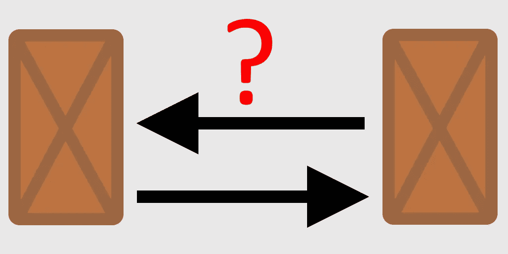
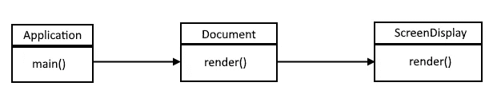
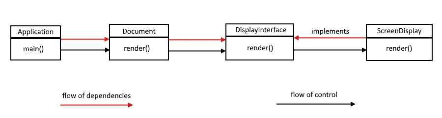
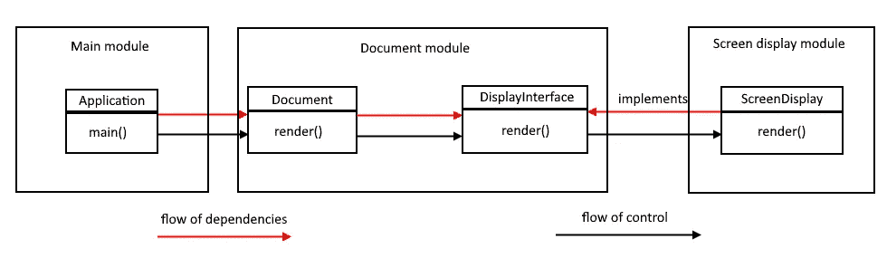

# 解释了依赖性反转原理以及教程是如何弄错的

> 原文：<https://levelup.gitconnected.com/dependency-inversion-principle-explained-and-how-tutorials-get-it-wrong-e2327ff1fc81>

## 依赖倒置原则不仅仅是抽象和实现。

图片由 [Giedrius Kristinaitis](https://medium.com/@giedrius.kristinaitis) 提供

先说依存倒置原则。更具体地说，让我们来探索什么是依赖倒置原则，以及它是如何经常以错误的方式出现并且没有得到充分解释的。

# 依赖倒置原则所说的

依赖性反转原则并不像看起来那么容易理解。有很多解释都是错误的。原则是你应该依赖抽象，而不是实现。

这对一个甚至没有听说过坚实原则的普通开发人员来说意味着什么呢？他们立即想到接口/抽象类及其实现，这很有意义，他们认为他们不能在代码中使用具体的类作为依赖。

由此产生的结果是为所有东西创建一个接口，实际上是每一个类，因为毕竟你需要依赖抽象，而接口就是抽象。

这种想法将原则视为硬性规定，并不关注真正重要的事情。

# 最大的依赖倒置原则错误

人们经常忽略的是原则的字面意思。告诉我，“*依赖抽象，而不是实现*”和“*依赖倒置原则*”听起来是一回事吗？如果你不深究，他们就不会。当一些人想到原则时，他们想到的是依赖抽象，而完全忽略了依赖倒置部分。

让我烦恼的是依赖倒置原则在很多课程和教程中被兜售的方式。你所看到的是一个例子，其中有一个接口，然后有 2 个接口的实现，接口的使用字面上呈现为依赖倒置原则。如我所说，完全忽略了依赖倒置本身。

## 伪装成依赖倒置原则的多态性

让我们引入另一个叫做多态性的概念。什么是多态性？多态性是用一个符号来表示多个不同的类型。

什么能代表那个符号？接口/抽象类都可以用作这个符号。接口的实现是由单个符号(接口)引用的不同类型。

这看起来是不是很像正在销售的依赖性反转原则？

> 普通多态性经常被当作依赖倒置原则来推销。

## 依赖倒置不仅仅是多态性

原理不仅仅是多态性。你认为《坚实的原则》的作者没有受过足够的教育来创造一个新的术语来定义多态性吗？我不知道。

当然，多态性肯定在原则中起作用，但不是原则本身。这就是依赖倒置概念的由来。多态性只是用来实现反转。

# 解释了依赖性倒置原则

## 控制流程

在我解释依赖倒置之前，我需要引入一个叫做控制流的概念。

什么是控制流？控制流就是程序执行的顺序。这里有一个例子:

图片由 [Giedrius Kristinaitis](https://medium.com/@giedrius.kristinaitis) 提供

main 方法调用**文档**类中的 render 方法，**文档**中的 render 方法调用 **ScreenDisplay** 类中的 render 方法。这就是该示例的执行顺序。在示例中，依赖关系指向与控制流相同的方向。

## 依赖性倒置

依赖关系反转意味着依赖关系的流向是反向的，并且指向与控制流向相反的方向。这里有一个例子:

图片由 [Giedrius Kristinaitis](https://medium.com/@giedrius.kristinaitis) 提供

然而，等一下。这难道看起来不像经典的接口和实现示例吗？确实如此。由于**文件**不再依赖于**屏幕显示**，而是依赖于**显示界面**，并且**屏幕显示**也依赖于**显示界面**，因此这也颠倒了依赖关系。经典接口示例在技术上也反转了依赖关系(这也很少被提及)。

那么，它与缺少依赖倒置部分而只是多态性的经典例子有什么不同呢？还没到…*T21。*

## 代码模块的上下文很重要

最后一个例子确实颠倒了 **ScreenDisplay** 依赖关系，只是这种颠倒在模块的上下文之外没有多大意义，这是简化教程和课程犯的错误，它们没有谈到模块。

什么是模块？模块是独立的相关功能组，也就是说，它们是松散耦合的(嗯，这是你应该追求的目标)。

颠倒依赖关系有什么意义，它有助于实现什么？

主要的一点是，它有助于使你的模块真正独立。它有助于使应用程序的各个部分可以独立部署。当您能够独立部署时，您就具备了能够独立开发应用程序部分的必要条件之一(如果您必须了解系统其他部分发生的细节，简而言之，当抽象泄漏细节时，仅仅能够独立部署对于独立开发来说是不够的)。

当然，还有更多好处可以让开发和维护变得更容易。模块是独立的这一事实本身就是巨大的。

最后一个例子中的反转没有多大意义，因为所有的东西都在同一个模块中，这意味着完全独立是不存在的，因为如果它们在同一个模块中，你怎么能独立地部署它们呢？你必须部署整个模块，所以它没有意义。

部署整个应用程序的难度取决于您的技术堆栈，因此在某些情况下，部署整个应用程序可能非常困难，让模块相互独立并颠倒依赖关系是非常有意义的。

例如，假设您用静态类型语言编程，在运行时需要知道依赖关系，编译整个应用程序需要几个小时。可以想象，如果您可以独立部署它的一部分，事情会简单得多。

如果您正在使用动态类型的语言，它可能就像更新源代码文件一样简单，整个部署可能在几分钟内完成。然而，这并不是完全忽略依赖倒置原则的理由。

下面是代码模块的更新示例:

图片由 [Giedrius Kristinaitis](https://medium.com/@giedrius.kristinaitis) 提供

现在您可以看到存在哪些模块。屏幕显示模块和应用程序的其余部分可以独立部署。屏幕显示是知道具体实现细节的底层模块，它依赖于一个高层模块，这个高层模块就是单据模块，是有业务规则的模块，不应该知道实现细节。

有两件事应该指出。

首先，为什么**文档**类和**显示界面**在同一个模块中？为了实现完全的模块独立性，需要这样做。如果将它放在任何其他模块中，它将使高级文档模块依赖于其他模块。 **DisplayInterface** 只是一个抽象，文档模块可以通过它与外界进行交互。

第二，主模块和文档模块之间的关系是什么？主模块依赖于具体的**文档**类，而不是抽象。难道不对吗？如果你把依赖倒置原则当作一个硬性规则，那么它就是。

> 没有办法让所有的模块都遵循这个原则，因为必须至少有一个模块将具体的实现与抽象联系起来，这个模块通常是主模块。

什么样的模块被允许违反依赖倒置原则，这是将来的一篇独立文章，所以我不再详述。

依赖倒置原则不仅仅是多态性。当你谈论它的时候，你不能忽略模块和它们如何相互作用。

语句“*依赖抽象，而不是实现*”不仅仅是为每个类创建一个接口，这个接口不抽象任何东西，并且与实现类位于同一个模块/目录中。

> 我们不要忘记，这个原则被称为依赖倒置原则是有原因的，因为当我们这样做时，我们要么过度设计无用的接口，要么设计不足，完全忽略了非常适合的原则。

有点可悲的是，有很多教程和课程根本就没有讲依赖倒置和模块的概念。