# Django 模型管理中的依赖和可搜索选择现在是一件轻而易举的事情

> 原文：<https://levelup.gitconnected.com/dependent-searchable-selections-in-django-model-admin-is-now-a-cakewalk-4b34c5e835f8>

我们都知道 Django 是一个很棒的框架，它提供了基于模型的默认管理界面。Django 支持的默认功能解决了我们 95%的用例，但在很多情况下，应用程序需要某些功能，我们必须按照我们需要的方式扩展内置的 Django 功能，这对新手来说是一场噩梦。

一个这样的例子是我们迫切需要下面的功能。

**问题陈述**

*   一个选择字段可以派生一个或多个选择字段(**一父多子**)。
*   选择字段的数据可以基于一个或多个选择字段导出(**一子多父**
*   一个选择字段可以派生出另一个选择字段，两个选择字段共同派生出几个其他选择字段(**多父-多子**)。
*   选择字段可以在同一个模型中，也可以在嵌套的内联中(**应该支持多层内联**
*   选择字段应该可以使用全选或取消全选支持进行搜索。

我们已经寻找了很长时间，如果我们能找到一个很棒的库，可以轻松地处理我们的用例，但我们没有找到。因此，我们开始探索更多的选项，并决定编写我们的自定义库，以一种可以开源的通用方式来解决我们的用例，结果是

 [## django-管理工具包

### Django 管理工具包为 Django 管理员提供了额外的功能

pypi.org](https://pypi.org/project/django-admin-kit/) 

在本文中，我将详细介绍如何将这个包与您的 Django 项目集成，以及如何使用这个包来实现每一个用例。

**安装过程**

*   将包添加到 requirements . txt**(django-admin-kit = = 0 . 0 . 17 是当前的稳定版本**)
*   将 **admin_kit** 添加到设置文件中的 INSTALLED_APPS。
*   将它添加到您的根 urls.py 中

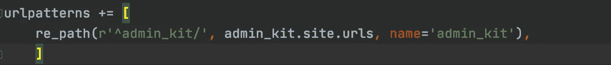

**使用流程**

现在我们已经建立了依赖关系，让我们试着用一个场景来逐个理解用例。

**场景-1** - > **有一组地区，每个地区有一组国家。现在，基于区域选择，我需要填充国家。**

步骤 1 ->导入模型中的依赖项

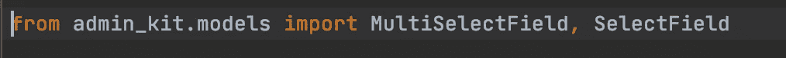

步骤 2 ->定义字段之间的关系

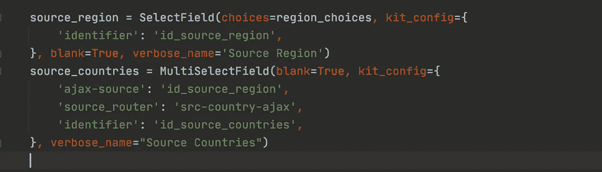

一旦导入了 SelectField，就会在其中添加一个名为 kit_config 的特殊属性，您可以在其中定义关系 b/w 字段和一些元数据。

*   **标识符** - >作为依赖字段的标识符，指定它依赖于哪个源字段。注意，一个视图中的多个字段的标识符不应该是相同的。**这是每个 SelectField 的必需属性。**
*   **ajax-source - >** 如果一个字段依赖于另一个字段，只需用源字段的逗号分隔标识符定义 ajax-source 即可。在我们的例子中，它只依赖于 source_region，只需在 ajax-source 或 source_countries 中定义 source_region 的标识符。
*   **source_router** - >一旦您从 source_region 中选择了一个项目，应用程序就会得到一个带有 router_path 的回调，并且应用程序会将数据发送回客户端。

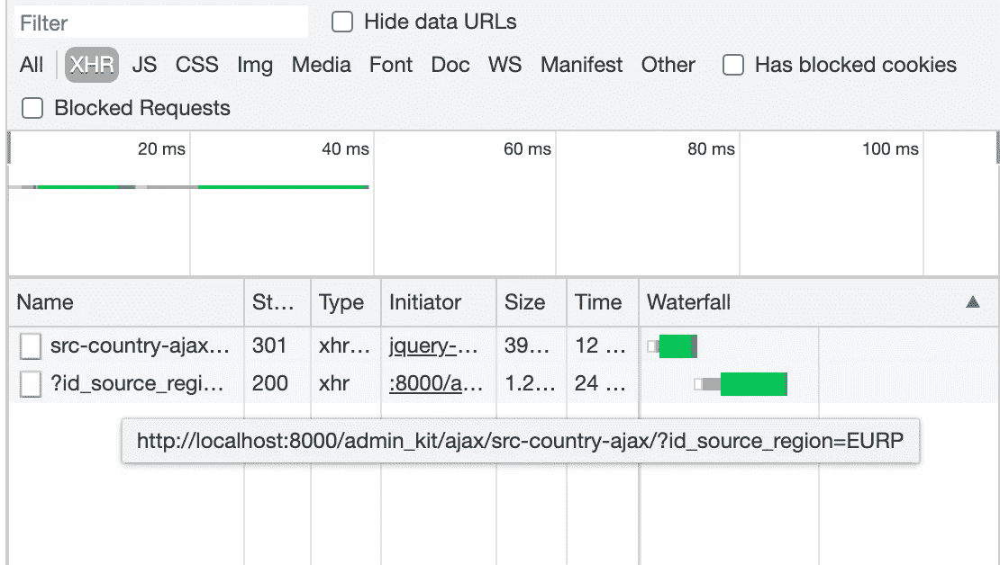

来自 AJAX 调用的数据应该是一个 2D 列表，其中外部列表表示一个项目，内部列表表示一个项目的元数据。

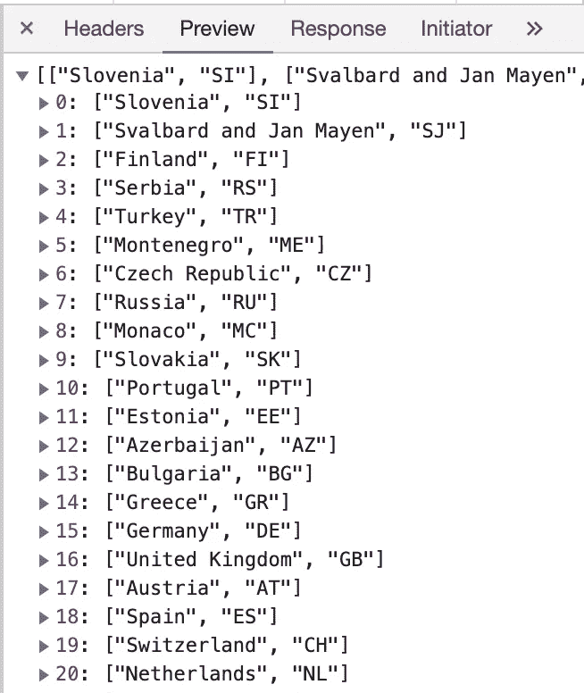

内部列表中的第一个元素是将要显示的文本，内部列表中的第二个元素是存储在 DB 中的值。

结果是这样的。

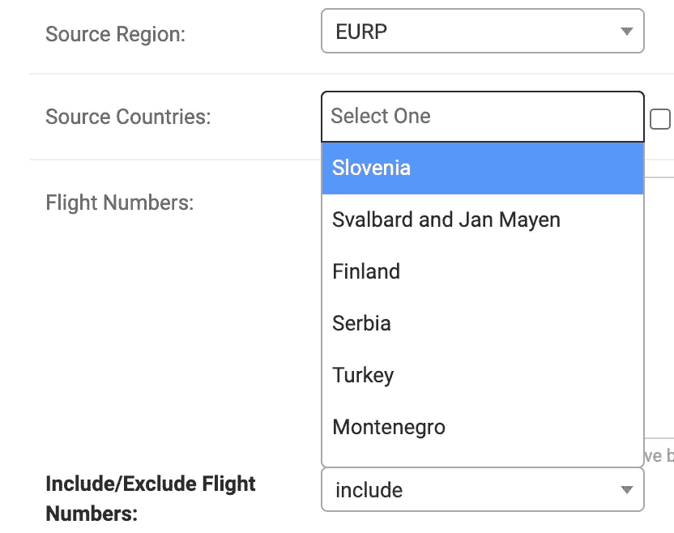

**帖子选择，界面如下图**

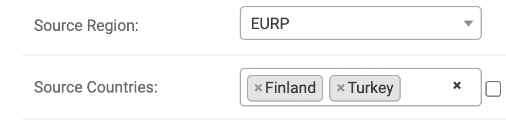

现在主要的问题来了，我如何注册我的 ajax 调用？嗯，这很简单。

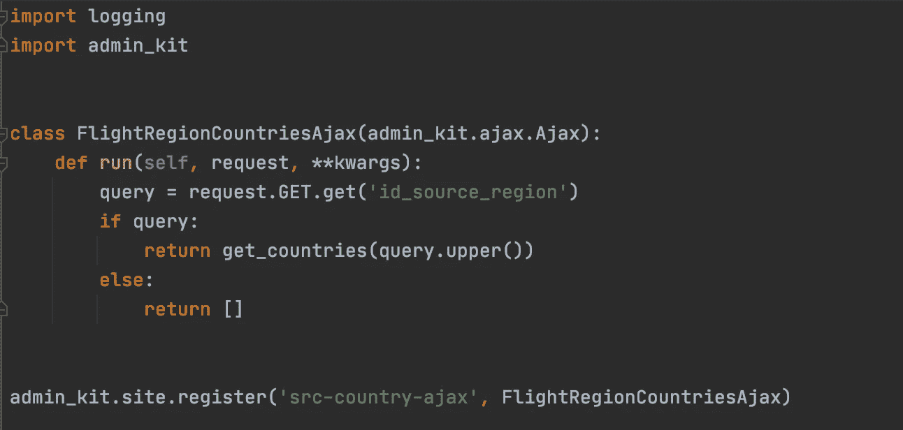

在应用程序内的 ajax.py 文件中，用 **source_router** 注册您的类。

*   类名可以是任何东西。
*   该类应该只有一个参数，即 **admin_kit.ajax.Ajax**
*   该类应该有一个包含两个参数的 run 方法。作为请求一部分的数据在第一个参数中发送，任何附加属性作为 kwargs 的一部分发送。
*   所有父字段选择信息都将是请求查询参数的一部分，我们可以获取信息，在选择的基础上执行相应的业务逻辑，并返回包含数据(文本和实际值)的数据的 2D 列表

耶，就是这样。我们已经成功完成了我们的第一个基本用例。

**场景二**

现在我们已经看到了一个字段依赖于一个字段属性的选择的用例，我们可能还会看到一个字段的数据是基于多个父选择而派生出来的。

啊，很难吗？答案是否定的。

你所要做的就是，在 ajax-source 中不要指定一个标识符，你需要指定一个逗号分隔的标识符列表，这个字段依赖于这个列表。

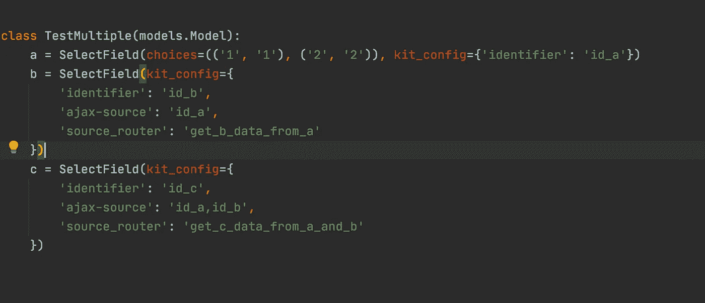

看看这个简单的例子，其中字段 B 依赖于字段 A 的选择，并将它的 ajax-source 指定为单独的 A，并指定它可以从中获取数据的路由器。

但是对于字段 C，它既取决于字段 A 的选择，也取决于字段 B 的选择。因此，它将其 ajax-source 指定为字段 A、字段 B 标识符和一个源路由器，在 A 和 B 选择中可以从源路由器获取字段 C 的数据。

从管理，我们将发送一个回调到 B 一旦 A 被选中，我们发送一个回调到 C 只有当 A & B 被选中。

在有多个父节点的情况下，回调 URL 看起来是这样的(**示例**)。

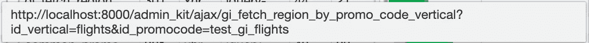

*   gi _ fetch _ region _ by _ promo _ code _ vertical 是源路由器
*   id_vertical 和 id_promocode 是父代的标识符。

**场景 3**

我们讨论的另外两个场景是父字段和依赖字段在同一个模型中。但是，如果父字段在视图的一个模型中，而子字段在另一个模型中，并且父字段和子字段之间的关系是一对多的，该怎么办呢？

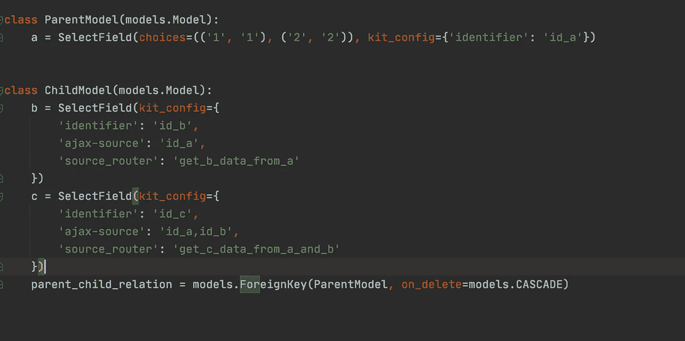

在这里，我们可以继续添加一个子模型，因为它在一个外键关系 w.r.t 父模型中。

我们确保在他们的项目中集成这个包的人不会有任何不便。**在这种情况下，开发者甚至不需要改变配置**。

每次添加表单集(内联模型)时，我们都会在后台创建一个依赖树，并向其中添加动作事件侦听器，以便 admin_kit 包检查整个表单主体的父表单，并侦听对它们所做的更改。

就 ajax 回调而言，什么都不需要改变。它与场景 2 完全相同

**场景四**

除了解决方案之外，最复杂的场景是一样的。

如果有一个祖父模型，它与 Parent Model 是一对多关系，而 ParentModel 与 ChildModel 是一对多关系。

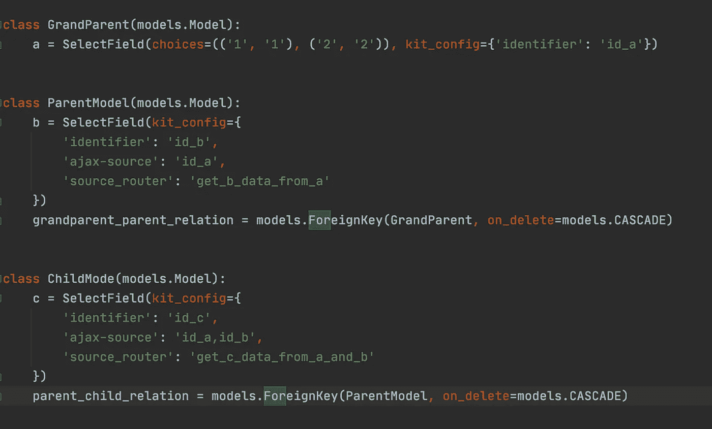

这里的问题是，假设视图是这样的。

*   1 个祖父母，2 个父母，每个父母有 2 个孩子。

现在，字段 B 的标识符在两个父模型中保持不变。当我们试图添加一个子模型时，它是从哪个 B 选择中得到的？

**它将基于第一个父 B 选择还是第二个父 B 选择获得？**

我们确保它是从最近的父代中派生出来的。

*   当添加了 Parent-1 模型的子模型时，字段 C 将基于祖父 A 和 Parent-1 B 派生
*   当添加了 Parent-2 模型的子模型时，字段 C 将基于祖父 A 和 Parent-2 B 派生。

就 ajax 回调而言，什么都不需要改变。它与场景 2 完全相同

**我们去掉了配置字段之间关系的复杂性，并确保客户端只指定当前字段依赖于哪些字段，不多不少。**

**场景-5**->-**可搜索选择**

在 Select2 JQuery 插件的帮助下，模型提供了默认的可搜索选择支持。

**场景-6 - >选择所有支持**

在多选的情况下，如果客户端希望有一个全选选项，我们启用了 SelectField 旁边的复选框。如果选中该复选框，将选择所有选项，如果再次取消选中该复选框，将删除所有选项。

**希望我已经涵盖了所有的场景，并希望看到该软件包集成到您的项目中。如果你有任何问题，请留言或发邮件到** `**codeforlyf@gmail.com**` **给我，我很乐意帮助你们。**