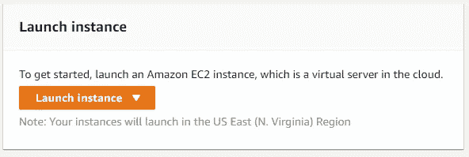
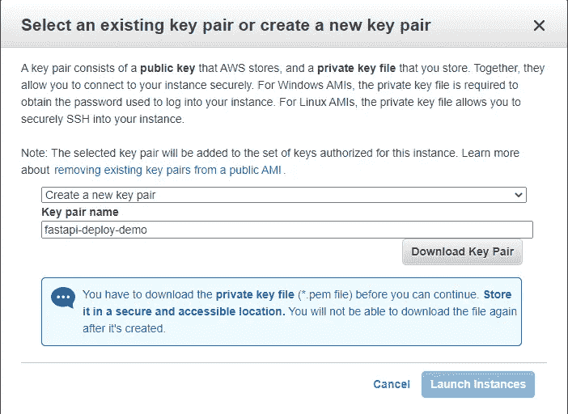
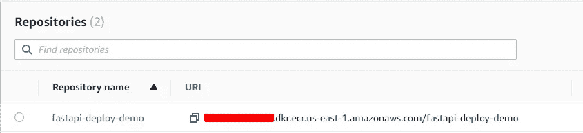
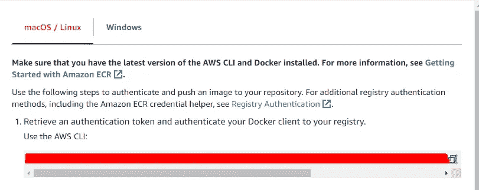
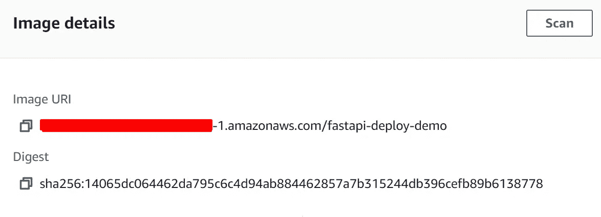
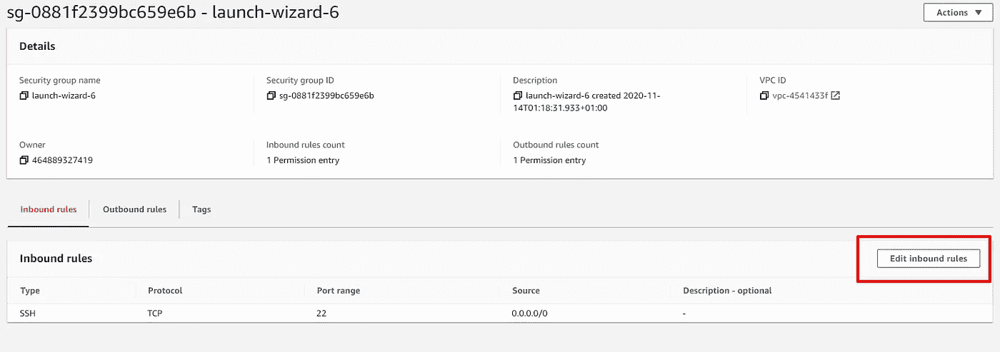
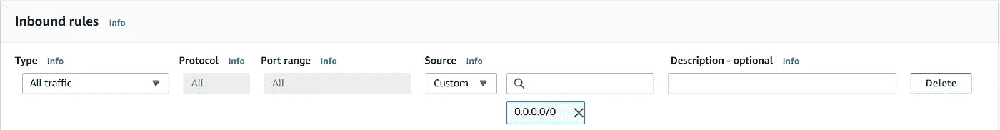
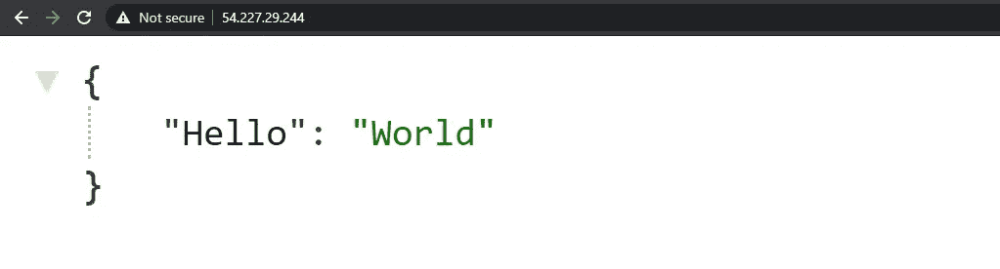

# 将 dockerized FastAPI 应用程序部署到 AWS

> 原文：<https://levelup.gitconnected.com/deploy-a-dockerized-fastapi-application-to-aws-cc757830ba1b>


> *您已经创建了您的 FastAPI 应用程序，现在您想通过部署它来公开它吗？—没什么可担心的。
> 在这篇文章中，我将一步一步地解释如何用 FastAPI 创建一个简单的应用程序，对它进行 dockerizing，并部署到 AWS EC2。*

# 什么是 FastAPI？

来自[官方文件](https://fastapi.tiangolo.com/):

> *FastAPI 是一个现代、快速(高性能)的 web 框架，用于基于标准 Python 类型提示使用 Python 3.6+构建 API。*

## 设置项目:

```
$ mkdir fastapi-demo
$ cd fastapi-demo
```

在为您的项目创建目录之后，开始创建一个虚拟环境。您可以跳过这一步，但是将您的依赖项与外界隔离总是好的。我想保持简单，所以我使用 virtualenv 工具来创建 python 虚拟环境。

```
$ virtualenv <name_of_environment>
$ source venv/Scripts/activate
```

现在安装 FastAPI 和 uvicorn:

```
pip install fastapi uvicorn
```

现在让我们设置项目结构:

```
$mkdir src && cd $_ 
$ touch __init__.py main.py 
```

现在，让我们在 main.py 中创建一个 FastAPI 应用程序的实例，添加一个路由并测试它:

```
from fastapi import FastAPI

app = FastAPI*()* @app.get("/")def root(*)*:
    return *{*"Hello": "World"*}*
```

所以现在我们通过用[uvicon](https://www.uvicorn.org/)运行应用程序来测试应用程序是否工作。命令有这样的格式:
`uvicorn <project_dir>.<project_dir>:<fastapi_instance_name>`

```
uvicorn src.main:app -- reload # for live-reloading
```

访问`http://localhost:8000/`查看实际应用🔥，或者`[http://localhost:8000/docs](http://localhost:8000/docs)`看 API 文档，是自动生成的？—是不是很牛逼？🙌

我不打算深入研究项目结构，我们如何更好地组织事情，等等..因为这里的目标只是开始使用 FastAPI，并学习如何将它整理并部署到 AWS，对于有关 FastAPI 的其他技巧和教程，我强烈建议参考[官方文档](https://fastapi.tiangolo.com/tutorial/)，因为它有真正组织良好的文档，并且它深入研究了框架的所有概念。

我们用 FastAPI 设置了一个简单的应用程序，现在您想要部署它，以便您可以访问它或共享它，或者做任何您想做的事情。有几种方法，比如通过获取源代码手动部署，以及像我们在本地那样手动运行，但我们希望在这里变得更智能，所以我们将应用程序 dockerize 并在 AWS EC2 实例上运行它。走吧**！**

# 将申请归档

所以我们基本上创建了应用程序，并在本地进行了测试，一切都很好。我们可以跳过创建虚拟环境和在本地运行代码的步骤，只需定义需求并添加相同的逻辑，但是在进一步开发之前，在本地运行应用程序并对其进行测试总是一个好的做法。

> *注意:如果您没有从* [*这里的*](https://www.docker.com/get-started) *获得 docker，我假设您的机器中已经安装了 docker。*

**我们为什么要使用 docker？**

*   去掉流行的说法“*在我的机器上有效*”
*   隔离依赖项
*   在隔离环境中运行，该环境仅用于运行您的应用程序及其依赖项
*   更易于部署等。

在我们项目的根目录下创建一个 **Dockerfile**

```
$ touch Dockerfile
```

Dockerfile 是一个文本文档，它包含用户可以在命令行上调用的所有命令，以组合一个图像。
在我们为 docker 文件编写配置之前，让我们生成应用程序需求:

```
$ pip freeze > requirements.txt 
```

用您最喜欢的编辑器打开 docker 文件，并编写以下内容:

```
FROM python:3.8.1-slim # Image from dockerhub

ENV *PYTHONUNBUFFERED* 1 
EXPOSE 8000 # Expose the port 8000 in which our application runs
WORKDIR /app # Make /app as a working directory in the container# Copy requirements from host, to docker container in /app 
COPY ./requirements.txt .# Copy everything from ./src directory to /app in the container
COPY ./src . RUN pip install -r requirements.txt # Install the dependencies# Run the application in the port 8000
CMD *[*"uvicorn", "--host", "0.0.0.0", "--port", "8000", "src.main:app"*]*
```

很好，现在让我们通过运行来建立我们的形象:

`$ docker build -t fastapi-demo .`

因为我们在同一个目录中，所以我们不需要指定 Dockerfile 的路径，因为文件名符合约定。现在，等待几分钟，因为您将从 docker hub 的远程存储库中下载图像，然后在其上构建您的项目。

为了确保没有失败，运行`$ docker images`,你应该在你的机器的图像列表中看到图像的名称。很好，现在让我们运行它:

```
$ docker run -dp <host_port:docker_port> <name_of_image># -d - Detached mode, runs in the background
# -p - to map the port on where do you want to access the #application in my case localhost:8000/
We have exposed port 8000 in our Dockerfile so we're good to go.So putting it all together:$ docker run -dp 8000:8000 fastapi-demo
```

为了确保映像正在运行(在映像运行后，它变成了一个容器),请检查`docker ps`,您应该会看到一个包含我们的映像的容器正在端口中运行`8000.`,现在访问`localhost:8000`,您应该会看到应用程序正在运行，就像我们之前在本地运行一样。完成的...

# 将应用程序部署到 AWS

因此，我们创建了我们的 FastAPI 应用程序，并且我们已经 dockerized 到一个隔离的环境中运行一切。这对本地来说很好，但我们希望向公众公开应用程序，所以让我们部署到最受欢迎的云提供商 AWS。

我们将在本文中使用的所有东西都应该是没有任何额外费用的，所以您可以使用 AWS free tier 来跟进，但一般来说，在您使用它之后进行清理。

注意:我假设你已经有一个 AWS 帐户，你可以使用免费服务。我将一步一步地解释一切，所以让我们继续。

**创建 EC2 实例** 

导航到 **EC2** 服务，点击`Launch Instance`



选择`Amazon Linux 2 AMI (HVM)`，因为它符合自由层条件。保持默认设置，点击`Review and Launch`。之后，它会要求您生成一个新的密钥，当您需要 ssh 到实例中时，您将使用这个密钥，因此创建一个新的密钥，命名您想要的名称，然后下载它们并保存在您的机器中，因为您将立即需要它们。单击 Launch instance，您的实例将很快准备好。



创建实例后，您可能想要`ssh` 进入它，并安装 docker，让我们开始吧。

在 EC2 仪表板中，在实例状态变为 running 之后，右键单击它，并选择`Connect`。这足以为您提供如何 ssh 到您的实例的信息。让它保持打开，并打开一个新的 bash 终端。
导航至下载的`.pem`键，并执行以下操作:

```
$ chmod 400 fastapi-deploy-demo.pem # Substitute with your key 
```

从您的 EC2 仪表板中，获取告诉您如何`ssh` 到实例的最新命令，并将其粘贴到您的终端中，(确保您与。pem 文件是):

```
# Same directory where .pem key is locatedssh -i "fastapi-deploy-demo.pem" ec2-user@<your-details-here>.compute-1.amazonaws.com
```

现在您应该在您的实例中了，所以让我们安装 docker。只要跟着命令走，你应该没问题:

```
# Update the installed packages and package cache on your instance.sudo yum update -y# Install the most recent Docker Community Edition package.sudo amazon-linux-extras install docker# Start the Docker service.sudo service docker start# Add the ec2-user to the docker group so you can execute Docker #commands without using sudo.sudo usermod -a -G docker ec2-user 
```

现在重新启动您的 EC2 实例，因为在大多数情况下，它不会获取配置的权限，所以从 EC2 仪表板中重新启动，并按照上面的步骤重新连接。

现在写`docker info`看看没有`sudo`你能不能运行它，如果能，你就可以开始了。

**创建一个存储库，并将图像推送到其中** 由于我们正在 AWS 中部署，我更喜欢将所有东西都放在这里，所以我将使用 Amazon ECR，而不是 Dockerhub。

> Amazon Elastic Container Registry(**ECR**)是一个完全托管的 Docker 容器注册中心，它使开发人员能够轻松地存储、管理和部署 Docker 容器映像

导航到 Amazon Container Services (ECR)并创建一个新的存储库。随便你怎么命名(fastapi-deploy-demo)。



现在是时候将我们之前构建的本地映像推送到这个远程存储库了。您首先需要从您的 AWS CLI(本地)使用您的 AWS 凭证进行验证，因此如果您没有它，请从[这里](https://docs.aws.amazon.com/cli/latest/userguide/install-cliv2.html)安装它:

*我假设您已经使用您的凭证进行了身份验证*

现在转到您的 ECR，选择您创建的存储库，并单击`VIEW PUSH COMMANDS`。使用第一个命令在注册表中验证 docker 客户机:



之后，使用存储库名称再次构建映像，标记并将映像推送到存储库:

```
# Navigate to the project directory first and type the following:docker build -t fastapi-deploy-demo .# Tag the image
docker tag fastapi-deploy-demo:latest <YOUR ID>.dkr.ecr.us-east-1.amazonaws.com/fastapi-deploy-demo:latest# PUSH
docker push <YOUR ID>.dkr.ecr.us-east-1.amazonaws.com/fastapi-deploy-demo:latest
```

完成的...
现在您已经设置好了一切，我们需要 ssh 到实例并提取映像，然后用 docker 运行它。

正如我们在本地所做的一样，现在在我们的实例中，我们已经提供了 AWS CLI，我们只需要通过运行

```
$ aws configure# This will ask you for:
AWS Access Key ID: []
AWS Secret Access Key: []
Default region name: []
Default output format: []# Make sure you use the same credentials as you used when you authenticated localy with AWS CLI
```

然后使用 docker 客户端进行身份验证，请参见此处的[文档](https://docs.aws.amazon.com/AmazonECR/latest/userguide/Registries.html#registry_auth)
通过身份验证后，您可以从 ECR 中提取映像，因此继续操作并再次导航到`ECR` ，单击存储库并获取映像 URI。



回到 EC2 实例，编写以下命令:

```
docker pull <IMAGE_URI> # that you grab from ecr repository
```

在您提取图像之后，继续像我们在本地所做的那样运行。

首先通过运行`docker images`抓取图像的名称，然后编写:
`docker run -dp 80:8000 <NAME_OF_IMAGE>`..现在我们已经将实例中的端口 80 映射到了`docker`中的端口 8000。
太好了，用下面的命令验证容器正在运行:`docker ps` 那么，我们还有最后一件事要配置，进入我们实例的流量...🚥

在 **EC2 仪表板**中转到您的实例，点击它，然后转到**安全选项卡**，之后点击您的安全组(我的是`sg-0881f2399bc659e6b)`，然后点击`Edit inbound rules`。



点击添加新规则，选择**所有流量**，这样不利于安全，只是为了演示。



最后，导航到您的 EC2 实例，获取该实例的 public `IPV4`并在您的浏览器中测试它:



我们已经使用 Docker 在您的 AWS EC2 实例中成功部署了 FastAPI 应用程序🚀 🔥

试着用它，当你用完后，删除实例和库，因为你不想从 AWS 得到任何额外的费用。

# 包扎

在本文中，我想一步一步地向您展示如何在 AWS 中部署您的应用程序。
正如我在那里所做的研究，这是部署您的应用程序的一种很好且简单的方法，但是如果您打算大规模运行应用程序，您可以使用其他服务，如`ECS`，这是一种完全托管的容器编排服务，因此您可以像我们一样，仅通过您的应用程序映像轻松扩展应用程序。

**如果你愿意支持我的工作，你可以点击下面的图片给我买杯咖啡😄:**

[](https://www.buymeacoffee.com/valonjanuzaj)

如果你有任何问题，请随时联系我。
*与我接通👉*[*LinkedIn*](https://www.linkedin.com/in/valon-januzaj-b02692187/)*，* [*Github*](https://github.com/vjanz)