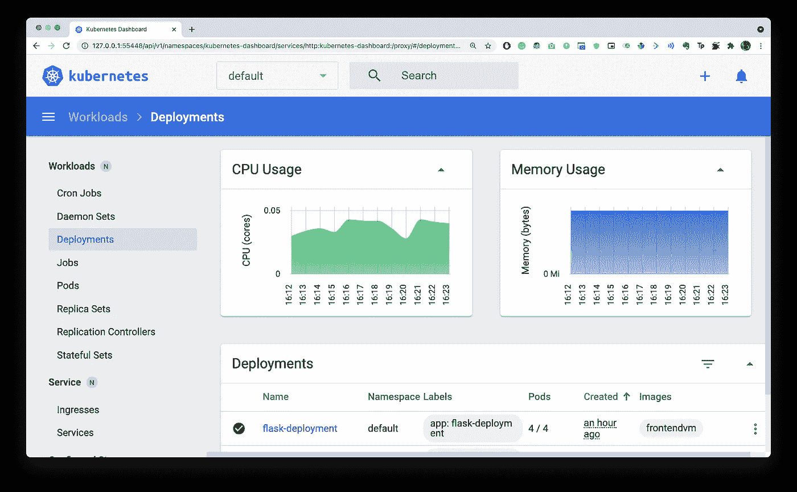
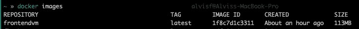
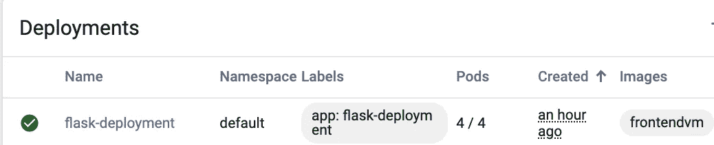
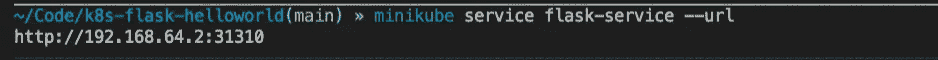
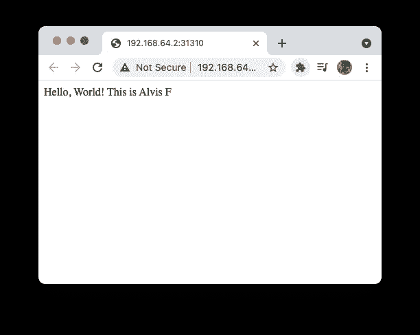
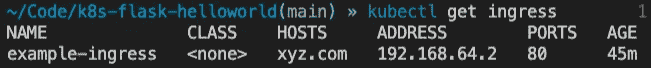
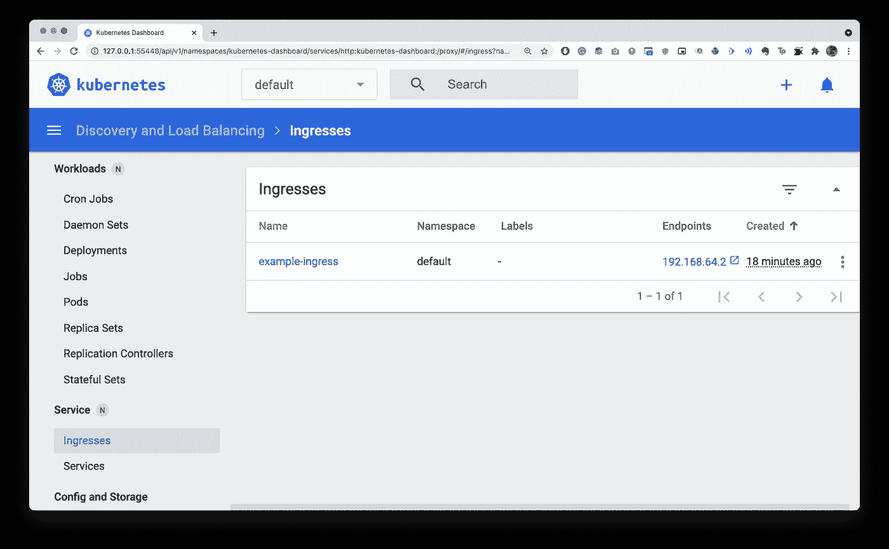
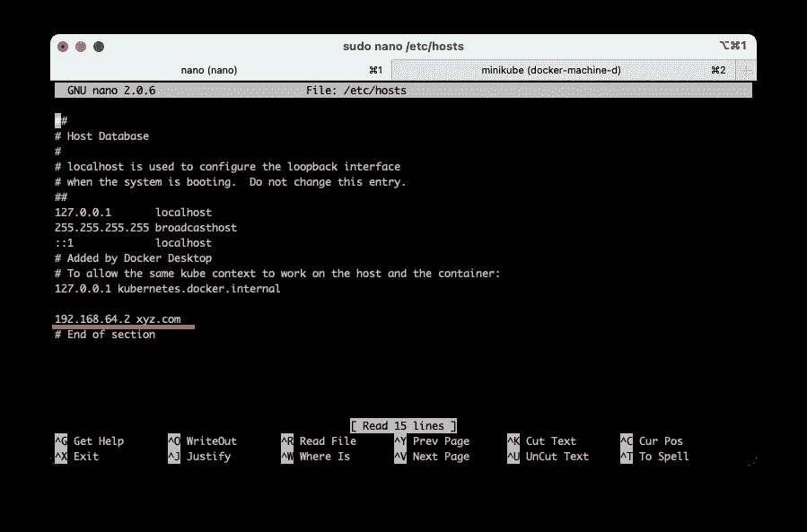
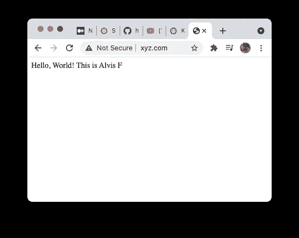

# 在 kubernetes 部署一个 Flask 应用程序

> 原文：<https://levelup.gitconnected.com/deploy-a-flask-app-in-kubernetes-f3e12100de9a>



一个[入口](https://kubernetes.io/docs/concepts/services-networking/ingress/)是一个 API 对象，它定义了允许外部访问集群中服务的规则。一个[入口控制器](https://kubernetes.io/docs/concepts/services-networking/ingress-controllers/)实现入口中设置的规则。

# 启动 minikube

如果您在本地安装了 Minikube，请运行以下命令:

```
minikube start
```

# 启用入口控制器

要启用 NGINX 入口控制器，请运行以下命令:

```
minikube addons enable ingress
```

克隆我的 GitHub 项目来跟进

[](https://github.com/alvisf/kubernetes-flask-poc) [## alvisf/Kubernetes-flask-POC

### 在 GitHub 上创建一个帐户，为 alvisf/Kubernetes-flask-poc 的开发做出贡献。

github.com](https://github.com/alvisf/kubernetes-flask-poc) 

# 创建 Dockerfile 文件

```
FROM alpine:latest
RUN apk add --no-cache python3-dev \&& apk add --no-cache py-pip
WORKDIR /appCOPY . /app
RUN pip3 --no-cache install Flask
EXPOSE 5002
ENTRYPOINT ["python3"]CMD ["main.py"]
```

这只是一个简单的 docker 文件，它将创建一个 docker 化的 flask 应用程序。

建立 docker 形象

```
docker build -t frontendvm .
```



现在 docker 映像已经创建好了，我们可以继续创建 Kubernetes 文件了

# 创建 K8s 部署文件

要创建部署，请使用命令

```
kubectl apply -f hello-deployment.yaml
```



要查看这个打开的 minikube 仪表板

```
minikube dashboard
```

现在我们需要创建一个服务来连接到我们部署的 pod

使用命令创建服务

```
kubectl apply -f hello-service.yaml
```

现在完成了，我们将有一个运行的应用程序到一个随机的 URL

```
minikube service flask-service --url
```



输出:-



现在我们需要创建一个入口规则来在我们的服务器上托管应用程序

# 为 K8s 创建入口

使用命令创建服务

```
kubectl apply -f hello-nginx-service.yaml
```



我们需要对我们的 **/etc/hosts** 文件做一个小小的改动



像这样把上面得到的值相加

所有这些都将成为你的输出



请随时联系我

[](https://linkedin.com/in/alvisf) [## 阿尔维斯 F -实习生- EY | LinkedIn

### 在全球最大的职业社区 LinkedIn 上查看 Alvis F 的个人资料。阿尔维斯有 4 个工作列在他们的…

linkedin.com](https://linkedin.com/in/alvisf)