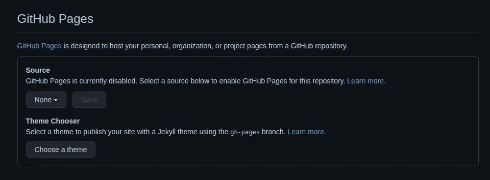

# 用 Jekyll 和 GitHub 页面部署一个免费网站

> 原文：<https://levelup.gitconnected.com/deploy-a-free-website-with-jekyll-and-github-pages-444ba8b42633>


*你也可以在我的个人博客* [*这里*](https://shahednasserblog.tk/deploy-a-website-with-jekyll-and-github-pages/) *查看这篇帖子。*

有时你想创建一个简单的博客或网站，并轻松地部署它，没有任何成本。这看起来很难，但实际上用杰基尔很容易！

如果你不熟悉 Jekyll，它可以帮助你创建一个简单的静态网站。你可以用 HTML 或者 [Markdown](https://daringfireball.net/projects/markdown/) 来写你的内容。

在这篇文章中，我将教你如何用简单的步骤用 Jekyll 创建一个博客，然后免费将它部署在 GitHub 页面上！

# 安装 Jekyll

要开始使用 Jekyll，首先需要在您的系统上安装一些先决条件。你可以在 Jekyll 的网站上找到详细的指南，告诉你如何基于你的系统做到这一点。

一旦安装了必备组件，就可以使用以下命令来安装 Jekyll:

```
gem install jekyll bundler
```

# 创建网站

现在你可以创建你的网站了！它只需要一个命令:

```
jekyll new tech-blog
```

我们称我们的网站为`tech-blog`，你可以用任何你想要的名字来代替它。此命令将创建一个新文件夹，其中包含 Jekyll 网站所需的所有文件。

# 将 Jekyll 添加到现有项目中

上面的命令将从头开始创建一个新项目。如果您已经有了一个想要添加 Jekyll 的项目，您可以像这样添加`--force`选项:

```
jekyll new tech-blog --force
```

这将把 Jekyll 添加到你现有的包含你的项目的目录`tech-blog`。

# 在本地建立和启动网站

创建上面的 Jekyll 网站后，将目录更改为网站目录中的目录

```
cd tech-blog
```

然后，使用以下命令在本地构建和服务网站:

```
bundle exec jekyll serve
```

然后在你的浏览器中进入`[localhost:4000](http://localhost:4000/)`，你会看到你的新博客开始运行了！


通过在上面的命令中添加选项`--livereload`,你的网站将会在你修改文件的时候重新加载

```
bundle exec jekyll serve --livereload
```

# 添加页面

让我们试着给我们的网站添加一个新页面。在网站目录的根目录下，创建包含以下内容的文件`helloworld.md`:

```
--- 
layout: page 
title: Hello World 
permalink: /hello-world/ 
---Hey There!
```

三个破折号之间的线就像页面的标题，定义了关于它的元信息。这里我们有三个信息:

1.  **布局:**表示页面的布局。默认为`default`、`home`、`page`或帖子。您也可以添加自己的自定义布局。
2.  **标题:**页面标题。
3.  **permanlink**:页面的 url。

一旦您添加了文件并在其中保存了内容，您就可以刷新您的网站页面，并看到一个新的链接被添加到导航栏中，或者如果您的命令中有`--livereload`，那么它已经为您刷新了页面。点击它，看到我们刚刚创建的新页面。


您可以尝试在三个破折号下编辑文件内容，并查看更改。

在这里，我们使用降价创建了这个页面。您也可以对 html 文件做同样的事情

```
--- 
layout: page 
title: Hello World 
permalink: /hello-world/ 
--- <div>Hey There!</div>
```

# 添加帖子

如果你创建的网站是博客，你可以在`_posts`目录中添加帖子。帖子文件需要以`YYYY-MM-DD`格式的帖子日期开始，然后以段格式的帖子名称结束。

创建一个包含以下内容的新文件`_posts/2020-12-15-my-first-post.md`(或 HTML，两者都可以):

```
--- 
layout: post 
title: "My First Post" 
categories: updates 
--- This is my first post. Thank you for reading it!
```

一旦我们保存它并转到我们的网站，我们会在主屏幕上看到一个新的帖子。


# 更改网站信息

要更改您的网站/博客的信息，如标题或 URL，所有元信息都包含在`_config.yml`文件中。

`_config.yml`文件默认有以下键:

1.  **标题:**网站标题。
2.  **电子邮件:**联系人电子邮件，也将出现在页脚。
3.  **描述:**网站描述。也会出现在页脚。
4.  **baseurl:** 网站的子页，例如`/blog`
5.  **url:** 网站的 url
6.  **twitter_username:** 您的 twitter 用户名，将出现在页脚。
7.  **github_username:** 您的 github 用户名，将出现在页脚中。
8.  **主题:**您网站的主题。默认情况下，它是最小值。
9.  **插件:**您将在网站上使用的插件。默认情况下，只有 jekyll-feed。

有关配置的完整列表，请在[哲基尔的网站](https://jekyllrb.com/docs/configuration/)上查看。此外，Minima 还有[附加配置](https://github.com/jekyll/minima/tree/v2.5.1)。

让我们尝试更改网站标题:

```
title: Tech Blog
```

对`_config.yml`的更改不会通过刷新或实时重新加载来显示。您需要重新启动服务器。

如果您现在重新启动服务器并转到该网站，您将会看到该网站的名称在导航栏、页脚和其他任何可能使用它的地方都发生了变化。


# 对主页进行更改

主页中的所有更改都应在`index.markdown`中进行。默认情况下，它使用主页布局显示你的文章列表。但是，您可以更改页面的布局或向其中添加任何附加内容。

让我们试着给它添加一些内容:

```
--- 
# Feel free to add content and custom Front Matter to this file. 
# To modify the layout, see https://jekyllrb.com/docs/themes/#overriding-theme-defaults 
layout: home 
--- This is my tech blog
```

默认情况下，破折号之间的所有内容都已经存在。我们刚刚添加了一行“这是我的技术博客”。如果你现在去你的网站，你会发现这一行已经加在帖子上面了。


# 使用资产

您在根目录中添加的任何资产都将自动包含在 Jekyll 构建中。这些包括 CSS 和 Javascript 文件或图像。

要将 CSS 添加到您的网站，您有两种选择:

1.  复制`_site`目录下 main.css 的内容，然后在你的目录`assets/main.css`的根目录下用你复制的内容创建一个新文件。然后你可以对它进行任何添加，它就会显示出来。
2.  创建一个新文件，并将其添加到网站的头部。

要使用第二种方法，首先创建包含以下内容的文件`assets/styles.css`:

```
.site-title, .site-title:visited { 
   color: #f00; 
}
```

我们只是改变了标题的颜色。然后，我们需要将其包含在网站的`<head>`中。为此，您需要从 minima(或者您正在使用的任何主题)复制`[includes/head.html](https://github.com/jekyll/minima/blob/v2.5.1/_includes/head.html)`的内容，然后在根目录下创建`_includes/head.html`，内容如下:

```
<head> 
 <meta charset="utf-8">
 <meta http-equiv="X-UA-Compatible" content="IE=edge">
 <meta name="viewport" content="width=device-width, initial-scale=1">
 
 <link rel="stylesheet" href="{{ "/assets/main.css" | relative_url }}">
 
 
 
 
 <link rel="stylesheet" href="{{ "/assets/styles.css" | relative_url }}">
</head>
```

最后一行之前的都是极简主题。最后一行是我们添加的，它是到我们创建的样式表`assets/styles.css`的链接。

如果你现在去网站，你会发现页面标题的颜色变了。


## 可选:使用 Sass

也可以用 Sass 代替 CSS。为此，首先需要将以下内容添加到`_config.yml`:

```
sass: sass_dir: assets style: compressed
```

`sass_dir`如果你在 sass 文件中使用导入是必要的。

然后，创建包含以下内容的文件`assets/styles.sass`:

```
--- 
--- .site-title, .site-title:visited
  color: #f00
```

前两个虚线告诉 Jekyll 编译并添加这个文件到构建中。之后，您可以添加任何您需要的样式。

最后，我们需要将它导入到页面的`<head>`中。可以使用以前的头代码，因为`assets/styles.sass`将被编译为`assets/styles.css`。

如果你现在刷新页面，你会看到网站标题的颜色是红色的。

# 部署到 GitHub 页面

一旦你完成了网站的制作，你现在可以免费将它部署到 GitHub 页面上。

首先，你需要在 GitHub 上为你的网站建立一个知识库。如果没有，那就创建一个并把你的工作交给它。

接下来，进入设置，向下滚动到 GitHub 页面



在这里，您需要选择一个源分支，然后选择根目录。点击保存，GitHub 将开始编译您的网站。

然而，它不会马上起作用。你需要在网站上做一些改变。

在`_config.yml`中，您需要更改三个关键值:

1.  baseurl: 这需要成为网站的子路径
2.  **网址:**这是网站的主网址。
3.  **目的地:**编译要去的目录

在 GitHub pages 中创建网站时，通常 URL 的格式会是:[**https://USERNAME.github.io/REPOSITORY-NAME**](https://USERNAME.github.io/REPOSITORY-NAME)

所以，`baseurl`应该是你 URL 的`/REPOSITORY-NAME`部分，`url`应该是你 URL 的`https://USERNAME.github.io`部分。

因为我们将它部署到 GitHub 页面，默认情况下，它使用您的存储库中`docs`目录的内容。因此，在`_config.yml`中添加一个`destination`键，并将其设置为`./docs`

```
destination: ./docs
```

然后创建一个`docs`目录。但是我们不希望文档的内容出现在存储库中。因此，在其中创建一个空的`.gitkeep`文件。这对于确保 docs 目录可以提交给存储库是必要的。然后，将以下内容添加到`.gitignore`:

```
docs/* 
!docs/.gitkeep
```

这将确保除了`.gitkeep`之外，不会添加`docs`目录的内容。

一旦你提交并把所有这些修改推送到你的库，你的 GitHub 页面将被重新构建，一旦完成，你可以在你指定的 URL 上查看它！

# 结论

这么多额外的设置和配置可以进入创建你的 Jekyll 网站。本教程旨在尽可能保持简单。你可以查看 Jekyll 的网站,获取关于如何创建或选择不同主题、插件等的文档！