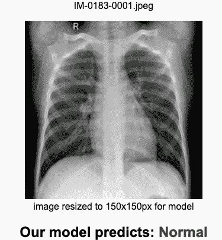
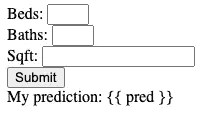
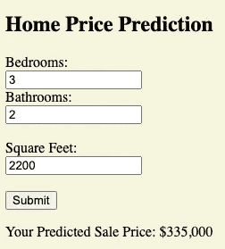
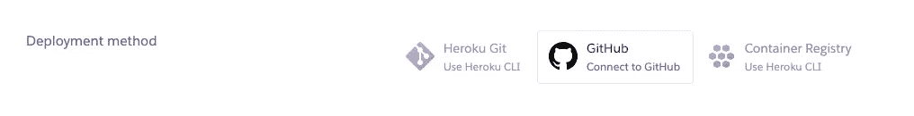
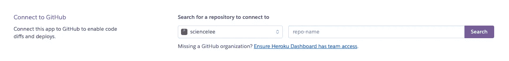
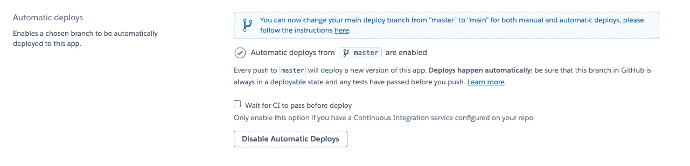

# 使用 Flask 部署预测模型

> 原文：<https://levelup.gitconnected.com/deploy-a-predictive-model-with-flask-33c1976293cc>

## 为您的 ML 项目制作并部署一个简单的 Flask 应用程序



本文的目的是向您展示一个使用 Flask、Heroku 和 GitHub 的机器学习模型的非常简单的“生产化”。本文假设您对 Python 代码有很好的理解，并且您已经用 Python 训练了一个机器学习模型，但是之前没有为此目的制作过 Flask 应用程序。你将需要访问 GitHub 和一个 Heroku 帐户；我们将为我们的应用程序创建一个存储库，并通过 repo 部署到 Heroku。有 HTML 和 Jinja 的经验也很好，但不是必须的。

Flask 是一个轻量级的 web 应用框架，使用起来非常简单，并且有很好的文档记录。在 Heroku 这样的云平台上启动并运行它也有些琐碎。

最近给自己的一个模特做了一个 Flask app。我建立了一个 CNN 模型来预测使用胸部 x 射线的肺炎结果，并希望为一个非技术演示提供一个交互式的初步模型。使用 ide 和笔记本可能很难做到这一点，所以我制作了一个快速烧瓶应用程序，作为我的模型进行预测的“概念验证”演示。

# 我的行动模型

在我们开始之前，你可以看看我用同样的方法制作的应用程序，让你对我们正在制作的东西有个概念。我在项目中使用的数据集来自 kaggle.com，链接如下。

[](https://www.kaggle.com/paultimothymooney/chest-xray-pneumonia) [## 胸部 x 光图像(肺炎)

### 5，863 张图片，2 个类别

www.kaggle.com](https://www.kaggle.com/paultimothymooney/chest-xray-pneumonia) 

我的 Flask app 托管在 Heroku 上。该模型是 keras 中的 CNN h5 模型，但是几乎任何 ML 模型都会以相同的方式工作。如果你能做一个 model.predict()，你就有足够的能力做一个预测 app。

欢迎[访问 app](https://xray-pred.herokuapp.com/) 上传胸片(jpg 或 png)预测是‘正常’还是‘肺炎’。您可以使用数据集中的图像输入到模型中，或者尝试自己的图像。

现在让我们一起做一个‘简洁’的应用程序。

# 步骤 1:制作一个烧瓶文件夹结构

我们首先为我们的项目创建一个虚拟环境(我推荐使用 Python 3.7)。使用您的正常工作流程将您的项目推送到 GitHub。如果我们保持一个有组织的存储库，以后通过 Github 在 Heroku 上部署将是轻而易举的事情。

下面是一个初学者友好的应用程序结构，我用在学生身上。更复杂的应用程序可能需要更复杂的结构。在开始之前，花点时间构建文件夹结构。这是在编码前可视化项目的好方法。更多关于烧瓶夹结构的信息可以在[这里](https://flask.palletsprojects.com/en/1.1.x/tutorial/layout/)找到。

```
My Project/
├── app.py
├── requirements.txt
├── Procfile
├── templates/
│   └── main.html
├── static/
│   ├── images/
│   ├── stylesheets/
│   └── fonts/
├── model/
│   └── my_model.pkl
```

# 第二步:制作一个基本的 Flask 应用程序

首先在你的 venv 中安装 Flask 库。在 [Flask 网站](https://flask.palletsprojects.com/en/1.1.x/)上的设置和安装说明可以帮助你开始。如果你不确定任何步骤，参考 Flask 网站让你远离麻烦是非常重要的。

现在，我们将从 Hello World Flask 应用程序开始。我将创建一个名为 **app.py** 的文件(在我的文件夹结构的根目录下，如步骤 1 所示)。将以下代码插入 **app.py** 。

那是弗拉斯克的“你好，世界”暗号。它导入 Flask 类，创建一个名为 **app** 的 Flask 对象，并定义一个返回“ **Hello，World！”的路由**。要运行 flask 应用程序，只需在 CLI 中导航到“**我的项目**”文件夹，然后键入

```
% **flask run**
```

这将启动一个内置服务器，这对于开发和故障排除来说已经足够了，但不是您在生产中使用的。在你的浏览器中点击默认的应用位置 [http://127.0.0.1:5000/](http://127.0.0.1:5000/) ，你应该会看到你的信息。

## 我函数上面的代码是什么？

我们正在制作一个 web 应用程序。一切都是通过 Flask 中的路线完成的。您实际上是将 URL 映射到操作。当您开始使用 Flask 时，可能最令人困惑的是下面这一行。

```
**@app.route(‘/’)**
```

**@** 符号只是一个 Python 装饰器。装饰器是 Python 中一个相当晦涩的语法术语。它修改功能；更具体地说，它是一个函数，将另一个函数作为参数，返回另一个函数。如果这令人困惑…我同意你。幸运的是，我们不必完全掌握它来使用它。

我们*需要*知道的:装饰器将我们应用程序中的相对 URL(路径)链接到它正在装饰的函数。这意味着 hello_world 函数与路由 **('/')** 相关联，这是我们的 web 应用程序的根。

当我们运行应用程序时，我们访问“触发”hello_world 函数的根 URL，而没有专门调用该函数。 **hello_world** 函数将消息返回给路由，我们看到它神奇地出现在我们服务器的根 URL 上。

有时，通过路由 URL 来实现交互性可能会令人困惑和麻烦。在其他时候，你可以看到整个事情的绝对天才。

# 步骤 3:加载您的模型

我们在文件结构中创建了一个文件夹来保存我们的模型。根据您制作的模型类型，有不同的存储方式。也许最简单的方法就是用泡菜。Pickling 只是在 Python 中序列化一个对象以备后用。Pickling 保留 Python 对象的当前状态。

假设您已经在一个编码会话中创建了一个线性回归模型，其对象名为 **LR_model。**要腌制它，只需执行以下操作:

```
import picklewith open("my_model.pkl", 'wb') as file:  
    pickle.dump(LR_model, file)
```

现在在当前目录下会弹出一个新文件，名为 **my_model.pkl** 。这是放入名为**型号**的文件夹中的文件，如步骤 1 文件夹结构所示。在 **app.py** 中，我们可以通过使用以下命令来撤销酸洗并检索模型。

```
import picklewith open('model/my_model.pkl', 'rb') as file:  
    model = pickle.load(file)
```

让我们继续将它集成到我们的应用程序中。将我们的腌泡模型放入我们的文件夹结构后，我们可以打开它并进行预测，然后我们可以将预测输出到 Flask 应用程序的根目录。

在这个假设中，模型接受一个长度为 3 的数组，进行预测，并将预测作为字符串返回给用户。

## 我们改变了什么:

*   增加第 2、3、4、6、7 和 13 行。
*   将 **def hello_world** 改为 **def index**
*   返回预测 **pred** (转换为字符串)，而不仅仅是**“hello world”**。
*   添加到第 16–17 行，因为这是一个好的做法。

# **第四步:添加模板**

这很好，但是我们想要的不仅仅是网页上的一个数字。Flask 有一个很棒的工具可以让复杂的 web 界面变得简单。让我们看看如何使用烧瓶模板。

如果你熟悉 HTML(和 CSS ),你会觉得这一部分很轻松。我们需要制作一个 HTML 页面。我将调用我的**index.html**并将它放在**模板**文件夹中(模板的默认位置)。这个页面将作为我的 web 应用程序的新“主页”。在**index.html**文件中，我放置了以下代码:

index.html

为了访问我的模板，flask 有一个名为 **render_template** 的函数，它可以“渲染”一个存储在 templates 文件夹中的 html 文件。当您从一个函数中**返回** **render_template** 时，它将在该函数的指定路径/URL(装饰器中的那个)中可用。在下面的代码中，**index.html**位于根文件夹中。

flask_app_step4.py

## 我们改变了什么:

*   在导入中添加了 render_template 函数
*   更改第 14 行以返回 render_template 函数调用

有了这两个文件， **flask run** 命令现在应该可以调出 html 模板了。

现在我们可以看到网页，但我们也希望能够在模板中显示预测。为此，我们只需修改两行代码。首先，更改 **render_template** 函数，使其包含您希望在模板中使用的每个值的关键字参数。这些值将可在网页上显示或操作。现在，将只发送一个字符串形式的单个值 **pred** 。

## 我们改变了什么:

*   在我们的 render_template 函数中添加了一个 kwarg(上面的第 4 行)

现在切换到你的 index.html 模板**。我们将在 html 中添加一点 Jinja 模板符号。Jinja 是一种模板语言，用于将 python 代码集成到我们的 html 页面中。最简单的实现如下所示。运行时，flask 应用程序现在应该显示传递的 **pred** 变量。**

## 我们改变了什么:

*   唯一改变的是第 8 行。 **{{ }}** Jinja 符号允许您在 html 中的任何地方显示从 **render_template** 函数发送的同名“变量”。

Jinja 可以为我们做更多的工作，我鼓励你去看看。我们可以在 HTML 模板中直接实现类似 Python 的结构，比如循环和条件，还可以动态实现许多格式化特性。

# 步骤 5:使用一个 Web 表单来发布您的模型的输入

如果我们不为用户提供一种输入预测数据的方式，这个 web 应用程序就不会非常有用。在我自己的模型中，用户提交的是 x 光图像数据。对于这个模型，我们将只传递几个数字。

我们假设的模型将是决定房价的线性回归。我们将把床、浴室和平方英尺的数量发送到这个简单的模型来预测价格。所有的数据都将显示在一个页面上。

我们将在 HTML 模板中添加一个表单。

## 我们改变了什么:

*   在第 8 行添加了一个表单标签(在第 13 行关闭)。将指定的方法和编码类型发布到多部分/格式数据。
*   在我的表格的第 9–11 行添加了三个数字输入，这将要求在一个框中输入数字
*   在第 12 行增加了一个提交按钮



您的页面看起来会像这样。

这里我们使用一个 **<表单>** 标签来包含用户输入元素。在 **<表单>** 的属性中，我们在这里指定方法和编码类型。重要的是，你要保持这些相同的显示。在该表单中，我们为期望的房屋特征添加了三个数字输入，并添加了一个提交按钮来发布(提交)信息。按照目前的写法，只有当您单击提交按钮时，表单数据才会提交。

现在切换回 **app.py** ，这样我们就可以添加一个机制来接受这些提交到 Python 中的值。将 **<表单>** 标签的方法设置为 POST。我们将设置我们的路由方法来接受 POST 信息进行匹配。默认情况下，除非另外指定，否则路由只有 GET 方法。

## 我们改变了什么:

*   第 1 行——我们将请求对象添加到 flask import 以接收表单数据
*   第 11 行——我们向 decorator 添加了 POST 以允许表单提交
*   第 13 行—添加了 if 语句，以检查是否有任何内容已发布。如果有帖子，我们获取数据并呈现模板。否则，我们不使用它来渲染模板。
*   第 14 到 15 行——我们使用请求对象和“类似字典”的符号将表单 POST 中的值读入 python。用于访问该值的键与模板中表单输入的名称值相同。
*   第 17 行——我们现在使用发布的表单数据来为模型提供信息并进行预测(然后通过返回的**render _ template**将预测信息发送回网页)

基本的功能是有的。客户将输入三个数字，点击提交，然后看到一个结果。

## 重要的

*   您应该添加一些检查来验证表单数据。
*   在运行 predict 方法之前，您还应该确保您的预测输入对您的模型有效。
*   测试你的应用程序不会因为各种表单输入而崩溃。
*   你可能想看看 flask 网站如何使用 **Werkzeug** 来验证表单输入，以使你的应用程序更加安全并防止黑客入侵。

# 第六步:设计风格

我将把这个留给你的个人偏好，因为它很耗时，并且涉及到你的应用/模型的许多个人选择。在部署这样的应用程序之前，您不必完全设计好它，这实际上取决于您的受众和部署原因。

## 静态文件夹

如果您正在添加文件(图像、样式表、脚本、数据集等。)添加到您的网页/模板中，所有这些资源都放在静态文件夹中。静态文件夹就是为此目的而存在的；你可以像对待任何网站一样提供图片、样式表和脚本。考虑到网页设计的目的，你的文件夹的其余部分是不可访问的。



这款车型的造型过于简单

# 步骤 7:为 Heroku 准备好你的应用程序

我们的最终目标是将我们的项目迁移到云中。我们需要添加两个文件到我们的项目中，使它更适合在 Heroku 上构建。

## requirements.txt

这个文件进入你的根目录(见文件夹结构)。这是一个简单的文本文件，列出了您的所有导入。当您构建应用程序时，Heroku 将遍历您的 **requirements.txt** 文件中的每一行，为您的应用程序安装必要的库。

需求文件中的错误会导致应用程序在构建过程中崩溃。排除故障也非常困难，所以要确保它们都是正确的。

下面是我在项目中使用的文件。这是我使用的每个外部库的导入和特定版本号。

```
**Flask**==**1.1.2
Jinja2**==**2.11.2
keras
numpy**==**1.18.5
Werkzeug**==**1.0.1
requests
gunicorn
tensorflow**==**2.3.1
h5py**==**2.10
Pillow**==**8.0.1**
```

为了避免麻烦，仔细检查每一行，并确保您可以针对本地虚拟环境的每个需求进行 pip 安装。

```
**% pip install Flask==1.1.2**
```

运行这些 pip 命令也是 Heroku 将要做的事情。如果您的机器有冲突，或者必须卸载并重新安装不同的版本，请确保您在 **requirements.txt.** 中指定了每个库的正确最终版本

## Procfile

创建一个名为 Procfile 的文件，并将其放在根目录中，如本文顶部的文件夹结构所示。不要添加扩展名使其成为 Procfile.txt 或其他任何文件，它只是 Procfile。

Procfile 只是告诉 Heroku 如何为你的项目处理不同的过程。对于我们的程序，只需在 Procfile 中放置下面一行代码。

```
web: gunicorn app:app
```

**Gunicorn** 是一个 Web 服务器网关接口(WSGI)服务器，用于管理我们的应用程序。我们的应用程序的名称是 app，所以如果您将您的 app.py 命名为其他名称，您也必须在这里进行更改。

## 开源代码库

最后，将所有内容推送到 github repo 中。确保将 **Procfile** 和 **requirements.txt** 添加到提交中。您已准备好部署。Heroku 和 GitHub 配合得非常好。您必须向 Heroku 授予 GitHub 访问权限，但是 Heroku 会通过用户友好的提示引导您添加身份验证。

# 步骤 8:在 Heroku 上部署你的应用

创建一个帐户并登录 Heroku。你可以用免费账户轻松运行这样的应用，但当然他们有付费账户的升级。

1.  去你的 Heroku 仪表板。
2.  点击“新建”按钮，创建一个新的应用程序。
3.  给你的应用取一个唯一的名字。它在整个 Heroku 一定是独一无二的。
4.  一个新的屏幕弹出。对于“部署方法”，选择“GitHub”



5.搜索您的应用程序的回购名称。



6.我建议启用自动部署。这意味着每次你将项目的主分支推送到 GitHub，Heroku 都会自动构建并重新部署你的 app。这是一个真正的节省时间。



# 试用您的应用

如果构建成功，您将能够在任何计算机上打开“打开应用程序”链接。您的模型已经部署，您可以将链接转发给用户。

祝你好运！