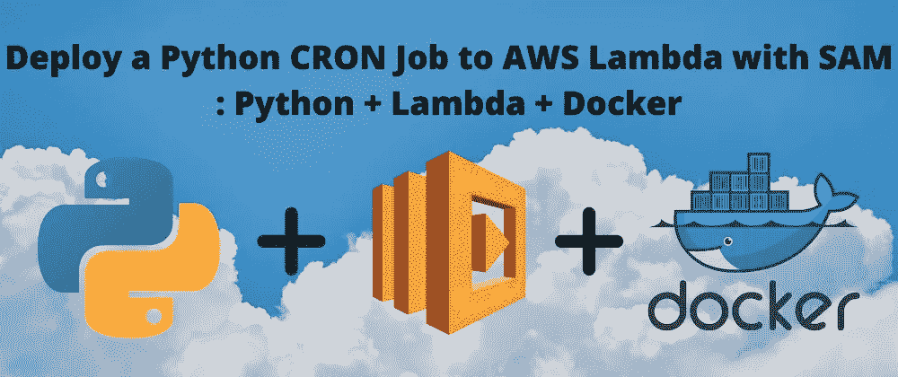

# 使用 SAM: Python + Lambda + Docker 将 Python CRON 作业部署到 AWS Lambda

> 原文：<https://levelup.gitconnected.com/deploy-a-python-cron-job-to-aws-lambda-with-sam-5d05f0c17a89>



使用 SAM: Python + Lambda + Docker 将 Python CRON 作业部署到 AWS Lambda

这篇文章将演示如何使用 SAM(无服务器应用程序模型)将 CRON 作业部署到 AWS Lambda。

本教程假设满足一些先决条件。

# 先决条件:

*   IDE(即 PyCharm)
*   [安装和配置 AWS CLI](https://docs.aws.amazon.com/cli/latest/userguide/cli-chap-welcome.html)
*   [安装并配置 AWS SAM CLI](https://docs.aws.amazon.com/serverless-application-model/latest/developerguide/serverless-sam-cli-install.html)
*   [Docker 安装配置](https://docs.docker.com/get-docker/)

# 步骤 1:创建一个函数/脚本

我假设你已经有一个脚本，但如果没有，我们将继续使用下面的脚本。下面的代码是一个 cron 作业，它将从我的口袋列表中检索过去 7 天的未读项目，并根据阅读时间(或阅读时间)标记它们。

在本地创建一个文件夹来包含您的脚本，目录结构将像这样简单:

```
.
└── app.py
```

我们将假设这个脚本在本地运行良好，但是如果它是我们想要按时间间隔运行的(cron 作业)，我们应该将它部署在云服务器上。根据这篇文章的标题，我们将部署到 AWS Lambda。虽然 AWS Lambda 被认为是“无服务器的”，但这实际上意味着服务器将只在运行时被实例化。

我们还将使用 AWS SAM。顾名思义，SAM(无服务器应用程序模型)是一个在 AWS 上构建和部署无服务器应用程序的框架。

# 步骤 2:创建 SAM 模板

在同一个目录中，创建一个名为 **template.yaml.** 的文件，这将是我们的 SAM 命令用来构建和部署的模板。

创建一个 YAML 文件，并输入以下内容:

```
Description: An AWS Serverless Specification template describing your function.
Resources:
  Function: 
    Type: 'AWS::Serverless::Function'
      Properties:
        FunctionName: FUNCTION_NAME_HERE
        Handler: app.lambda_handler
        Runtime: python3.9
```

因此，在上面的例子中，我们有一个带有 Python 3.9 运行时的 Lambda 函数(如果您愿意，可以使用不同的运行时)。

现在，我们的目录结构应该如下所示:

```
.
├── app.py
└── template.yaml
```

# 步骤 3:构建应用程序

假设您已经按照本地配置 SAM 的说明进行了操作，让我们运行 SAM build。

```
sam build --use-container
```

运行以上程序后，您可能会收到以下消息:

```
requirements.txt file not found. Continuing the build without dependencies.
```

构建将会“成功”,但是我们应该解决上面的消息，这样我们以后就不会有问题了。

如果我们的脚本中有包依赖(第三方库/模块)，我们需要有一个 **requirements.txt** 。否则，Lambda 只知道内置的 Python 3.9 包(或者你的运行时包)。

理想情况下，您初始化了一个虚拟环境，并在那里安装了您的模块，因此 **requirements.txt** 不会包含您曾经安装过的每个模块。现在我们的目录结构应该是这样的:

```
.
├── app.py
├── requirements.txt
└── template.yaml
```

现在，如果您重新运行`sam build --use-container`，您应该不会看到该消息。

# 步骤 4:本地调用应用程序

建好之后试运行`sam local invoke`。这个命令将模拟 Lambda 运行时环境，这样您就可以测试该函数在部署后是否能够工作。

运行本地调用时，您可能会得到以下错误:

```
'lambda_handler' missing on module 'app'
```

这是因为我们在本地调用 **app.py** ，就好像它是一个 lambda 函数，但是在文件中没有 Lambda 处理程序。

为了解决这个问题，我们将添加以下代码:

```
def lambda_handler(event, context):
   main()
```

您不需要知道事件或上下文参数是什么，因为在这种情况下我们不会用到它们。如果你的 Lambda 函数依赖于其他 AWS 服务的行为，这些都是相关的，这一点本文不会涉及。

使用之前共享的命令再次构建和调用，您应该会在 IDE 控制台中得到一些反馈。

在某些情况下，如果您的函数返回时间超过 3 秒，那么您将会得到如下错误:

```
Function 'FUNCTION_NAME_HERE' timed out after 3 seconds
```

这也可以通过在 template.yaml 中配置超时值来快速解决。

你可以看到我在下面的 yaml 中添加了`Timeout: 30`。

```
Description: An AWS Serverless Specification template describing your function.
Resources:
  Function: 
    Type: 'AWS::Serverless::Function'
      Properties:
        FunctionName: FUNCTION_NAME_HERE
        Handler: app.lambda_handler
        Runtime: python3.9
        Timeout: 30
```

现在，您可以再次构建和调用您的函数。使用我的共享功能，我们将看到以下内容:

```
START RequestId: *REQUEST_ID_HERE*
Version: $LATEST
null
END RequestId: *REQUEST_ID_HERE*
```

这是将在 AWS Lambda 控制台日志中显示的内容，默认情况下，它将发布到 Cloudwatch 中的一个日志组(这将不在本文中讨论)。

现在让我们实际将这些代码部署到 AWS 上。为此，我们将继续使用 SAM。

# 步骤 5:部署应用程序

奔跑

```
sam deploy --guided
```

您将看到下面粘贴的一系列提示(方括号中是默认值)。

```
Stack Name [sam-app]: 
AWS Region [us-east-1]: 

#Shows you resources changes to be deployed and require a 'Y' to initiate deploy
Confirm changes before deploy [y/N]: 

#SAM needs permission to be able to create roles to connect to the resources in your templateAllow SAM CLI IAM role creation [Y/n]: 
Save arguments to configuration file [Y/n]: 
SAM configuration file [samconfig.toml]: 
SAM configuration environment [default]:
```

根据您的偏好进行响应，部署就应该开始了！

抓紧了。我们已经*接近*了。还有一个设置我们没有在模板中配置，所以您应该会看到这样的错误:

```
An error occurred (ValidationError) when calling the CreateChangeSet operation: Template format error: Unrecognized resource types: [AWS::Serverless::Function]
```

为了解决这个问题，我们将把一个**转换**值添加到我们的 YAML 中，如文件顶部所示:

```
Transform: 'AWS::Serverless-2016-10-31'
Description: An AWS Serverless Specification template describing your function.
Resources:
  Function:
    Type: 'AWS::Serverless::Function'
    Properties:
      FunctionName: FUNCTION_NAME_HERE
      Handler: app.lambda_handler
      Runtime: python3.9
      Timeout: 30
```

根据 [AWS](https://docs.aws.amazon.com/AWSCloudFormation/latest/UserGuide/transform-aws-serverless.html) ，

> *`*AWS::Serverless*`*转换是由 CloudFormation 托管的宏，它采用以 AWS 无服务器应用程序模型(AWS SAM)语法编写的整个模板，并将其转换和扩展为兼容的 CloudFormation 模板。**

*这一次，部署应该会成功。*

*现在，如果您已经安装了 AWS CLI，那么您可以从命令行使用*

```
*aws lambda invoke --function-name FUNCTION_NAME_HERE output.txt*
```

***output.txt** 标志是一个必需的 outfile 命令，它通过管道将函数调用的日志输出到文件中。我们的函数不返回任何东西，所以它只是一个空值。*

*如果您运行上面的命令，并且成功了，您将看到*

```
*{
    "StatusCode": 200,
    "ExecutedVersion": "$LATEST"
}*
```

*在你的终端里。*

*如果你用`cat output.txt`点击 output.txt，你会看到`null`。*

*这意味着成功了！*

*现在我们已经调用了函数，让我们创建 cron 调度。*

# *步骤 6:配置 CRON 计划*

*AWS 上 cron 表达式的语法可以在[这里](https://docs.aws.amazon.com/AmazonCloudWatch/latest/events/ScheduledEvents.html)找到。*

*我在下面(事件部分)添加了一个每周日下午 2 点的时间表。*

```
*Description: An AWS Serverless Specification template describing your function.
Resources:
  Function: 
    Type: 'AWS::Serverless::Function'
    Properties:
      FunctionName: FUNCTION_NAME_HERE
      Handler: app.lambda_handler
      Runtime: python3.9
      Timeout: 30
      Events:
        Schedule:
          Type: Schedule
          Properties:
            Name: SCHEDULE_NAME_HERE
            Schedule: cron(0 14 ? * SUN *)*
```

*你的时间表(和名字)可以是你的喜好。*

*现在我们已经添加了 cron 调度，我们可以再次构建和部署(您应该还记得在这篇文章的前面是如何做的)——**就这样！***

# *参考资料:*

*   *[安装和配置 AWS CLI](https://docs.aws.amazon.com/cli/latest/userguide/cli-chap-welcome.html)*
*   *[什么是 AWS SAM？](https://docs.aws.amazon.com/serverless-application-model/latest/developerguide/what-is-sam.html)*
*   *[安装和配置 AWS SAM CLI](https://docs.aws.amazon.com/serverless-application-model/latest/developerguide/serverless-sam-cli-install.html)*
*   *[安装对接器](https://docs.docker.com/get-docker/)*
*   *[Python 虚拟环境](https://realpython.com/python-virtual-environments-a-primer/)*
*   *【the requirements.txt 文件是什么？*
*   *[什么是口袋？](https://getpocket.com/en/)*
*   *[口袋开发者 API](https://getpocket.com/developer/)*