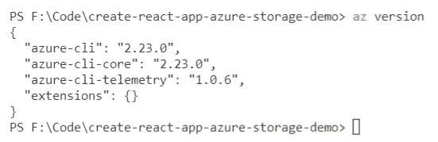
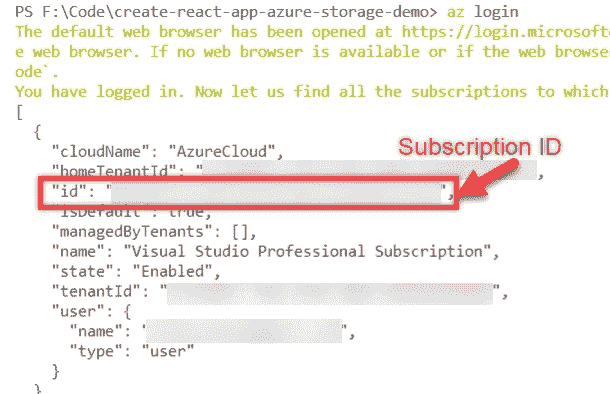
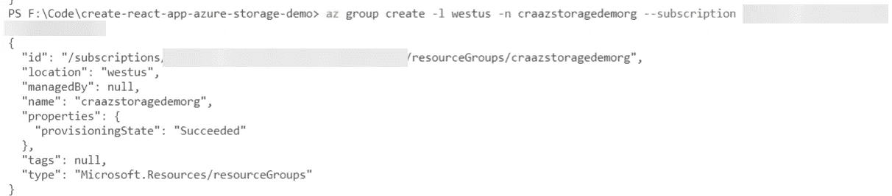
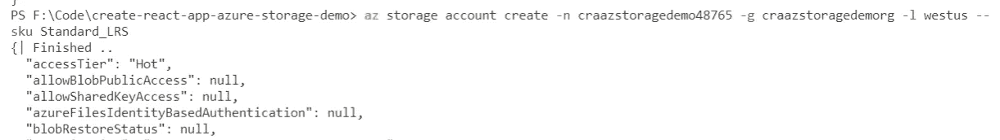
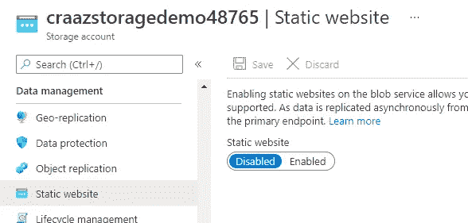
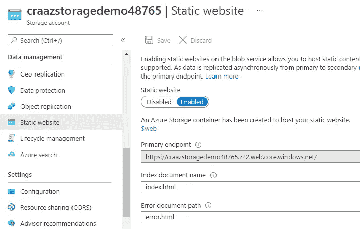
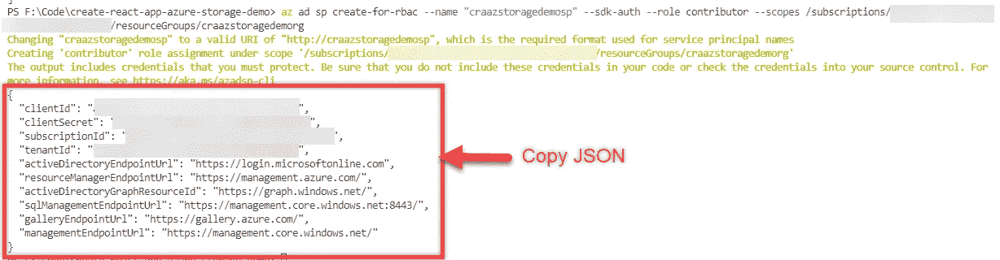
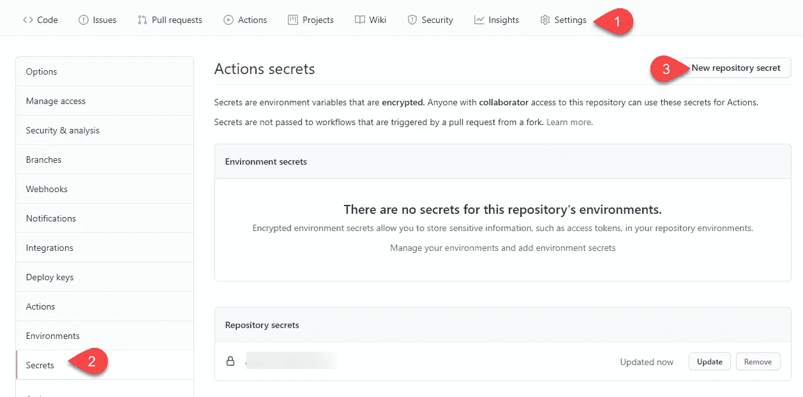
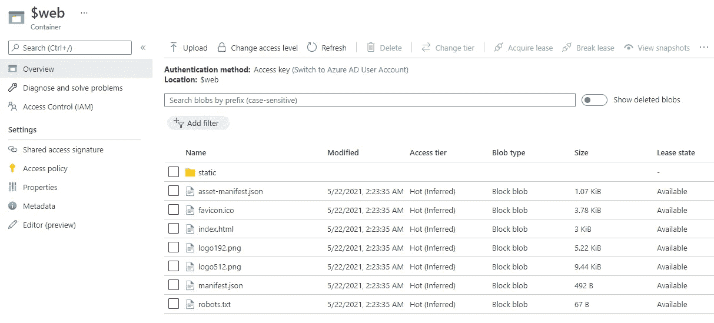
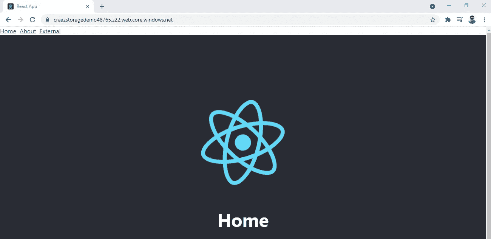

# 使用 GitHub 操作将 React 应用程序部署到 Azure Blob 存储

> 原文：<https://levelup.gitconnected.com/deploy-a-react-app-to-an-azure-blob-storage-using-github-actions-d56dc4b4724d>

## 无缝开发和部署单页面应用程序


第一行的 logo:[GitHub](https://github.com/)和 [GitHub 动作](https://docs.github.com/en/actions)。标志在第二排:[反应](https://reactjs.org/)，[天蓝色存储](https://docs.microsoft.com/en-us/azure/storage/)。作者创造的形象。

# 介绍

我对 [GitHub 动作](https://docs.github.com/en/actions)非常着迷，因为我非常喜欢将构建和部署配置与存储库本身紧密结合的想法。我也喜欢用 YAML 来定义整个工作流程。我最近讲述了如何将一个应用部署到 GitHub Pages 本身，但后来我想我应该如何从外部部署一个应用，比如说部署到一个 [Azure 存储帐户](https://docs.microsoft.com/en-us/azure/storage/)？本文旨在回答这个问题。

在本文中，我们将概括介绍以下内容:

1.  **起点:**我们将创建一个示例 React 应用程序，并将这些更改推送到 GitHub 存储库，这样我们就有东西可以试验了。
2.  **构建管道:**因为我们已经签入了一个样板 React 应用程序，所以我们可以使用 GitHub 操作非常快速地创建一个构建管道，并将构建的应用程序打包成一个构建工件。
3.  **创建 Azure blob 存储:**接下来，是时候在 Azure 中创建一些资源了。但是，我们还不会对这些资源部署任何东西。
4.  **服务主体帐户和凭证:**由于我们不是通过 Azure 门户直接部署我们的代码，而是通过命令行，我们需要创建一个服务主体帐户，以便我们可以使用其凭证通过 Azure CLI 登录，并将我们的代码上传到存储帐户。
5.  **部署管道:**类似于前面创建的构建管道，在这一步，我们将创建一个新的工作流文件来将构建工件部署到我们的 Azure 存储帐户。
6.  **测试一下:**我们将看看端到端测试该流程的不同方法，并确认我们的代码已经成功部署到存储帐户。

# #1 起点

先说一个共同的基础。我们将首先使用 [Create React App](https://create-react-app.dev/) 实用程序创建一个 React 应用程序，并将代码添加到 GitHub 存储库中。我已经使用下面的命令生成了一个样本 React 应用程序。

```
npx create-react-app <project directory> --template typescript
```

我没有添加或修改任何东西——这些是当我们运行上面提到的`npx`命令时立即生成的文件和文件夹。我只是通过运行命令`npm run start`来确保它在本地工作，仅此而已。

我已经将这些更改推送到我的 [GitHub 库](https://github.com/ClydeDz/create-react-app-azure-storage-demo)中，如果你正在跟进，你也可以做同样的事情。如果你想比较的话，这个[是我的存储库在这个阶段的样子。](https://github.com/ClydeDz/create-react-app-azure-storage-demo/tree/28031b3b8abbe403b9844be3d4a64114d402c31a)

# #2 构建管道

下一步是使用 GitHub Actions 构建我们的 React 应用程序。在`.github/workflow`文件夹中，创建一个`build-site.yml`文件，并从下面的 YAML 文件中复制内容。

这份 YAML 档案一般分为三个部分。我们首先在`name`关键字中设置一个友好的名称。在这种情况下，它被设置为*构建站点*。这个名称出现在 GitHub Actions UI 中，所以给它一个描述性的名称是一个好习惯，特别是如果您的存储库中有多个工作流文件。

`on`关键字及其代码块描述了该工作流是如何被触发的。在上面的例子中，我们将工作流设置为当代码被推送到主分支或者以主分支为目标分支创建拉请求时触发。

`jobs`关键字及其代码块列出了触发该工作流时要执行的步骤。我们实际上是在运行多个命令来安装节点、安装所需的 npm 包、构建站点和运行单元测试。最后一步使用来自 marketplace 的 [GitHub 动作将生成的站点文件从构建文件夹上传到名为`production-files`的 ZIP 文件中。](https://github.com/marketplace/actions/upload-a-build-artifact)

# #3 创建 Azure blob 存储

我们将使用 Azure 的命令行工具来创建存储帐户。首先，如果你还没有注册，请[注册 Azure](https://azure.microsoft.com/en-us/free/search/) 。接下来，让我们从[这个页面](https://docs.microsoft.com/en-us/cli/azure/install-azure-cli-windows?tabs=azure-cli)下载 Azure CLI。然后，运行`az version`命令来验证工具是否已安装。



> **提示:**你现在可以将你的 Azure 命令行片段写入一个`.azcli`文件。如果你正在使用 VS 代码，我强烈推荐你使用 [Azure CLI 工具扩展](https://marketplace.visualstudio.com/items?itemName=ms-vscode.azurecli)。这个扩展与`.azcli`文件相结合，为命令及其参数提供了智能感知，支持高亮显示`.azcli`文件中的命令并在终端中运行，以及大量其他功能。看看我的`.azcli`文件[这里](https://github.com/ClydeDz/create-react-app-azure-storage-demo/blob/main/.azure/script.azcli)。

为了与 Azure 交互，我们需要首先通过 CLI 登录 Azure。运行命令`az login`登录您的帐户。这将在浏览器中打开身份验证页面，您可以在其中输入用户名和密码。成功登录后，您应该会看到一条确认消息，提示您可以关闭浏览器。此命令还将打印您有权访问的订阅列表。从这个 JSON 输出中复制订阅 id——我们稍后将需要这个值。



> 可选地，运行命令`az account list`也将打印您有权访问的订阅列表。

现在让我们在这个订阅中创建一个资源组。资源组是逻辑上相关的 Azure 资源的容器。运行以下命令创建资源组。

```
az group create -l westus -n <RESOURCE GROUP NAME> --subscription <ID>
```

将`<RESOURCE GROUP NAME>`替换为合适的名称，将`<ID>`替换为您之前保存的订阅 ID。这将在控制台中打印一个 JSON 输出，确认已经创建了一个资源。



现在，我们将通过运行以下命令创建一个 Azure 存储帐户。将`<STORAGE ACCOUNT NAME>`替换为全局唯一的存储帐户名，将`<RESOURCE GROUP NAME>`替换为您之前刚刚创建的资源组名。

```
az storage account create -n <STORAGE ACCOUNT NAME> -g <RESOURCE GROUP NAME> -l westus --sku Standard_LRS
```

这个命令还将打印一个 JSON 输出，确认资源创建。



虽然存储帐户已创建，但它不支持开箱即用的静态网站，我们需要手动启用它。前往 Azure 门户，单击您刚刚创建的存储帐户，然后单击**静态网站**菜单项，然后在屏幕上单击**启用**切换并保存您的更改。或者，您也可以通过命令行来完成此操作。



如果您选择命令行，请运行以下命令在存储帐户上启用静态站点。

```
az storage blob service-properties update --account-name <STORAGE ACCOUNT NAME> --static-website true --404-document error.html --index-document index.html
```

无论哪种方式，您都应该看到静态网站已启用，并且主端点(也称为网站的 URL)可用。



# #4 服务主体帐户和凭证

我们现在需要在 Azure 中创建一个服务主体，这样我们就可以通过命令行登录，将 React 应用程序部署到存储帐户。运行以下命令创建一个登录。

```
az ad sp create-for-rbac --name "<UNIQUE NAME>" --sdk-auth --role contributor --scopes /subscriptions/<SUBSCRIPTION ID>/resourceGroups/<RESOURCE GROUP NAME>
```

将`<UNIQUE NAME>`替换为服务主账户的合适名称，并根据需要替换为`<SUBSCRIPTION ID>`和`<RESOURCE GROUP NAME>`。在运行上面的命令之后，复制已经打印在控制台上的 JSON 输出——我们将在下一步中需要这些细节。



## 将这些凭证添加到 GitHub

为了在 GitHub 工作流文件中使用 Azure 登录命令，我们需要将您在上面复制的 JSON 凭证添加到我们的 GitHub 存储库中。点击**设置**，然后点击左侧边栏菜单中的**机密**，然后点击**新建存储库机密**按钮。



在**名称**字段输入`AZURE_CREDENTIALS`。只要在工作流文件中使用此机密时记得重命名引用，就可以对其进行重命名。在**值**字段中，复制您之前复制的 JSON。最后，点击**添加秘密**按钮。

# #5 部署管道

既然我们已经在 Azure 中创建了资源，并且已经准备好登录，那么是时候将代码部署到存储帐户了。

让我们在`.github/workflows`目录下创建一个名为`deploy-site.yml`的文件，并从下面的 YAML 文件中复制内容。

该工作流文件分为三个部分。`name`关键字为该工作流设置一个友好的名称。

关键字`on`及其代码块定义了如何触发这个工作流。在这种情况下，我们想要在名为*构建站点*的工作流完成时触发该工作流，并且只有在主分支上触发了*构建站点*工作流时。

关键字`jobs`及其代码块定义了需要作为工作流的一部分运行的步骤。我们有一个名为*的单一任务部署。*if 条件表示只有当相关工作流成功时，该作业才应运行。我们使用 Azure CLI 命令，通过之前创建的服务主体凭据登录 Azure 帐户。然后，我们将工件上传到 blob 存储帐户的`$web`文件夹，最后，我们退出 Azure。

# #6 测试一下

更新您的网站内容，并将您的更改推送到 GitHub。这将触发构建工作流，一旦成功，将触发部署工作流。

如果你前往 Azure，点击你创建的存储账户，然后点击左边菜单中的**容器**，然后点击`$web`文件夹，你应该会在那里看到你的 React 文件。



在浏览器中打开静态站点的 URL，确认 React 应用程序已经加载。当您在存储帐户上启用静态站点时，您应该已经获得了此 URL。它的格式应该是`<storage account name>.z22.web.core.windows.net`。



如果您创建一个新的分支，进行更多的代码更改，然后创建一个 pull 请求将更改合并回主分支，您会注意到构建工作流会运行，但部署工作流不会运行。将更改合并到主分支后，构建和部署工作流都将运行，应用程序的更新版本将部署到存储帐户。

# 资源

*   [GitHub 库](https://github.com/ClydeDz/create-react-app-azure-storage-demo)
*   [构建工作流文件](https://gist.github.com/ClydeDz/81e5594a4c337398f6ca2b5c67f9ed26)
*   [部署工作流文件](https://gist.github.com/ClydeDz/bd7506f79e35f6f38092b8206bb7c7e3)

就是这样！感谢阅读。

# 分级编码

感谢您成为我们社区的一员！[订阅我们的 YouTube 频道](https://www.youtube.com/channel/UC3v9kBR_ab4UHXXdknz8Fbg?sub_confirmation=1)或者加入 [**Skilled.dev 编码面试课程**](https://skilled.dev/) 。

[](https://skilled.dev) [## 编写面试问题+获得开发工作

### 掌握编码面试的过程

技术开发](https://skilled.dev)