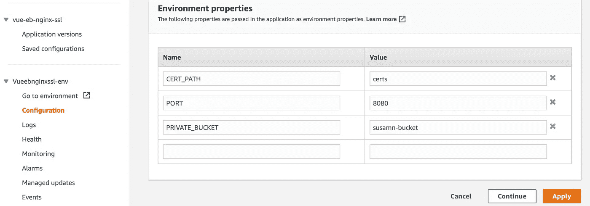

# 使用 Nginx 和 SSL 在 Elastic Beanstalk 中部署应用程序，不使用 ACM

> 原文：<https://levelup.gitconnected.com/deploy-an-application-in-elastic-beanstalk-with-nginx-with-ssl-without-acm-d7216a2956d5>

我喜欢弹性豆茎。这是一个非常棒的 PaaS 解决方案，通过自动扩展使应用程序部署变得轻而易举。在 AWS 的保护伞下，它也真的很强大，有这么多的功能。

[自由股票](https://unsplash.com/@freestocks?utm_source=unsplash&utm_medium=referral&utm_content=creditCopyText)在 [Unsplash](https://unsplash.com/s/photos/security?utm_source=unsplash&utm_medium=referral&utm_content=creditCopyText) 上的照片

在典型的场景中，负载平衡器应该处理 HTTPS 流量，并通过 TCP 80 将明文流量发送到后端服务器。但是我也看到了很多需要对从负载平衡器到终端服务器的流量进行加密的场景，这样企业就可以全程实施 SSL。在这些情况下，我们还必须在 web 服务器(Apache/Nginx)中配置 SSL。

在这篇文章中，让我们用 Nginx 在 Elastic Beanstalk 中部署一个应用程序来代理请求。我们还将在 Nginx 中使用 S3 可用的证书来配置 SSL(**不使用 ACM** )

代码托管在此处:

 [## GitHub - susamn/eb-nginx-ssl:一个示例应用程序，展示了如何使用 ssl 为弹性应用程序配置 Nginx…

### 一个示例应用程序，展示了如何使用 SSL 为弹性 Beanstalk 设置配置 Nginx。

github.com](https://github.com/susamn/eb-nginx-ssl) 

我已经使用了 AWS 提供的简单示例应用程序，并为 SSL 添加了必要的文件。

我们只需要 3 个文件。

1.  **nginx-proxy.config** 这个文件启用 nginx 特性，这样 Elastic Beanstalk 就知道它需要使用 nginx 作为代理服务器。

> 将该文件放在**中。捆绑应用程序代码时的 ebextensions** 文件夹。

**2。copycerts.sh**
该文件用于在应用程序启动前将证书文件从 S3 下载到应用服务器。

我这里有我自己签名的证书:

这里需要记住一些事情。

*   在与应用程序捆绑之前，此文件的执行权限(+x)。否则，我们将被 EC2 服务器拒绝许可。
*   这个脚本需要知道证书文件在哪里。为了指定这些数据，我们需要设置 env 变量。 **PRIVATE_BUCKET** 指定 BUCKET 名称，而 **CERT_PATH** 指定位置。

*   设置另一个名为 **PORT** 的环境变量，以控制应用程序将使用哪个端口在本地运行。在第 16 行的**Nginx 配置的应用程序和下一个文件中进行必要的更改。它告诉 Nginx 将应用程序的流量路由到哪里。**
*   如果您有一个证书链，在这个脚本中做一些必要的修改来复制它们。
*   确保授予 S3 对 elastic beanstalk 环境的访问权限，这样它启动的任何服务器都将附加该策略。转到 Elastic Beanstalk**env**->**配置** - > **安全**并记下实例概要文件名称。然后转到 **IAM** 并将 **S3ReadOnlyAccess** 策略添加到该实例概要文件中。

> 将该文件保存在**中。platform/hooks/predeploy** 在捆绑的应用程序代码的根中，以便它在主应用程序运行之前执行，并且 Nginx 可以在正确的位置找到证书。

**3。https-listener.conf** 这是 Nginx 配置文件，取代了 Nginx 使用的原始配置文件。

这个文件是相当简单的 Nginx 配置。它用于在运行的服务器中配置 Nginx 服务器行为。

*   在第 6 行和第 7 行中，我们指出了应用服务器中的证书位置。在前面的脚本中，我们从 S3 复制了证书文件。
*   从第 15 行到第 21 行，我们指定了位置。当 Nginx 收到流量时，它会根据路径将这些流量转发到这个位置。

> 将该文件放在**中。捆绑应用中的 platform/nginx/conf.d/** 文件夹。这是 AWS 为 Nginx 配置推荐的途径。

就是这样，如果一切顺利，nginx 服务器将有适当的配置，当应用程序启动时，我们将获得一个 443 端口，以获取 HTTPS 流量。

通过到服务器验证它:

由于有一个自签名证书，我得到了卷曲的问题。但是在理想情况下，您的客户或雇主会提供证书进行配置，所以您应该没问题。

## 当事情不顺利的时候

如果由于任何原因，环境无法启动，请从 Elastic Beanstalk env 启用日志流，并在 CloudWatch 中查看日志。

查看 **eb-engine.log** 以找到任何与弹性 beanstalk 环境设置相关的问题。

现在是时候配置负载平衡器将 HTTPS 流量转发到弹性 beanatalk 服务器了。

# 在负载平衡器中添加一个侦听器

这里我们只有一个 HTTP 端口转发。点击 Add listenter，添加一个 HTTPS 监听器，将流量转发到 eb 服务器。

所以有两件事要做，非常简单。

1.  在 eb 服务器的安全组中添加入站规则以接受 HTTPs 流量。
2.  在负载平衡器中添加侦听器，将 HTTPs 流量转发到上述安全组。